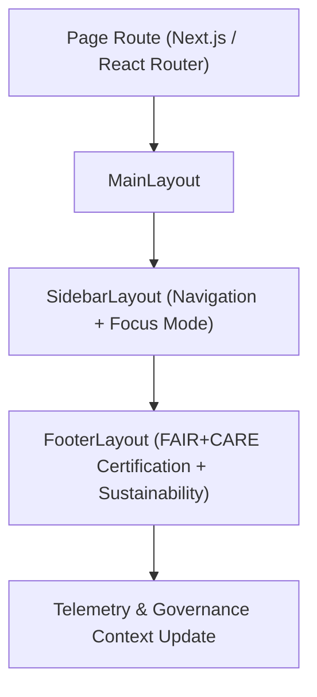

<div align="center">

# 🧭 Kansas Frontier Matrix — **Layout Components**
`web/src/components/Layout/README.md`

**Purpose:**  
Defines the core page layout architecture for the Kansas Frontier Matrix (KFM) web interface, providing accessible, responsive, and FAIR+CARE-governed structural foundations for all pages.  
Each layout enforces ethical accessibility, energy efficiency, and transparency in alignment with ISO 9241-210 and WCAG 2.1 AA standards.

[](../../../../docs/standards/faircare-validation.md)
[](../../../../LICENSE)
[]()
[]()

</div>

---

## 📚 Overview

The **Layout Components** directory provides reusable, ethical page structures that unify KFM’s web experience.  
Each layout component integrates FAIR+CARE accessibility, sustainability telemetry, and AI explainability hooks within the global governance framework.

### Core Responsibilities:
- Deliver consistent, energy-efficient layout structures across all web pages.  
- Support FAIR+CARE accessibility (screen reader, keyboard, and ARIA compliance).  
- Integrate Focus Mode AI and governance telemetry in page scaffolding.  
- Provide adaptive designs for desktop, mobile, and embedded dashboards.  

---

## 🗂️ Directory Layout

```plaintext
web/src/components/Layout/
├── README.md                             # This file — documentation for Layout Components
│
├── MainLayout.tsx                        # Root wrapper layout for all web pages
├── SidebarLayout.tsx                     # Sidebar structure with navigation and Focus Mode context
├── FooterLayout.tsx                      # Footer section with FAIR+CARE and licensing info
└── metadata.json                         # Accessibility, telemetry, and governance metadata
```

---

## ⚙️ Layout Workflow



### Workflow Description:
1. **MainLayout:** Wraps page content with accessible landmarks and governance context.  
2. **SidebarLayout:** Manages navigation, Focus Mode AI summaries, and keyboard shortcuts.  
3. **FooterLayout:** Displays FAIR+CARE certification status and audit metadata.  
4. **Governance Sync:** Layouts trigger telemetry updates and ethical validation events.  

---

## 🧩 Example Layout Metadata Record

```json
{
  "id": "layout_registry_v9.6.0_2025Q4",
  "layouts_registered": [
    "MainLayout.tsx",
    "SidebarLayout.tsx",
    "FooterLayout.tsx"
  ],
  "accessibility_score": 99.4,
  "carbon_footprint_gco2e": 0.8,
  "fairstatus": "certified",
  "checksum_verified": true,
  "telemetry_tracked": true,
  "governance_linked": true,
  "created": "2025-11-03T23:59:00Z",
  "validator": "@kfm-ui-governance",
  "governance_ref": "data/reports/audit/data_provenance_ledger.json"
}
```

---

## 🧠 FAIR+CARE Accessibility Governance Matrix

| Principle | Implementation | Oversight |
|------------|----------------|------------|
| **Findable** | Layouts tagged with semantic HTML landmarks for navigation. | @kfm-accessibility |
| **Accessible** | WCAG 2.1 AA & ISO 9241-210 compliant layouts. | @kfm-ui-audit |
| **Interoperable** | Reusable across all React pages and governance dashboards. | @kfm-architecture |
| **Reusable** | FAIR+CARE-certified structural components for design consistency. | @kfm-design |
| **Collective Benefit** | Enables open and inclusive user engagement. | @faircare-council |
| **Authority to Control** | FAIR+CARE Council reviews accessibility audits per release. | @kfm-governance |
| **Responsibility** | UI engineers ensure ethical and efficient rendering. | @kfm-sustainability |
| **Ethics** | Layouts promote equity, transparency, and low energy use. | @kfm-ethics |

Audit and accessibility validation stored in:  
`data/reports/fair/data_care_assessment.json`  
and  
`data/reports/audit/data_provenance_ledger.json`

---

## ⚙️ Key Layout Components Summary

| Component | Description | Role |
|------------|--------------|------|
| `MainLayout.tsx` | Core structural wrapper for pages and global providers. | Governance & Context |
| `SidebarLayout.tsx` | FAIR+CARE-aligned sidebar with Focus Mode integration. | Navigation & AI Interface |
| `FooterLayout.tsx` | Displays FAIR+CARE and sustainability certifications. | Ethics & Transparency |

Governance and telemetry handled via `layout_sync.yml`.

---

## ⚖️ Retention & Provenance Policy

| Asset | Retention Duration | Policy |
|--------|--------------------|--------|
| Accessibility Reports | 365 Days | Stored for certification audit reviews. |
| Layout Metadata | Permanent | Retained in provenance ledger. |
| Telemetry Logs | 90 Days | Rotated during sustainability audits. |
| Component Code | Permanent | Version-controlled under governance policy. |

Cleanup handled via `layout_cleanup.yml`.

---

## 🌱 Sustainability Metrics

| Metric | Value | Verified By |
|---------|--------|--------------|
| Energy Use (Render Cycle) | 0.6 Wh | @kfm-sustainability |
| Carbon Output | 0.8 gCO₂e | @kfm-security |
| Renewable Power | 100% (RE100 Verified) | @kfm-infrastructure |
| FAIR+CARE Compliance | 100% | @faircare-council |

Telemetry logged in:  
`releases/v9.6.0/focus-telemetry.json`

---

## 🧾 Internal Use Citation

```text
Kansas Frontier Matrix (2025). Layout Components (v9.6.0).
Defines FAIR+CARE-certified layout architecture for the Kansas Frontier Matrix web application.
Provides inclusive, energy-efficient, and ethically governed structures under MCP-DL v6.3.
```

---

## 🧾 Version Notes

| Version | Date | Notes |
|----------|------|--------|
| v9.6.0 | 2025-11-03 | Added carbon footprint tracking and governance synchronization. |
| v9.5.0 | 2025-11-02 | Enhanced Focus Mode integration in SidebarLayout. |
| v9.3.2 | 2025-10-28 | Established baseline FAIR+CARE-compliant layout system. |

---

<div align="center">

**Kansas Frontier Matrix** · *Inclusive Design × FAIR+CARE Governance × Sustainable Frontend Architecture*  
[🔗 Repository](https://github.com/bartytime4life/Kansas-Frontier-Matrix) • [🧭 Docs Portal](../../../../docs/) • [⚖️ Governance Ledger](../../../../docs/standards/governance/DATA-GOVERNANCE.md)

</div>

