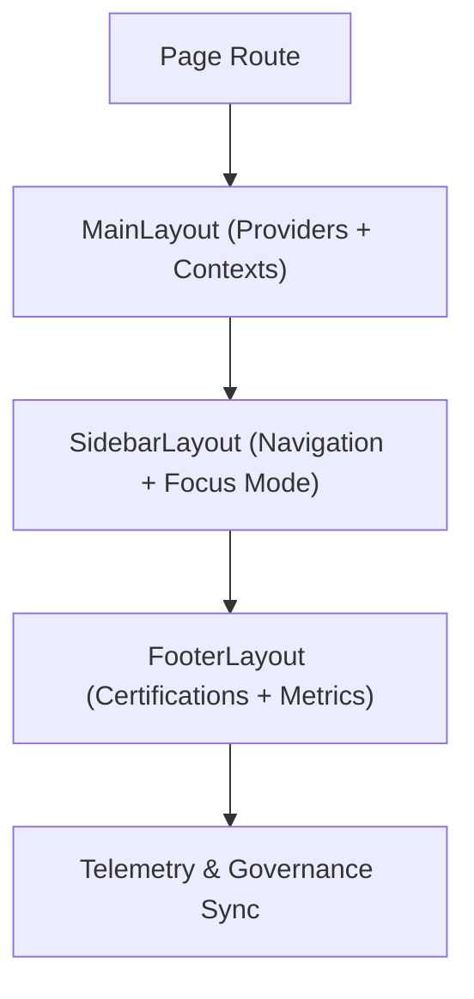

<div align="center">

# 🧭 **Kansas Frontier Matrix — Layout Components**
`web/src/components/Layout/README.md`

**Purpose:** Define the core layout framework for KFM’s web application — ensuring every page structure adheres to FAIR+CARE accessibility, sustainability, and provenance standards under **MCP v6.3** and **WCAG 2.1 AA**.

[](../../../../docs/README.md)
[](../../../../LICENSE)
[](../../../../docs/standards/faircare.md)
[]()

</div>

---

## 📘 Overview

The **Layout Components** layer standardizes responsive and inclusive page scaffolding for the Kansas Frontier Matrix web app.  
Layouts serve as the structural foundation for all pages, combining accessibility, Focus Mode context, and telemetry synchronization for reproducible, ethical UI.

---

## 🗂️ Directory Layout

```
web/src/components/Layout/
├── README.md
├── MainLayout.tsx        # Root page wrapper, global providers & contexts
├── SidebarLayout.tsx     # Navigation, Focus Mode, and governance panel
├── FooterLayout.tsx      # FAIR+CARE, sustainability, and license display
└── metadata.json         # Governance + telemetry metadata for layout components
```

---

## 🧩 Layout Architecture



1. **MainLayout:** defines app-wide providers (Theme, Telemetry, Governance).  
2. **SidebarLayout:** integrates navigation, Focus Mode summaries, and a11y shortcuts.  
3. **FooterLayout:** displays FAIR+CARE status, license, and audit references.  
4. **Sync:** updates provenance + telemetry data each render cycle.

---

## ⚙️ Layout Contracts

| Contract | Purpose | Validator |
|----------|----------|-----------|
| Accessibility | Semantic structure + landmarks (header, nav, main, footer). | `accessibility_scan.yml` |
| Governance | FAIR+CARE + provenance tags in footer metadata. | `faircare-validate.yml` |
| Telemetry | Layout render + perf metrics schema. | `telemetry-export.yml` |
| Theme | Color tokens and contrast validation. | Lighthouse + Tailwind lint |

Artifacts stored in:
- `docs/reports/telemetry/build_metrics.json`  
- `../../../../releases/v9.7.0/focus-telemetry.json`

---

## 🧠 FAIR+CARE Governance Matrix

| Principle | Implementation | Oversight |
|------------|----------------|------------|
| **Findable** | Layout metadata indexed by version and component ID. | @kfm-data |
| **Accessible** | WCAG 2.1 AA-compliant structure with ARIA landmarks. | @kfm-accessibility |
| **Interoperable** | Standardized layout API for all routes and dashboards. | @kfm-architecture |
| **Reusable** | Exportable layouts across web and governance UIs. | @kfm-design |
| **Collective Benefit** | Promotes equitable and consistent access for users. | @faircare-council |
| **Authority to Control** | Council validates a11y and energy audits per release. | @kfm-governance |
| **Responsibility** | Layout telemetry monitors render efficiency and a11y. | @kfm-sustainability |
| **Ethics** | Structural fairness and visual neutrality reviewed each release. | @kfm-ethics |

---

## 🧾 Example Metadata Record

```json
{
  "id": "layout_v9.7.0",
  "layouts": ["MainLayout", "SidebarLayout", "FooterLayout"],
  "a11y_score": 99.5,
  "fairstatus": "certified",
  "energy_use_wh": 0.59,
  "carbon_output_gco2e": 0.7,
  "telemetry_synced": true,
  "timestamp": "2025-11-05T18:50:00Z"
}
```

---

## ♿ Accessibility Standards

- Semantic layout regions (header, nav, main, aside, footer).  
- Skip-link integration for screen readers and keyboard users.  
- Focus-visible indicators and motion-reduced transitions.  
- Alt-text and caption slots for non-textual footer content.  
- Validated via **axe-core** + **Lighthouse CI**.

---

## 🌱 Sustainability Metrics

| Metric | Target | Verified By |
|-------|--------|-------------|
| Energy per Render | ≤ 0.6 Wh | Telemetry |
| Carbon Output | ≤ 0.8 gCO₂e | CI telemetry |
| Lighthouse A11y | ≥ 95 | `accessibility_scan.yml` |
| Renewable Hosting | 100% RE100 | Infrastructure logs |

---

## 🕰️ Version History

| Version | Date | Author | Summary |
|----------|------|---------|----------|
| v9.7.0 | 2025-11-05 | KFM Core Team | Upgraded + aligned: contracts, telemetry schema v1, semantic landmarks, a11y scan integration. |
| v9.6.0 | 2025-11-03 | KFM Core Team | Added carbon footprint telemetry and Focus Mode sidebar sync. |
| v9.5.0 | 2025-11-02 | KFM Core Team | Enhanced a11y reports + governance metrics in footer. |
| v9.3.2 | 2025-10-28 | KFM Core Team | Established FAIR+CARE layout system. |

---

<div align="center">

**© 2025 Kansas Frontier Matrix — MIT / CC-BY 4.0**  
Maintained under **Master Coder Protocol v6.3** · FAIR+CARE Certified · Diamond⁹ Ω / Crown∞Ω Ultimate Certified  
[Back to Components Index](../README.md) · [Docs Index](../../../../docs/README.md)

</div>