<div align="center">

# 🧭 **Kansas Frontier Matrix — Layout Architecture & Structural Framework**  
`web/src/components/Layout/README.md`

**Purpose:**  
Define the **deep, Diamond⁹ Ω–grade architecture** of layout components used throughout the Kansas Frontier Matrix (KFM) v10.3.2 web platform — the foundational containers providing structure, accessibility, governance surfaces, design token propagation, telemetry instrumentation, and Focus Mode v2.5 contextual synchronization.  
This document is the **canonical, whitepaper-level** specification for all Layout components.

[]()
[]()
[]()
[]()

</div>

---

# 📘 Executive Summary

Layout components are the **structural backbone** of the entire KFM web platform.  
They unify:

- global providers (theme, governance, telemetry, Focus Mode)  
- accessibility landmarks  
- energy-efficient rendering architecture  
- FAIR+CARE certification surface  
- provenance + licensing  
- Focus Mode + Timeline + MapView context propagation  
- design token pipelines  
- footer governance disclosures  
- sidebar ethical navigation  

The layout layer is the **topmost ethical & semantic container** for every KFM route.

---

# 🗂️ Directory Layout (Authoritative v10.3.2)

```text
web/src/components/Layout/
├── README.md
├── MainLayout.tsx
├── SidebarLayout.tsx
├── FooterLayout.tsx
└── metadata.json
```

Each layout component exists to maintain **global compliance + global context integrity**.

---

# 🧩 High-Level Layout Architecture

```mermaid
flowchart TD
    ROUTE[Page Route] --> MAIN[MainLayout<br/>Providers + Contexts + Tokens]
    MAIN --> SIDE[SidebarLayout<br/>Navigation · Focus Mode Summary · CARE Indicators]
    MAIN --> FOOT[FooterLayout<br/>Licenses · FAIRCARE Status · Provenance]
    FOOT --> TEL[Telemetry Hooks<br/>Energy · A11y · Ethics]
```



---

# 🧬 MainLayout.tsx — Global Providers & Structural Kernel

The **MainLayout** is the **structural root** that wraps every KFM page.

## Responsibilities
- Initialize:
  - ThemeProvider (design tokens)
  - A11yProvider (focus rings, motion reduction, ARIA map)
  - GovernanceProvider (CARE labels, sovereignty rules)
  - TelemetryProvider (render cost + sustainability)
  - FocusProvider (Focus Mode v2.5 narrative context)
  - TimelineProvider (currentYear broadcast)
- Provide semantic layout regions:
  - `<header>`  
  - `<nav>`  
  - `<main>`  
  - `<footer>`  

## MainLayout Architecture


---

# 🎛️ SidebarLayout.tsx — Navigation + Ethical Context Column

SidebarLayout anchors:

- Primary navigation  
- Focus Mode status panel (entity, date, caret, explainability badge)  
- Licensing + data category tags  
- CARE-sensitive quick alerts  
- A11y shortcuts (skip-links, high-contrast toggles)  

## Sidebar Architecture


### Governance-Sensitive Sidebar Behavior
- Masked data → sidebar displays redaction notice  
- Restricted dataset → sidebar shows sovereignty reasons  
- Predictive data → sidebar signals future/projection mode  

---

# 🧾 FooterLayout.tsx — Provenance + Sustainability + Governance Panel

Displays:

- FAIR+CARE compliance status  
- License + attribution  
- Provenance chain references  
- Sustainability metrics (Wh, CO₂e)  
- Build/Release metadata  
- Governance Council certification markers  

## Footer Architecture


---

# 💠 Layout State Machine (Deep Specification)

```mermaid
flowchart TD
    S0[Initial Render] --> S1[Providers Mount]
    S1 --> S2[Governance Initialization]
    S2 --> S3[Token Injection<br/>theme · a11y · map]
    S3 --> S4[Navigation Sync]
    S3 --> S5[Footer Sync]
    S4 --> S6[Focus Summary Pull]
    S5 --> S7[Sustainability Metrics Push]
```



Every state transition logs telemetry.

---

# 🎨 Design Token Propagation Architecture

Tokens include:

- colors  
- spacing  
- typography  
- projections (for map layers)  
- CARE-warning icons  
- predictive-band fills  

## Token Flow


---

# ♿ Accessibility Architecture (WCAG 2.1 AA)

**Non-negotiable rules enforced at layout layer:**

- semantic landmarks  
- skip-links  
- focus-visible styling  
- reduced motion compliance  
- high-contrast theme switching  
- keyboard-first priority  

## A11y DAG


---

# 🔐 FAIR+CARE Governance Integration

Layout enforces top-level governance:

- CARE tags in sidebar  
- provenance + checksum elements in footer  
- mask-mode global banners if sensitive layer is active  
- restricted dataset → disable navigation routes  
- sovereignty → highlight advisory glyphs  

## Governance Flow


Governance ledger:

```
../../../../docs/reports/audit/web-layout-governance-ledger.json
```

---

# 📡 Telemetry & Sustainability Architecture

Captured via Layout:

- render-time energy estimate (Wh)  
- component mount latency  
- provenance display interactions  
- sidebar + footer interactions  
- A11y token coverage  
- Carbon equivalent (gCO₂e)  

Telemetry output:

```
../../../../releases/v10.3.2/focus-telemetry.json
```

## Telemetry DAG


---

# ⚙️ Validation & CI/CD Requirements (MCP-DL v6.3)

| Category | Validation |
|----------|------------|
| Documentation | docs-lint.yml |
| Accessibility | a11y-lint.yml + Lighthouse |
| Governance | faircare-validate.yml |
| Sustainability | telemetry-export.yml |
| Schema | metadata.json → JSON Schema |
| Security | CodeQL + Trivy |

Any failing area blocks merge.

---

# 🧾 Example Layout Metadata Record

```json
{
  "id": "layout_v10.3.2",
  "layouts": [
    "MainLayout",
    "SidebarLayout",
    "FooterLayout"
  ],
  "a11y_score": 99.7,
  "energy_use_wh": 0.48,
  "carbon_output_gco2e": 0.63,
  "fairstatus": "certified",
  "checksum_verified": true,
  "timestamp": "2025-11-14T09:32:00Z"
}
```

---

# 🕰️ Version History

| Version | Date | Summary |
|--------|--------|---------|
| v10.3.2 | 2025-11-14 | Full deep-architecture rebuild; added state machine, token propagation, governance, telemetry, and Focus Mode integration. |
| v9.7.0 | 2025-11-05 | Previous version. |

---

<div align="center">

**Kansas Frontier Matrix — Layout Architecture**  
🧭 Semantic Foundations · ♿ Accessibility Core · 🔐 Ethical Structure · 🌱 Sustainable Rendering  
© 2025 Kansas Frontier Matrix — MIT License  

[Back to Components Index](../README.md)

</div>
