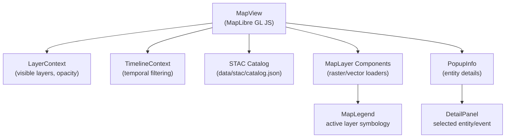
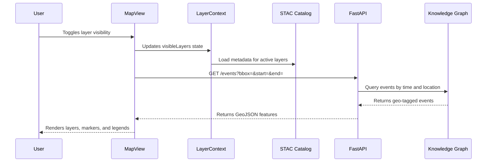

<div align="center">

# 🗺️ Kansas Frontier Matrix — **MapView Component**  
`web/src/components/MapView/`

**Interactive Mapping · Historical Layers · Spatial Storytelling**

[](../../../../../.github/workflows/ci.yml)
[](../../../../../.github/workflows/stac-validate.yml)
[](../../../../../docs/)
[](../../../../../docs/design/reviews/accessibility/)
[](../../../../../LICENSE)

</div>

---

```yaml
---
title: "KFM • MapView Component (web/src/components/MapView/)"
version: "v1.5.0"
last_updated: "2025-10-14"
owners: ["@kfm-web", "@kfm-gis"]
tags: ["react","maplibre","stac","geojson","timeline","mcp","accessibility"]
license: "MIT"
semantic_alignment:
  - STAC 1.0
  - CIDOC CRM
  - OWL-Time
  - WCAG 2.1 AA
---
````

---

## 🧭 Overview

The **MapView Component** powers the **geospatial visualization engine** of the Kansas Frontier Matrix.
It renders **historical and modern datasets** from the project’s **STAC catalog**, synchronizing them with the **TimelineView** and **Knowledge Graph**.
MapView anchors Kansas’s physical geography to its **cultural, temporal, and ecological stories** — visualizing treaties, hydrology, settlements, and events across time.

Built with **MapLibre GL JS**, MapView supports dynamic overlays of **COGs (Cloud-Optimized GeoTIFFs)**, **GeoJSON features**, and **temporal filtering**, maintaining smooth performance and strict MCP-DL v6.2 documentation standards.

---

## 🧱 Directory Structure

```text
web/src/components/MapView/
├── MapView.tsx             # Main map renderer (MapLibre + Context integration)
├── MapLayer.tsx            # Handles STAC-defined raster/vector layers
├── MapLegend.tsx           # Displays active legends and metadata
├── MapMarker.tsx           # Entity or event markers (interactive)
├── PopupInfo.tsx           # Info popups for selected features
├── styles.scss             # Theming, responsive sizing, overlay styles
└── __tests__/              # Jest + RTL tests for rendering and interactions
```

Each submodule is typed, modular, and testable — reinforcing MCP reproducibility and maintainability.

---

## ⚙️ Component Architecture



> The architecture ensures a one-directional, declarative flow of data — from STAC → Context → Map → UI.

---

## 🧩 Core Features

| Feature                 | Description                                                | Data Source              |
| :---------------------- | :--------------------------------------------------------- | :----------------------- |
| **STAC-Driven Layers**  | Dynamically loads raster/vector datasets from STAC Items   | `data/stac/catalog.json` |
| **Temporal Filtering**  | Filters visible features according to active timeline      | `TimelineContext`        |
| **Interactive Markers** | Displays events, treaties, and places as clickable markers | Knowledge Graph          |
| **Popup Information**   | Shows entity summaries linked to DetailPanel               | `/api/entity/{id}`       |
| **Legends & Overlays**  | Renders color scales & categories from STAC metadata       | STAC                     |
| **Basemap Controls**    | Switches between modern, terrain, and satellite maps       | MapLibre GL              |
| **Accessibility**       | Keyboard navigation, ARIA roles, and focus rings           | WCAG 2.1 AA              |

---

## 💬 Example Implementation

```tsx
import React, { useEffect, useRef } from "react";
import maplibregl from "maplibre-gl";
import { useLayer } from "../../context/LayerContext";
import { useTimeline } from "../../context/TimelineContext";
import { loadSTACLayers } from "../../utils/mapUtils";
import "maplibre-gl/dist/maplibre-gl.css";
import "./styles.scss";

export const MapView: React.FC = () => {
  const mapContainer = useRef<HTMLDivElement>(null);
  const { visibleLayers } = useLayer();
  const { range } = useTimeline();

  useEffect(() => {
    const map = new maplibregl.Map({
      container: mapContainer.current!,
      style: "https://basemaps.cartocdn.com/gl/voyager-gl-style/style.json",
      center: [-98.3, 38.5],
      zoom: 6,
      attributionControl: true,
    });

    loadSTACLayers(map, visibleLayers, range);
    return () => map.remove();
  }, [visibleLayers, range]);

  return (
    <div
      ref={mapContainer}
      className="map-view"
      role="region"
      aria-label="Interactive Kansas Historical Map"
    ></div>
  );
};
```

> **Purpose:** Displays spatiotemporal data layers (treaties, hydrology, DEMs) and links geographic interactions to the `SelectionContext`.

---

## 🧮 Data Flow



---

## 🎨 Styling & UI

| UI Aspect          | Description                                                               |
| :----------------- | :------------------------------------------------------------------------ |
| **Layout**         | Central viewport inside AppShell; responsive with ResizeObserver          |
| **Basemaps**       | Voyager (default), Terrain, Satellite                                     |
| **Layer Styling**  | Categorical (boundaries, routes) + Continuous (raster elevation, climate) |
| **Legend Display** | Auto-generates from STAC metadata (title, range, color ramp)              |
| **Performance**    | Uses `requestAnimationFrame` for smooth transitions                       |
| **Responsiveness** | Auto-centers on resize; throttled viewport sync                           |

---

## ♿ Accessibility (WCAG 2.1 AA)

| Feature                 | Implementation                                                |
| :---------------------- | :------------------------------------------------------------ |
| **Keyboard Navigation** | Arrow keys → pan, `+`/`−` → zoom, `Tab` cycles controls       |
| **Screen Readers**      | `aria-label="Interactive Kansas Map"` on container            |
| **Focus Indicators**    | High-contrast outlines managed by `AccessibilityContext`      |
| **Reduced Motion**      | Disables map transitions when `prefers-reduced-motion` active |
| **Tooltips**            | Accessible via `role="tooltip"` with clear text for markers   |

Accessibility checks are validated in CI using **axe-core** and **Lighthouse**.

---

## 🧪 Testing

| Test Case               | Description                                       | Tool                 |
| :---------------------- | :------------------------------------------------ | :------------------- |
| **Layer Loading**       | Ensures STAC layers load and render correctly     | Jest + MSW           |
| **Opacity Control**     | Confirms LayerControls modify opacity dynamically | Jest DOM             |
| **Popup Rendering**     | Verifies popups show correct entity info          | RTL                  |
| **Timeline Sync**       | Tests layer filtering by date range               | Mock TimelineContext |
| **Accessibility Audit** | Validates ARIA, keyboard, and contrast            | axe-core             |

**Target Coverage:** ≥ **90%** (rendering + interactions)

---

## 🧾 Provenance & Integrity

| Artifact         | Description                                                                      |
| :--------------- | :------------------------------------------------------------------------------- |
| **Inputs**       | STAC catalog (`data/stac/catalog.json`), API data (`/api/events`), `maplibre-gl` |
| **Outputs**      | Rendered COG overlays, vector layers, markers, popups, and legends               |
| **Dependencies** | React 18+, MapLibre GL JS, Framer Motion, TailwindCSS                            |
| **Integrity**    | CI validates STAC schema, visual regression, and accessibility before merge      |

---

## 🧠 MCP Compliance Checklist

| MCP Principle       | Implementation                                   |
| :------------------ | :----------------------------------------------- |
| Documentation-first | README & JSDoc per component                     |
| Reproducibility     | Deterministic layer rendering from STAC metadata |
| Provenance          | STAC asset lineage + dataset citations           |
| Accessibility       | WCAG 2.1 AA validation in CI                     |
| Open Standards      | GeoJSON · COG · STAC 1.0 · OWL-Time alignment    |

---

## 🔗 Related Documentation

* **LayerControls Component** — `web/src/components/LayerControls/README.md`
* **TimelineView Component** — `web/src/components/TimelineView/README.md`
* **DetailPanel Component** — `web/src/components/DetailPanel/README.md`
* **Web Components Overview** — `web/src/components/README.md`
* **Web UI Architecture** — `web/ARCHITECTURE.md`

---

## 📜 License

Released under the **MIT License**.
© 2025 Kansas Frontier Matrix — developed under **MCP-DL v6.2** for transparency, reproducibility, and accessible scientific visualization.

> *“The MapView is the living map of Kansas — where time, data, and history converge upon the land.”*

```
```
