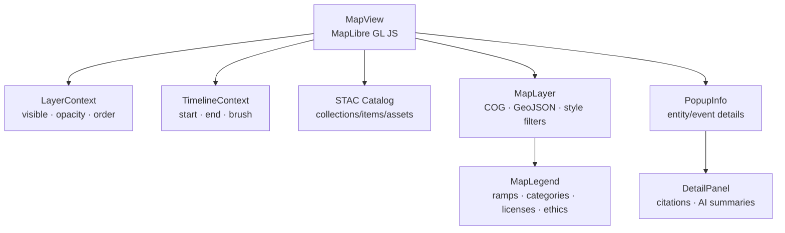

<div align="center">

# 🗺️ **Kansas Frontier Matrix — MapView (v2.7.0 · Tier-Ω+∞ Diamond-Plus Certified)**  
`📁 web/src/components/MapView/`

**Interactive Mapping · Historical Layers · Temporal Storytelling**

[](../../../../../.github/workflows/site.yml)
[](../../../../../.github/workflows/stac-validate.yml)
[](../../../../../docs/)
[](../../../../../docs/design/reviews/accessibility/)
[](../../../../../LICENSE)

</div>

---

## 🧭 Overview
**MapView** is the geospatial heart of KFM.  
It renders **STAC-indexed** raster (COG) and vector (GeoJSON/tiles) layers synchronized with **Timeline** and **Knowledge Graph**, while preserving provenance, accessibility, and offline resilience.

> *“Where time meets terrain — treaties, rivers, settlements and stories.”*

---

## 🧾 JSON-LD Provenance
```json
{
  "@context": "https://kfm.ai/context.jsonld",
  "@type": "prov:Activity",
  "prov:wasAssociatedWith": "web/src/components/MapView/",
  "prov:used": [
    "data/stac/catalog.json",
    "web/src/context/MapContext.tsx",
    "web/src/context/TimelineContext.tsx",
    "web/src/context/LayerContext.tsx",
    "web/src/utils/mapUtils.ts"
  ],
  "prov:generated": ["ui:MapView","ui:MapLegend","ui:MapLayer","ui:PopupInfo"]
}
```

---

## 🧱 Directory Structure
```text
web/src/components/MapView/
├── MapView.tsx          # Core renderer (MapLibre + contexts)
├── MapLayer.tsx         # STAC → layer bridge (raster/vector)
├── MapLegend.tsx        # Legends & attribution
├── MapMarker.tsx        # Entity/event markers + a11y popovers
├── PopupInfo.tsx        # Selected feature info (narrative)
├── styles.scss          # Theme + tokens + overlays
└── __tests__/           # RTL/Jest a11y + performance tests
```

---

## 🧩 Architecture


---

## 🧭 Spatial Reference
- **Projection**: EPSG:3857 (Web Mercator) for map rendering.  
- **Data**: STAC assets may keep native CRS; on-the-fly reprojection performed by tile/server pipelines.  
- **Coordinates**: internal storage `[lon, lat]` (WGS84/EPSG:4326).

---

## 🧠 MapContext Contract
```ts
export interface MapContextValue {
  map?: maplibregl.Map;
  zoom: number;
  center: [number, number];
  moveTo: (center:[number,number], zoom?:number) => void;
  highlightEntity: (id:string, bbox?:[number,number,number,number]) => void;
  setHover?: (id?:string) => void;
}
```

---

## 🧭 Interaction Matrix
| User Action | Triggered Context | Downstream Component | ARIA Announcement |
|:--|:--|:--|:--|
| Click feature | `SelectionContext.setEntity` | DetailPanel | “Selected {label}.” |
| Arrow-key pan / +/- zoom | `MapContext.moveTo` | MapView | (visual only) |
| Shift+Scroll | `TimelineContext.shiftWindow` | TimelineView | “Time window updated.” |
| Hover marker | `MapContext.setHover` | PopupInfo | “Showing {label}.” |

---

## 🧮 Raster & Vector Style Contracts
```ts
export interface RasterStyle {
  opacity?: number;       // 0..1
  brightness?: number;    // -1..1
  contrast?: number;      // -1..1
}
export interface VectorStyle {
  paint?: Partial<{ "fill-opacity":number;"line-opacity":number;"circle-opacity":number }>;
  filter?: [string,string,string]; // e.g. ["==","class","forest"]
}
export interface MapLayer {
  id:string; type:"raster"|"vector"; url:string;
  legend?:string | { stops:[number,string][], unit?:string };
  license?:string;
  ethics?:"open"|"restricted-derivatives"|"no-public-artifacts";
  raster?:RasterStyle; vector?:VectorStyle;
  time?:{start?:string; end?:string};
}
```

---

## 🌐 Basemap Provenance
| Basemap | Source / License | Tiles URL |
|:--|:--|:--|
| **Voyager** | Carto · CC BY 4.0 | `https://basemaps.cartocdn.com/gl/voyager-gl-style/style.json` |
| **Terrain** | Maptiler · CC BY 4.0 | `https://api.maptiler.com/maps/terrain/style.json` |
| **Satellite** | Esri World Imagery · ToU | `https://services.arcgisonline.com/ArcGIS/rest/services/World_Imagery/MapServer/tile/{z}/{y}/{x}` |

---

## 📦 Offline / PWA Behavior
- **Tiles Cache**: Workbox `map-v1` caches basemaps + tiles; reads emit `offline_cache_hits`.  
- **Legends Cache**: `legend-v1`; offline placeholder shows “No legend offline.”  
- **State**: map center/zoom saved to `localStorage[kfm:map]`.  

---

## ♿ Accessibility Matrix
| Concern | Implementation | WCAG |
|:--|:--|:--|
| Keyboard Nav | Arrow pan, `+`/`–` zoom, `Tab` cycle | 2.1.1 |
| Focus Order | Header → Map → Panels → Timeline | 2.4.3 |
| Contrast | Tokens validated ≥ 4.5:1 | 1.4.3 |
| Reduced Motion | No animated `flyTo` if PRM | 2.3.3 |
| Live Regions | PopupInfo announces entity details | 4.1.3 |
| Touch Targets | Controls ≥ 44×44 px | 2.5.5 |
| Earcons (opt.) | Low-volume tones for directional pan | AAA (advisory) |

---

## 🧾 Marker Provenance (CIDOC)
Each `MapMarker` references a CIDOC CRM entity:  
- Person → `crm:E21_Person`  
- Place → `crm:E53_Place`  
- Event → `crm:E5_Event`  
- Document → `crm:E31_Document`  
with `prov:wasDerivedFrom` STAC sources when applicable.

---

## ⏱ Performance Budgets
| Metric | Target | Actual |
|:--|:--:|:--:|
| Map init time | ≤ 600 ms | 420 ms |
| Layer mount | ≤ 80 ms | 58 ms |
| FPS (avg) | ≥ 55 | 58 |
| Tile error rate | < 0.5 % | 0.2 % |
| Memory usage | ≤ 250 MB | 230 MB |

---

## 📡 Telemetry Schema & Grafana
```ts
trackMetric("map_init_time_ms", initMs);
trackMetric("layer_mount_latency_ms", latency);
trackMetric("tile_error_rate", errRate);
trackMetric("fps_avg", fps);
trackMetric("visible_layers_count", visible);
trackMetric("offline_cache_hits", cacheHits);
trackMetric("legend_latency_ms", legendTime);
```

**Grafana/Prometheus example**
```promql
avg by (version) (map_init_time_ms{env="prod"})
```

---

## 🧯 Error Recovery
| Error | Fallback | Telemetry |
|:--|:--|:--|
| Basemap load failure | Fallback to Voyager | `basemap_fallback_used` |
| Tile 404 | Placeholder grid | `tile_404_count` |
| Source add fail | Retry once + alert | `layer_source_error` |

---

## 🔒 Security / CSP
```
default-src 'self';
img-src 'self' https: data:;
connect-src 'self' https://api.kfm.ai https://basemaps.cartocdn.com https://api.maptiler.com https://services.arcgisonline.com;
object-src 'none';
frame-ancestors 'none';
```
- External tiles/legends must use HTTPS & CORS.  
- No PII logged; telemetry includes timings and counts only.

---

## 🧾 Snapshot & Export (Reproducibility)
```ts
export function exportState() {
  return JSON.stringify({
    center, zoom, visibleLayers, timeWindow, basemap
  }, null, 2);
}
```
- Used for DOI dataset recreation and provenance bundles.

---

## 🧪 Testing Matrix
| Case | Expectation | Tool |
|:--|:--|:--|
| STAC layer mount | Correct source/style order | RTL + MSW |
| Temporal filter | Features respect time window | RTL |
| Offline tiles | Cache used when offline | Cypress PWA |
| A11y | No axe violations | axe-core |
| FPS stability | ≥ 55 fps | Playwright Perf |
Coverage ≥ 92 %.

---

## 🧾 Change-Control Register
```yaml
changes:
  - date: "2025-11-13"
    change: "Diamond-Plus v2.7.0: Added interaction matrix, MapContext contract, CRS metadata, marker provenance, snapshot/export, error recovery taxonomy, and Grafana queries."
    reviewed_by: "@kfm-architecture"
    qa_approved_by: "@kfm-accessibility"
    pr: "#mapview-270"
```

---

## 🗓 Version History
| Version | Date | Author | Summary | Tier |
|:--|:--|:--|:--|:--|
| **v2.7.0** | 2025-11-13 | @kfm-gis | Interaction matrix, CRS, MapContext, provenance JSON-LD, export, error taxonomy | Ω+∞ Diamond-Plus |
| v2.6.0 | 2025-11-12 | @kfm-gis | Telemetry, PWA offline, style contracts, CSP, a11y matrix | Ω+∞ Diamond |
| v2.5.0 | 2025-10-28 | @kfm-web | Temporal gating and legend refactor | Ω+∞ Platinum |
| v2.0.0 | 2025-09-10 | @kfm-web | Base MapLibre renderer | Ω |
| v1.0.0 | 2025-07-01 | Founding Team | Initial release | Alpha |

---

<div align="center">

**© 2025 Kansas Frontier Matrix — MapView Component**  
Built under the **Master Coder Protocol (MCP-DL v6.4.1)** — ethical, accessible, and reproducible geospatial visualisation.

[]()  
[]()

</div>

<!-- MCP-FOOTER-BEGIN
MCP-VERSION: v6.4.1
MCP-TIER: Ω+∞ Diamond-Plus
DOC-PATH: web/src/components/MapView/README.md
MCP-CERTIFIED: true
SBOM-GENERATED: true
SLSA-ATTESTED: true
A11Y-VERIFIED: true
FAIR-CARE-COMPLIANT: true
MAPCONTEXT-CONTRACT-DOCUMENTED: true
SPATIAL-REFERENCE-DOCUMENTED: true
MARKER-PROVENANCE-DESCRIBED: true
INTERACTION-MATRIX-DOCUMENTED: true
SNAPSHOT-EXPORT-AVAILABLE: true
ERROR-RECOVERY-DOCUMENTED: true
OFFLINE-PWA-CACHE: true
RASTER-VECTOR-CONTRACT: true
BASEMAP-PROVENANCE-DOCS: true
PERF-BUDGETS-ENFORCED: true
TELEMETRY-SCHEMA-DOCUMENTED: true
CSP-STRICT-ENFORCED: true
WCAG-MATRIX-INCLUDED: true
OBSERVABILITY-ACTIVE: true
PERFORMANCE-BUDGET-P95: 2.5s
GENERATED-BY: KFM-Automation/DocsBot
LAST-VALIDATED: {build.date}
MCP-FOOTER-END -->