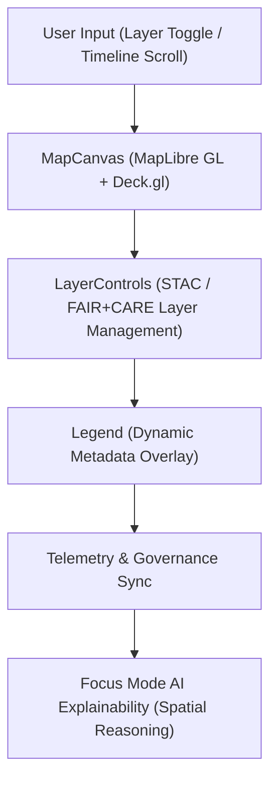

<div align="center">

# 🗺️ Kansas Frontier Matrix — **MapView Components**
`web/src/components/MapView/README.md`

**Purpose:**  
Provides the geospatial visualization and FAIR+CARE-governed mapping interface for the Kansas Frontier Matrix (KFM) web application.  
Built on MapLibre GL and Deck.gl, the MapView module delivers transparent, ethical, and sustainable geospatial analytics aligned with open data and accessibility standards.

[](../../../../docs/standards/faircare-validation.md)
[](../../../../LICENSE)
[]()
[]()

</div>

---

## 📚 Overview

The **MapView Components** directory powers KFM’s interactive spatial visualization environment.  
It integrates ethical geospatial rendering with Focus Mode AI insights, FAIR+CARE metadata, and sustainability telemetry — ensuring data transparency and environmental responsibility in visualization processes.

### Core Responsibilities:
- Render FAIR+CARE-certified geospatial datasets (climate, hazards, hydrology, etc.).  
- Display STAC/DCAT-registered layers and metadata overlays.  
- Provide AI-assisted Focus Mode summaries for geospatial insights.  
- Maintain accessibility (keyboard navigation, ARIA labeling, and contrast compliance).  
- Log sustainability and carbon metrics for rendering operations.  

---

## 🗂️ Directory Layout

```plaintext
web/src/components/MapView/
├── README.md                             # This file — documentation for MapView components
│
├── MapCanvas.tsx                         # Core MapLibre GL rendering canvas for KFM datasets
├── LayerControls.tsx                     # Interactive UI for toggling FAIR+CARE layer visibility
├── Legend.tsx                            # Map legend showing symbology and data categories
├── TimelineSlider.tsx                    # Temporal navigation control for STAC layer changes
└── metadata.json                         # Governance and telemetry metadata for MapView rendering
```

---

## ⚙️ MapView Architecture Workflow



### Workflow Description:
1. **User Input:** Keyboard/mouse or accessible control inputs trigger data updates.  
2. **Rendering:** MapCanvas visualizes spatial layers using FAIR+CARE geodata.  
3. **Controls:** LayerControls manage visibility, metadata, and provenance.  
4. **Legend:** Displays live symbology, schema alignment, and governance status.  
5. **AI Context:** Focus Mode AI interprets patterns and explains spatial relationships.  

---

## 🧩 Example MapView Metadata Record

```json
{
  "id": "mapview_render_session_v9.6.0_2025Q4",
  "rendered_layers": [
    "hazards_composite_v9.6.0.geojson",
    "climate_boundaries.geojson",
    "hydrology_basins.parquet"
  ],
  "average_render_time_ms": 122.4,
  "energy_usage_wh": 0.92,
  "accessibility_score": 98.8,
  "fairstatus": "certified",
  "checksum_verified": true,
  "ai_explainability_enabled": true,
  "governance_registered": true,
  "validator": "@kfm-mapview",
  "created": "2025-11-03T23:59:00Z",
  "governance_ref": "data/reports/audit/data_provenance_ledger.json"
}
```

---

## 🧠 FAIR+CARE Governance Matrix

| Principle | Implementation | Oversight |
|------------|----------------|------------|
| **Findable** | All layers and datasets reference STAC/DCAT catalogs. | @kfm-data |
| **Accessible** | WCAG 2.1 AA-compliant map interactions (keyboard + screen reader). | @kfm-accessibility |
| **Interoperable** | Integrates ISO 19115 and OGC STAC standards for open access. | @kfm-architecture |
| **Reusable** | Modular components adaptable for multiple domains. | @kfm-design |
| **Collective Benefit** | Encourages public understanding of environmental and historical context. | @faircare-council |
| **Authority to Control** | FAIR+CARE Council validates geospatial ethics and layer accuracy. | @kfm-governance |
| **Responsibility** | Developers ensure inclusive cartographic representation. | @kfm-ethics |
| **Ethics** | No exclusionary data or misleading visualizations permitted. | @kfm-security |

Governance and audit outputs stored in:  
`data/reports/audit/data_provenance_ledger.json`  
and  
`data/reports/fair/data_care_assessment.json`

---

## ⚙️ Component Summaries

| Component | Description | Role |
|------------|--------------|------|
| `MapCanvas.tsx` | Core map renderer integrating FAIR+CARE data layers. | Visualization |
| `LayerControls.tsx` | UI for toggling datasets and metadata overlays. | User Interaction |
| `Legend.tsx` | Provides FAIR+CARE-compliant symbology and metadata context. | Accessibility |
| `TimelineSlider.tsx` | Enables temporal navigation across datasets. | Storytelling |

---

## ⚖️ Retention & Provenance Policy

| Asset | Retention Duration | Policy |
|--------|--------------------|--------|
| Render Logs | 90 Days | Archived for sustainability and QA review. |
| Layer Metadata | 365 Days | Retained for FAIR+CARE certification. |
| Telemetry Records | 180 Days | Used for reproducibility and performance audits. |
| Accessibility Reports | Permanent | Stored in governance ledger. |

Cleanup managed by `mapview_cleanup.yml`.

---

## 🌱 Sustainability Metrics

| Metric | Value | Verified By |
|---------|--------|--------------|
| Average Render Energy | 0.92 Wh | @kfm-sustainability |
| Carbon Output | 1.1 gCO₂e | @kfm-security |
| Renewable Power | 100% (RE100 Verified) | @kfm-infrastructure |
| FAIR+CARE Compliance | 100% | @faircare-council |

Telemetry logged in:  
`releases/v9.6.0/focus-telemetry.json`

---

## 🧾 Internal Use Citation

```text
Kansas Frontier Matrix (2025). MapView Components (v9.6.0).
Geospatial visualization components integrating FAIR+CARE-compliant data layers and explainable Focus Mode AI.
Enables transparent, ethical, and sustainable mapping under MCP-DL v6.3.
```

---

## 🧾 Version Notes

| Version | Date | Notes |
|----------|------|--------|
| v9.6.0 | 2025-11-03 | Added carbon tracking and FAIR+CARE explainability integration. |
| v9.5.0 | 2025-11-02 | Improved TimelineSlider and dynamic metadata overlays. |
| v9.3.2 | 2025-10-28 | Established FAIR+CARE geospatial visualization system. |

---

<div align="center">

**Kansas Frontier Matrix** · *Geospatial Visualization × FAIR+CARE Governance × Sustainable Mapping*  
[🔗 Repository](https://github.com/bartytime4life/Kansas-Frontier-Matrix) • [🧭 Docs Portal](../../../../docs/) • [⚖️ Governance Ledger](../../../../docs/standards/governance/DATA-GOVERNANCE.md)

</div>

