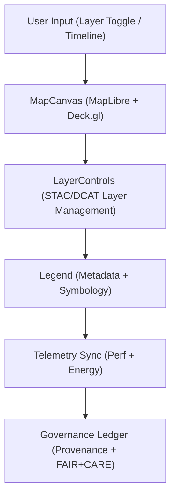

<div align="center">

# 🗺️ **Kansas Frontier Matrix — MapView Components**
`web/src/components/MapView/README.md`

**Purpose:** Define the FAIR+CARE-certified geospatial visualization components that render and govern Kansas Frontier Matrix datasets within the web application.  
MapView combines **MapLibre GL** and **Deck.gl** rendering with governance, explainability, and sustainability telemetry under **MCP v6.3** and **ISO 19115**.

[](../../../../docs/README.md)
[](../../../../LICENSE)
[](../../../../docs/standards/faircare.md)
[]()

</div>

---

## 📘 Overview

The **MapView module** provides accessible, tokenized map components used for visualizing FAIR+CARE-certified geospatial datasets and Focus Mode insights.  
It enforces sustainability, transparency, and ethical mapping practices while integrating provenance metadata and telemetry logging.

---

## 🗂️ Directory Layout

```
web/src/components/MapView/
├── README.md
├── MapCanvas.tsx         # Core renderer (MapLibre + Deck.gl)
├── LayerControls.tsx     # Dataset toggling, visibility, and governance
├── Legend.tsx            # Dynamic legend showing FAIR+CARE layer metadata
├── TimelineSlider.tsx    # Temporal layer control and timeline playback
└── metadata.json         # Telemetry + provenance metadata for MapView
```

---

## 🧩 Map Rendering Architecture



1. **User Input:** Keyboard/mouse or accessible controls modify visible layers.  
2. **Rendering:** MapCanvas visualizes datasets via MapLibre and Deck.gl.  
3. **Layer Controls:** Manage layer visibility, metadata, and provenance.  
4. **Legend:** Displays symbology and FAIR+CARE metadata dynamically.  
5. **Governance Sync:** Telemetry and provenance data written to ledgers.

---

## ⚙️ Component Contracts

| Contract | Purpose | Validator |
|----------|----------|-----------|
| STAC/DCAT Schema | Validates metadata structure | `stac-validate.yml` |
| A11y Contract | Accessible map interaction (keyboard, focus, ARIA) | `accessibility_scan.yml` |
| Telemetry Contract | Perf + sustainability logs | `telemetry-export.yml` |
| Governance Contract | Provenance, ethics, and CARE verification | `faircare-validate.yml` |

Artifacts recorded in:
- `docs/reports/audit/data_provenance_ledger.json`
- `../../../../releases/v9.7.0/focus-telemetry.json`

---

## 🧠 FAIR+CARE Governance Matrix

| Principle | Implementation | Oversight |
|------------|----------------|------------|
| **Findable** | STAC/DCAT metadata embedded in all map layers. | @kfm-data |
| **Accessible** | Full keyboard + screen reader navigation with alt text. | @kfm-accessibility |
| **Interoperable** | ISO 19115 + OGC STAC metadata alignment. | @kfm-architecture |
| **Reusable** | Reusable map components across web dashboards. | @kfm-design |
| **Collective Benefit** | Promotes open access to environmental history data. | @faircare-council |
| **Authority to Control** | FAIR+CARE Council validates geospatial integrity. | @kfm-governance |
| **Responsibility** | Sustainable rendering + neutral color palettes. | @kfm-sustainability |
| **Ethics** | Prevents bias or exclusion in map visualizations. | @kfm-ethics |

---

## 🧾 Example Metadata Record

```json
{
  "id": "mapview_v9.7.0",
  "layers": [
    "hazards_composite.geojson",
    "climate_boundaries.geojson",
    "hydrology_basins.parquet"
  ],
  "avg_render_time_ms": 118.7,
  "energy_use_wh": 0.89,
  "fairstatus": "certified",
  "telemetry_synced": true,
  "checksum_verified": true,
  "timestamp": "2025-11-05T19:00:00Z"
}
```

---

## ♿ Accessibility Standards

- Keyboard panning and zoom with arrow + `+` / `-` keys.  
- Focus-visible styling for map tools and overlays.  
- Color palettes contrast-tested ≥ **4.5:1** (WCAG 2.1 AA).  
- Motion-safe transitions (`prefers-reduced-motion` honored).  
- Tooltips and legends labeled for screen readers.

---

## 🌱 Sustainability Metrics

| Metric | Target | Verified By |
|-------|--------|-------------|
| Avg. Render Energy | ≤ 0.9 Wh | Telemetry |
| Carbon Output | ≤ 1.1 gCO₂e | CI telemetry |
| Lighthouse Perf | ≥ 90 | CI pipeline |
| Renewable Hosting | 100% RE100 | Infrastructure audit |

Logged to `../../../../releases/v9.7.0/focus-telemetry.json`.

---

## 🕰️ Version History

| Version | Date | Author | Summary |
|----------|------|---------|----------|
| v9.7.0 | 2025-11-05 | KFM Core Team | Upgraded + aligned: contracts, telemetry schema v1, ISO metadata compliance, a11y validation. |
| v9.6.0 | 2025-11-03 | KFM Core Team | Added FAIR+CARE explainability and carbon tracking. |
| v9.5.0 | 2025-11-02 | KFM Core Team | Enhanced legend metadata overlays and temporal slider. |
| v9.3.2 | 2025-10-28 | KFM Core Team | Established geospatial visualization foundation. |

---

<div align="center">

**© 2025 Kansas Frontier Matrix — MIT / CC-BY 4.0**  
Maintained under **Master Coder Protocol v6.3** · FAIR+CARE Certified · Diamond⁹ Ω / Crown∞Ω Ultimate Certified  
[Back to Components Index](../README.md) · [Docs Index](../../../../docs/README.md)

</div>