<div align="center">

# 🗺️ **Kansas Frontier Matrix — MapView Architecture & Rendering System**  
`web/src/components/MapView/README.md`

**Purpose:**  
Define the complete **deep-architecture rendering system** for MapView in the Kansas Frontier Matrix (KFM) v10.3.2 web platform.  
MapView unifies **MapLibre GL**, **CesiumJS**, **FAIR+CARE geospatial governance**, **STAC/DCAT layer metadata**, **Focus Mode v2.5 alignment**, **predictive temporal overlays (2030–2100)**, and **full telemetry instrumentation** into a single deterministic and ethical mapping engine.

[]()
[]()
[]()
[]()

</div>

---

# 📘 Executive Summary

The **MapView Rendering System** is the front-end geospatial engine for KFM, providing:

- 2D map rendering (MapLibre)  
- 3D terrain + deep-time visualization (CesiumJS)  
- Layer stack orchestration (STAC/DCAT)  
- Governance overlays (CARE, sovereignty, masking rules)  
- Focus Mode v2.5 spatial sync  
- Timeline sync (year → map layers)  
- Predictive SSP overlays (2030–2100)  
- Legend + symbology engine (WCAG-tested)  
- Interactive layer controls  
- Telemetry + sustainability instrumentation  
- Accessibility compliance (WCAG 2.1 AA)  

This document codifies *every* component, pipeline link, and governance rule involved in MapView.

---

# 🗂️ Directory Layout (Authoritative v10.3.2)

```text
web/src/components/MapView/
├── README.md
├── MapCanvas.tsx
├── LayerControls.tsx
├── Legend.tsx
├── TimelineSlider.tsx
└── metadata.json
```

Each component participates in the **Geospatial Rendering Control Plane**.

---

# 🌐 High-Level Map Rendering Architecture


---

# 🧬 1. MapCanvas.tsx — Dual Rendering Engine

MapCanvas unifies **MapLibre GL (2D)** with **CesiumJS (3D)** while enforcing:

- Layer filtering  
- Temporal sync  
- Predictive overlays  
- Terrain blending  
- Ethical masking  

## Dual Engine Architecture


### Responsibilities
- Manage WebGL contexts (2D + 3D)  
- Apply CARE masking before draw  
- Attach predictive temporal materials  
- Broadcast map events (`kfm:map:layer-change`)  
- Provide render-cost telemetry  

---

# 🎛️ 2. LayerControls.tsx — Semantic Layer Stack Orchestrator

Controls all:

- layer toggles  
- opacity  
- ordering  
- metadata expansion  
- provenance visibility  
- CARE enforcement gating  

## Layer Stack Architecture


### Governance Enforcement
From `masking.json` + CARE labels:
- restricted → block  
- sensitive → generalize/fuzz  
- public → full resolution  

---

# 🎨 3. Legend.tsx — Symbology + FAIR+CARE Plate

Legend displays:

- WCAG-compliant symbology  
- predictive band fills  
- CARE icons  
- provenance chips (data source, license, checksum)  
- color scales mapped from `symbology.json`  

## Legend Architecture


---

# 🕰️ 4. TimelineSlider.tsx — Temporal-Map Synchronization

A temporal slider linked to the global `currentYear` broadcast.

### Responsibilities
- Update map visible layers by year  
- Trigger predictive temporal overlays  
- Sync Focus Mode + Story Nodes  

## Temporal Map Architecture


---

# 🌋 Rendering Pipelines (Deep Architecture)

## 2D Map Pipeline — MapLibre

```mermaid
flowchart TD
    LS[Layer Stack] --> FLT[Temporal Filter<br/>STAC datetime]
    FLT --> MASK[CARE Mask Engine<br/>H3 · Fuzzing]
    MASK --> DRAW2D[MapLibre Draw<br/>vector · raster]
```



## 3D Map Pipeline — Cesium


---

# 🧠 Focus Mode v2.5 Spatial Alignment

Components interact with Focus Mode via:

- event-based triggers  
- spatial highlighting  
- timeline binding  
- provenance-driven filters  

## Focus Sync Architecture


---

# 🔐 FAIR+CARE Spatial Governance

| Rule | Enforcement |
|------|-------------|
| No sensitive coordinates exposed | CARE mask engine inside LayerControls + MapCanvas |
| Sovereignty boundaries protected | H3 + buffer masking |
| Restricted layers hidden by default | CARE gating |
| Provenance required for every layer | Legend + metadata.json |
| Ethical colors & accessibility | WCAG-tested color ramps |

Governance ledger:

```
../../../../docs/reports/audit/web-mapview-governance-ledger.json
```

---

# ♿ Accessibility Architecture (WCAG 2.1 AA)

All MapView components implement:

- keyboard navigation for all toggles and map pan/zoom  
- ARIA roles (`region`, `toolbar`, `slider`, `status`)  
- focus-visible tokens  
- high-contrast symbology  
- reduced-motion camera transitions  
- zoom-to-feature announcements via live regions  

## A11y Architecture


---

# 📡 Telemetry & Sustainability System

Telemetry includes:

- `map_render_ms`  
- `layer_toggle_latency_ms`  
- `terrain_shader_cost_ms`  
- `energy_estimate_wh`  
- `a11y_compliance`  
- `care_masking_events`  

Telemetry destination:

```
../../../../releases/v10.3.2/focus-telemetry.json
```

Energy estimation uses ISO 50001-compliant browser models.

---

# ⚙️ CI/CD & Validation

| Mechanism | Ensures |
|-----------|---------|
| `docs-lint.yml` | Documentation compliance |
| `faircare-validate.yml` | Governance & CARE correctness |
| `accessibility_scan.yml` | WCAG 2.1 AA compliance |
| `stac-validate.yml` | Metadata correctness |
| `telemetry-export.yml` | Sustainability & energy metrics |
| `codeql.yml` | Security safety |

Failures block merge automatically.

---

# 🧾 Example Metadata Record

```json
{
  "id": "mapview_v10.3.2",
  "layers": [
    "hazards_timeseries.stac.json",
    "climate_ssp2050_cog.json",
    "hydrology_basins.parquet"
  ],
  "avg_render_time_ms": 112.4,
  "energy_use_wh": 0.83,
  "a11y_compliant": true,
  "care_events": 12,
  "checksum_verified": true,
  "timestamp": "2025-11-14T10:21:00Z"
}
```

---

# 🕰️ Version History

| Version | Date | Summary |
|--------|--------|---------|
| v10.3.2 | 2025-11-14 | Full deep-architecture rebuild; added dual-engine rendering, predictive overlays, governance masking, and telemetry integration. |
| v9.7.0 | 2025-11-05 | Previous version. |

---

<div align="center">

**Kansas Frontier Matrix — MapView Architecture**  
🗺️ Ethical Spatial Rendering · 🌐 FAIR+CARE · 🧠 AI-Aligned · 🔗 Provenance-Secured  
© 2025 Kansas Frontier Matrix — MIT License  

[Back to Components Index](../README.md)

</div>
