<div align="center">

# 🗺️ Kansas Frontier Matrix — **MapView Component**  
`web/src/components/MapView/`

**Interactive Mapping · Historical Layers · Spatial Storytelling**

[](../../../../../.github/workflows/ci.yml)
[](../../../../../.github/workflows/stac-validate.yml)
[](../../../../../docs/)
[](../../../../../docs/design/reviews/accessibility/)
[](../../../../../LICENSE)

</div>

---

## 🧭 Overview

The **MapView** is the geospatial heart of KFM. It renders **STAC-indexed** raster (COG) and vector (GeoJSON) layers, synchronized with the **Timeline** and **Knowledge Graph**.  
Built on **MapLibre GL JS**, it supports temporal filters, legends, markers, and accessible interactions—all aligned with **MCP-DL v6.2** and **WCAG 2.1 AA**.

> *“Where time meets terrain: treaties, rivers, settlements, and stories.”*

---

## 🧱 Directory Structure

```text
web/src/components/MapView/
├── MapView.tsx             # Main renderer (MapLibre + Context integration)
├── MapLayer.tsx            # Declarative STAC → map layer bridge (raster/vector)
├── MapLegend.tsx           # Active legends & attribution
├── MapMarker.tsx           # Entity/event markers with a11y popovers
├── PopupInfo.tsx           # Selected feature info (narrative excerpts)
├── styles.scss             # Theme, sizing, overlays
└── __tests__/              # RTL + Jest: rendering/interaction/a11y tests
```

---

## 🗺️ Architecture

```mermaid
flowchart TD
  MV["MapView<br/>MapLibre GL JS"] --> LCTX["LayerContext<br/>visible · opacity · order"]
  MV --> TLX["TimelineContext<br/>start · end · brush"]
  MV --> STAC["STAC Catalog<br/>collections/items/assets"]
  MV --> ML["MapLayer<br/>COG · GeoJSON · style filters"]
  MV --> POP["PopupInfo<br/>entity/event details"]
  ML --> LEG["MapLegend<br/>ramp · categories · attribution"]
  POP --> DP["DetailPanel<br/>dossier + citations"]
%% END OF MERMAID
```



*One-way flow:* **STAC → Context → Map → UI** ensures deterministic, reproducible rendering.

---

## 🧩 Core Features

| Feature                  | What it does                                                    | Source |
| :----------------------- | :-------------------------------------------------------------- | :----- |
| **STAC-Driven Layers**   | Declaratively mount COG/GeoJSON with attribution & license      | STAC   |
| **Temporal Filtering**   | Filters features by `start/end` from **TimelineContext**        | TLX    |
| **Interactive Markers**  | Clickable events/places with keyboard navigation                | Graph  |
| **Legends & Ramps**      | Auto-generated from STAC metadata (categorical/continuous)      | STAC   |
| **Basemap Switcher**     | Voyager · Terrain · Satellite                                   | MapLibre |
| **A11y Controls**        | Focus rings, ARIA labels, reduced motion                        | A11y/Theme |

---

## 💬 Reference Implementation (concise)

```tsx
import React, { useEffect, useRef } from "react";
import maplibregl from "maplibre-gl";
import "maplibre-gl/dist/maplibre-gl.css";
import { useLayer } from "../../context/LayerContext";
import { useTimeline } from "../../context/TimelineContext";
import { applyStacLayers } from "../../utils/mapUtils";
import "./styles.scss";

export const MapView: React.FC = () => {
  const containerRef = useRef<HTMLDivElement>(null);
  const mapRef = useRef<maplibregl.Map | null>(null);
  const { visibleLayers } = useLayer();
  const { range } = useTimeline(); // { start, end }

  useEffect(() => {
    if (mapRef.current) return; // singleton
    mapRef.current = new maplibregl.Map({
      container: containerRef.current!,
      style: "https://basemaps.cartocdn.com/gl/voyager-gl-style/style.json",
      center: [-98.3, 38.5], zoom: 6, attributionControl: true,
    });
    mapRef.current.addControl(new maplibregl.NavigationControl({ showCompass: false }), "top-right");
  }, []);

  useEffect(() => {
    if (!mapRef.current) return;
    applyStacLayers(mapRef.current, visibleLayers, range); // idempotent updates
  }, [visibleLayers, range]);

  return (
    <div
      ref={containerRef}
      className="map-view"
      role="region"
      aria-label="Interactive Kansas Historical Map"
      data-testid="map-view"
    />
  );
};
```

---

## 🧮 Temporal & Layer Logic


---

## 🎛 Basemap & Styling

- **Basemaps:** `voyager` (default), `terrain`, `satellite` – exposed via a small toggle.  
- **Layer styling:**
  - **Categorical:** treaties, routes, boundaries (stroke/fill + filter).  
  - **Continuous:** rasters (COG) with color ramps and hillshade (if available).  
- **Legends:** read from STAC `assets.roles` + `properties` (title, colormap, units).

---

## ♿ Accessibility (WCAG 2.1 AA)

| Concern               | Implementation                                                                 |
| :-------------------- | :------------------------------------------------------------------------------ |
| Keyboard navigation   | Arrow keys pan; `+`/`−` zoom; `Tab` cycles controls; `Esc` closes popups       |
| Roles & labels        | Container `role="region"` + descriptive `aria-label`                            |
| Focus management      | Visible high-contrast ring; map canvas not focus-stealing                      |
| Reduced motion        | Disables smooth flyTo/animate on `prefers-reduced-motion: reduce`              |
| Tooltips & popups     | `role="dialog"` for sticky popups; `aria-live="polite"` for announcements      |

A11y checks enforced in CI (**axe-core**, Lighthouse).

---

## 🧪 Testing

| Case                    | Expectation                                                 | Tooling        |
| :---------------------- | :---------------------------------------------------------- | :------------- |
| STAC layer mount        | Layers add/remove with correct source/style                 | Jest + MSW     |
| Temporal filtering      | Features respect `{start,end}` from TimelineContext         | RTL + mocks    |
| Legend generation       | STAC metadata → legend entries with labels & units          | Jest           |
| Marker interaction      | Keyboard/Mouse open `PopupInfo`; focus order preserved      | RTL + userEvent|
| A11y audit              | No critical violations (roles/labels/contrast)              | axe-core       |

**Coverage target:** ≥ **90%**.

---

## ⚡ Performance Notes

- Prefer **COG** for rasters; set `raster-resampling: linear` and tile size 512.  
- Simplify large vectors at build time; use filters over frequent `setData`.  
- Throttle viewport sync to **60–120ms**; avoid expensive re-style churn.  
- Batch style operations: add sources first, then layers, then filters.  
- Use **idempotent** updates in `applyStacLayers` to prevent flicker.

---

## 🧾 Provenance & Integrity

| Artifact         | Description                                                                       |
| :--------------- | :-------------------------------------------------------------------------------- |
| **Inputs**       | STAC catalog (`data/stac/*.json`), API (`/api/events`), context state             |
| **Outputs**      | Rendered map layers (COG/GeoJSON), legends, markers, popups                       |
| **Dependencies** | React 18+, MapLibre GL, TailwindCSS, (optional) Framer Motion for UI affordances  |
| **Integrity**    | CI validates STAC schema, visual snapshots, and accessibility before merge        |

---

## 🔗 Related Documentation

- **LayerControls** — `web/src/components/LayerControls/README.md`  
- **TimelineView** — `web/src/components/TimelineView/README.md`  
- **DetailPanel** — `web/src/components/DetailPanel/README.md`  
- **Components Overview** — `web/src/components/README.md`  
- **Web UI Architecture** — `web/ARCHITECTURE.md`

---

## 🧾 Versioning & Metadata

| Field | Value |
| :---- | :---- |
| **Version** | `v1.6.0` |
| **Codename** | *Temporal Filters & Legend Sync Upgrade* |
| **Last Updated** | 2025-10-17 |
| **Maintainers** | @kfm-web · @kfm-gis |
| **License** | MIT (code) · CC-BY 4.0 (docs) |
| **Alignment** | STAC 1.0 · CIDOC CRM · OWL-Time · WCAG 2.1 AA |
| **Maturity** | Stable / Production |

---

## 📜 License

Released under the **MIT License**.  
© 2025 Kansas Frontier Matrix — built under **MCP-DL v6.2** for transparent, reproducible geovisualization.

> *“MapView is the living atlas—Kansas across centuries, rendered in motion.”*
