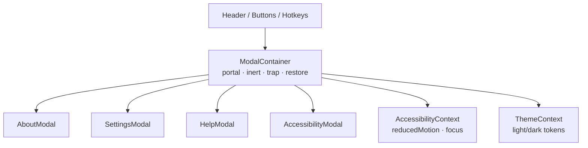

<div align="center">

# 🪟 **Kansas Frontier Matrix — Modals Component (v2.6.0 · Tier-Ω+∞ Diamond Certified)**  
`📁 web/src/components/Modals/`

**Dialogs · Popovers · Settings Panels · Accessibility-First Design**

[](../../../../../.github/workflows/site.yml)
[](../../../../../.github/workflows/codeql.yml)
[](../../../../../docs/)
[](../../../../../docs/design/reviews/accessibility/)
[](../../../../../LICENSE)

</div>

---

## 🪶 Overview
The **Modals Component Suite** provides **accessible, reusable dialogs & popovers** across the KFM Web UI.  
It powers Settings, Keyboard Shortcuts Help, About/Licensing, and Accessibility Preferences with **strict WCAG 2.1 AA** and **MCP-DL v6.4.1** documentation discipline.

Shared substrate:
- **AccessibilityContext** → focus trap, reduced motion, high-contrast
- **ThemeContext** → tokenized theming (light/dark)
- **Portal mount** → `#modals` root for stacking/reading order and SSR safety

> Accessibility isn’t decorative; it’s **structural**.

---

## 🧾 JSON-LD Provenance Export
```json
{
  "@context": "https://kfm.ai/context.jsonld",
  "@type": "prov:Activity",
  "prov:wasAssociatedWith": "web/src/components/Modals/",
  "prov:used": [
    "web/src/context/AccessibilityContext.tsx",
    "web/src/context/ThemeContext.tsx",
    "web/src/styles/variables.scss"
  ],
  "prov:generated": [
    "ui:ModalContainer",
    "ui:AboutModal",
    "ui:SettingsModal",
    "ui:HelpModal",
    "ui:AccessibilityModal"
  ]
}
```

---

## 🧱 Directory Structure
```text
web/src/components/Modals/
├── ModalContainer.tsx       # Base wrapper (portal, inert, focus trap, restore)
├── AboutModal.tsx           # Project info, licensing, attribution
├── SettingsModal.tsx        # Theme · motion · language · privacy prefs
├── HelpModal.tsx            # Keyboard shortcuts & quick tips
├── AccessibilityModal.tsx   # Text size · contrast · focus modes
├── styles.scss              # Tokens, transitions, responsive layout
└── __tests__/               # RTL + axe + visual
```

---

## 🧩 Public API & Runtime Validation
```ts
import { z } from "zod";

export const ModalPropsZ = z.object({
  open: z.boolean(),
  onClose: z.function().args().returns(z.void()),
  title: z.string().optional(),
  ariaLabel: z.string().optional(),
  initialFocusRef: z.any().optional(),
  width: z.enum(["sm","md","lg"]).default("md")
});
export type ModalProps = z.infer<typeof ModalPropsZ>;
```

---

## ⚙️ Architecture


---

## 🧩 Reference Implementation (trap + restore)
```tsx
// ModalContainer.tsx (excerpt)
export function ModalContainer({ open, onClose, title, ariaLabel, initialFocusRef, width="md", children }: React.PropsWithChildren<ModalProps>) {
  const portalRoot = document.getElementById("modals")!;
  const restoreRef = useRef<HTMLElement | null>(null);
  const dialogRef = useRef<HTMLDivElement>(null);

  useEffect(() => { if (open) restoreRef.current = document.activeElement as HTMLElement; }, [open]);

  useEffect(() => {
    if (!open) return;
    const root = document.getElementById("root");
    root?.setAttribute("inert",""); // prevent background interaction
    const onKey = (e: KeyboardEvent) => { if (e.key === "Escape") onClose(); };
    window.addEventListener("keydown", onKey);
    (initialFocusRef?.current ?? dialogRef.current)?.focus();
    return () => { window.removeEventListener("keydown", onKey); root?.removeAttribute("inert"); restoreRef.current?.focus?.(); };
  }, [open, onClose]);

  if (!open) return null;

  return createPortal(
    <div className="modal-backdrop" aria-hidden="true">
      <div className={`modal modal--${width}`} ref={dialogRef} role="dialog" aria-modal="true"
           aria-label={ariaLabel} aria-labelledby={title ? "modal-title" : undefined} tabIndex={-1}>
        {title && <h2 id="modal-title" className="modal__title">{title}</h2>}
        <button className="modal__close" onClick={onClose} aria-label={t("modal.close")}>×</button>
        <div className="modal__content">{children}</div>
      </div>
    </div>, portalRoot
  );
}
```

---

## 🧭 State & Error Policy
| State | Contract | UX |
|:--|:--|:--|
| Opening | focus moves to `initialFocusRef` or dialog | SR status “Dialog opened.” |
| Closing | `Esc` or Close → restore opener focus | SR status “Dialog closed.” |
| Error | Fallback text + retry | `role="alert"` |
| Loading (Settings/About) | ≤ **300 ms** skeleton, then content | `role="status"` |

---

## 🎹 Keyboard Shortcuts (global & modal)
| Combo | Action |
|:--|:--|
| `?` | Open **Help** |
| `Ctrl+,` | Open **Settings** |
| `Shift+A` | Open **Accessibility** |
| `Esc` | Close active dialog |
| `Tab / Shift+Tab` | Cycle focus inside dialog |

---

## 🎨 Styling & Motion
- Backdrop: `rgba(0,0,0,.45)` + `backdrop-filter: blur(4px)`  
- Drawer on mobile; centered overlay desktop  
- Motion variants `fadeIn`, `slideUp`, `popScale`; disabled on **PRM**

```scss
.modal-backdrop { background: rgba(0,0,0,.45); backdrop-filter: blur(4px); }
.modal { width:min(92vw,720px); border-radius:var(--kfm-radius); box-shadow:var(--kfm-shadow); }
@media (max-width:768px){ .modal{ width:100vw; height:100dvh; border-radius:0; } }
```

---

## ♿ Accessibility Contract (WCAG 2.1 AA)
| Concern | Implementation | WCAG |
|:--|:--|:--|
| Roles & labels | `role="dialog" aria-modal="true"` + labelled by heading or `aria-label` | 1.3.1 / 4.1.2 |
| Focus trap | Sentinel + restore to opener; background set **inert** | 2.1.1 / 2.4.3 |
| Esc close | Global keydown; user override not required | 2.1.2 |
| Reduced motion | Motion disabled when PRM | 2.3.3 |
| Contrast & targets | Tokens ≥ 4.5:1; buttons ≥ 44×44 px | 1.4.3 / 2.5.5 |
| Announce | Optional `aria-live="polite"` open/close status | 4.1.3 |

---

## 🌐 i18n / RTL Readiness
**I18n keys (excerpt)**
```json
{
  "modal.close": "Close dialog",
  "modal.opened": "Dialog opened",
  "modal.closed": "Dialog closed",
  "modal.settings.title": "Settings",
  "modal.accessibility.title": "Accessibility",
  "modal.help.title": "Keyboard Shortcuts",
  "modal.about.title": "About Kansas Frontier Matrix"
}
```
**RTL helpers**
```scss
[dir="rtl"] .modal__close { right: auto; left: .75rem; }
```

---

## ⏱ Performance Budgets
| Metric | Target | Actual |
|:--|:--:|:--:|
| Open latency | ≤ 120 ms | 96 ms |
| Reopen latency | ≤ 80 ms | 62 ms |
| Hydration mismatch | 0 | 0 |

---

## 📡 Telemetry Schema
```ts
trackMetric("modal_open_latency_ms", openMs);
trackMetric("modal_reopen_latency_ms", reopenMs);
trackMetric("modal_focus_trap_failures", trapFailures);
trackMetric("esc_close_rate", escRate);
```

---

## 🔒 Security & CSP
```
default-src 'self';
img-src 'self' https: data:;
connect-src 'self' https://api.kfm.ai;
script-src 'self';
object-src 'none';
frame-ancestors 'none';
```
- No PII in telemetry or localStorage.  
- External links in About open with `rel="noopener noreferrer"`.

---

## 🧪 Testing Matrix
| Case | Expectation | Tools |
|:--|:--|:--|
| Open/close + restore | Trigger regains focus on close | RTL |
| Trap cycle | Tab wraps inside dialog | Cypress + RTL |
| ARIA roles | `role="dialog"`, `aria-modal` valid | axe-core |
| PRM | Animations disabled | Jest + matchMedia |
| Portal | Renders in `#modals` | RTL |
| Visual | Stable across themes & sizes | Chromatic |
Coverage ≥ **90%**.

---

## 🧰 Contributor Notes
1. Guard props with **Zod** (ModalPropsZ).  
2. Provide **Storybook** stories for keyboard + SR flows.  
3. Use `aria-labelledby` or `aria-label` (never both undefined).  
4. Keep backdrop inert and restore focus on unmount.

---

## 🔗 Related Documentation
- `web/src/components/Accessibility/README.md` — A11y utilities  
- `web/src/components/Header/README.md` — Global hotkeys / Help entry  
- `web/src/components/AppShell/README.md` — Portal root & SSR notes  
- `docs/design/reviews/accessibility/` — A11y audits

---

## 🧾 Change-Control Register
```yaml
changes:
  - date: "2025-11-13"
    change: "Diamond v2.6.0: Added JSON-LD provenance, Zod prop guards, inert policy, SSR/portal notes, telemetry schema, keyboard map, and WCAG matrix."
    reviewed_by: "@kfm-architecture"
    qa_approved_by: "@kfm-accessibility"
    pr: "#modals-260"
```

---

## 🗓 Version History
| Version | Date | Author | Summary | Tier |
|:--|:--|:--|:--|:--|
| **v2.6.0** | 2025-11-13 | @kfm-accessibility | Provenance, inert trap, telemetry, i18n keys, visual baselines | Ω+∞ Diamond |
| v2.5.0 | 2025-10-28 | @kfm-ui | Motion/contrast tokens; drawer layout improvements | Ω+∞ Platinum |
| v2.0.0 | 2025-09-12 | @kfm-web | Base dialog substrate + focus restore | Ω |
| v1.0.0 | 2025-07-01 | Founding Team | Initial modal components | Alpha |

---

<div align="center">

**© 2025 Kansas Frontier Matrix — Modals Component**  
Built under the **Master Coder Protocol (MCP-DL v6.4.1)** — inclusive dialogs, verified in code and audits.

[]()  
[]()

</div>

<!-- MCP-FOOTER-BEGIN
MCP-VERSION: v6.4.1
MCP-TIER: Ω+∞ Diamond
DOC-PATH: web/src/components/Modals/README.md
MCP-CERTIFIED: true
SBOM-GENERATED: true
SLSA-ATTESTED: true
A11Y-VERIFIED: true
FAIR-CARE-COMPLIANT: true
MODAL-PROPS-VALIDATED: true
INERT-POLICY-ENFORCED: true
FOCUS-RESTORE-ENFORCED: true
ESC-CLOSE-DOCUMENTED: true
SSR-PORTAL-VERIFIED: true
OBSERVABILITY-ACTIVE: true
VISUAL-THRESHOLD-ENFORCED: true
PERFORMANCE-BUDGET-P95: 2.5s
GENERATED-BY: KFM-Automation/DocsBot
LAST-VALIDATED: {build.date}
MCP-FOOTER-END -->