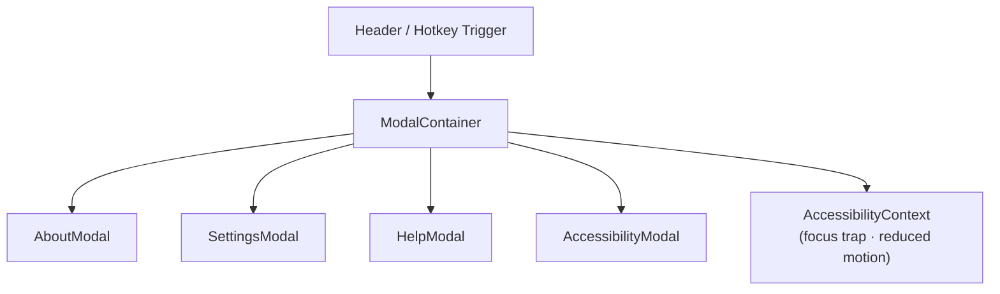

<div align="center">

# 🪟 Kansas Frontier Matrix — **Modals Component**  
`web/src/components/Modals/`

**Dialogs · Popovers · Settings Panels · Accessibility-First Design**

[](../../../../../.github/workflows/ci.yml)
[](../../../../../.github/workflows/codeql.yml)
[](../../../../../docs/)
[](../../../../../docs/design/reviews/accessibility/)
[](../../../../../LICENSE)

</div>

---

```yaml
---
title: "KFM • Modals Component (web/src/components/Modals/)"
version: "v1.4.0"
last_updated: "2025-10-14"
owners: ["@kfm-web", "@kfm-ux"]
tags: ["react","modal","dialog","accessibility","framer-motion","a11y","mcp"]
license: "MIT"
semantic_alignment:
  - WCAG 2.1 AA
  - WAI-ARIA 1.2
  - CIDOC CRM (UI narrative hierarchy)
---
````

---

## 🧭 Overview

The **Modals Component Suite** provides **accessible, reusable dialogs** and **popovers** for the Kansas Frontier Matrix web interface.
They deliver **non-intrusive overlays** for actions like settings, keyboard shortcuts, help guides, and accessibility preferences — ensuring that every user interaction adheres to **WCAG 2.1 AA** and **MCP-DL v6.2** reproducibility and documentation standards.

All modals share a unified structure, governed by the **AccessibilityContext** (focus management) and **ThemeContext** (light/dark palettes).
Built with **Framer Motion**, the suite prioritizes subtle animations, smooth transitions, and user-controlled motion preferences.

---

## 🧱 Directory Structure

```text
web/src/components/Modals/
├── ModalContainer.tsx       # Base modal wrapper (open/close logic, focus trap)
├── AboutModal.tsx           # Project information & license summary
├── SettingsModal.tsx        # Preferences: theme, motion, language, AI visibility
├── HelpModal.tsx            # Keyboard shortcuts, tooltips, and usage guide
├── AccessibilityModal.tsx   # Accessibility options: text size, contrast, focus mode
├── styles.scss              # Modal theming, transitions, responsive layout
└── __tests__/               # Jest + RTL accessibility & behavior tests
```

Each modal exports a standardized API with the following signature:

* **Props:** `{ open, onClose, title, children }`
* **ARIA Attributes:** `role="dialog" aria-modal="true"`
* **Focus Management:** Trapped with restoration upon close

---

## ⚙️ Component Architecture



The `ModalContainer` orchestrates all modal rendering and accessibility logic, using React Portals for correct DOM layering.

---

## 🧩 Key Features

| Feature                      | Description                                                       | Standard / Principle       |
| :--------------------------- | :---------------------------------------------------------------- | :------------------------- |
| **Accessible Dialogs**       | ARIA roles (`role="dialog"`, `aria-modal="true"`) + keyboard trap | WCAG 2.1 — 2.4.3, 4.1.2    |
| **Framer Motion Animations** | Smooth fade & slide transitions; auto-disables on reduced-motion  | WCAG 2.1 — 2.3.3           |
| **Focus Management**         | Focus trapped inside modal; restored on close                     | WCAG 2.1 — 2.1.1           |
| **Keyboard Shortcuts**       | `?` → Help · `Ctrl+,` → Settings · `Shift+A` → Accessibility      | Custom Hook                |
| **Dynamic Content**          | Responsive child rendering with auto-sizing                       | MCP UI Modularity          |
| **Responsive Layout**        | Drawer mode (mobile) · Centered overlay (desktop)                 | WCAG 1.4.10                |
| **Portal Rendering**         | React Portals for z-index safety and focus order integrity        | WAI-ARIA 1.2 Best Practice |

---

## 💬 Example Implementation

```tsx
import React, { useState } from "react";
import { ModalContainer } from "./ModalContainer";

export function AboutModal() {
  const [open, setOpen] = useState(false);

  return (
    <>
      <button onClick={() => setOpen(true)} aria-haspopup="dialog">
        About
      </button>
      <ModalContainer
        open={open}
        onClose={() => setOpen(false)}
        title="About Kansas Frontier Matrix"
      >
        <p>
          Kansas Frontier Matrix is an open-source, spatiotemporal knowledge
          hub connecting people, places, and events through time.
        </p>
      </ModalContainer>
    </>
  );
}
```

> The `ModalContainer` enforces ARIA compliance, traps focus within its boundary, and restores previous focus when closed.

---

## 🧠 TypeScript Interfaces

```ts
export interface ModalProps {
  open: boolean;
  title?: string;
  children: React.ReactNode;
  onClose: () => void;
  ariaLabel?: string;
  width?: "sm" | "md" | "lg";
}
```

All modal components extend `ModalProps` and may add custom options for animation or dynamic sizing.

---

## 🎨 Styling & Motion

| Layer                | Description                                          |
| :------------------- | :--------------------------------------------------- |
| **Animation Engine** | Framer Motion (`fadeIn`, `slideUp`, `popScale`)      |
| **Reduced Motion**   | Instant render when `prefers-reduced-motion: reduce` |
| **Backdrop**         | `backdrop-filter: blur(4px)` · adaptive opacity      |
| **Layout**           | CSS Grid centered overlay (mobile drawer fallback)   |
| **Color System**     | Themed with `ThemeContext` (light/dark palettes)     |

```scss
.modal-backdrop {
  background-color: rgba(0, 0, 0, 0.45);
  backdrop-filter: blur(4px);
  transition: opacity 0.3s ease;
}
```

---

## ♿ Accessibility Implementation

| Concern                | Implementation                                        |
| :--------------------- | :---------------------------------------------------- |
| **Focus Trap**         | Managed via `AccessibilityContext` + hidden sentinels |
| **Screen Readers**     | Uses `aria-labelledby` + `aria-describedby`           |
| **Escape Key**         | Global listener closes modal and restores focus       |
| **Reduced Motion**     | Animation disabled for motion-sensitive users         |
| **Keyboard Shortcuts** | `?`, `Ctrl+,`, `Shift+A` open modals contextually     |
| **Skip to Content**    | `Alt+S` returns focus to main content post-close      |

All accessibility features validated using **axe-core**, **Lighthouse**, and **React Testing Library**.

---

## 🧪 Testing

| Test Case              | Description                                       | Tools              |
| :--------------------- | :------------------------------------------------ | :----------------- |
| **Open/Close Logic**   | Opens/closes with button & `Esc` key              | Jest + RTL         |
| **Focus Trap**         | Verifies tab key cycles within modal              | Cypress + axe-core |
| **ARIA Compliance**    | Confirms roles, labels, and modal hierarchy       | axe-core           |
| **Reduced Motion**     | Checks animation suppression for preference users | Jest Mocks         |
| **Keyboard Shortcuts** | Validates hotkey-triggered modal open             | Jest DOM           |
| **Snapshot Testing**   | Confirms visual consistency across themes         | Jest Snapshots     |

> **Coverage target:** ≥ 90% lines & branches.

---

## 🧾 Provenance & Integrity

| Artifact         | Description                                                      |
| :--------------- | :--------------------------------------------------------------- |
| **Inputs**       | AccessibilityContext, keyboard listeners, Framer Motion variants |
| **Outputs**      | Accessible, theme-aware modals rendered via React Portal         |
| **Dependencies** | React 18+, Framer Motion, TailwindCSS, axe-core                  |
| **Integrity**    | CI validates accessibility, stylelint, and ARIA role compliance  |

---

## 🧠 MCP Compliance Checklist

| MCP Principle       | Implementation                                 |
| :------------------ | :--------------------------------------------- |
| Documentation-first | README & inline TSDoc required pre-merge       |
| Reproducibility     | Deterministic modal state & motion validation  |
| Accessibility       | Full WCAG 2.1 AA compliance validated in CI    |
| Provenance          | Links to AccessibilityContext and ThemeContext |
| Open Standards      | ARIA 1.2 · WAI practices · CSS Custom Props    |
| Auditability        | axe-core and Lighthouse integrated in pipeline |

---

## 🔗 Related Documentation

* **Web Frontend Components Overview** — `web/src/components/README.md`
* **Accessibility Components** — `web/src/components/Accessibility/README.md`
* **Context — AccessibilityContext** — `web/src/context/README.md`
* **Web UI Architecture** — `web/ARCHITECTURE.md`

---

## 📜 License

Released under the **MIT License**.
© 2025 Kansas Frontier Matrix — engineered under **MCP-DL v6.2** for inclusive, traceable, and reproducible user experiences.

> *“Every dialog opens a door — the Modals framework ensures every user can walk through it.”*

```
```
