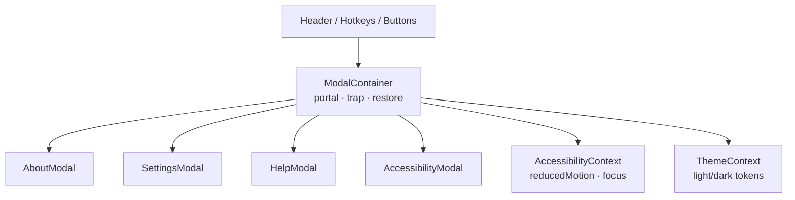

<div align="center">

# 🪟 Kansas Frontier Matrix — **Modals Component**  
`web/src/components/Modals/`

**Dialogs · Popovers · Settings Panels · Accessibility-First Design**

[](../../../../../.github/workflows/ci.yml)
[](../../../../../.github/workflows/codeql.yml)
[](../../../../../docs/)
[](../../../../../docs/design/reviews/accessibility/)
[](../../../../../LICENSE)

</div>

---

## 🧭 Overview

The **Modals Component Suite** provides **accessible, reusable dialogs & popovers** for the KFM Web UI.  
It powers settings, keyboard-shortcut help, about/licensing, and accessibility preferences with **strict WCAG 2.1 AA** compliance and **MCP-DL v6.2** documentation discipline.

All modals share a unified substrate:

- **AccessibilityContext** → focus-trap, reduced-motion, high-contrast  
- **ThemeContext** → tokenized theming (light/dark)  
- **Portal mount** → `#modals` root to preserve stacking & reading order

Subtle animation is implemented with **Framer Motion** and **auto-disabled** when users prefer reduced motion.

---

## 🧱 Directory Structure

```text
web/src/components/Modals/
├── ModalContainer.tsx       # Base wrapper (open/close, focus trap, portal)
├── AboutModal.tsx           # Project info, licensing, attribution
├── SettingsModal.tsx        # Theme · motion · language · data/privacy prefs
├── HelpModal.tsx            # Keyboard shortcuts & quick tips
├── AccessibilityModal.tsx   # Text size · contrast · focus modes
├── styles.scss              # Tokens, transitions, responsive layout
└── __tests__/               # Jest + RTL + axe-core tests
```

**Public API (per modal)**

- Props: `{ open, onClose, title?, ariaLabel?, initialFocusRef?, width? }`  
- Roles: `role="dialog" aria-modal="true"`; labelled by `title` or `ariaLabel`  
- Focus: trapped; **origin focus** restored on close

---

## ⚙️ Architecture



---

## 🧩 Key Features

| Feature                      | Description                                                                 | Standard |
| :--------------------------- | :-------------------------------------------------------------------------- | :------- |
| **Accessible Dialogs**       | `role="dialog"`, `aria-modal="true"`, labelled/ described via IDs          | WAI-ARIA 1.2 |
| **Focus Management**         | Trap within modal; restore focus to trigger; inert background              | WCAG 2.1 2.4.3/2.1.1 |
| **Keyboard Shortcuts**       | `?` Help · `Ctrl+,` Settings · `Shift+A` Accessibility · `Esc` Close       | House Rule |
| **Framer Motion Animations** | Fade/slide/popup variants; auto-disable via `prefers-reduced-motion`       | WCAG 2.3.3 |
| **Responsive Layout**        | Drawer mode on mobile; centered overlay desktop                            | WCAG 1.4.10 |
| **Portal Rendering**         | Mounts in `#modals` to simplify z-index and reading order                  | ARIA BP |

---

## 💬 Reference Implementation

```tsx
// ModalContainer.tsx (excerpt)
import React, { useEffect, useRef } from "react";
import { createPortal } from "react-dom";

export interface ModalProps {
  open: boolean;
  onClose: () => void;
  title?: string;
  ariaLabel?: string;
  initialFocusRef?: React.RefObject<HTMLElement>;
  width?: "sm" | "md" | "lg";
}

export function ModalContainer({
  open,
  onClose,
  title,
  ariaLabel,
  initialFocusRef,
  width = "md",
  children,
}: React.PropsWithChildren<ModalProps>) {
  const portalRoot = document.getElementById("modals")!;
  const restoreRef = useRef<HTMLElement | null>(null);
  const dialogRef = useRef<HTMLDivElement>(null);

  // Remember trigger element to restore focus
  useEffect(() => {
    if (open) restoreRef.current = (document.activeElement as HTMLElement) ?? null;
  }, [open]);

  // Trap focus & close on Esc
  useEffect(() => {
    if (!open) return;
    const handleKey = (e: KeyboardEvent) => {
      if (e.key === "Escape") onClose();
    };
    const root = document.getElementById("root");
    root?.setAttribute("inert", ""); // prevent background interaction
    window.addEventListener("keydown", handleKey);

    // Initial focus
    (initialFocusRef?.current ?? dialogRef.current)?.focus();

    return () => {
      window.removeEventListener("keydown", handleKey);
      root?.removeAttribute("inert");
      restoreRef.current?.focus?.();
    };
  }, [open, onClose]);

  if (!open) return null;

  return createPortal(
    <div className="modal-backdrop" aria-hidden="true">
      <div
        className={`modal modal--${width}`}
        ref={dialogRef}
        role="dialog"
        aria-modal="true"
        aria-label={ariaLabel}
        aria-labelledby={title ? "modal-title" : undefined}
        tabIndex={-1}
      >
        {title && <h2 id="modal-title" className="modal__title">{title}</h2>}
        <button className="modal__close" onClick={onClose} aria-label="Close dialog">×</button>
        <div className="modal__content">{children}</div>
      </div>
    </div>,
    portalRoot
  );
}
```

> Background is made **inert** while open; focus is restored to the trigger element on close.

---

## 🧠 TypeScript Interfaces

```ts
export type ModalWidth = "sm" | "md" | "lg";

export interface KeyboardShortcut {
  combo: string;     // e.g., "Ctrl+,", "?"
  action: () => void;
  description: string;
}

export interface HotkeyMap {
  [combo: string]: KeyboardShortcut;
}
```

---

## 🎨 Styling & Motion

| Layer                | Description                                                     |
| :------------------- | :-------------------------------------------------------------- |
| **Backdrop**         | `rgba(0,0,0,.45)` + `backdrop-filter: blur(4px)`               |
| **Container**        | CSS Grid center; drawer at `max-width < 768px`                 |
| **Tokens**           | Theme via CSS variables `--kfm-color-*`, `--kfm-radius`, etc.  |
| **Motion**           | `fadeIn`, `slideUp`, `popScale` variants; disabled on PRM      |

```scss
/* styles.scss (excerpt) */
.modal-backdrop { background: rgba(0,0,0,.45); backdrop-filter: blur(4px); }
.modal { width: min(92vw, 720px); border-radius: var(--kfm-radius); box-shadow: var(--kfm-shadow); }
@media (max-width: 768px) { .modal { width: 100vw; height: 100dvh; border-radius: 0; } }
```

---

## ♿ Accessibility Implementation

| Concern            | Implementation                                                                              |
| :----------------- | :------------------------------------------------------------------------------------------ |
| **Roles & Labels** | `role="dialog" aria-modal="true"`; labelled by heading or `aria-label`                     |
| **Focus Trap**     | Sentinel elements + restoration to trigger; prevent background interaction with `inert`     |
| **Esc to Close**   | Global keydown listener while open                                                          |
| **Reduced Motion** | Honors `prefers-reduced-motion`; animation removed                                          |
| **Hotkeys**        | `?` Help · `Ctrl+,` Settings · `Shift+A` Accessibility · `Esc` Close                        |
| **SR Announce**    | Optional `aria-live="polite"` region for dialog open/close status                           |

Audited with **axe-core** and **Lighthouse** in CI.

---

## 🧪 Testing

| Case                    | Expectation                                              | Tools                  |
| :---------------------- | :------------------------------------------------------- | :--------------------- |
| **Open/Close**          | Button opens; `Esc` closes; focus restores               | Jest + RTL             |
| **Trap & Restore**      | Tab cycles within dialog; trigger regains focus          | Cypress + RTL          |
| **ARIA Compliance**     | Required roles/labels present                            | axe-core               |
| **Reduced Motion**      | Animations are disabled when PRM is set                  | Jest (matchMedia mock) |
| **Portal Mount**        | Renders into `#modals`; stacking order preserved         | Jest DOM               |
| **Visual Snapshots**    | Stable across themes & widths                            | Jest Snapshots         |

**Coverage target:** ≥ **90%** (lines/branches/statements)

---

## 🔗 Related Documentation

- **Components Overview** — `web/src/components/README.md`  
- **Accessibility Utilities** — `web/src/components/Accessibility/README.md`  
- **Context (Accessibility/Theme)** — `web/src/context/README.md`  
- **Web UI Architecture** — `web/ARCHITECTURE.md`

---

## 🧾 Versioning & Metadata

| Field | Value |
| :---- | :---- |
| **Version** | `v1.5.0` |
| **Codename** | *Inclusive Dialogs & Motion Upgrade* |
| **Last Updated** | 2025-10-17 |
| **Maintainers** | @kfm-web · @kfm-ux |
| **License** | MIT (code) · CC-BY 4.0 (docs) |
| **Alignment** | WCAG 2.1 AA · WAI-ARIA 1.2 · CIDOC CRM (narrative hierarchy) |
| **Maturity** | Stable / Production |

---

## 📜 License

Released under the **MIT License**.  
© 2025 Kansas Frontier Matrix — engineered under **MCP-DL v6.2** for inclusive, traceable, and reproducible UX.

> *“Every dialog opens a door — we make sure every user can walk through it.”*