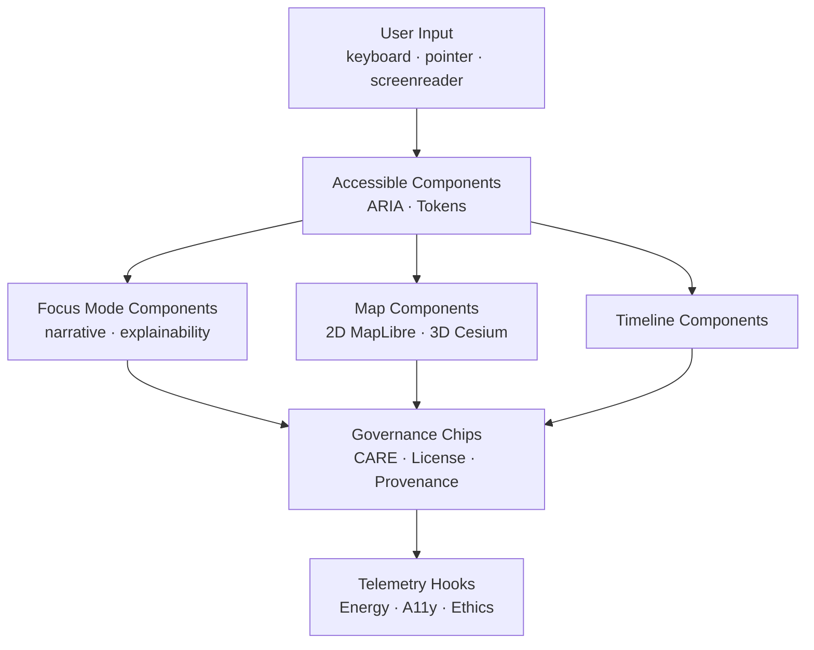
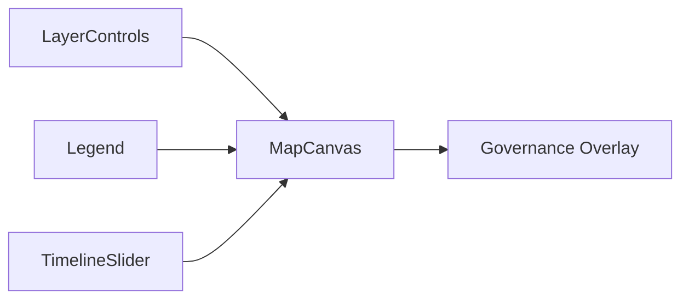
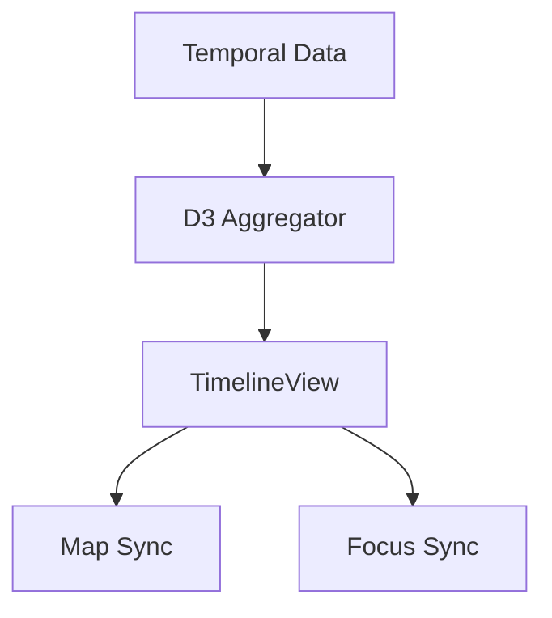
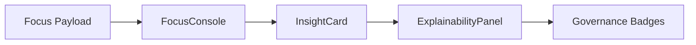
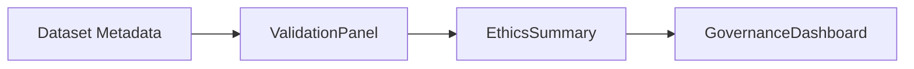
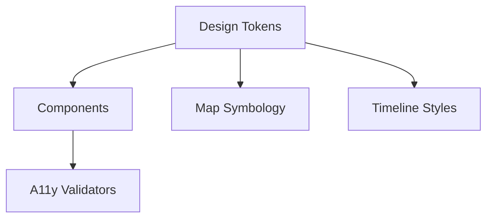

<div align="center">

# 🧱 **Kansas Frontier Matrix — Web Components Library Architecture**  
`web/src/components/README.md`

**Purpose:**  
Define the **complete deep-architecture specification** for all UI components powering the Kansas Frontier Matrix (KFM) v10.3.2 web platform.  
These components form the **ethical, accessible, explainable, FAIR+CARE-certified front-end foundation** integrating MapLibre, Cesium, Focus Mode v2.5, STAC/DCAT metadata, governance overlays, and full telemetry & sustainability instrumentation.

[]()
[]()
[]()
[]()

</div>

---

# 📘 Executive Summary

The **Web Components Library** provides:

- Accessible, token-driven React components  
- Integrated governance (CARE labels, consent banners, license chips)  
- Explainable AI panels (Focus Mode v2.5)  
- Story Node narrative UIs  
- MapLibre + Cesium rendering surfaces  
- Vector/COG layer controls  
- Temporal navigation systems (Timeline)  
- Provenance-aware data cards  
- Sustainability-aware visual components  
- Telemetry-emitting interactions  

This library is **10% visual, 90% architecture**—the UI surface that binds all KFM modules into a single ethical, spatial-temporal knowledge engine.

---

# 🗂️ Directory Layout (Authoritative v10.3.2)

```text
web/src/components/
├── README.md
│
├── Layout/
│   ├── MainLayout.tsx
│   ├── SidebarLayout.tsx
│   ├── FooterLayout.tsx
│
├── MapView/
│   ├── MapCanvas.tsx
│   ├── LayerControls.tsx
│   ├── Legend.tsx
│   └── TimelineSlider.tsx
│
├── TimelineView/
│   ├── TimelineView.tsx
│   ├── useTimeline.ts
│   ├── timeline-context.ts
│   ├── density-chart.tsx
│   ├── telemetry.ts
│   └── timeline.css
│
├── FocusMode/
│   ├── FocusConsole.tsx
│   ├── InsightCard.tsx
│   └── ExplainabilityPanel.tsx
│
├── DataCards/
│   ├── ClimateCard.tsx
│   ├── HazardsCard.tsx
│   ├── HydrologyCard.tsx
│   └── ProvenanceCard.tsx
│
├── Governance/
│   ├── GovernanceDashboard.tsx
│   ├── ValidationPanel.tsx
│   └── EthicsSummary.tsx
│
├── DetailDrawer/
│   ├── DetailDrawer.tsx
│   └── drawer-context.ts
│
└── metadata.json
```

---

# ⚙️ Deep Component Architecture



---

# 🧬 Component Families (Deep Specification)

## 1️⃣ Layout Components — *Structure + Accessibility Backbone*

### Purpose  
Frame every interface with WCAG-compliant semantics.

Includes:
- `MainLayout.tsx` — global frame  
- `SidebarLayout.tsx` — navigation and data cards  
- `FooterLayout.tsx` — governance, license, sustainability info  

### Architecture  
- Enforces ARIA regions  
- Provides skip-links  
- Injects provenance footer tokens  
- Required by all pages

---

## 2️⃣ MapView Components — *2D/3D Spatial Interaction Engine*

### Purpose  
Control all map rendering and geospatial interactivity.

Includes:
- MapLibre render surface  
- Cesium globe & terrain  
- Layer switching  
- Legends  
- Temporal slider  

### Architecture



Features:
- STAC/DCAT-backed layer metadata  
- DEM blending  
- Predictive overlays  
- CARE masking propagation  

---

## 3️⃣ TimelineView Components — *Spatial-Temporal Intelligence UI*

Includes:
- `TimelineView.tsx`  
- `density-chart.tsx`  
- `timeline-context.ts`  
- `useTimeline.ts`  

### Capabilities
- Time brushing  
- Epoch selection  
- Predictive band visualization  
- WCAG-compliant color schemes  

### Architecture



---

## 4️⃣ FocusMode Components — *Explainable AI · Narrative Intelligence*

Includes:
- `FocusConsole.tsx`  
- `InsightCard.tsx`  
- `ExplainabilityPanel.tsx`  

### Features
- Narrative rendering
- SHAP/LIME explainability tokens  
- Provenance chips  
- CARE ethics warnings  
- Story Node relationships  

### Architecture



---

## 5️⃣ DataCards — *Domain-Specific Semantic Cards*

Includes:
- ClimateCard  
- HazardsCard  
- HydrologyCard  
- ProvenanceCard  

### Responsibilities
- Render semantic attributes  
- Show dataset lineage (PROV-O)  
- Display FAIR+CARE compliance  
- Activate linked entities + temporal layers  

---

## 6️⃣ Governance Components — *Ethical Compliance UI Layer*

Includes:
- GovernanceDashboard  
- ValidationPanel  
- EthicsSummary  

### Functions
- Show compliance status  
- Highlight masking rules  
- Summarize dataset licenses + CARE flags  
- Provide reviewer tools for FAIR+CARE Council  

### Architecture



---

## 7️⃣ DetailDrawer — *Entity Context Envelope*

### Purpose  
Provide contextual overlays for:

- People  
- Events  
- Places  
- Datasets  
- Story Nodes  

### Requirements
- CARE masking  
- Provenance display  
- Accessibility-first structure  

---

# 🎨 Design System Architecture



### Tokens include:
- color scales  
- typography  
- spacing  
- elevation  
- symbology patterns  
- predictive band fills  
- CARE warning icons  

---

# ♿ Accessibility Architecture (WCAG 2.1 AA)

Components enforce:

- ARIA roles  
- Keyboard-first navigation  
- Focus rings  
- Prefer-reduced-motion  
- High-contrast tokens  
- Screen reader live regions for timeline/focus updates  
- Accessible landmark patterns  

CI requires Lighthouse A11y ≥ 95.

---

# 🔐 Governance Integration (FAIR+CARE)

Each component:

- surfaces CARE labels  
- blocks restricted content  
- masks sensitive geometry  
- displays provenance + checksum  
- shows ethical warnings for AI content  
- logs governance-related actions  

Governance ledger:

```
../../../docs/reports/audit/web-components-governance-ledger.json
```

---

# 📡 Telemetry & Sustainability Architecture

Telemetry includes:

- Component render cost  
- Energy (Wh) approximation  
- A11y token coverage  
- Event interactions  
- Ethical rule triggers  
- Predictive-band usage  
- Focus Mode narrative events  

Telemetry target:

```
../../../releases/v10.3.2/focus-telemetry.json
```

---

# ⚙️ Validation & CI/CD Integration

CI enforces:

| Area | Mechanism |
|------|-----------|
| Type safety | TS strict mode |
| A11y | axe + Lighthouse |
| Governance | CARE rule tests |
| Security | CodeQL + Trivy |
| Docs | docs-lint.yml |
| Sustainability | telemetry-export.yml |

---

# 🧾 Internal Citation

```text
Kansas Frontier Matrix (2025). Web Components Library Architecture (v10.3.2).
Defines the ethical, accessible, FAIR+CARE-certified React component architecture for the Kansas Frontier Matrix platform.
```

---

# 🕰️ Version History

| Version | Date | Summary |
|---------|--------|---------|
| v10.3.2 | 2025-11-14 | Full deep-architecture rebuild; added symbology engine, governance flows, predictive temporal integration, and Focus Mode v2.5 structures. |
| v9.9.0 | 2025-11-08 | Previous version. |

---

<div align="center">

**Kansas Frontier Matrix — Components Architecture**  
🧱 Accessible UI · 🧠 Explainable AI · 🌐 FAIR+CARE · 🔗 Provenance by Design  
© 2025 Kansas Frontier Matrix — MIT License  

[Back to Components Directory](./)

</div>
