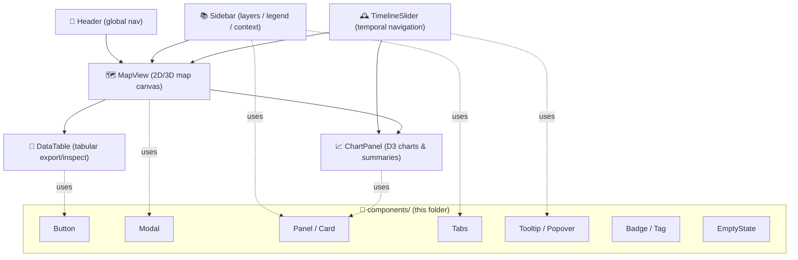

# 🧩 `web/src/components`


%20Cesium-1f6feb)


> Reusable, **feature-agnostic** UI building blocks for the Kansas Frontier Matrix (KFM) frontend.  
> Think: buttons, modals, panels, table primitives, chart wrappers, badges, empty states, etc.

---

## 🎯 What belongs here?

✅ Put it in `components/` if it is:

- **Reusable** across multiple features (map, timeline, dashboard, story/focus mode)
- **UI-first** (no domain logic baked in)
- **Composable** (small + predictable props)
- **API-agnostic** (it does *not* fetch data directly)

🚫 Do **not** put it here if it is:

- Feature-specific (ex: `MapView`, `TimelineSlider`, “TreatySearchPanel”) → belongs in `web/src/features/*`
- Page-level composition → belongs in `web/src/features/*` or `web/src/pages/*` (depending on structure)
- A data-fetching hook or API client → belongs in `web/src/services/*`
- Global state glue → belongs in `web/src/store/*`

---

## 🗂️ Expected (v13-style) UI layout

This folder is part of a broader, contract-first, evidence-first architecture. A typical structure looks like:

```text
🌐 web/
  └── 🧠 src/
      ├── 🧩 components/            # ✅ reusable generic components (YOU ARE HERE)
      ├── 🧬 features/
      │   ├── 🗺️ map/               # MapView + map utils
      │   ├── 🕰️ timeline/          # TimelineSlider + temporal helpers
      │   ├── 🔐 auth/              # login UI + auth context
      │   └── 📊 dashboard/         # page-level compositions
      ├── 🎨 styles/                # global styles / tokens
      ├── 🔌 services/              # API client + data fetchers
      ├── 🧠 store/                 # Redux slices / providers
      └── 🧰 utils/                 # shared helpers
```

---

## 🧱 Core “shell” composition (mental model)

The main KFM UI is typically composed from these “big pieces” (usually **feature** components), with `components/` supplying the reusable bricks:



---

## 🔒 KFM Non‑Negotiables (UI invariants)

These are architecture rules that **components must support**, not fight against:

### 1) 🚧 API boundary rule (hard)
- The UI **never** talks directly to the graph/database layer.
- All data comes through the governed API layer (`src/server/…` contracts).  
  ✅ Components should assume **typed data contracts** are real and enforced.

### 2) 🧾 Provenance-first UI (hard)
- Any **data layer**, **chart**, or **computed output** must be traceable to evidence:
  - STAC / DCAT metadata
  - PROV lineage  
- UI patterns to support:
  - “Data source” badge
  - “Info” popover citing dataset + version + license + lineage link
  - Footnote-style citations in story/focus views

### 3) 🪶 Evidence-first narrative (hard)
- Story text, tooltips, summaries: **no unsourced claims**.
- If the UI displays narrative, it must support citations + “fact vs interpretation” separation.

### 4) 🛡️ CARE / sovereignty safeguards (hard)
- No output may be less restricted than its inputs.
- Components must be able to:
  - blur/generalize sensitive locations
  - hide precise coordinates
  - show “restricted” labeling + explain why

---

## ✅ Component standards

### 🧷 Naming & file conventions
Use **PascalCase** for component folders + exports.

```text
components/
  🧩 Button/
     ├── Button.tsx
     ├── Button.test.tsx
     ├── Button.module.css
     └── index.ts
```

**Export pattern** (barrel files):
- Each component folder has an `index.ts`
- `components/index.ts` re-exports public components (optional but recommended)

### 🧠 Props-first design
- Prefer **pure props** over implicit global state.
- If a component needs global state:
  - expose a “dumb” component here
  - wire it up in a feature container under `features/*`

✅ Good:
- `Legend(items, onToggle, selectedIds)`
- `DataTable(rows, columns, onDownload)`

🚫 Avoid:
- `Legend()` that imports store, fetches layers, mutates global state internally

### 🎨 Styling
- Prefer a consistent approach (choose one and stick to it):
  - `*.module.css` (CSS Modules), OR
  - a component library theming layer (MUI/Ant/etc), OR
  - a token-based CSS approach (`styles/tokens.css`)

**Rules of thumb**
- Use Flexbox/Grid for layout
- Use breakpoint utilities instead of hard-coded pixel math
- Keep spacing/typography in tokens (so the app stays cohesive)

### ♿ Accessibility baseline
Every interactive component must:
- be keyboard reachable (`Tab`, `Enter`, `Space`, `Esc`)
- have visible focus styles
- include semantic HTML first (`button`, `nav`, `main`, `header`, etc.)
- use ARIA only when semantics don’t cover the use case

### ⚡ Performance baseline
- Use `React.memo` and memoized callbacks for heavy UI trees
- Avoid re-rendering map canvases on unrelated state changes
- For big lists/tables: support virtualization (feature-level implementation allowed)

### 🧪 Testing baseline
- Unit tests: Jest + React Testing Library
- Snapshot tests: only for stable UI (avoid brittle snapshots)
- E2E tests (feature flows): Cypress/Selenium (kept outside `components/`)

---

## 🧰 “New component” template

### 1) Create the folder
```bash
mkdir -p web/src/components/Foo
```

### 2) Implement the component
```tsx
// web/src/components/Foo/Foo.tsx
import React from "react";

export type FooProps = {
  title: string;
  children?: React.ReactNode;
};

export function Foo({ title, children }: FooProps) {
  return (
    <section aria-label={title}>
      <h2>{title}</h2>
      <div>{children}</div>
    </section>
  );
}
```

### 3) Add local export
```ts
// web/src/components/Foo/index.ts
export * from "./Foo";
```

### 4) Add a test
```tsx
// web/src/components/Foo/Foo.test.tsx
import { render, screen } from "@testing-library/react";
import { Foo } from "./Foo";

test("renders title", () => {
  render(<Foo title="Hello">World</Foo>);
  expect(screen.getByText("Hello")).toBeInTheDocument();
  expect(screen.getByText("World")).toBeInTheDocument();
});
```

---

## 🧾 Provenance-aware UI patterns (recommended)

### ✅ Pattern: `DataSourceBadge` + `ProvenancePopover`
When a component presents data (layer, chart, table), it should accept a small, typed “source” object:

```ts
export type EvidenceSource = {
  title: string;
  stacId?: string;
  dcatId?: string;
  provId?: string;
  license?: string;
  version?: string;
  classification?: "public" | "restricted" | "sensitive";
};
```

Then the UI can:
- show a badge: **Source: Landsat 8 (v2025-01)**
- provide a popover: **license**, **lineage**, **links**
- enforce display rules if `classification !== "public"`

---

## 🗺️ Map-friendly components (rules of thumb)

Even reusable components should be “map aware” in the *UI sense*:

- Popovers/Modals used on map selection should support:
  - anchoring (optional)
  - short summaries + “open details”
  - accessible close behavior (Esc)
- Legends and toggles should support:
  - long lists (scrollable)
  - clear affordances (checkbox, switch)
  - provenance display per layer

---

## 🧾 PR checklist (components)

Before merging a new/changed component:

- [ ] Props are typed (TypeScript) and documented
- [ ] Component is reusable (not feature-specific)
- [ ] No direct API calls or graph access
- [ ] Keyboard + screen-reader friendly
- [ ] Responsive behavior tested (mobile + desktop)
- [ ] Tests added/updated
- [ ] If data is shown: provenance hooks exist (badge/popover pattern)
- [ ] If sensitive: classification safeguards supported

---

## 🔗 Related docs (repo links)

- 📘 Master Guide (pipeline + invariants): `../../../docs/MASTER_GUIDE_v13.md`
- 🧩 Frontend architecture notes: `../../../docs/architecture/` *(if present)*
- 🧾 Story Node template: `../../../docs/templates/TEMPLATE__STORY_NODE_V3.md`
- 🧱 API contracts: `../../../src/server/contracts/`
- 🗺️ Map & UI feature code: `../features/map/` and `../features/timeline/`

---

## ✨ Philosophy (tl;dr)

KFM’s UI is **story-first**, **map-driven**, and **evidence-backed**.  
Components should make it easy to build interfaces that are:
- consistent (design system)
- fast (performance-minded)
- accessible (a11y baseline)
- trustworthy (provenance + governance)

🌾 Welcome to the “LEGO box” for the Kansas Frontier Matrix.