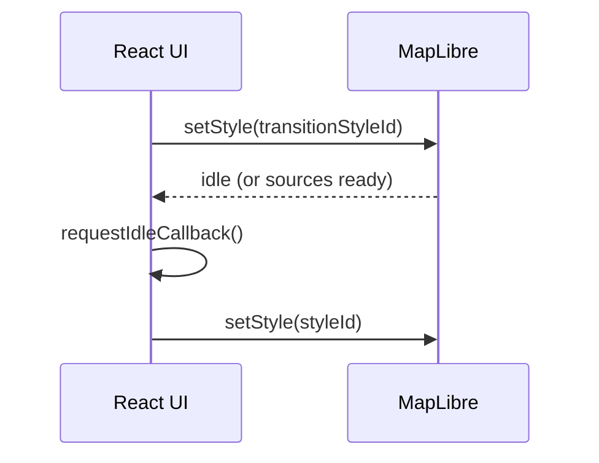

<!--
File: web/src/components/map/README.md
Purpose: KFM Web UI map surface (React/TypeScript + MapLibre)
-->

# 🗺️ Map Components


This folder contains KFM’s **interactive map UI**: the MapLibre map canvas, the layer registry, map interactions (hover/click), and the UI that answers:

> **“What am I looking at, where did it come from, and what am I allowed to see?”**

---

## ✨ If you’re new, start here

### Quick tasks

- **Just render the map** → jump to [Minimal usage](#-minimal-usage)
- **Add a new map overlay** → jump to [Add a new layer](#-add-a-new-layer)
- **Add click-to-identify** → jump to [Identify on click](#-identify-on-click)
- **Hook map to Story Nodes / Focus Mode** → jump to [Story Node sync](#-story-node-sync)
- **Fix “blank map during transitions”** → jump to [Instant Story Transitions (LQ styles)](#-instant-story-transitions-lq-styles)

### What makes KFM’s map different

KFM’s map is not “just a basemap + layers.” It’s an evidence-first surface:

- **Provenance is first-class UI** (layers have an “info” affordance, not hidden docs)
- **Policy and sensitivity matter** (some layers must be generalized/redacted or hidden)
- **Time is a core axis** (timeline and map stay synchronized)
- **No direct database access from the browser** (trust membrane: UI → governed APIs only)

---

## 🧠 Mental model

```mermaid
flowchart LR
  U[User] --> UI[Map UI<br/>React components]
  UI --> ML[MapLibre Map<br/>(WebGL)]
  UI -->|data requests| API[Governed API Gateway]
  API -->|policy checks| PDP[Policy engine<br/>(OPA/PDP)]
  API --> DS[(Data stores)]
  API --> PRV[(Catalog + Provenance)]
  UI --> PRVD[Provenance Drawer<br/>Layer & Answer metadata]
  UI --> FM[Focus Mode Panel<br/>Cite or abstain]
```

**Rule of thumb:**  
If a component needs **data**, it should request it through an API client (never from PostGIS/Neo4j/object storage directly).

## 📚 Glossary (MapLibre + KFM)

| Term | What it means in practice |
|---|---|
| **Style** | A JSON document (Style Spec) that declares sources + layers + paint/layout rules. |
| **Source** | A data input (vector tiles, raster tiles, GeoJSON, images). Usually added via `map.addSource()`. |
| **Layer** | A visual rule in the style (line/fill/symbol/etc.) that references a `source` (and optionally `source-layer`). |
| **`source-layer`** | For vector tiles: the named layer _inside_ the tile archive (not the same as a style layer id). |
| **TileJSON** | A JSON descriptor for tile endpoints + bounds/zoom metadata. |
| **PMTiles** | A single-file tile pyramid fetched via HTTP range requests (great for static hosting). |
| **Provenance Drawer** | KFM UI panel that explains a layer/answer: sources, licenses, transformations, constraints. |
| **Trust membrane** | UI never talks to databases/object storage directly — only to governed APIs. |
| **Story Node** | A governed narrative step that can drive map view, time window, and active layers. |

---

## 📁 What lives in this folder

> ⚠️ The exact filenames may vary by branch. Use this as a guide and keep it updated when you rename/move files.

Recommended (or typical) structure:

```text
web/src/components/map/
├─ README.md                         # you are here
├─ MapView.tsx                        # top-level map component
├─ MapProvider.tsx                    # context: map instance + view state
├─ hooks/
│  ├─ useMapInstance.ts               # safe access to MapLibre instance
│  ├─ useMapViewState.ts              # center/zoom/bearing/pitch
│  ├─ useStoryNodeSync.ts             # applies story node view + time window
│  └─ useLayerRegistry.ts             # register/toggle layers
├─ layers/
│  ├─ layerRegistry.ts                # layer definitions + metadata
│  ├─ layerTypes.ts                   # shared types (LayerId, LayerMeta, etc.)
│  ├─ layerVisibility.ts              # visibility rules + zoom/time gating
│  └─ transitions/
│     ├─ applyTransitionStyle.ts      # transitionStyleId → styleId swap
│     └─ fadeInOnSourceReady.ts       # mount-then-fade-in helper
├─ sources/
│  ├─ registerSources.ts              # addSource helpers
│  ├─ pmtiles.ts                      # pmtiles:// protocol registration
│  └─ transformRequest.ts             # auth + request rewriting hook
├─ interactions/
│  ├─ identifyOnClick.ts              # queryRenderedFeatures + popup
│  ├─ hoverHighlight.ts               # hover/selection styling
│  └─ cursor.ts                       # cursor affordances
├─ ui/
│  ├─ LayerPanel.tsx                  # layer list + toggles
│  ├─ Legend.tsx                      # symbology
│  ├─ ProvenanceDrawer.tsx            # “map behind the map”
│  └─ MapStatus.tsx                   # loading/idle/errors indicators
└─ __tests__/
   ├─ layerRegistry.test.ts
   └─ transitions.test.ts
```

---

## ✅ Minimal usage

Example “drop a map on the page” usage.

```tsx
import React from "react";
import { MapView } from "./MapView";

export function MapPage() {
  return (
    <div style={{ height: "100vh" }}>
      <MapView />
    </div>
  );
}
```

---

## 🧩 Common workflows

### ➕ Add a new layer

A layer in KFM is **never** just a style snippet. At minimum it should have:

- a stable `id`
- a **user-facing title**
- a **provenance hook** (how to open DCAT/STAC/PROV info)
- sensitivity hints (public vs restricted/generalized)
- default visibility rules (zoom/time gating)

Suggested interface (adjust to match actual types):

```ts
export type LayerId = string;

export type LayerMeta = {
  id: LayerId;
  title: string;
  description?: string;

  /** Where the UI can fetch layer metadata/provenance for “What is this?” */
  provenanceRef?: { kind: "dcat" | "stac" | "prov" | "doc"; id: string };

  /** Governance hints used by UI + policy responses */
  sensitivity?: "public" | "restricted" | "generalized";
};

export type LayerDef = {
  meta: LayerMeta;
  maplibreLayerIds: string[]; // style layer IDs
  defaultOn?: boolean;
  minZoom?: number;
  maxZoom?: number;
};
```

Add it to the registry:

```ts
export const LAYERS: Record<LayerId, LayerDef> = {
  "roads": {
    meta: {
      id: "roads",
      title: "Roads",
      provenanceRef: { kind: "dcat", id: "dcat:ksdot_roads_v1" },
      sensitivity: "public",
    },
    maplibreLayerIds: ["roads-line", "roads-casing"],
    defaultOn: true,
    minZoom: 4,
  },
};
```

Then expose it in the Layer Panel:

```tsx
<LayerPanel layers={LAYERS} />
```

> ✅ Definition of Done (UI layer):  
> If a user can toggle it on, they can also open “What is this?” and see the provenance/constraints.

---

### 🕵️ Identify on click

MapLibre’s `queryRenderedFeatures` is the typical “identify what’s under my cursor” approach.

```ts
export function attachIdentifyOnClick(map: maplibregl.Map) {
  map.on("click", (e) => {
    const hits = map.queryRenderedFeatures(e.point, { layers: ["myroads-line"] });
    if (!hits.length) return;

    const f = hits[0];
    new maplibregl.Popup()
      .setLngLat(e.lngLat)
      .setHTML(`<pre>${JSON.stringify(f.properties, null, 2)}</pre>`)
      .addTo(map);
  });
}
```

**KFM add-on:** the popup should include a link/button to open the **Provenance Drawer** for the active layer(s), not just raw JSON.

---

### 🧱 Use PMTiles (static “serverless” tiles)

If you serve vector tiles as `.pmtiles` on static hosting / object storage, you can register a `pmtiles://` protocol once and then reference it from styles.

```ts
import maplibregl from "maplibre-gl";
import { Protocol, PMTiles } from "pmtiles";

export function registerPMTilesProtocol(pmtilesUrl: string) {
  const protocol = new Protocol();
  maplibregl.addProtocol("pmtiles", protocol.tile);

  // keep a shared PMTiles instance (recommended pattern)
  protocol.add(new PMTiles(pmtilesUrl));
}
```

## 🔐 Requests, auth, and safety

Most deployments will need *some* request customization:

- attach auth headers/tokens
- enforce `credentials` behavior
- route tile/style requests through the governed API domain
- block accidental calls to untrusted origins

MapLibre supports request rewriting via `transformRequest`. Keep this logic **centralized** (e.g., `sources/transformRequest.ts`) so the whole app has consistent behavior.

> ✅ KFM expectation: the browser should only ever see **verified, sanitized** links for sensitive artifacts (attestations/logs/etc.). If something needs signature verification, do it server-side, then expose a safe URL.

---

## 🧭 Story Node sync

Story Nodes and Focus Mode expect map state to be reproducible (same view, same time window, same layers).

Typical state inputs to sync:

- `bbox` or `{center, zoom, bearing, pitch}`
- `timeRange` (timeline window)
- `activeLayers`

Suggested approach:

1. Parse the Story Node’s **view state** (from Story Node config / API).
2. Apply it to the map via `jumpTo` or `easeTo`.
3. Apply the time window to the timeline store.
4. Apply layer visibility through the layer registry (not direct `setLayoutProperty` calls scattered in UI).

---

## ⚡ Instant Story Transitions (LQ styles)

Problem: Story navigation can briefly show a blank map while heavy layers load.

Pattern: render a **lightweight “transition style” first**, then upgrade to the full style once the UI is idle + sources are loaded.

High-level flow:



Implementation tips:

- Keep the camera + selection state stable across `setStyle()`.
- Use a small loading indicator to show the map is upgrading (avoid “silent drift”).
- **CI gate idea:** if a Story Node has `styleId`, require a `transitionStyleId` (or an explicit opt-out).

---

## 🌫️ Progressive layer reveal (mount-then-fade-in)

Instead of adding/removing heavy layers during navigation, keep them mounted but transparent, then fade in when the underlying source is ready.

Why it helps:

- reduces add/remove churn
- avoids late “pop-in”
- feels smoother during fast Story stepping

Sketch:

```ts
// 1) mount layer with opacity 0
map.setPaintProperty("my-layer", "fill-opacity", 0);

// 2) when source is ready, tween to 1
tweenOpacity({
  from: 0,
  to: 1,
  ms: 300,
  onTick: (v) => map.setPaintProperty("my-layer", "fill-opacity", v),
});
```

---

## 🧷 Provenance Drawer UX requirements

Every map layer that is user-visible should surface, at minimum:

- dataset/source name
- license/usage constraints
- time coverage
- last refresh / staleness hints
- transformations (if this layer is derived)
- sensitivity classification (public/generalized/restricted)

Keep it easy:

- “ℹ️ About this layer” button next to every layer toggle
- keyboard accessible (tab order, ESC to close)
- never hide it behind dev-only toggles

---

## ♿ Accessibility expectations

Maps are hard for accessibility — we still treat it as non-negotiable.

Minimum expectations:

- Every interactive control is keyboard reachable.
- Focus is never trapped when panels open/close.
- Any time-based UI (timeline playback, animations) offers pause/stop.
- Provide a text alternative for key map insights (e.g., “Selected county: …” panel).

---

## 🚀 Performance notes (practical)

A few things that usually matter most:

- Use vector tiles (or PMTiles) for large datasets.
- For GeoJSON overlays: cluster, simplify, and constrain zoom ranges.
- Avoid re-rendering React components on every map mousemove; use MapLibre events + refs.
- Prefer opacity/visibility changes over add/remove cycles for heavy layers.

Debug toggles that help when diagnosing:

- tile boundaries
- collision boxes
- overdraw inspector

---

## 🧪 Testing strategy

Recommended minimum:

| Layer | What to test | Tooling ideas |
|---|---|---|
| Unit | layer registry: visibility rules, metadata present, stable IDs | Jest/Vitest |
| Component | panels render + keyboard navigation | Testing Library |
| E2E | Story stepping never blanks the map; provenance opens | Playwright |
| Contract | API returns required metadata fields for layers | contract tests |

---

## 🧾 Governance checklist for PRs

Before opening a PR that touches this folder:

- [ ] New layers include provenance metadata (DCAT/STAC/PROV reference)
- [ ] Sensitive layers have a plan (restricted vs generalized)
- [ ] UI is still **API-only** (no direct DB/object-store access)
- [ ] Story Node transitions remain non-blank (transition style or fade-in)
- [ ] Basic accessibility checks pass (keyboard + focus)
- [ ] Tests updated/added for the changed behavior
- [ ] README updated if structure or behavior changed

---

## 🔗 Related docs (repo)

> Update links to match your repo structure.

- `../../../../docs/architecture/ARCHITECTURE.md`
- `../../../../docs/architecture/TRUST_MEMBRANE.md`
- `../../../../docs/ui/PROVENANCE_UX.md`
- `../../../../docs/story_nodes/README.md`
- `../../../../docs/policies/README.md`

---

## 🧰 Troubleshooting (common issues)

<details>
<summary><strong>Map is blank / controls look broken</strong></summary>

- Did you import MapLibre’s CSS?
- Is the map container getting a non-zero height?
- Are you setting the style URL correctly?

</details>

<details>
<summary><strong>Vector tiles load but nothing draws</strong></summary>

- Verify your layer IDs match the style.
- Check `source-layer` names for vector tile sources.
- Confirm zoom ranges (`minzoom`/`maxzoom`) align with the tiles.

</details>

<details>
<summary><strong>PMTiles doesn’t load</strong></summary>

- Ensure `maplibregl.addProtocol("pmtiles", ...)` runs before the map is created.
- Confirm the PMTiles URL supports HTTP range requests.
- Check CORS headers (static hosting must allow the browser to fetch ranges).

</details>