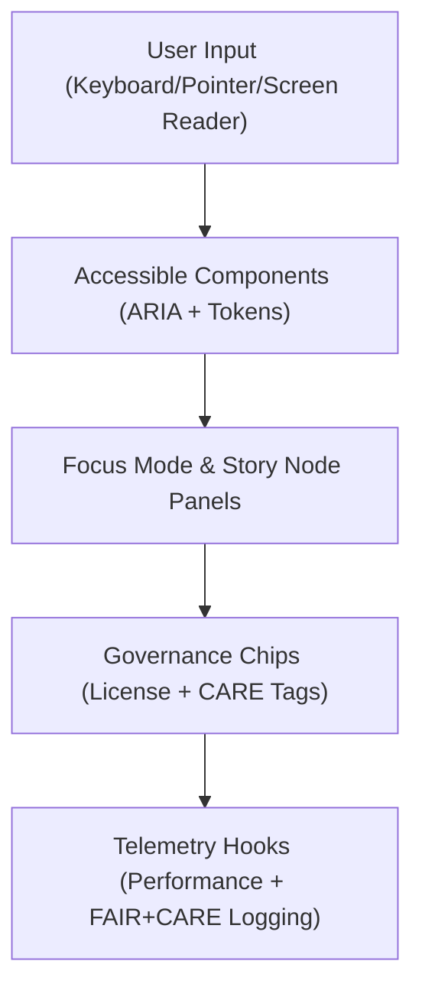

<div align="center">

# 🧱 **Kansas Frontier Matrix — Web Components Library**  
`web/src/components/README.md`

**Purpose:**  
Provide an accessible, FAIR+CARE-certified set of **React components** forming the **visual, narrative, and governance foundation** of the Kansas Frontier Matrix (KFM) web platform.  
Aligned with **MCP-DL v6.3**, **WCAG 2.1 AA**, and **ISO 9241-210**, these components power an inclusive, low-energy, explainable, and ethically governed user experience.

[](../../../docs/)
[](../../../LICENSE)
[](../../../docs/standards/faircare.md)
[](#)

</div>

---

## 📘 Overview

The **Web Components Library** provides reusable, token-driven React modules for building all Kansas Frontier Matrix interfaces.  
Every component is:
- ♿ Accessible (WCAG 2.1 AA + WAI-ARIA compliant)  
- ⚖️ Governed (FAIR+CARE metadata integrated)  
- 🌱 Sustainable (ISO 50001 energy-tracked rendering)  
- 🧠 Explainable (Focus Mode + provenance chips built in)  

Components integrate **Focus AI**, **MapLibre**, **Cesium**, and **GraphQL** data pipelines while maintaining consistent **MCP-DL documentation** and **ethical transparency**.

---

## 🗂️ Directory Layout

```plaintext
web/src/components/
├── README.md
│
├── Layout/
│   ├── MainLayout.tsx
│   ├── SidebarLayout.tsx
│   └── FooterLayout.tsx
│
├── MapView/
│   ├── MapCanvas.tsx
│   ├── LayerControls.tsx
│   ├── Legend.tsx
│   └── TimelineSlider.tsx
│
├── TimelineView/
│   ├── README.md               # This file — component overview
│   ├── TimelineView.tsx        # React component rendering the timeline
│   ├── useTimeline.ts          # Hook managing timeline state and sync
│   ├── timeline-context.ts     # Context for global currentYear state
│   ├── density-chart.tsx       # D3-based event density graph
│   ├── telemetry.ts            # Logs performance and FAIR+CARE metrics
│   └── timeline.css            # Styling and accessibility tokens
│
│
│
├── FocusMode/
│   ├── FocusConsole.tsx
│   ├── InsightCard.tsx
│   └── ExplainabilityPanel.tsx
│
├── DataCards/
│   ├── ClimateCard.tsx
│   ├── HazardsCard.tsx
│   ├── HydrologyCard.tsx
│   └── ProvenanceCard.tsx
│
├── Governance/
│   ├── GovernanceDashboard.tsx
│   ├── ValidationPanel.tsx
│   └── EthicsSummary.tsx
│
├── DetailDrawer/
│   ├── DetailDrawer.tsx
│   └── drawer-context.ts
│
└── metadata.json
```

---

## ⚙️ Component Architecture



**Pipeline Summary**
1. **Accessible Components:** Semantic React structure with design tokens and ARIA roles.  
2. **Narrative Layers:** Components interact with story nodes, Focus AI, and provenance.  
3. **Governance Chips:** Ethical compliance badges surface license & CARE data.  
4. **Telemetry Hooks:** Log energy, latency, and accessibility compliance in CI/CD.

---

## 🧠 FAIR+CARE & MCP Governance Matrix

| Principle | Implementation | Oversight |
|------------|----------------|------------|
| **Findable** | Each component documented and indexed with metadata. | `@kfm-design` |
| **Accessible** | Keyboard-first navigation, color contrast 4.5:1+, ARIA validation. | `@kfm-accessibility` |
| **Interoperable** | Token-driven APIs (TypeScript props, contexts). | `@kfm-architecture` |
| **Reusable** | Modular templates across map, timeline, focus, and story views. | `@kfm-ui` |
| **Collective Benefit** | Transparent provenance and explainability layers. | `@faircare-council` |
| **Authority to Control** | CARE governance hooks applied per dataset or story. | `@kfm-governance` |
| **Responsibility** | Energy-efficient, WCAG-validated UI components. | `@kfm-sustainability` |
| **Ethics** | Explainability UIs expose AI decision provenance. | `@kfm-ethics` |

**Audit References**  
- FAIR+CARE: `../../../reports/audit/faircare_summary.json`  
- Provenance: `../../../reports/audit/data_provenance_ledger.json`

---

## 🧩 Major Components

| Component | Description | Feature Domain |
|-----------|--------------|----------------|
| `MainLayout.tsx` | Responsive page layout shell. | Layout |
| `MapCanvas.tsx` | MapLibre + Cesium rendering surface. | Map |
| `LayerControls.tsx` | Toggles and filters for STAC/DCAT layers. | Map |
| `Legend.tsx` | Symbol and color legends for time-aware layers. | Map |
| `TimelineSlider.tsx` | Interactive timeline slider controlling temporal layers. | Timeline |
| `FocusConsole.tsx` | Core Focus Mode narrative viewer. | Focus |
| `ExplainabilityPanel.tsx` | AI reasoning visualization (SHAP/LIME). | Focus |
| `ProvenanceCard.tsx` | Dataset/license provenance and checksum chips. | Governance |
| `DetailDrawer.tsx` | Contextual entity summary panel with CARE enforcement. | UI |

---

## 🎨 Design Guidelines

| Category | Standard | Notes |
|----------|-----------|------|
| **Color** | WCAG 2.1 AA | 4.5:1 text contrast; high-contrast themes supported. |
| **Typography** | ISO 9241-210 | Scalable and readable across devices. |
| **Interaction** | WAI-ARIA | Roles, focus rings, keyboard tab order validated. |
| **Performance** | ISO 50001 | Energy-efficient animations, lazy loading, and caching. |
| **Governance** | FAIR+CARE | CARE tagging and ethical rendering on all panels. |

---

## 📊 Telemetry & Sustainability Metrics

| Metric | Target | Monitored By |
|--------|--------|--------------|
| Render Energy / Interaction | ≤ 0.9 Wh | `telemetry-export.yml` |
| FPS Stability | ≥ 58 FPS | Performance dashboard |
| Lighthouse A11y Score | ≥ 95 | CI/CD audit |
| Bundle Size | ≤ 300 KB per feature | Build validator |
| FAIR+CARE Compliance | 100% | `faircare-validate.yml` |

Telemetry data streams to `releases/v9.9.0/focus-telemetry.json`.

---

## 🧮 CI/CD Integration

| Workflow | Validation | Artifact |
|-----------|-------------|----------|
| `docs-lint.yml` | Ensures MCP-DL front-matter, structure, metadata. | `reports/docs_lint.json` |
| `a11y-lint.yml` | Accessibility compliance checks. | `reports/ui_a11y_summary.json` |
| `telemetry-export.yml` | Merges build & energy telemetry. | `releases/v9.9.0/focus-telemetry.json` |
| `faircare-validate.yml` | Ethical + governance review. | `reports/faircare_summary.json` |

---

## ♻️ Accessibility Highlights

- **ARIA regions:** All interactive panels have descriptive roles.  
- **Keyboard-first design:** Focus management utilities ensure consistent navigation.  
- **Screen readers:** Live region announcements for updates (timeline, focus, story).  
- **Reduced motion:** Honors `prefers-reduced-motion` media query.  
- **High contrast:** Theme tokens defined in global design tokens.  

---

## 🧾 Internal Citation

```text
Kansas Frontier Matrix (2025). Web Components Library (v9.9.0).
Defines FAIR+CARE-aligned, WCAG 2.1 AA-compliant React component suite forming the sustainable, explainable, and ethical UI foundation for KFM’s web system.
```

---

## 🕰️ Version History

| Version | Date | Author | Summary |
|----------|------|---------|----------|
| v9.9.0 | 2025-11-08 | `@kfm-web` | Added DetailDrawer integration, FAIR+CARE telemetry hooks, and explainability overlays. |
| v9.8.0 | 2025-11-05 | `@kfm-ui` | Improved accessibility tokens and performance metrics. |
| v9.7.0 | 2025-11-02 | `@kfm-core` | Established modular React component structure for KFM web application. |

---

<div align="center">

**Kansas Frontier Matrix**  
*Accessible Design × FAIR+CARE Ethics × Sustainable Components*  
© 2025 Kansas Frontier Matrix · Master Coder Protocol v6.3 · FAIR+CARE Certified · Diamond⁹ Ω / Crown∞Ω Ultimate Certified  

[Back to Web Source](../README.md) · [Governance Charter](../../../docs/standards/governance/ROOT-GOVERNANCE.md)

</div>
