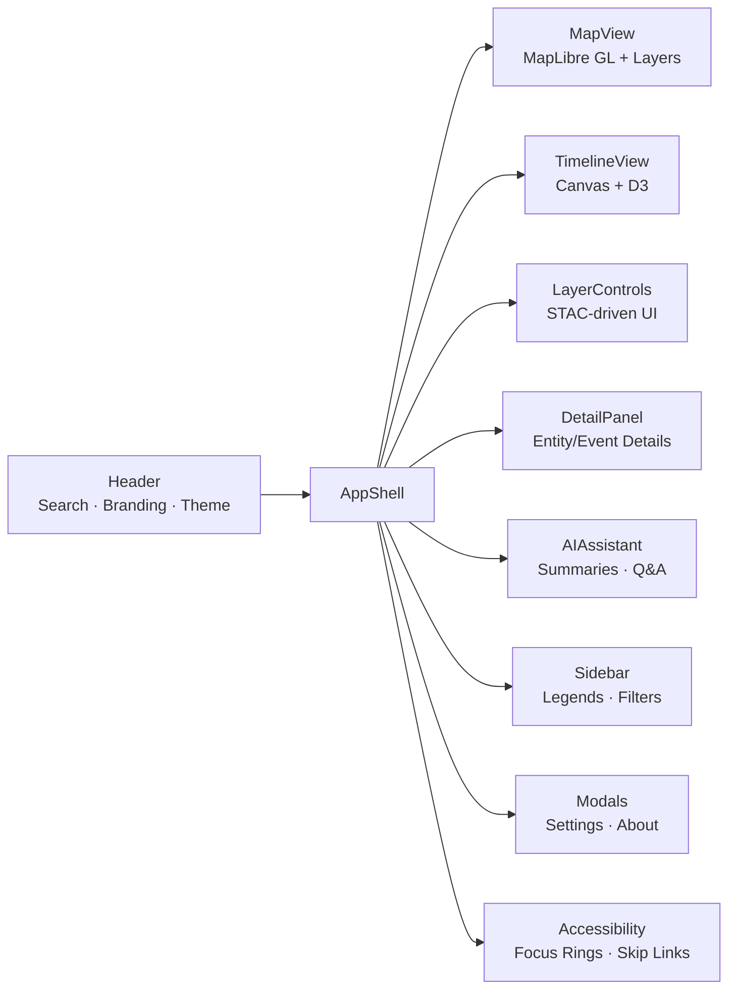
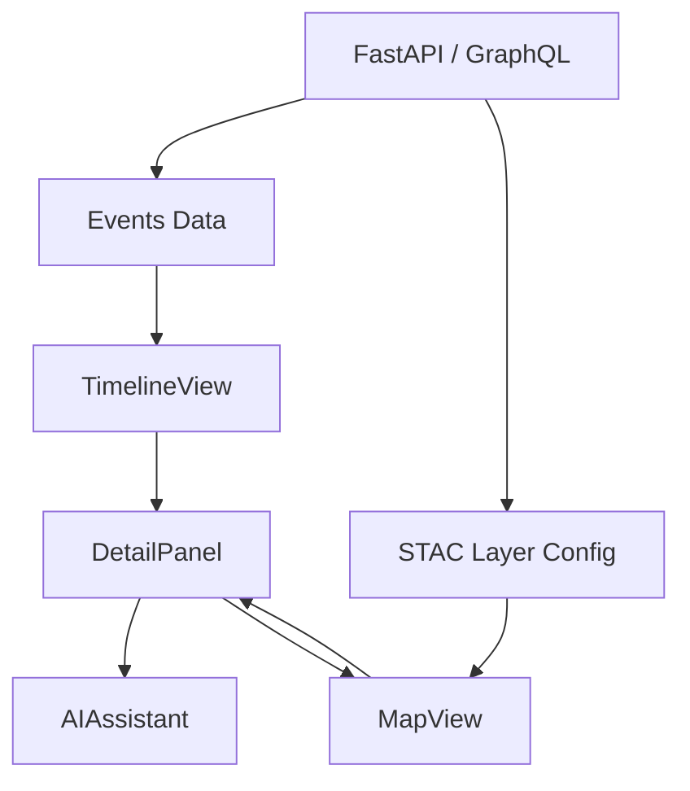

<div align="center">

# 🧩 Kansas Frontier Matrix — **Web Frontend Components**  
`web/src/components/`

**Modular React Components · Map + Timeline UI · Storytelling Panels**

[](../../../../.github/workflows/ci.yml)
[](../../../../.github/workflows/codeql.yml)
[](../../../../docs/)
[](../../../../LICENSE)

</div>

---

```yaml
---
title: "KFM • Web Frontend Components (web/src/components/)"
version: "v1.4.0"
last_updated: "2025-10-14"
owners: ["@kfm-web", "@kfm-ui"]
tags: ["react","components","map","timeline","ai","accessibility","mcp"]
license: "MIT"
semantic_alignment:
  - CIDOC CRM (entity visualization)
  - OWL-Time (temporal data visualization)
  - WCAG 2.1 AA (UI accessibility)
---
````

---

## 🧭 Overview

`web/src/components/` contains all **React components** that form the Kansas Frontier Matrix (KFM) Web UI — including the **Map**, **Timeline**, **LayerControls**, **AI Assistant**, and **Detail Panels**.
Each component is **modular, typed, documented**, and integrated into the system’s **MCP-DL v6.2** reproducibility pipeline.

> **MCP Principle:** Document → Implement → Validate → Reproduce

Every visual element — from map overlays to timeline markers — connects directly to structured data from the **FastAPI / GraphQL backend** and **Neo4j Knowledge Graph**, ensuring spatial, temporal, and narrative coherence.

---

## 🧱 Directory Structure

```text
web/src/components/
├── AppShell/             # Root layout + context providers
├── Header/               # Top navigation bar (search, theme, title)
├── MapView/              # MapLibre map + overlays (GeoJSON, COG, STAC)
├── TimelineView/         # Canvas/D3 timeline visualization
├── LayerControls/        # STAC-driven layer toggles + opacity sliders
├── DetailPanel/          # Entity/Event dossiers, AI summaries, citations
├── AIAssistant/          # Conversational Q&A + chat context
├── Sidebar/              # Filter + legend container beside map
├── Modals/               # Global modals (About, Accessibility, Settings)
├── Accessibility/        # Focus indicators, skip links, a11y overlays
└── index.ts              # Barrel export of all components
```

Each component folder generally contains:

* `index.tsx` — main component implementation
* `styles.scss` — scoped styling rules
* `test.tsx` — Jest + RTL unit/integration tests
* `README.md` — optional component-specific documentation

---

## 🎨 Component Map



All major UI modules render inside the **AppShell**, which orchestrates context providers, responsive layout, and theme synchronization.

---

## 🧩 Core Components

| Component         | Purpose                                                     | Key Technologies               |
| :---------------- | :---------------------------------------------------------- | :----------------------------- |
| **AppShell**      | Root wrapper; injects global providers (context, theme, AI) | React Context, Framer Motion   |
| **Header**        | Navigation, title, search, theme toggle                     | React Router, useDebounce      |
| **MapView**       | MapLibre map rendering GeoJSON/COG layers                   | MapLibre GL JS                 |
| **TimelineView**  | Scrollable timeline visualizing events                      | HTML5 Canvas, D3.js            |
| **LayerControls** | Layer toggles + opacity controls (STAC-based)               | STAC metadata parser           |
| **DetailPanel**   | Entity dossiers + AI summaries + citations                  | `react-markdown`, internal UI  |
| **AIAssistant**   | Conversational AI Q&A + historical summaries                | Backend `/api/ask`             |
| **Sidebar**       | Layer legend, filter drawer                                 | TailwindCSS, Framer Motion     |
| **Modals**        | About / Settings / Accessibility overlays                   | React Portal API               |
| **Accessibility** | WCAG compliance helpers                                     | ARIA roles, keyboard nav hooks |

---

## ⚙️ Component Example — MapView

```tsx
import React, { useEffect, useRef } from "react";
import maplibregl from "maplibre-gl";
import "maplibre-gl/dist/maplibre-gl.css";

export function MapView({ layers }) {
  const mapContainer = useRef<HTMLDivElement>(null);

  useEffect(() => {
    const map = new maplibregl.Map({
      container: mapContainer.current!,
      style: "https://basemaps.cartocdn.com/gl/voyager-gl-style/style.json",
      center: [-98.3, 38.5],
      zoom: 6,
    });

    layers.forEach(layer => {
      map.addSource(layer.id, { type: "geojson", data: layer.url });
    });

    return () => map.remove();
  }, [layers]);

  return <div ref={mapContainer} className="map-view" />;
}
```

> Renders the spatial layer stack (treaty boundaries, hydrology, elevation) and connects map interactions to `SelectionContext`, synchronizing the map and timeline.

---

## 🧠 Data Flow



This flow ensures cohesive updates:

* **Timeline scrubbing** filters visible map events
* **Map selections** open corresponding **Detail Panels**
* **AI queries** enrich entity or event context dynamically

---

## 🧩 Development Standards

* **Styling:** Components import design tokens and grid utilities from `web/src/styles/`
* **Accessibility:** All components use `AccessibilityContext` for focus and reduced-motion states
* **Performance:** Timeline + Map utilize `requestAnimationFrame`, memoization, and throttled updates
* **Testing:** Jest + RTL simulate user interactions; snapshots stored under `__tests__/`
* **Documentation:** Each directory includes optional component-level `README.md`

Optional: Components can be previewed via **Storybook** for visual QA.

---

## 🧾 Provenance & Integrity

| Artifact         | Description                                                      |
| :--------------- | :--------------------------------------------------------------- |
| **Inputs**       | Context & hooks (state, API data, AI responses)                  |
| **Outputs**      | React-rendered DOM and Canvas/Map visualizations                 |
| **Dependencies** | React 18+, D3.js, MapLibre GL, TailwindCSS, Framer Motion        |
| **Integrity**    | CI validates linting, tests, and accessibility (axe-core audits) |

---

## 🧠 MCP Compliance Checklist

| MCP Principle       | Implementation                                    |
| :------------------ | :------------------------------------------------ |
| Documentation-first | Per-component docs + TSDoc comments               |
| Reproducibility     | Deterministic rendering + CI validation           |
| Open Standards      | WCAG, GeoJSON, STAC, OWL-Time                     |
| Provenance          | Source metadata and component lineage documented  |
| Accessibility       | Full keyboard/focus support + contrast validation |

---

## 🔗 Related Documentation

* **Web Frontend Overview** — `web/README.md`
* **Context Providers** — `web/src/context/README.md`
* **Hooks** — `web/src/hooks/README.md`
* **Types** — `web/src/types/README.md`
* **Utilities** — `web/src/utils/README.md`
* **Web UI Architecture** — `web/ARCHITECTURE.md`

---

## 📜 License

Released under the **MIT License**.
© 2025 Kansas Frontier Matrix — designed and built under **MCP-DL v6.2** standards for clarity, modularity, and reproducibility.

> *“Components are the storytellers — each renders a fragment of Kansas history into view.”*

```
```
