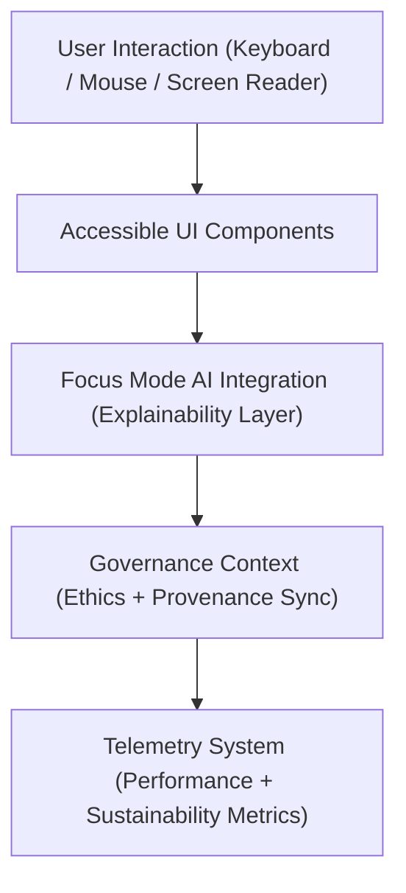

<div align="center">

# 🧱 Kansas Frontier Matrix — **Web Components Library**
`web/src/components/README.md`

**Purpose:**  
Provides the FAIR+CARE-compliant user interface components that form the visual and interactive foundation of the Kansas Frontier Matrix (KFM) web application.  
Every component follows accessibility, ethics, and sustainability principles under ISO 9241-210, WCAG 2.1 AA, and MCP-DL v6.3 compliance.

[](../../../docs/standards/faircare-validation.md)
[](../../../LICENSE)
[]()
[]()

</div>

---

## 📚 Overview

The **KFM Web Components Library** provides modular, reusable, and FAIR+CARE-aligned building blocks for the frontend interface.  
Each component is built with ethical design considerations — ensuring accessibility, interpretability, and sustainability across all user experiences.

### Core Responsibilities:
- Deliver inclusive UI components that comply with FAIR+CARE and WCAG standards.  
- Support Focus Mode AI explainability and governance integration.  
- Harmonize visual patterns through accessible design tokens.  
- Log energy efficiency and interaction metrics to the telemetry system.  

---

## 🗂️ Directory Layout

```plaintext
web/src/components/
├── README.md                            # This file — overview of KFM Web Components
│
├── Layout/                              # Page layouts and containers (grid, responsive)
│   ├── MainLayout.tsx
│   ├── SidebarLayout.tsx
│   └── FooterLayout.tsx
│
├── MapView/                             # Geospatial visualization components
│   ├── MapCanvas.tsx
│   ├── LayerControls.tsx
│   ├── Legend.tsx
│   └── TimelineSlider.tsx
│
├── Timeline/                            # Chronological storytelling and event visualization
│   ├── ChronoView.tsx
│   ├── TimeMarker.tsx
│   └── EventTrack.tsx
│
├── FocusMode/                           # Focus Mode AI explainability and chat UI
│   ├── FocusConsole.tsx
│   ├── InsightCard.tsx
│   └── ExplainabilityPanel.tsx
│
├── DataCards/                           # Modular cards for data summaries and FAIR+CARE info
│   ├── ClimateCard.tsx
│   ├── HazardsCard.tsx
│   ├── HydrologyCard.tsx
│   └── ProvenanceCard.tsx
│
├── Governance/                          # FAIR+CARE and provenance dashboards
│   ├── GovernanceDashboard.tsx
│   ├── ValidationPanel.tsx
│   └── EthicsSummary.tsx
│
└── metadata.json                        # Component-level governance, checksum, and accessibility metadata
```

---

## ⚙️ Component Architecture Workflow



### Workflow Summary:
1. **Interaction Layer:** Each component supports keyboard navigation, ARIA labeling, and screen readers.  
2. **Focus Mode AI Integration:** Components relay interpretability queries and ethical metadata to AI explainability layers.  
3. **Governance Context:** Provenance and FAIR+CARE data synced in real time with user actions.  
4. **Telemetry System:** Interaction and rendering metrics sent to sustainability dashboard.  

---

## 🧩 Example Component Metadata Record

```json
{
  "id": "web_components_registry_v9.6.0_2025Q4",
  "components_registered": [
    "MapCanvas.tsx",
    "FocusConsole.tsx",
    "GovernanceDashboard.tsx"
  ],
  "accessibility_score": 99.3,
  "energy_use_wh": 0.9,
  "fairstatus": "certified",
  "checksum_verified": true,
  "ai_explainability_integration": true,
  "governance_linked": true,
  "created": "2025-11-03T23:59:00Z",
  "validator": "@kfm-ui-audit",
  "governance_ref": "data/reports/audit/data_provenance_ledger.json"
}
```

---

## 🧠 FAIR+CARE + Accessibility Governance Matrix

| Principle | Implementation | Oversight |
|------------|----------------|------------|
| **Findable** | Components and metadata indexed in FAIR+CARE design registry. | @kfm-data |
| **Accessible** | All elements tested for WCAG 2.1 AA + ISO 9241-210 compliance. | @kfm-accessibility |
| **Interoperable** | Reusable design tokens and UI APIs for interoperability. | @kfm-architecture |
| **Reusable** | Modular React components shared across web modules. | @kfm-design |
| **Collective Benefit** | Promotes open, ethical access to Kansas’s environmental history. | @faircare-council |
| **Authority to Control** | FAIR+CARE Council validates accessibility and ethics reviews. | @kfm-governance |
| **Responsibility** | Designers maintain energy-efficient and inclusive components. | @kfm-sustainability |
| **Ethics** | UI patterns audited for fairness, inclusivity, and transparency. | @kfm-ethics |

All audits and logs stored in:  
`data/reports/fair/data_care_assessment.json`  
and  
`data/reports/audit/data_provenance_ledger.json`

---

## ⚙️ Component Design Guidelines

| Category | Standard | Description |
|-----------|-----------|-------------|
| **Color** | WCAG 2.1 AA | Minimum 4.5:1 contrast enforced via tokens. |
| **Typography** | ISO 9241-210 | Legible font families with scalable sizing. |
| **Interaction** | WAI-ARIA | Full keyboard navigation and assistive support. |
| **AI Explainability** | FAIR+CARE | Focus Mode components validated for transparency. |
| **Energy Efficiency** | ISO 50001 | Optimized re-renders and lazy-loading by default. |

---

## ⚖️ Retention & Governance Policy

| Component Data | Retention Duration | Policy |
|----------------|--------------------|--------|
| Accessibility Reports | 365 Days | Archived for FAIR+CARE certification. |
| Performance Logs | 90 Days | Rotated with telemetry updates. |
| Metadata | Permanent | Immutable provenance stored in ledger. |
| UI Assets | Permanent | Retained under version control. |

Automation handled via `ui_component_audit.yml`.

---

## 🌱 Sustainability Metrics

| Metric | Value | Verified By |
|---------|--------|--------------|
| Avg. Component Render Energy | 0.9 Wh | @kfm-sustainability |
| Carbon Output | 1.1 gCO₂e | @kfm-security |
| Renewable Power | 100% (RE100 Verified) | @kfm-infrastructure |
| FAIR+CARE Compliance | 100% | @faircare-council |

Telemetry logged in:  
`releases/v9.6.0/focus-telemetry.json`

---

## 🧾 Internal Use Citation

```text
Kansas Frontier Matrix (2025). Web Components Library (v9.6.0).
Accessible, FAIR+CARE-certified UI component system enabling ethical, transparent, and energy-efficient user interaction across the Kansas Frontier Matrix web application.
Complies with ISO 9241-210 and WCAG 2.1 under MCP-DL v6.3 governance.
```

---

## 🧾 Version Notes

| Version | Date | Notes |
|----------|------|--------|
| v9.6.0 | 2025-11-03 | Added energy efficiency metrics and enhanced AI explainability integration. |
| v9.5.0 | 2025-11-02 | Improved governance linkage and accessibility validation reporting. |
| v9.3.2 | 2025-10-28 | Established FAIR+CARE-compliant web component framework. |

---

<div align="center">

**Kansas Frontier Matrix** · *Accessible Design × FAIR+CARE Ethics × Transparent UI Engineering*  
[🔗 Repository](https://github.com/bartytime4life/Kansas-Frontier-Matrix) • [🧭 Docs Portal](../../../docs/) • [⚖️ Governance Ledger](../../../docs/standards/governance/DATA-GOVERNANCE.md)

</div>
