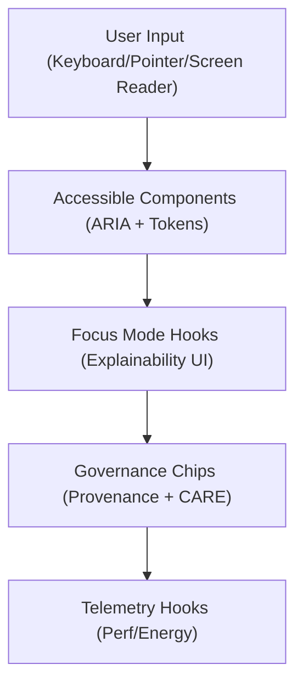

<div align="center">

# 🧱 **Kansas Frontier Matrix — Web Components Library**
`web/src/components/README.md`

**Purpose:** Provide an accessible, FAIR+CARE-certified set of React components that form the KFM web application’s visual and interaction foundation — aligned with **MCP v6.3**, **WCAG 2.1 AA**, and **ISO 9241-210**.

[](../../../docs/README.md)
[](../../../LICENSE)
[](../../../docs/standards/faircare.md)
[]()

</div>

---

## 📘 Overview

The **Components Library** offers modular, token-driven UI building blocks.  
Components implement inclusive patterns, Focus Mode explainability surfaces, and provenance chips, while minimizing energy use and re-renders.

---

## 🗂️ Directory Layout

```
web/src/components/
├── README.md
│
├── Layout/
│   ├── MainLayout.tsx
│   ├── SidebarLayout.tsx
│   └── FooterLayout.tsx
│
├── MapView/
│   ├── MapCanvas.tsx
│   ├── LayerControls.tsx
│   ├── Legend.tsx
│   └── TimelineSlider.tsx
│
├── Timeline/
│   ├── ChronoView.tsx
│   ├── TimeMarker.tsx
│   └── EventTrack.tsx
│
├── FocusMode/
│   ├── FocusConsole.tsx
│   ├── InsightCard.tsx
│   └── ExplainabilityPanel.tsx
│
├── DataCards/
│   ├── ClimateCard.tsx
│   ├── HazardsCard.tsx
│   ├── HydrologyCard.tsx
│   └── ProvenanceCard.tsx
│
├── Governance/
│   ├── GovernanceDashboard.tsx
│   ├── ValidationPanel.tsx
│   └── EthicsSummary.tsx
│
└── metadata.json
```

---

## 🧩 Component Architecture



1. **Accessible Components:** tokenized, ARIA-labelled, keyboard-first.  
2. **Explainability UI:** Focus Mode bindings render summaries and traces.  
3. **Governance Chips:** show dataset license, provenance, and CARE flags.  
4. **Telemetry Hooks:** log energy, latency, and a11y results to release telemetry.

---

## ⚙️ Design Guidelines

| Category | Standard | Notes |
|----------|----------|------|
| Color | WCAG 2.1 AA | 4.5:1 text contrast (3:1 large) |
| Typography | ISO 9241-210 | Scalable, legible, language-aware |
| Interaction | WAI-ARIA | Focus rings, roles, labels, and landmarks |
| Tokens | Central registry | `web/src/styles/tokens.css` |
| Performance | ISO 50001 | Lazy-load, memoize, limit re-renders |

---

## 🧠 FAIR+CARE + Accessibility Matrix

| Principle | Implementation | Oversight |
|------------|----------------|------------|
| **Findable** | Components cataloged with metadata and examples. | @kfm-design |
| **Accessible** | Axe/Lighthouse audits per release; keyboard-first UX. | @kfm-accessibility |
| **Interoperable** | Token-driven API; TypeScript props and slots. | @kfm-architecture |
| **Reusable** | Modular, documented patterns shared app-wide. | @kfm-design |
| **Collective Benefit** | Transparent data visuals and provenance. | @faircare-council |
| **Authority to Control** | CARE flags surface sensitive content rules. | @kfm-governance |
| **Responsibility** | Components tuned for low-power rendering. | @kfm-sustainability |
| **Ethics** | Explainability UI ensures non-opaque AI interactions. | @kfm-ethics |

**Audit Paths**
- FAIR+CARE: `../../../docs/reports/fair/data_care_assessment.json`  
- Provenance: `../../../docs/reports/audit/data_provenance_ledger.json`

---

## 🧩 Component Summaries

| Component | Description | Role |
|-----------|-------------|------|
| `MapCanvas.tsx` | MapLibre map with vector layers and keyboard ops. | Spatial View |
| `LayerControls.tsx` | Toggles STAC/DCAT layers & styles. | Layer Control |
| `Legend.tsx` | Symbol and color key with a11y. | Guidance |
| `TimelineSlider.tsx` | Time brushing and range selection. | Temporal Nav |
| `ChronoView.tsx` | Time-series density and markers. | Temporal Viz |
| `FocusConsole.tsx` | Conversational Focus Mode panel. | AI Narrative |
| `ExplainabilityPanel.tsx` | SHAP/LIME links and summaries. | Transparency |
| `ProvenanceCard.tsx` | License + checksum + source chips. | Governance |

---

## ⚙️ CI/CD & Contracts

| Workflow | Verification | Artifact |
|----------|--------------|----------|
| `docs-lint.yml` | README structure & front-matter | `reports/self-validation/docs/lint_summary.json` |
| `build-and-deploy.yml` | Component build & bundle size | `docs/reports/telemetry/build_metrics.json` |
| `telemetry-export.yml` | Merge per-release metrics | `../../../releases/v9.7.0/focus-telemetry.json` |

---

## 🌱 Sustainability Metrics

| Metric | Target | Verified By |
|-------|--------|-------------|
| Render Energy / Interaction | ≤ 0.9 Wh | Telemetry |
| Lighthouse A11y Score | ≥ 95 | CI pipeline |
| Bundle Size (components) | ≤ 250 KB | Build metrics |

---

## 🕰️ Version History

| Version | Date | Author | Summary |
|----------|------|---------|----------|
| v9.7.0 | 2025-11-05 | KFM Core Team | Upgraded & aligned: contracts, governance chips, Focus Mode bindings, telemetry schema. |
| v9.6.0 | 2025-11-03 | KFM Core Team | Added explainability surfaces + a11y audits. |
| v9.5.0 | 2025-11-02 | KFM Core Team | Improved token integration and energy efficiency. |
| v9.3.2 | 2025-10-28 | KFM Core Team | Established modular component library. |

---

<div align="center">

**© 2025 Kansas Frontier Matrix — MIT / CC-BY 4.0**  
Maintained under **Master Coder Protocol v6.3** · FAIR+CARE Certified · Diamond⁹ Ω / Crown∞Ω Ultimate Certified  
[Back to Web Source](../README.md) · [Docs Index](../../../docs/README.md)

</div>