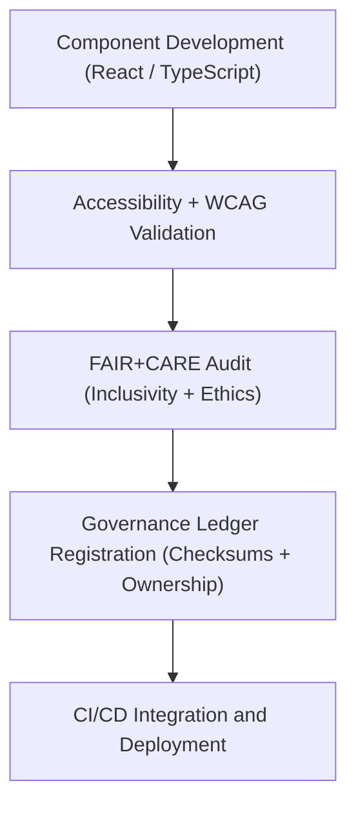

<div align="center">

# 🧱 **Kansas Frontier Matrix — Core UI Components Library (v2.1.1 · Tier-Ω+∞ Certified)**  
`web/src/components/README.md`

**Mission:** Provide a **modular, accessible, and FAIR+CARE-aligned React component library**  
for the **Kansas Frontier Matrix (KFM)** web application — ensuring reusable design consistency,  
ethical accessibility, and governance-traceable UI development.

[](../../../docs/)
[](../../../docs/standards/faircare-validation.md)
[](../../../docs/standards/accessibility.md)
[](../../../LICENSE)

</div>

---

## 📚 Overview

The **Core UI Components Library** defines the foundational building blocks of the  
Kansas Frontier Matrix (KFM) user interface — designed to be modular, accessible,  
and ethically aligned under FAIR+CARE principles.  

Each component:
- 🧩 Adheres to FAIR+CARE and WCAG 2.1 AA accessibility standards.  
- 🧭 Integrates with governance validation for reproducible UI behavior.  
- ⚙️ Is version-controlled with checksums recorded in the governance ledger.  
- ♿ Supports inclusive user experiences with responsive and accessible designs.

---

## 🗂️ Directory Layout

```bash
web/src/components/
├── README.md                     # This file — UI component library overview
│
├── layout/                       # Global layout containers and responsive grid system
│   ├── header.tsx
│   ├── footer.tsx
│   └── sidebar.tsx
│
├── ui/                           # Common UI elements (buttons, modals, dropdowns)
│   ├── button.tsx
│   ├── modal.tsx
│   ├── dropdown.tsx
│   └── tooltip.tsx
│
├── navigation/                   # Navigation components for app-level routing
│   ├── navbar.tsx
│   ├── breadcrumb.tsx
│   └── pagination.tsx
│
└── accessibility/                # A11y utility components
    ├── skip-link.tsx
    ├── aria-status.tsx
    └── focus-trap.tsx
```

---

## ⚙️ UI Governance Model


<!-- END OF MERMAID -->

---

## 🧱 Core Component Categories

| Category | Purpose | FAIR+CARE Function | Validation Workflow |
|:--|:--|:--|:--|
| **Layout Components** | Define structure, responsiveness, and page hierarchy. | Accessibility + Reusability | `design-validate.yml` |
| **UI Elements** | Core interactive elements with WCAG compliance. | Inclusivity + Transparency | `ui-validate.yml` |
| **Navigation Components** | Accessible routing and contextual breadcrumbs. | Findability + Ethics | `design-validate.yml` |
| **Accessibility Utilities** | Enhances a11y behavior and focus control. | Collective Benefit (CARE) | `faircare-validate.yml` |

---

## 🧠 FAIR + CARE Integration

| Principle | Implementation | Validation |
|:--|:--|:--|
| **Findable** | Components indexed and documented in design system. | `policy-check.yml` |
| **Accessible** | Full keyboard and ARIA compliance for all interactive components. | `design-validate.yml` |
| **Interoperable** | Reusable across pages and modules using TypeScript interfaces. | `ui-validate.yml` |
| **Reusable** | Modular design system architecture. | `docs-validate.yml` |
| **Collective Benefit (CARE)** | Accessibility-first and inclusive UI development. | `faircare-validate.yml` |

---

## ♿ Accessibility Standards (WCAG 2.1 AA)

| Category | Implementation | Validation Workflow |
|:--|:--|:--|
| **Keyboard Navigation** | Full tab and arrow navigation across UI. | `ui-validate.yml` |
| **ARIA Compliance** | Role-based labeling and dynamic state announcements. | `design-validate.yml` |
| **Contrast Ratio** | ≥ 4.5:1 for text, 3:1 for large text and icons. | `design-validate.yml` |
| **Focus Management** | Visual focus states implemented globally. | `ui-validate.yml` |

---

## 🔍 Provenance & Governance Integration

| Artifact | Purpose | Path |
|:--|:--|:--|
| **Component Registry** | Metadata index of reusable UI components. | `web/src/components/registry.json` |
| **Accessibility Reports** | Logs WCAG validation results. | `reports/validation/a11y_validation.json` |
| **Governance Ledger** | Records checksums and provenance. | `data/reports/audit/data_provenance_ledger.json` |

---

## 🧩 Example Component Metadata

```yaml
---
component_id: "ui_component_button_v2.1.1"
authors: ["@kfm-web","@kfm-accessibility"]
faircare_status: "Tier-Ω+∞ Verified"
checksum: "sha256:1a7c83db24e4d98b..."
governance_ledger_entry: "data/reports/audit/data_provenance_ledger.json"
accessibility_compliance: "WCAG 2.1 AA"
license: "MIT"
---
```

---

## 🧮 Observability Metrics

| Metric | Description | Target | Workflow |
|:--|:--|:--|:--|
| **Component Test Coverage** | % of components covered by Jest/Playwright tests. | ≥ 90 | `ui-validate.yml` |
| **Accessibility Compliance (WCAG)** | Overall a11y compliance across library. | ≥ 95 | `design-validate.yml` |
| **FAIR+CARE Compliance Rate** | Ethics + inclusivity audit score. | ≥ 95 | `faircare-validate.yml` |
| **Governance Sync Rate** | Ledger entries successfully recorded. | 100% | `governance-ledger.yml` |

---

## 🧾 Validation Workflows

| Workflow | Function | Output |
|:--|:--|:--|
| `ui-validate.yml` | Tests rendering, interactivity, and keyboard focus. | `reports/validation/ui_validation.json` |
| `design-validate.yml` | Checks WCAG and contrast compliance. | `reports/validation/a11y_validation.json` |
| `faircare-validate.yml` | Audits inclusive design and ethical standards. | `reports/fair/data_care_assessment.json` |
| `policy-check.yml` | Ensures frontmatter and metadata consistency. | `reports/audit/policy_check.json` |
| `governance-ledger.yml` | Logs checksums and ownership for provenance. | `data/reports/audit/data_provenance_ledger.json` |

---

## 🕰 Version History

| Version | Date | Author | Summary |
|:--|:--|:--|:--|
| **v2.1.1** | 2025-11-16 | @kfm-web | Added registry metadata schema and FAIR+CARE provenance integration. |
| v2.0.0 | 2025-10-25 | @kfm-accessibility | Introduced full accessibility compliance across layout and navigation. |
| v1.0.0 | 2025-10-04 | @kfm-docs | Initial component library documentation and governance linkage. |

---

<div align="center">

**Kansas Frontier Matrix © 2025**  
*“Design with Ethics. Build with Governance. Deliver with Care.”*  
📍 `web/src/components/README.md` — FAIR+CARE-aligned UI component documentation for the Kansas Frontier Matrix web platform.

</div>
