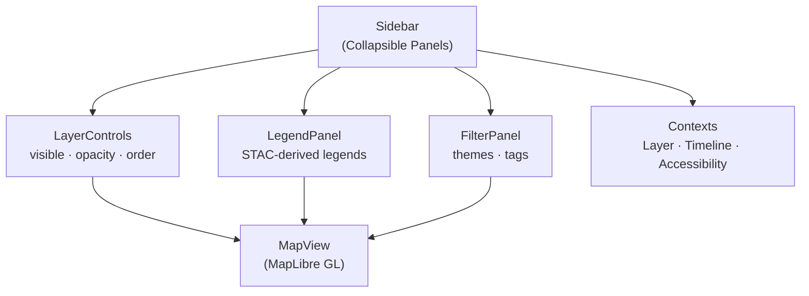
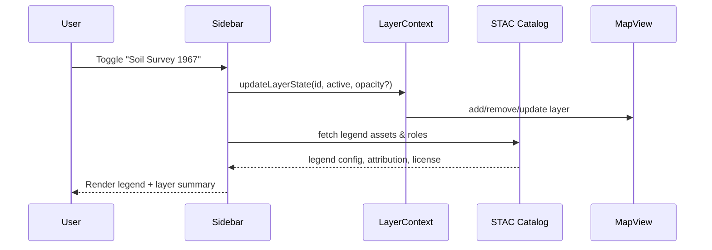

<div align="center">

# 📚 Kansas Frontier Matrix — **Sidebar Component**  
`web/src/components/Sidebar/`

**Layer Management · Legends · Filters · Temporal Context**

[](../../../../../.github/workflows/ci.yml)
[](../../../../../.github/workflows/stac-validate.yml)
[](../../../../../docs/)
[](../../../../../docs/design/reviews/accessibility/)
[](../../../../../LICENSE)

</div>

---

## 🧭 Overview

The **Sidebar** is the **command hub** of the KFM Web UI. It centralizes **Layer Management**, **Legends**, and **Filters**, synchronizing with **Timeline** and **Map** via typed contexts. All behavior follows **MCP-DL v6.2** and WCAG 2.1 AA.

It integrates with:

- 🗂 **LayerContext** — active overlays, opacity, order  
- 🕰 **TimelineContext** — time-window filtering for datasets  
- 🧭 **STAC metadata** — drives legends, titles, attributions, licenses  

---

## 🧱 Directory Structure

```text
web/src/components/Sidebar/
├── Sidebar.tsx           # Main container (composition + layout)
├── SidebarPanel.tsx      # Accessible, collapsible panel primitive
├── FilterPanel.tsx       # Thematic filters (e.g., climate, treaty, hydrology)
├── LegendPanel.tsx       # Legends derived from STAC assets/roles
├── styles.scss           # Responsive + theme-aware styles
└── __tests__/            # Jest + RTL unit/integration tests
```

---

## ⚙️ Component Architecture



**Sync contract:** Sidebar listens to context updates and dispatches actions; **MapView** and **TimelineView** update in lockstep.

---

## 🧩 Key Features

| Feature                | Description                                                          | Data / Source          |
| :--------------------- | :------------------------------------------------------------------- | :--------------------- |
| **Layer Management**   | Toggle overlays, set opacity, reorder                                | `LayerContext`         |
| **Legends**            | Auto-renders from STAC Items/roles (e.g., `data`, `overview`)        | `data/stac/`           |
| **Timeline Filtering** | Shows only layers within current time window                         | `TimelineContext`      |
| **Thematic Filters**   | Climate, treaty, hydrology, archaeology (via STAC tags)              | STAC `properties.*`    |
| **Responsive**         | Drawer on mobile; fixed panel on desktop                             | CSS Grid + Tailwind    |
| **Accessible**         | Keyboard nav, focus management, high-contrast tokens                 | `AccessibilityContext` |

---

## 💬 Reference Implementation

```tsx
// Sidebar.tsx
import React from "react";
import { LayerControls } from "../LayerControls";
import { LegendPanel } from "./LegendPanel";
import { FilterPanel } from "./FilterPanel";
import "./styles.scss";

export const Sidebar: React.FC = () => {
  return (
    <aside
      className="sidebar"
      role="complementary"
      aria-label="Map layers, legends, and filters"
      data-testid="sidebar"
    >
      <header className="sidebar__header">
        <h2 className="sidebar__title">Map Controls</h2>
      </header>

      <section className="sidebar__section" aria-labelledby="layers-heading">
        <h3 id="layers-heading" className="sr-only">Layers</h3>
        <LayerControls />
      </section>

      <section className="sidebar__section" aria-labelledby="legend-heading">
        <h3 id="legend-heading" className="sr-only">Legend</h3>
        <LegendPanel />
      </section>

      <section className="sidebar__section" aria-labelledby="filters-heading">
        <h3 id="filters-heading" className="sr-only">Filters</h3>
        <FilterPanel />
      </section>
    </aside>
  );
};
```

> Uses semantic landmarks and labelled sections for AT-friendly navigation.

---

## 🧠 TypeScript Interfaces

```ts
// SidebarPanel.tsx
export interface SidebarPanelProps {
  title: string;
  defaultOpen?: boolean;
  children: React.ReactNode;
  onToggle?: (open: boolean) => void;
  id?: string; // used for aria-controls/labelledby
}

// FilterPanel.tsx
export type FilterCategory =
  | "climate"
  | "geology"
  | "treaty"
  | "hydrology"
  | "archaeology"
  | "infrastructure";

export interface FilterOption {
  id: string;
  label: string;
  category: FilterCategory;
  active: boolean;
}
```

---

## 🧮 Interaction Flow



---

## 🎨 Styling & Layout

| Property            | Description                                                                 |
| :------------------ | :-------------------------------------------------------------------------- |
| **Base Width**      | `clamp(280px, 25vw, 360px)` on desktop / 100vw drawer on mobile            |
| **Panels**          | Accordion expand/collapse (Framer Motion optional)                          |
| **Tokens**          | Uses `--kfm-color-*`, `--kfm-radius`, `--kfm-shadow` from design system     |
| **Scroll**          | Sticky legend header, scrollable sections                                   |

```scss
/* styles.scss (excerpt) */
.sidebar {
  background: var(--kfm-color-bg);
  color: var(--kfm-color-text);
  width: clamp(280px, 25vw, 360px);
  border-right: 1px solid color-mix(in oklab, var(--kfm-color-text), transparent 85%);
  transition: background-color .24s ease, color .24s ease;
}
.sidebar__section + .sidebar__section { margin-top: var(--kfm-spacing-lg); }
```

---

## ♿ Accessibility (WCAG 2.1 AA)

- `<aside role="complementary">` landmark  
- Collapsible panels expose `aria-expanded`, `aria-controls`, and keep focus in flow  
- Keyboard shortcuts:  
  - `l` → toggle Sidebar  
  - `f` → focus Filter panel  
- High-contrast tokens and reduced motion respected (`prefers-reduced-motion`)  
- Icons provide `role="img"` + `aria-label` as needed  
- CI runs **axe-core** audits

---

## 🧪 Testing

| Case                    | Expectation                                           | Tooling          |
| :---------------------- | :---------------------------------------------------- | :--------------- |
| **Layer Toggle Sync**   | Toggling updates MapView immediately                  | Jest + RTL       |
| **Legend Rendering**    | STAC metadata loads, roles map to legend entries      | Jest (mocks)     |
| **Accordion Focus**     | Focus stays logical; `aria-expanded` toggles correctly| RTL + user-event |
| **Responsive Drawer**   | Mobile drawer transitions & trap focus                | Cypress E2E      |
| **A11y Audit**          | No critical violations                                | axe-core         |

**Coverage target:** ≥ **90%** lines/branches/statements.

---

## 🧾 Provenance & Integrity

| Artifact         | Description                                                  |
| :--------------- | :----------------------------------------------------------- |
| **Inputs**       | STAC Items/Collections, `LayerContext`, `TimelineContext`    |
| **Outputs**      | Active layers, legends, filtered overlays                    |
| **Dependencies** | React 18+, MapLibre GL, TailwindCSS, (optional) Framer Motion|
| **Integrity**    | CI validates STAC schema, a11y checks, unit/integration/E2E  |

---

## 🔗 Related Documentation

- **LayerControls** — `web/src/components/LayerControls/README.md`  
- **MapView** — `web/src/components/MapView/README.md`  
- **TimelineView** — `web/src/components/TimelineView/README.md`  
- **Contexts (Layer/Timeline)** — `web/src/context/README.md`  
- **Web UI Architecture** — `web/ARCHITECTURE.md`

---

## 🧾 Versioning & Metadata

| Field | Value |
| :---- | :---- |
| **Version** | `v1.5.0` |
| **Codename** | *Command Hub & Legends Upgrade* |
| **Last Updated** | 2025-10-17 |
| **Maintainers** | @kfm-web · @kfm-ui |
| **License** | MIT (code) · CC-BY 4.0 (docs) |
| **Alignment** | STAC 1.0 · CIDOC CRM · WCAG 2.1 AA |
| **Maturity** | Stable / Production |

---

<div align="center">

**© Kansas Frontier Matrix — Sidebar Component**  
Built under the **Master Coder Protocol (MCP)** for modular, accessible, and reproducible UI.

[]()  
[]()

</div>