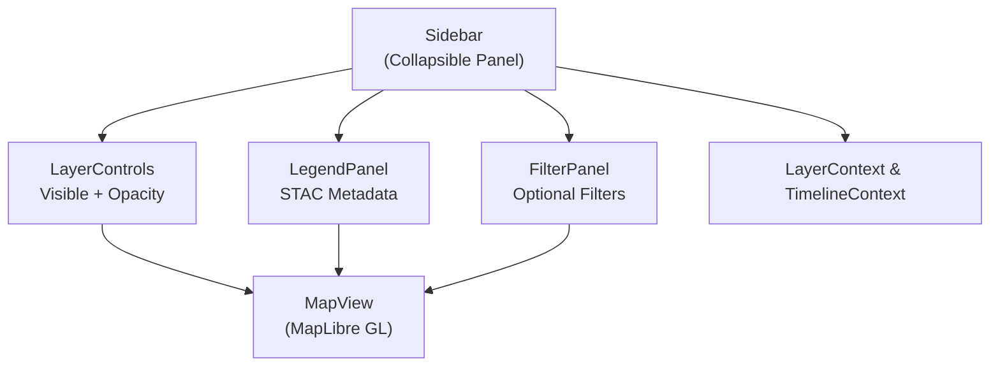
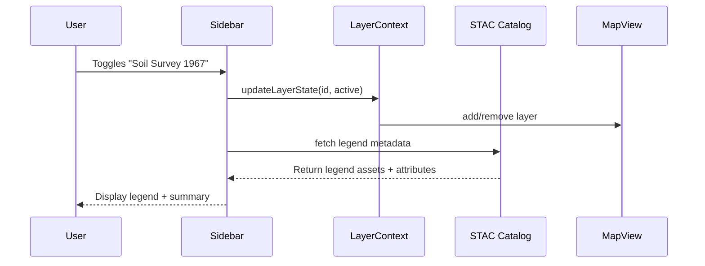

<div align="center">

# 📚 Kansas Frontier Matrix — **Sidebar Component**  
`web/src/components/Sidebar/`

**Layer Management · Legends · Filters · Temporal Context**

[](../../../../../.github/workflows/ci.yml)
[](../../../../../.github/workflows/stac-validate.yml)
[](../../../../../docs/)
[](../../../../../docs/design/reviews/accessibility/)
[](../../../../../LICENSE)

</div>

---

```yaml
---
title: "KFM • Sidebar Component (web/src/components/Sidebar/)"
version: "v1.4.0"
last_updated: "2025-10-14"
owners: ["@kfm-web", "@kfm-ui"]
tags: ["react","sidebar","filters","layers","stac","accessibility","mcp"]
license: "MIT"
semantic_alignment:
  - STAC 1.0
  - CIDOC CRM
  - WCAG 2.1 AA
---
````

---

## 🧭 Overview

The **Sidebar Component** acts as the **command and information hub** of the Kansas Frontier Matrix interface.
It centralizes control of **Layer Management**, **Legends**, and **Filter Panels**, allowing users to customize geospatial and historical data visible on the interactive map.

The Sidebar integrates with multiple application contexts:

* 🗂 **LayerContext** — controls active overlays and opacity
* 🕰 **TimelineContext** — filters layers by visible time range
* 🧭 **STAC metadata** — drives legend and dataset descriptions dynamically

It supports **collapsible panels**, **keyboard navigation**, and **theme awareness**, all conforming to **MCP-DL v6.2** reproducibility and accessibility guidelines.

---

## 🧱 Directory Structure

```text
web/src/components/Sidebar/
├── Sidebar.tsx           # Main sidebar container + layout orchestration
├── SidebarPanel.tsx      # Collapsible, reusable panel component
├── FilterPanel.tsx       # Optional thematic filters (e.g., climate, treaty)
├── LegendPanel.tsx       # Dynamic map legends generated from STAC metadata
├── styles.scss           # Responsive styles + theme variables
└── __tests__/            # Jest + RTL unit & integration tests
```

---

## ⚙️ Component Architecture



The Sidebar listens for **context updates** and propagates UI changes back to **MapView** and **TimelineView** for synchronized visualization.

---

## 🧩 Key Features

| Feature                | Description                                          | Data Source             |
| :--------------------- | :--------------------------------------------------- | :---------------------- |
| **Layer Management**   | Toggle overlays, adjust opacity, fetch STAC metadata | `LayerContext` / STAC   |
| **Legends**            | Auto-renders legends from STAC `catalog.json`        | `data/stac/`            |
| **Timeline Filtering** | Filters visible datasets by timeline range           | `TimelineContext`       |
| **Category Filters**   | Group data by theme (climate, treaty, hydrology)     | Local state / STAC tags |
| **Responsive Design**  | Collapses to drawer on mobile, sidebar on desktop    | Tailwind + CSS Grid     |
| **Accessibility**      | Full keyboard navigation + WCAG compliance           | `AccessibilityContext`  |

---

## 💬 Example Implementation

```tsx
import React from "react";
import { LayerControls } from "../LayerControls";
import { LegendPanel } from "./LegendPanel";
import { FilterPanel } from "./FilterPanel";
import "./styles.scss";

export const Sidebar: React.FC = () => {
  return (
    <aside
      className="sidebar"
      role="complementary"
      aria-label="Map Layers and Filters"
    >
      <header className="sidebar-header">
        <h2>Map Controls</h2>
      </header>

      <section className="sidebar-section">
        <LayerControls />
      </section>

      <section className="sidebar-section">
        <LegendPanel />
      </section>

      <section className="sidebar-section">
        <FilterPanel />
      </section>
    </aside>
  );
};
```

> The Sidebar binds directly to React Context values to propagate changes across **MapView**, **TimelineView**, and **DetailPanel** components.

---

## 🧠 TypeScript Interfaces

```ts
export interface SidebarPanelProps {
  title: string;
  isOpen?: boolean;
  children: React.ReactNode;
  onToggle?: () => void;
}

export interface FilterOption {
  id: string;
  label: string;
  category:
    | "climate"
    | "geology"
    | "treaty"
    | "infrastructure"
    | "archaeology";
  active: boolean;
}
```

---

## 🧮 Data Flow



---

## 🎨 Styling & Layout

| Property            | Description                                                                  |
| :------------------ | :--------------------------------------------------------------------------- |
| **Base Width**      | 320 px (desktop) / 100 vw (mobile drawer)                                    |
| **Panel Behavior**  | Accordion-style expand/collapse (Framer Motion)                              |
| **Transitions**     | Smooth open/close with easing curves                                         |
| **Color System**    | Inherits tokens from `ThemeContext` (`--kfm-color-bg`, `--kfm-color-accent`) |
| **Scroll Behavior** | Auto-scrolls to active section, fixed legend header                          |

Example SCSS snippet:

```scss
.sidebar {
  background: var(--kfm-color-bg);
  color: var(--kfm-color-text);
  width: clamp(280px, 25vw, 360px);
  transition: all 0.25s ease;
}
```

---

## ♿ Accessibility (WCAG 2.1 AA)

* `role="complementary"` assigned to `<aside>`
* Each collapsible panel uses `aria-expanded` and keyboard focus management
* Keyboard shortcuts:

  * `L` → toggle Sidebar
  * `F` → focus Filter panel
* Icons use `role="img"` + `aria-label` for assistive clarity
* Large click areas + high contrast tokens validated by **axe-core**

Accessibility audits run automatically in CI/CD.

---

## 🧪 Testing

| Test Case               | Description                              | Tool                     |
| :---------------------- | :--------------------------------------- | :----------------------- |
| **Layer Toggle Sync**   | Toggling layer updates map visibility    | Jest + RTL               |
| **Legend Rendering**    | Verifies STAC metadata loads and renders | Mock STAC + Jest         |
| **Accordion Behavior**  | Tests animation and focus state          | Framer Motion test suite |
| **Accessibility Audit** | ARIA and contrast validation             | axe-core                 |
| **Responsive Layout**   | Validates mobile drawer vs desktop panel | Cypress E2E              |

> **Coverage Goal:** ≥ 90 % (lines, branches, and statements)

---

## 🧾 Provenance & Integrity

| Artifact         | Description                                                  |
| :--------------- | :----------------------------------------------------------- |
| **Inputs**       | STAC Catalog, `LayerContext`, `TimelineContext`              |
| **Outputs**      | Active layers, dynamic legends, filtered overlays            |
| **Dependencies** | React 18+, MapLibre GL, Framer Motion, TailwindCSS           |
| **Integrity**    | CI validates STAC schema + accessibility + visual regression |

---

## 🧠 MCP Compliance Checklist

| MCP Principle       | Implementation                              |
| :------------------ | :------------------------------------------ |
| Documentation-first | README + per-component TSDoc                |
| Reproducibility     | Deterministic layer updates + CI validation |
| Provenance          | Linked STAC metadata for every legend asset |
| Accessibility       | WCAG 2.1 AA validated via axe-core          |
| Open Standards      | STAC 1.0 · GeoJSON · CSS Custom Properties  |

---

## 🔗 Related Documentation

* **LayerControls Component** — `web/src/components/LayerControls/README.md`
* **MapView Component** — `web/src/components/MapView/README.md`
* **TimelineView Component** — `web/src/components/TimelineView/README.md`
* **Context: Layer & Timeline** — `web/src/context/README.md`
* **Web UI Architecture** — `web/ARCHITECTURE.md`

---

## 📜 License

Released under the **MIT License**.
© 2025 **Kansas Frontier Matrix** — engineered under **MCP-DL v6.2** for modularity, traceability, and accessibility.

> *“The Sidebar is the explorer’s toolkit — the command center for navigating Kansas across time and terrain.”*

```
```
