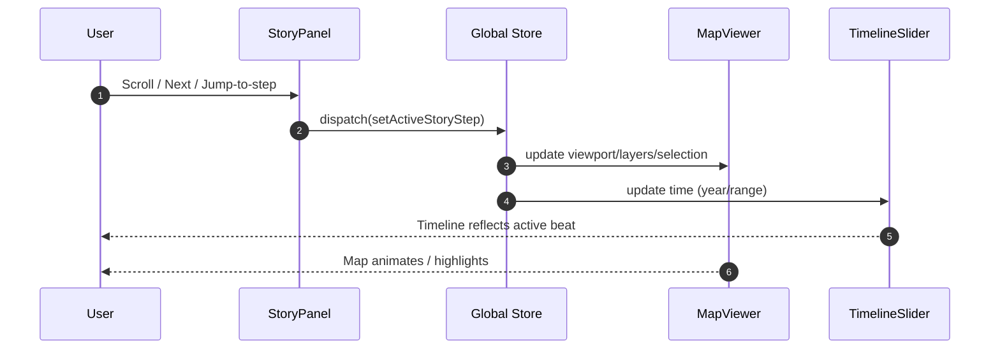

> According to a document from **February 3, 2026**, KFM’s web frontend is a **React/TypeScript** app whose reusable components include **MapViewer**, **TimelineSlider**, and **StoryPanel** (story content + scroll linking). [oai_citation:0‡Kansas Frontier Matrix (KFM) – Comprehensive Technical Blueprint.pdf](sediment://file_000000006dbc71f89a5094ce310a452d)

# 🧩📜 StoryPanel


**StoryPanel** is KFM’s *story/narrative player* UI surface: it **renders story content** (long-form + stepwise beats) and **coordinates the “scroll → map/timeline” sync** (aka scrollytelling). [oai_citation:1‡Kansas Frontier Matrix (KFM) – Comprehensive Technical Blueprint.pdf](sediment://file_000000006dbc71f89a5094ce310a452d) [oai_citation:2‡Kansas Frontier Matrix (KFM) – Comprehensive Technical Blueprint.pdf](sediment://file_000000006dbc71f89a5094ce310a452d)

---

## ✨ Why this exists

KFM is intentionally built with a clean separation of concerns: the React UI is interactive (map + timeline + story), but **it does not query databases directly**—it talks to the backend API layer which enforces governance, provenance, and policy checks. [oai_citation:3‡Kansas Frontier Matrix Comprehensive System Documentation.pdf](sediment://file_00000000ef40722faf17987b69730695)

StoryPanel exists to deliver the “interactive narrative” layer:
- It turns *structured Story Nodes* into a readable “story” panel.
- It enables **scroll-linked storytelling & timelines** (scrollytelling) where **the map and timeline animate in sync** with the story’s position on screen. [oai_citation:4‡Kansas Frontier Matrix (KFM) – Comprehensive Technical Blueprint.pdf](sediment://file_000000006dbc71f89a5094ce310a452d)
- It supports **evidence-first reading**: citations are first-class UI elements (clickable footnotes / references). [oai_citation:5‡Kansas Frontier Matrix Comprehensive System Documentation.pdf](sediment://file_00000000ef40722faf17987b69730695)

---

## 🗺️ Where it lives

📁 `web/src/components/StoryPanel/`

> In the KFM frontend, `StoryPanel` is listed alongside other core components like `MapViewer`, `TimelineSlider`, `SearchBar`, and `LayerControl`. [oai_citation:6‡Kansas Frontier Matrix (KFM) – Comprehensive Technical Blueprint.pdf](sediment://file_000000006dbc71f89a5094ce310a452d)

---

## 🎯 Responsibilities

### ✅ StoryPanel *does*
- Render story content (title, sections/steps, media, citations, metadata).
- Provide a **scroll-linked step activation** signal (“which beat is active?”).
- Emit events so global state can keep the app in sync (**map viewport**, **timeline position**, **active layers**, **current story**). [oai_citation:7‡Kansas Frontier Matrix (KFM) – Comprehensive Technical Blueprint.pdf](sediment://file_000000006dbc71f89a5094ce310a452d)
- Render **citation markers** and expose callbacks so other UI can open source drawers, highlight map features, etc. [oai_citation:8‡Kansas Frontier Matrix Comprehensive System Documentation.pdf](sediment://file_00000000ef40722faf17987b69730695)

### ❌ StoryPanel does *not*
- Fetch data directly from DBs (PostGIS/Neo4j/Search Index). It should receive data via props or via a client/service that calls the backend API (same rule as the rest of the frontend). [oai_citation:9‡Kansas Frontier Matrix Comprehensive System Documentation.pdf](sediment://file_00000000ef40722faf17987b69730695)
- Contain map rendering logic (that’s `MapViewer`) or timeline widgets (`TimelineSlider`). [oai_citation:10‡Kansas Frontier Matrix (KFM) – Comprehensive Technical Blueprint.pdf](sediment://file_000000006dbc71f89a5094ce310a452d)

---

## 🧠 Architecture fit (UI sync contract)

KFM uses global state (Redux Toolkit or React Context) to synchronize components like the map, timeline, and story panel. [oai_citation:11‡Kansas Frontier Matrix (KFM) – Comprehensive Technical Blueprint.pdf](sediment://file_000000006dbc71f89a5094ce310a452d)

Example (from the blueprint): when the user selects a new year on the timeline, the store updates and **both the map and the story panel respond**—this same pattern applies in reverse when the story panel activates a step and updates the current time/range. [oai_citation:12‡Kansas Frontier Matrix (KFM) – Comprehensive Technical Blueprint.pdf](sediment://file_000000006dbc71f89a5094ce310a452d)



---

## 🧱 Component modularity expectations

StoryPanel should behave like a clean module:
- accepts inputs (**props**) and outputs UI + events
- hides internal details (parsing/rendering, scroll observers, etc.) [oai_citation:13‡Node.js-React-CSS-HTML.pdf](sediment://file_00000000b09c71f8b277cb19b9f597b2)

---

## 🧾 Data model (recommended)

> The KFM docs talk about **Story Nodes** and a story/narrative player. They also describe governance + citations as enforced principles. This section defines the *frontend-friendly shape* StoryPanel expects. Use it as the “UI contract” and keep it aligned with API schemas over time. [oai_citation:14‡Kansas Frontier Matrix Comprehensive System Documentation.pdf](sediment://file_00000000ef40722faf17987b69730695) [oai_citation:15‡Kansas Frontier Matrix (KFM) – Comprehensive Technical Blueprint.pdf](sediment://file_000000006dbc71f89a5094ce310a452d)

### 📌 Story
```ts
export type Story = {
  id: string;                // stable ID for routing/bookmarks
  title: string;
  subtitle?: string;

  // Full story content:
  // - either pre-split steps (preferred for scrollytelling)
  // - or a long-form body that StoryPanel can segment
  steps: StoryStep[];

  // Provenance & governance
  provenance?: ProvenanceSummary;
  governance?: GovernanceTags;

  // Optional metadata that helps UI linking
  defaultTimeRange?: TimeRange;      // initial timeline range
  defaultViewport?: MapViewport;     // initial map view
  tags?: string[];
};
```

### 🪜 StoryStep (the “beat”)
```ts
export type StoryStep = {
  id: string;
  heading?: string;

  // Renderable content (markdown is typical)
  bodyMarkdown: string;

  // Optional “sync cues”
  timeRange?: TimeRange;
  viewport?: MapViewport;
  layers?: LayerCue[];

  // Evidence
  citations?: CitationRef[];     // references used in this step
  media?: MediaItem[];

  // Governance
  governance?: GovernanceTags;
};
```

### 🔗 CitationRef
Citations are a foundational design requirement (evidence-first). [oai_citation:16‡Kansas Frontier Matrix Comprehensive System Documentation.pdf](sediment://file_00000000ef40722faf17987b69730695)

```ts
export type CitationRef = {
  id: string;                  // stable identifier for linking
  label?: string;              // display label (optional)
  kind: "document" | "dataset" | "graphNode" | "mapLayer";

  // UI-friendly reference
  title: string;
  sourceUrl?: string;          // may be internal route or external URL
  excerpt?: string;            // short excerpt for tooltip/drawer

  // Optional provenance metadata
  retrievedAt?: string;
  license?: string;
};
```

### 🛡️ GovernanceTags
KFM emphasizes governance controls (policy checks, provenance, and special handling for sensitive content). [oai_citation:17‡Kansas Frontier Matrix Comprehensive System Documentation.pdf](sediment://file_00000000ef40722faf17987b69730695)

```ts
export type GovernanceTags = {
  sensitivity?: "public" | "restricted" | "sensitive";
  indigenousData?: boolean;          // triggers CARE-aware UI affordances
  notes?: string[];                 // UI tooltips / warnings / editorial notes
};
```

---

## 🧭 Props contract (recommended)

> Treat this as the “minimum viable interface” so StoryPanel can stay modular and reusable. [oai_citation:18‡Node.js-React-CSS-HTML.pdf](sediment://file_00000000b09c71f8b277cb19b9f597b2)

| Prop | Type | Required | Meaning |
|---|---:|:---:|---|
| `story` | `Story` | ✅ | The full story + steps to render |
| `activeStepId` | `string \| null` | ✅ | Which step is currently active |
| `onActiveStepChange` | `(stepId: string) => void` | ✅ | Scroll/Next/Jump triggers this |
| `onCitationClick` | `(citationId: string) => void` | ❓ | Open source drawer / jump to evidence |
| `onApplyCues` | `(cues: {timeRange?: TimeRange; viewport?: MapViewport; layers?: LayerCue[]}) => void` | ❓ | Optional “direct cue” callback |
| `renderHeader` | `(story: Story) => ReactNode` | ❓ | Custom header slot |
| `renderFooter` | `(story: Story) => ReactNode` | ❓ | Custom footer slot |

---

## 🧷 Scroll-linked storytelling

The blueprint explicitly calls out the next UI innovation: **a scrollytelling interface where scrolling syncs the map and timeline**. [oai_citation:19‡Kansas Frontier Matrix (KFM) – Comprehensive Technical Blueprint.pdf](sediment://file_000000006dbc71f89a5094ce310a452d)

### Recommended implementation pattern
- Use `IntersectionObserver` to determine which `StoryStep` is “active”.
- Debounce updates to avoid state thrash.
- Respect `prefers-reduced-motion` and avoid forced scroll animations when reduced motion is enabled.

**Heuristic suggestion:**
- A step becomes active when its top crosses 30–40% of the panel viewport.
- When active changes, call `onActiveStepChange(stepId)` and (optionally) `onApplyCues(stepCue)`.

```ts
// pseudo-logic
if (stepBecomesActive) {
  onActiveStepChange(step.id);
  onApplyCues?.({
    timeRange: step.timeRange ?? story.defaultTimeRange,
    viewport: step.viewport ?? story.defaultViewport,
    layers: step.layers,
  });
}
```

---

## ⛓️ Citations & provenance (non-negotiable UX)

KFM’s AI and narrative philosophy is “**evidence-first**”—answers and narratives must be backed by sources, with citation markers rendered as clickable footnotes. [oai_citation:20‡Kansas Frontier Matrix Comprehensive System Documentation.pdf](sediment://file_00000000ef40722faf17987b69730695)

### Rendering expectations
- Inline citation markers like `[1] [2]` should render as:
  - clickable chips or superscripts
  - keyboard reachable
  - with tooltips and/or an “Evidence drawer”
- Each step may also show an “Evidence” section with the citations used in that step.

### Failure modes
If citations are missing for content that claims factual assertions:
- Show a **non-blocking warning banner** (editorial QA)
- Or render a subtle “⚠️ Evidence missing” indicator (depending on audience: public vs contributor mode)

---

## 🪶 Governance & respectful handling (CARE-aware UI)

KFM integrates Indigenous history and records and notes special governance expectations (CARE principles) for culturally sensitive information. [oai_citation:21‡Kansas Frontier Matrix Comprehensive System Documentation.pdf](sediment://file_00000000ef40722faf17987b69730695)

Indigenous Data Sovereignty / governance frameworks stress that:
- CARE principles (Collective benefit, Authority to control, Responsibility, Ethics) help set minimum expectations for sharing data about Indigenous peoples. [oai_citation:22‡Indigenous Statistics.pdf](sediment://file_0000000033ec72308e1f791a79f61bfe)
- OCAP® principles emphasize Indigenous community control over their data (ownership/control/access/possession). [oai_citation:23‡Indigenous Statistics.pdf](sediment://file_0000000033ec72308e1f791a79f61bfe)

### What StoryPanel should do when `governance.indigenousData === true`
- Display a small governance badge (e.g., “CARE-aware”) and link to governance info.
- Prefer **context-rich framing**: avoid deficit-only narratives that risk stereotyping.
  - Indigenous statistics research warns that deficit-based statistical framing can contribute to stigmatization/stereotyping without historical/social context. [oai_citation:24‡Indigenous Statistics.pdf](sediment://file_0000000033ec72308e1f791a79f61bfe)
- Ensure citations and provenance are visible without requiring extra clicks.

> [!NOTE]
> Governance is not only backend policy—UI design is part of how we operationalize respectful, context-forward storytelling. (StoryPanel is one of the most visible narrative surfaces.)

---

## ♿ Accessibility: semantic + navigable

Semantics provide structure and meaning; HTML5 structural elements improve value and clarity of content structure. [oai_citation:25‡learn-to-code-html-and-css-develop-and-style-websites.pdf](sediment://file_00000000ed6471fdb0ecead71e051444)

### Checklist
- ✅ Use landmark structure (`<aside>` / `<section>` / `<nav>` as appropriate)
- ✅ Ensure heading order (`h1 → h2 → h3`) is logical
- ✅ Step navigation is keyboard friendly:
  - `Tab` reaches citation chips
  - `Enter/Space` activates citations
- ✅ Provide skip link “Skip story content” (especially if panel is long)
- ✅ Focus management when “Jump to step” is used

> [!TIP]
> Keep HTML/CSS modular and maintainable; consistency matters when multiple contributors touch UI code. [oai_citation:26‡learn-to-code-html-and-css-develop-and-style-websites.pdf](sediment://file_00000000ed6471fdb0ecead71e051444)

---

## 🎨 Styling & layout (recommended)

### Layout roles
- 📌 **Panel container**: width constraints, scrolling, sticky header (optional)
- 🪜 **Step list**: vertical stack; steps are `article`-like blocks
- 🔎 **Evidence**: expandable area per step (or global footer)

### Responsive behaviors
- Desktop: story panel alongside map
- Mobile: panel overlays map (drawer) or becomes primary view

---

## 🧪 Testing strategy

The KFM blueprint emphasizes tests as crucial for reliability (CI should run tests on PRs). [oai_citation:27‡Kansas Frontier Matrix (KFM) – Comprehensive Technical Blueprint.pdf](sediment://file_000000006dbc71f89a5094ce310a452d)

### Suggested test layers
- **Unit**
  - citation parsing / rendering
  - step activation logic (mock IntersectionObserver)
- **Integration**
  - StoryPanel → store dispatch → MapViewer/TimelineSlider reactions (mock store)
- **A11y**
  - run automated checks (axe) on story render + evidence drawer

---

## ⚡ Performance notes

StoryPanel may render long-form content. Keep it responsive:
- Avoid re-rendering the entire story on small state changes
- Prefer memoized step components
- Consider virtualization for extremely large stories (if needed)

---

## 🧰 Recommended folder layout

> This is a suggested shape. Align with how other components in `web/src/components/` are organized. [oai_citation:28‡Kansas Frontier Matrix (KFM) – Comprehensive Technical Blueprint.pdf](sediment://file_000000006dbc71f89a5094ce310a452d)

```text
📁 StoryPanel/
├─ 🧩 StoryPanel.tsx
├─ 🧾 types.ts
├─ 🎛️ hooks.ts              # scroll linking helpers, cue helpers
├─ 🎨 StoryPanel.module.css  # or StoryPanel.scss
├─ 🧪 StoryPanel.test.tsx
├─ 📚 StoryPanel.stories.tsx # (optional) Storybook
└─ 📘 README.md              # you are here
```

---

## 🧑‍💻 Usage example (illustrative)

```tsx
import { StoryPanel } from "./StoryPanel";

export function AppShell() {
  const story = useCurrentStory();             // from API/store
  const activeStepId = useActiveStoryStepId(); // from store

  return (
    <aside aria-label="Story">
      <StoryPanel
        story={story}
        activeStepId={activeStepId}
        onActiveStepChange={(stepId) => dispatch(setActiveStoryStep(stepId))}
        onCitationClick={(citationId) => dispatch(openEvidenceDrawer(citationId))}
        onApplyCues={(cues) => dispatch(applyStoryCues(cues))}
      />
    </aside>
  );
}
```

---

## ✅ Contributing checklist

- [ ] Does each step that makes factual claims include citations? [oai_citation:29‡Kansas Frontier Matrix Comprehensive System Documentation.pdf](sediment://file_00000000ef40722faf17987b69730695)
- [ ] Does scroll linking feel stable (no flicker / ping-pong)?
- [ ] Are map/timeline cues emitted in a predictable way? [oai_citation:30‡Kansas Frontier Matrix (KFM) – Comprehensive Technical Blueprint.pdf](sediment://file_000000006dbc71f89a5094ce310a452d)
- [ ] If Indigenous data is involved, is context provided and governance surfaced? [oai_citation:31‡Kansas Frontier Matrix Comprehensive System Documentation.pdf](sediment://file_00000000ef40722faf17987b69730695) [oai_citation:32‡Indigenous Statistics.pdf](sediment://file_0000000033ec72308e1f791a79f61bfe)
- [ ] Are semantics and keyboard navigation correct? [oai_citation:33‡learn-to-code-html-and-css-develop-and-style-websites.pdf](sediment://file_00000000ed6471fdb0ecead71e051444)

---

## 📚 Project file references (local)

These are the “project files” this README is aligned with:

- KFM architecture + UI components overview:  [oai_citation:34‡Kansas Frontier Matrix Comprehensive System Documentation.pdf](sediment://file_00000000ef40722faf17987b69730695)  
- Web/frontend modular React patterns (supporting conceptual grounding):  [oai_citation:35‡Node.js-React-CSS-HTML.pdf](sediment://file_00000000b09c71f8b277cb19b9f597b2)  
- Semantic HTML guidance used for accessibility expectations:  [oai_citation:36‡learn-to-code-html-and-css-develop-and-style-websites.pdf](sediment://file_00000000ed6471fdb0ecead71e051444)  
- Indigenous data governance framing (CARE/OCAP, anti-stereotype framing):  [oai_citation:37‡Indigenous Statistics.pdf](sediment://file_0000000033ec72308e1f791a79f61bfe)  
