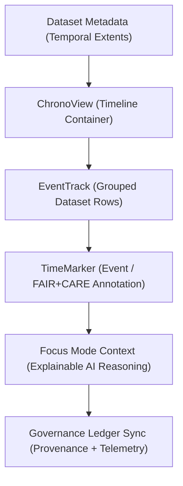

<div align="center">

# 🕰️ **Kansas Frontier Matrix — Timeline Components**
`web/src/components/Timeline/README.md`

**Purpose:** Define the FAIR+CARE-certified chronological visualization framework that supports storytelling, historical analysis, and explainable temporal AI in the Kansas Frontier Matrix (KFM) web app.  
These components combine **ISO 19115 temporal metadata**, **FAIR+CARE governance**, and **AI Focus Mode reasoning** under **MCP v6.3**.

[](../../../../docs/README.md)
[](../../../../LICENSE)
[](../../../../docs/standards/faircare.md)
[]()

</div>

---

## 📘 Overview

The **Timeline Components** provide dynamic, accessible, and ethically governed time-based visualization of KFM datasets.  
They merge FAIR+CARE compliance, explainable AI, and sustainability telemetry to create interpretable and inclusive chronological narratives.

---

## 🗂️ Directory Layout

```
web/src/components/Timeline/
├── README.md
├── ChronoView.tsx       # Main timeline visualization container
├── EventTrack.tsx       # Horizontal dataset grouping and temporal sequencing
├── TimeMarker.tsx       # Individual event marker with FAIR+CARE metadata
└── metadata.json        # Governance + accessibility metadata for timeline visualization
```

---

## 🧩 Visualization Workflow



1. **ChronoView:** aggregates temporal datasets and time intervals.  
2. **EventTrack:** organizes category-specific events (treaties, hazards, hydrology).  
3. **TimeMarker:** renders points or ranges with provenance and FAIR+CARE tags.  
4. **AI Context:** Focus Mode connects patterns to semantic explanations.  
5. **Governance:** provenance and a11y metrics logged for audit reproducibility.

---

## ⚙️ Component Contracts

| Contract | Purpose | Validator |
|----------|----------|-----------|
| Temporal Metadata | Validates dataset extents and ISO 19115 compliance. | `stac-validate.yml` |
| A11y Contract | Ensures ARIA, contrast, and keyboard navigation. | `accessibility_scan.yml` |
| Governance Contract | Links events to FAIR+CARE provenance. | `faircare-validate.yml` |
| Telemetry Contract | Logs performance and sustainability metrics. | `telemetry-export.yml` |

Artifacts stored in:
- `../../../../docs/reports/audit/data_provenance_ledger.json`
- `../../../../releases/v9.7.0/focus-telemetry.json`

---

## 🧠 FAIR+CARE Governance Matrix

| Principle | Implementation | Oversight |
|------------|----------------|------------|
| **Findable** | Temporal data indexed with FAIR+CARE metadata in ledgers. | @kfm-data |
| **Accessible** | Keyboard and screen reader-friendly timeline navigation. | @kfm-accessibility |
| **Interoperable** | Conforms to DCAT 3.0, STAC, and ISO 19115 temporal models. | @kfm-architecture |
| **Reusable** | Components reused across AI explainability and dashboards. | @kfm-design |
| **Collective Benefit** | Encourages equitable and educational storytelling. | @faircare-council |
| **Authority to Control** | Council reviews event accuracy and ethics representation. | @kfm-governance |
| **Responsibility** | Developers log AI explanations and audit history. | @kfm-sustainability |
| **Ethics** | Events reviewed for neutrality, inclusivity, and respect. | @kfm-ethics |

---

## 🧾 Example Metadata Record

```json
{
  "id": "timeline_v9.7.0",
  "events_displayed": 512,
  "datasets_linked": [
    "treaties_normalized_v9.7.0.csv",
    "climate_trends_v9.7.0.geojson"
  ],
  "temporal_extent": ["1800-01-01", "2025-12-31"],
  "ai_explainability_enabled": true,
  "accessibility_score": 99.4,
  "energy_use_wh": 1.03,
  "fairstatus": "certified",
  "telemetry_synced": true,
  "timestamp": "2025-11-05T19:10:00Z"
}
```

---

## ⚙️ Component Summaries

| Component | Description | Role |
|-----------|-------------|------|
| `ChronoView.tsx` | Primary visualization container rendering timeline and intervals. | Timeline View |
| `EventTrack.tsx` | Groups datasets into thematic or domain-based tracks. | Organization |
| `TimeMarker.tsx` | Displays individual events with FAIR+CARE annotations. | Event Marker |

---

## ♿ Accessibility Standards

- Keyboard shortcuts for navigation (←, →, Tab).  
- Screen-reader friendly event labeling with ARIA roles.  
- WCAG 2.1 AA color and motion preferences respected.  
- Accessible legends and timestamp tooltips.  
- Validated in CI with **axe-core** and **Lighthouse**.

---

## 🌱 Sustainability Metrics

| Metric | Target | Verified By |
|-------|--------|-------------|
| Render Energy | ≤ 1.0 Wh | Telemetry |
| Carbon Output | ≤ 1.1 gCO₂e | CI telemetry |
| Lighthouse Perf | ≥ 90 | CI pipeline |
| Renewable Hosting | 100% RE100 | @kfm-infrastructure |

---

## 🕰️ Version History

| Version | Date | Author | Summary |
|----------|------|---------|----------|
| v9.7.0 | 2025-11-05 | KFM Core Team | Upgraded + aligned: contracts, telemetry schema v1, keyboard navigation, and provenance tagging. |
| v9.6.0 | 2025-11-03 | KFM Core Team | Added AI temporal reasoning and sustainability logging. |
| v9.5.0 | 2025-11-02 | KFM Core Team | Enhanced dataset grouping + provenance linking. |
| v9.3.2 | 2025-10-28 | KFM Core Team | Established FAIR+CARE timeline visualization. |

---

<div align="center">

**© 2025 Kansas Frontier Matrix — MIT / CC-BY 4.0**  
Maintained under **Master Coder Protocol v6.3** · FAIR+CARE Certified · Diamond⁹ Ω / Crown∞Ω Ultimate Certified  
[Back to Components Index](../README.md) · [Docs Index](../../../../docs/README.md)

</div>