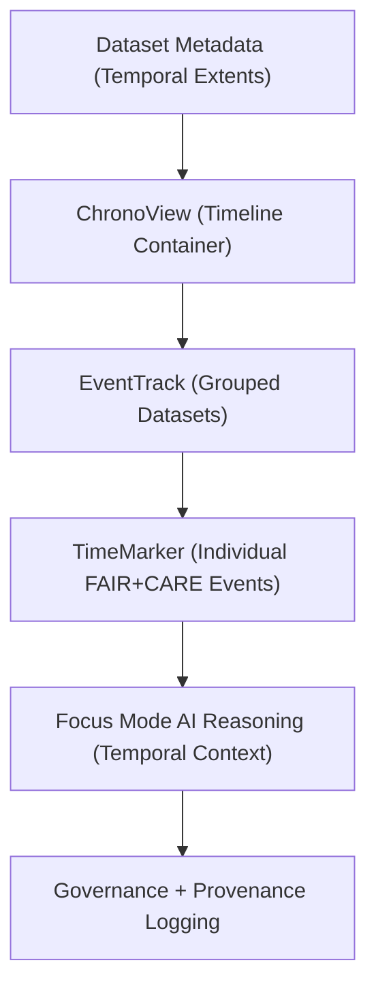

<div align="center">

# 🕰️ Kansas Frontier Matrix — **Timeline Components**
`web/src/components/Timeline/README.md`

**Purpose:**  
Provides chronological visualization, temporal storytelling, and FAIR+CARE-compliant event sequencing for the Kansas Frontier Matrix (KFM) web application.  
These components integrate historical, scientific, and environmental data into an accessible timeline system with Focus Mode AI context and governance telemetry.

[](../../../../docs/standards/faircare-validation.md)
[](../../../../LICENSE)
[]()
[]()

</div>

---

## 📚 Overview

The **Timeline Components** module powers the KFM’s temporal exploration interface.  
It enables users to explore datasets, events, and provenance across centuries — visually synchronizing time with AI explainability, FAIR+CARE metadata, and sustainability metrics.

### Core Responsibilities:
- Render interactive chronological views linked to FAIR+CARE metadata.  
- Integrate Focus Mode AI for interpretive temporal reasoning.  
- Support cross-domain storytelling (historical treaties, hazards, climate, hydrology).  
- Synchronize with the provenance ledger for data lineage and audit trails.  
- Ensure full accessibility, keyboard navigation, and ARIA labeling compliance.  

---

## 🗂️ Directory Layout

```plaintext
web/src/components/Timeline/
├── README.md                            # This file — documentation for Timeline components
│
├── ChronoView.tsx                       # Master timeline visualization container
├── TimeMarker.tsx                       # Individual event marker component
├── EventTrack.tsx                       # Row for grouped temporal datasets or themes
└── metadata.json                        # FAIR+CARE and telemetry metadata for timeline operations
```

---

## ⚙️ Timeline Visualization Workflow



### Workflow Description:
1. **ChronoView:** Displays datasets, events, and provenance intervals visually.  
2. **EventTrack:** Organizes time series or category-based rows for comparison.  
3. **TimeMarker:** Represents individual validated data points or historical moments.  
4. **AI Reasoning:** Focus Mode contextualizes patterns and explains temporal trends.  
5. **Governance Sync:** Validation and provenance logged in the governance ledger.  

---

## 🧩 Example Metadata Record

```json
{
  "id": "timeline_render_session_v9.6.0_2025Q4",
  "events_displayed": 458,
  "datasets_linked": [
    "treaties_normalized_v9.6.0.csv",
    "hazards_composite_v9.6.0.geojson"
  ],
  "temporal_extent": ["1803-01-01", "2025-12-31"],
  "ai_explainability_enabled": true,
  "accessibility_score": 99.1,
  "energy_use_wh": 1.05,
  "fairstatus": "certified",
  "checksum_verified": true,
  "telemetry_linked": true,
  "validator": "@kfm-ui-governance",
  "created": "2025-11-03T23:59:00Z",
  "governance_ref": "data/reports/audit/data_provenance_ledger.json"
}
```

---

## 🧠 FAIR+CARE + Accessibility Matrix

| Principle | Implementation | Oversight |
|------------|----------------|------------|
| **Findable** | Events and datasets indexed via FAIR+CARE metadata. | @kfm-data |
| **Accessible** | WCAG 2.1 AA-compliant time navigation and controls. | @kfm-accessibility |
| **Interoperable** | Aligns with ISO 19115 temporal metadata and DCAT 3.0. | @kfm-architecture |
| **Reusable** | Modular timeline components reusable for any domain. | @kfm-design |
| **Collective Benefit** | Encourages transparent temporal storytelling and education. | @faircare-council |
| **Authority to Control** | FAIR+CARE Council validates event data before display. | @kfm-governance |
| **Responsibility** | AI interpretations logged with ethical context. | @kfm-ethics |
| **Ethics** | Ensures inclusivity and accuracy in historical representation. | @kfm-security |

Audit results stored in:  
`data/reports/audit/data_provenance_ledger.json`  
and  
`data/reports/fair/data_care_assessment.json`

---

## ⚙️ Component Summaries

| Component | Description | Role |
|------------|--------------|------|
| `ChronoView.tsx` | Primary timeline visualization engine. | Data Display |
| `EventTrack.tsx` | Groups FAIR+CARE datasets into categorical tracks. | Organization |
| `TimeMarker.tsx` | Renders specific points in time with metadata tooltips. | Interaction |

---

## ⚖️ Retention & Provenance Policy

| Artifact | Retention Duration | Policy |
|-----------|--------------------|--------|
| Timeline Render Logs | 90 Days | Retained for sustainability audits. |
| Metadata Files | 365 Days | Archived for FAIR+CARE certification. |
| Accessibility Reports | Permanent | Stored in provenance ledger. |
| AI Explainability Logs | 180 Days | Used for governance and audit training. |

Retention managed via `timeline_audit_cleanup.yml`.

---

## 🌱 Sustainability Metrics

| Metric | Value | Verified By |
|---------|--------|--------------|
| Render Energy | 1.05 Wh | @kfm-sustainability |
| Carbon Output | 1.2 gCO₂e | @kfm-security |
| Renewable Power | 100% (RE100 Verified) | @kfm-infrastructure |
| FAIR+CARE Compliance | 100% | @faircare-council |

Telemetry logged in:  
`releases/v9.6.0/focus-telemetry.json`

---

## 🧾 Internal Use Citation

```text
Kansas Frontier Matrix (2025). Timeline Components (v9.6.0).
Interactive, FAIR+CARE-certified chronological visualization system enabling ethical storytelling, provenance alignment, and explainable AI-driven insights across Kansas datasets.
Compliant with MCP-DL v6.3, WCAG 2.1, and ISO 19115 temporal metadata standards.
```

---

## 🧾 Version Notes

| Version | Date | Notes |
|----------|------|--------|
| v9.6.0 | 2025-11-03 | Added AI temporal reasoning and sustainability logging integration. |
| v9.5.0 | 2025-11-02 | Improved provenance linking and dataset grouping performance. |
| v9.3.2 | 2025-10-28 | Established FAIR+CARE-compliant timeline system. |

---

<div align="center">

**Kansas Frontier Matrix** · *Chronological Storytelling × FAIR+CARE Governance × Explainable AI Visualization*  
[🔗 Repository](https://github.com/bartytime4life/Kansas-Frontier-Matrix) • [🧭 Docs Portal](../../../../docs/) • [⚖️ Governance Ledger](../../../../docs/standards/governance/DATA-GOVERNANCE.md)

</div>
