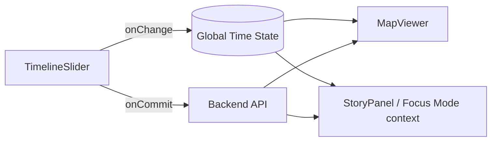

# TimelineSlider ⏳🗺️  
*A provenance-friendly time navigator for KFM’s map + story experience*


---

## 📌 What this component is

`TimelineSlider` is the **horizontal time slider control** used by the Kansas Frontier Matrix (KFM) web UI to navigate across time-dependent map layers and story context. In the intended KFM architecture, selecting a new year/time updates a **global state** (e.g., `currentYear`) so that both the **map** (filtering by time) and the **story panel** (highlighting relevant sections) stay synchronized.  [oai_citation:0‡Kansas Frontier Matrix (KFM) – Comprehensive Technical Blueprint.pdf](sediment://file_000000006dbc71f89a5094ce310a452d)

KFM’s data is explicitly **spatiotemporal** (e.g., territorial/state census series and other historical records), and the slider is the core UI affordance for “scrubbing” through those time slices—e.g., animating population changes over time.  [oai_citation:1‡Kansas Frontier Matrix Comprehensive System Documentation.pdf](sediment://file_00000000ef40722faf17987b69730695)

---

## 🎯 Design goals

### 1) Single source of truth for time  
- The slider is **controlled** by the app’s state (Redux/Context), not local-only UI state.  
- Changing the slider updates global state → downstream consumers react (MapViewer, StoryPanel, Focus Mode).  [oai_citation:2‡Kansas Frontier Matrix (KFM) – Comprehensive Technical Blueprint.pdf](sediment://file_000000006dbc71f89a5094ce310a452d)

### 2) Truth-path compliant UI (no bypassing)
KFM’s UI is designed to **never bypass the API**, preserving the “truth path” (data → catalogs → graph → API → UI). Timeline interactions must respect this boundary and trigger governed API usage rather than directly pulling from runtime stores.  [oai_citation:3‡Kansas Frontier Matrix (KFM) – Comprehensive Technical Blueprint.pdf](sediment://file_000000006dbc71f89a5094ce310a452d) [oai_citation:4‡MARKDOWN_GUIDE_v13.md.gdoc](file-service://file-UYVruFXfueR8veHMUKeugU)

### 3) Provenance-first overlays & interactions
If time navigation causes a new dataset/layer/overlay to appear, that UI element must be traceable back to catalog metadata (DCAT/STAC/PROV) and show the user where it came from (e.g., layer info popover / legend / citation surface).  [oai_citation:5‡MARKDOWN_GUIDE_v13.md.gdoc](file-service://file-UYVruFXfueR8veHMUKeugU)

### 4) Governance & sensitivity aware  
KFM explicitly handles data that may be sensitive (cultural sites, personal data in records, etc.). Time-filtering must not become a side-channel for leaking restricted precision or restricted slices.  [oai_citation:6‡Kansas Frontier Matrix Comprehensive System Documentation.pdf](sediment://file_00000000ef40722faf17987b69730695)

---

## 📁 Suggested folder layout

> Adapt to what’s actually in the repo—this is the recommended “clean component folder” structure.

```text
web/src/components/TimelineSlider/
├─ README.md                  👈 you are here
├─ TimelineSlider.tsx         🧩 main component
├─ TimelineSlider.types.ts    🧾 exported types (props/events)
├─ TimelineSlider.utils.ts    🛠 label formatting, tick mapping, clamps
├─ TimelineSlider.module.css  🎨 styles (or .scss)
└─ TimelineSlider.test.tsx    🧪 unit + a11y tests
```

---

## 🧠 Time model in KFM (what the slider needs to support)

KFM includes datasets with **uneven time steps** (example: territorial censuses 1854–1859 and state censuses 1865, 1875, … up to 1925). That means the slider should support both:

- **Uniform steps** (e.g., yearly increments)
- **Explicit ticks** (e.g., census years only)  [oai_citation:7‡Kansas Frontier Matrix Comprehensive System Documentation.pdf](sediment://file_00000000ef40722faf17987b69730695)

✅ Recommendation: prefer a **tick-based model** internally so irregular series are first-class.

---

## 🧾 Public API (recommended contract)

### Types

```ts
export type TimelineValue = number; // KFM commonly uses year-like integers.

export type TimelineTick = {
  value: TimelineValue;     // e.g., 1854
  label?: string;           // e.g., "1854", "1850s"
  isMajor?: boolean;        // render stronger tick/label
  isAvailable?: boolean;    // optional: show gaps in data availability
};

export type TimelineRange = {
  start: TimelineValue;
  end: TimelineValue;
};
```

### Props

```ts
export type TimelineSliderProps = {
  /** If `ticks` provided, slider navigates by index but emits `tick.value`. */
  ticks?: TimelineTick[];

  /** Uniform mode (used when `ticks` not provided). */
  min?: TimelineValue;
  max?: TimelineValue;
  step?: number; // default 1

  /** Controlled value (point-in-time). */
  value?: TimelineValue;

  /** Controlled range (optional). */
  range?: TimelineRange;

  /** Fires during drag/scrub (UI should stay responsive). */
  onChange?: (next: TimelineValue | TimelineRange) => void;

  /** Fires when user “commits” (mouse up / touch end / Enter). Prefer API calls here. */
  onCommit?: (next: TimelineValue | TimelineRange) => void;

  /** Display formatting */
  formatLabel?: (v: TimelineValue) => string;

  /** Playback controls (optional) */
  canPlay?: boolean;
  isPlaying?: boolean;
  onPlayToggle?: (next: boolean) => void;
  playbackFps?: number;      // e.g., 6
  loop?: boolean;

  /** UX + a11y */
  disabled?: boolean;
  ariaLabel?: string;
  ariaDescription?: string;

  /** Styling hooks */
  className?: string;
  "data-testid"?: string;
};
```

> [!NOTE]
> This README defines a **contract-first** direction consistent with KFM’s master guide (schemas/specs are first-class artifacts). If the implementation differs, update this README or refactor to match.  [oai_citation:8‡MARKDOWN_GUIDE_v13.md.gdoc](file-service://file-UYVruFXfueR8veHMUKeugU)

---

## 🔁 Event semantics: `onChange` vs `onCommit`

Because time scrubbing can drive expensive re-renders / tile swaps / queries, split events:

- `onChange`: **fast path** (UI feedback, local preview, map filter expression updates if already loaded)
- `onCommit`: **slow path** (network calls: catalog search, dataset reload, tile endpoint swaps)

This aligns with KFM’s API-mediated access pattern and keeps UI responsive while preserving the governed truth path.  [oai_citation:9‡Kansas Frontier Matrix (KFM) – Comprehensive Technical Blueprint.pdf](sediment://file_000000006dbc71f89a5094ce310a452d)

---

## 🧩 Usage examples

### 1) Simple year slider (uniform)

```tsx
import { useState } from "react";
import { TimelineSlider } from "./TimelineSlider";

export function Example() {
  const [year, setYear] = useState(1880);

  return (
    <TimelineSlider
      min={1854}
      max={1925}
      step={1}
      value={year}
      onChange={(v) => setYear(v as number)}
      onCommit={(v) => {
        // ✅ good place to trigger data loads
        // fetchLayersForYear(v as number)
      }}
      ariaLabel="Select year"
    />
  );
}
```

### 2) Census tick slider (irregular steps)

```tsx
const censusTicks = [
  { value: 1854, isMajor: true },
  { value: 1855 },
  { value: 1856 },
  { value: 1857 },
  { value: 1858 },
  { value: 1859, isMajor: true },
  { value: 1865, isMajor: true },
  { value: 1875, isMajor: true },
  { value: 1885, isMajor: true },
  { value: 1895, isMajor: true },
  { value: 1905, isMajor: true },
  { value: 1915, isMajor: true },
  { value: 1925, isMajor: true },
];

<TimelineSlider
  ticks={censusTicks}
  value={1885}
  onChange={(v) => setYear(v as number)}
  onCommit={(v) => loadCensusLayer(v as number)}
  ariaLabel="Select census year"
/>;
```

### 3) Hooked into global store (KFM pattern)

```tsx
// Pseudocode: names will depend on the app store implementation.
const year = useSelector((s) => s.time.currentYear);
const dispatch = useDispatch();

<TimelineSlider
  value={year}
  onChange={(v) => dispatch({ type: "time/setCurrentYearPreview", payload: v })}
  onCommit={(v) => dispatch({ type: "time/setCurrentYear", payload: v })}
/>;
```

KFM’s blueprint explicitly describes a global store where selecting a new year updates `currentYear`, and both map + story panel respond.  [oai_citation:10‡Kansas Frontier Matrix (KFM) – Comprehensive Technical Blueprint.pdf](sediment://file_000000006dbc71f89a5094ce310a452d)

---

## 🔌 How this connects to data + maps

### Runtime consumers
- **MapViewer (MapLibre/Cesium)** reacts to time changes by filtering or swapping time-aware layers. KFM’s front-end is designed around MapLibre (2D) and optionally Cesium (3D).  [oai_citation:11‡Kansas Frontier Matrix (KFM) – Comprehensive Technical Blueprint.pdf](sediment://file_000000006dbc71f89a5094ce310a452d)
- **StoryPanel / Focus Mode context** uses the same time state so narrative and map stay aligned.  [oai_citation:12‡Kansas Frontier Matrix (KFM) – Comprehensive Technical Blueprint.pdf](sediment://file_000000006dbc71f89a5094ce310a452d)

### API patterns the slider typically drives
KFM’s API includes:
- Dataset lookup returning DCAT summary + links to assets (STAC items, etc.)
- Catalog search that supports **time range filtering**
- Tiles endpoints for vector tiles (MVT) and raster tiles for map clients  [oai_citation:13‡Kansas Frontier Matrix Comprehensive System Documentation.pdf](sediment://file_00000000ef40722faf17987b69730695) [oai_citation:14‡Kansas Frontier Matrix Comprehensive System Documentation.pdf](sediment://file_00000000ef40722faf17987b69730695)

> [!TIP]
> If you have to choose between pushing time filters into the UI vs into the API:
> - **UI filter** is acceptable for *already loaded* data
> - **API query** is preferred for *new data acquisition* or anything governed/redacted

---

## 🧾 Provenance surface area (what the UI must expose)

KFM is built on an evidence-first philosophy: data + provenance before interpretation.  [oai_citation:15‡MARKDOWN_GUIDE_v13.md.gdoc](file-service://file-UYVruFXfueR8veHMUKeugU)

So, when `TimelineSlider` changes the world state, the UI should help the user answer:
- “What dataset am I looking at right now?”
- “What time slice is this?”
- “What’s the source / license / provenance?”

✅ Recommended UI affordances:
- A small **“active time” pill** (e.g., `1885`) near the slider
- A **layer info** popover listing DCAT metadata & STAC assets for currently visible layers
- In Focus Mode contexts, citations must remain clickable and provenance-linked (hard gate).  [oai_citation:16‡MARKDOWN_GUIDE_v13.md.gdoc](file-service://file-UYVruFXfueR8veHMUKeugU)

---

## 🔒 Data sensitivity & CARE alignment

KFM’s system overview emphasizes that some data may be sensitive and may require generalization/hiding (e.g., archeological or sacred sites) and that governance applies FAIR + CARE principles.  [oai_citation:17‡Kansas Frontier Matrix Comprehensive System Documentation.pdf](sediment://file_00000000ef40722faf17987b69730695)

### TimelineSlider-specific implications
- **Do not** show “missing” sensitive points by allowing the user to infer hidden coordinates via time-slicing.
- If time filtering changes aggregation level (e.g., county-level vs exact point), make that visible in the UI.
- When used in Focus Mode, the map/timeline experience must not become a side-channel that circumvents redaction (e.g., exact markers appearing only at certain years).  [oai_citation:18‡MARKDOWN_GUIDE_v13.md.gdoc](file-service://file-UYVruFXfueR8veHMUKeugU)

If you need background on CARE principles and why they’re used to balance open data with Indigenous rights/interests, see the referenced material.  [oai_citation:19‡Indigenous Statistics.pdf](sediment://file_0000000033ec72308e1f791a79f61bfe)

---

## ♿ Accessibility requirements (non-negotiable)

### Minimum a11y checklist
- Slider has an accessible name (`aria-label` or associated label)
- Keyboard support:
  - `←/→` (or `↑/↓`) = step by 1 tick
  - `PageUp/PageDown` = jump (e.g., ±10 ticks)
  - `Home/End` = min/max
- Visible focus ring on thumb + any interactive buttons (play/pause)
- Text alternatives for tick labels (don’t rely only on visuals)

> [!NOTE]
> If implementing a **range slider (two thumbs)**, ensure each thumb is individually labeled (e.g., “Start year”, “End year”) and that the relationship is clear to screen readers.

---

## ⚡ Performance notes

Time sliders can trigger expensive cascades (map style recalcs, tile churn, rerenders). Keep it snappy:

- Prefer **`requestAnimationFrame`**-paced visual updates while scrubbing.
- Use **`onCommit`** to debounce any network calls or heavy computations.
- If the map uses tiles, avoid swapping sources every tick; prefer server-side time filters or precomputed time tiles when possible.

---

## 🧪 Testing strategy

### Unit tests
- Emits correct values for:
  - uniform mode (`min/max/step`)
  - tick mode (`ticks[]`)
  - range mode (if enabled)
- Clamps out-of-range values gracefully
- `onChange` vs `onCommit` correctness

### A11y tests
- Tab order + keyboard stepping
- `aria-*` present and meaningful
- No focus traps introduced by playback controls

---

## 🧭 UX patterns worth copying (time visualization research)

Time-oriented visualization commonly uses:
- A **horizontal time axis**
- A **dual-handle range slider** to filter the time axis
- Adjustable resolution / semantic zoom (where appropriate)  [oai_citation:20‡Visualization of Time-Oriented Data.pdf](sediment://file_000000001468722f929b8752236e5a72)

Use these patterns when extending `TimelineSlider` into richer “time explorer” behavior (range filtering, resolution toggles, etc.).

---

## 🧷 Interaction flow (conceptual)



This matches KFM’s broader architecture where UI stays synchronized via global state and all governed data access goes through the API.  [oai_citation:21‡Kansas Frontier Matrix (KFM) – Comprehensive Technical Blueprint.pdf](sediment://file_000000006dbc71f89a5094ce310a452d) [oai_citation:22‡Kansas Frontier Matrix (KFM) – Comprehensive Technical Blueprint.pdf](sediment://file_000000006dbc71f89a5094ce310a452d)

---

## ✅ Contribution checklist

When modifying `TimelineSlider`, ensure you didn’t break:

- [ ] **Contract-first typing** (props/events are explicit & stable)
- [ ] **Truth path** (no direct DB calls, no bypass)
- [ ] **Provenance UI hooks** still available for layer/source surfacing
- [ ] **Sensitivity rules** still enforced (no leaks via time slicing)
- [ ] **Keyboard + ARIA** still correct
- [ ] Tests updated

---

## 📚 Source material used (project docs)

<details>
<summary>Click to expand references</summary>

- KFM web front-end composition and global time-store synchronization (TimelineSlider + Map + Story)  [oai_citation:23‡Kansas Frontier Matrix (KFM) – Comprehensive Technical Blueprint.pdf](sediment://file_000000006dbc71f89a5094ce310a452d)  
- KFM historical datasets and timeline slider animating population changes (census/time series)  [oai_citation:24‡Kansas Frontier Matrix Comprehensive System Documentation.pdf](sediment://file_00000000ef40722faf17987b69730695)  
- KFM API supports catalog search by time range + dataset endpoints  [oai_citation:25‡Kansas Frontier Matrix Comprehensive System Documentation.pdf](sediment://file_00000000ef40722faf17987b69730695)  
- KFM map tile endpoints and MapLibre consumption context  [oai_citation:26‡Kansas Frontier Matrix Comprehensive System Documentation.pdf](sediment://file_00000000ef40722faf17987b69730695) [oai_citation:27‡Kansas Frontier Matrix (KFM) – Comprehensive Technical Blueprint.pdf](sediment://file_000000006dbc71f89a5094ce310a452d)  
- “Truth path” / API boundary enforcement in KFM architecture  [oai_citation:28‡Kansas Frontier Matrix (KFM) – Comprehensive Technical Blueprint.pdf](sediment://file_000000006dbc71f89a5094ce310a452d)  
- Master Guide v13: canonical pipeline ordering + provenance-first UI expectations  [oai_citation:29‡MARKDOWN_GUIDE_v13.md.gdoc](file-service://file-UYVruFXfueR8veHMUKeugU) [oai_citation:30‡MARKDOWN_GUIDE_v13.md.gdoc](file-service://file-UYVruFXfueR8veHMUKeugU)  
- Focus Mode “hard gate” principles (no provenance, no display) and sensitive location leak prevention  [oai_citation:31‡MARKDOWN_GUIDE_v13.md.gdoc](file-service://file-UYVruFXfueR8veHMUKeugU)  
- CARE principles background and adoption signals  [oai_citation:32‡Indigenous Statistics.pdf](sediment://file_0000000033ec72308e1f791a79f61bfe)  
- Time-oriented visualization patterns (range slider filtering along a time axis)  [oai_citation:33‡Visualization of Time-Oriented Data.pdf](sediment://file_000000001468722f929b8752236e5a72)

</details>

---

## 🔗 Workspace file anchors (for this ChatGPT session)

These are the project files referenced while drafting this README:

-  [oai_citation:34‡Kansas Frontier Matrix Comprehensive System Documentation.pdf](sediment://file_00000000ef40722faf17987b69730695) (Kansas Frontier Matrix Comprehensive System Documentation)  
-  [oai_citation:35‡MARKDOWN_GUIDE_v13.md.gdoc](file-service://file-UYVruFXfueR8veHMUKeugU) (KFM Master Guide v13 / Markdown guide)  
-  [oai_citation:36‡Kansas Frontier Matrix (KFM) – Comprehensive Technical Blueprint.pdf](sediment://file_000000006dbc71f89a5094ce310a452d) (KFM Comprehensive Technical Blueprint)  
-  [oai_citation:37‡Visualization of Time-Oriented Data.pdf](sediment://file_000000001468722f929b8752236e5a72) (Visualization of Time-Oriented Data)  
-  [oai_citation:38‡Indigenous Statistics.pdf](sediment://file_0000000033ec72308e1f791a79f61bfe) (Indigenous Statistics / CARE context)  
-  [oai_citation:39‡Node.js-React-CSS-HTML.pdf](sediment://file_00000000b09c71f8b277cb19b9f597b2) (Node/React ecosystem collection)  
-  [oai_citation:40‡learn-to-code-html-and-css-develop-and-style-websites.pdf](sediment://file_00000000ed6471fdb0ecead71e051444) (HTML/CSS learning reference)
