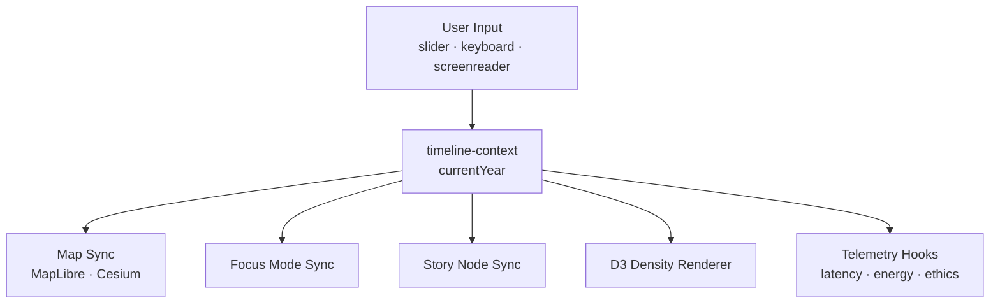
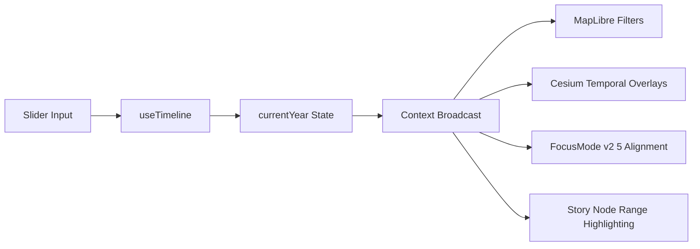
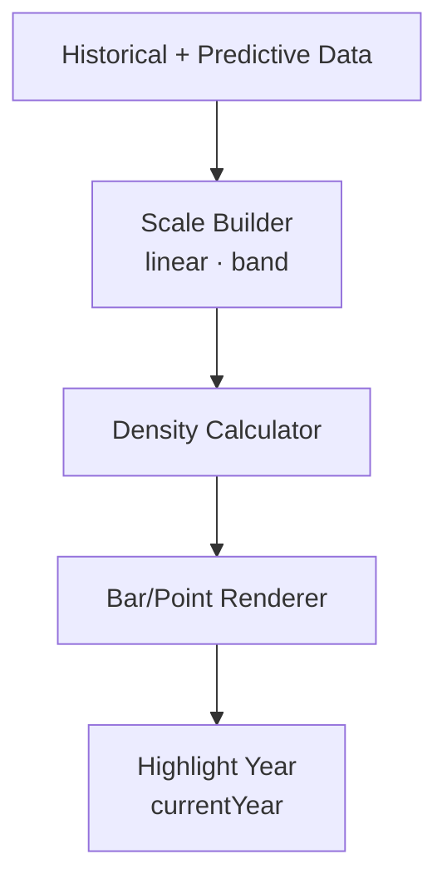
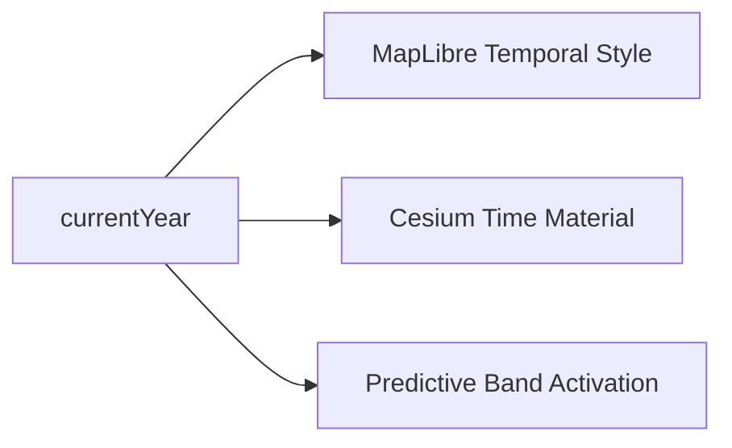
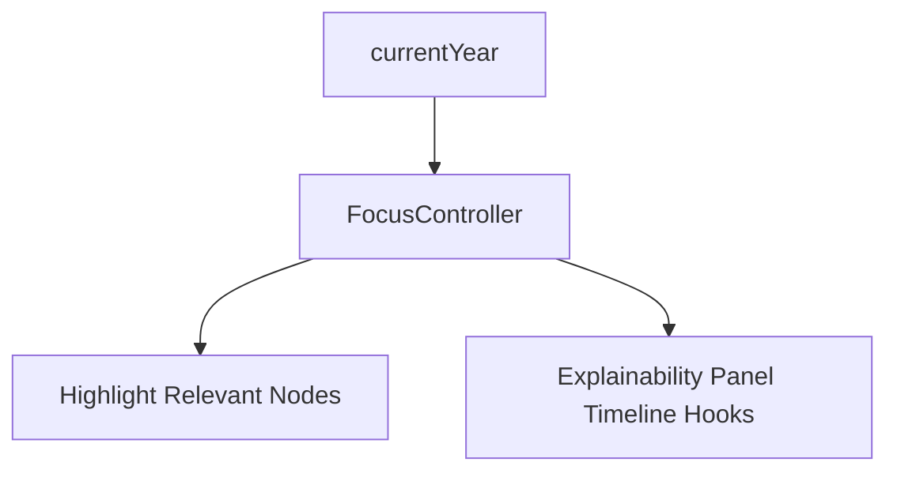
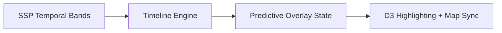
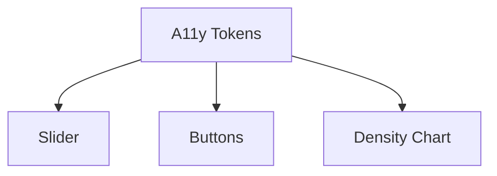
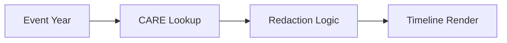

<div align="center">

# 🕰️ **Kansas Frontier Matrix — Timeline View Architecture**  
`web/src/components/TimelineView/README.md`

**Purpose:**  
Define the **deep internal architecture** of the KFM v10.3.2 Timeline View system — including temporal state management, MapLibre & Cesium synchronization, predictive band integration (2030–2100), Focus Mode v2.5 alignment, D3-based rendering, accessibility logic, FAIR+CARE temporal masking, and telemetry instrumentation.  
This document is the **canonical, whitepaper-grade** reference for timeline-driven temporal intelligence in the KFM web platform.

[]()
[]()
[]()
[]()

</div>

---

# 📘 Executive Summary

The **Timeline View subsystem** manages all front-end temporal intelligence:

- Time scrubbing (1700–2100)  
- Temporal filtering and event density charts (D3)  
- Predictive temporal band overlays (2030–2100 SSP)  
- Cross-sync with:
  - MapLibre 2D layers  
  - Cesium terrain overlays  
  - Focus Mode v2.5 narratives  
  - Story Nodes  
- FAIR+CARE-governed temporal redaction  
- Accessibility-first design (WCAG 2.1 AA)  
- Telemetry for:
  - energy usage  
  - rendering cost  
  - latency  
  - ethics events  

It is the user’s primary **time-navigation engine** for interacting with the Kansas Frontier Matrix.

---

# 🗂️ Directory Layout (Authoritative v10.3.2)

```text
web/src/components/TimelineView/
├── README.md
│
├── TimelineView.tsx              # Primary timeline interface
├── useTimeline.ts                # Temporal state + scheduler
├── timeline-context.ts           # Global context for currentYear
├── density-chart.tsx             # D3-based event density renderer
├── telemetry.ts                  # Timeline telemetry + FAIR+CARE logs
└── timeline.css                  # Styles + accessible tokens
```

---

# 🧩 High-Level Temporal Architecture



---

# 🧬 Timeline State Engine (Deep Specification)

The timeline system is built around a **single source of truth**: `currentYear`.

## Timeline Engine Flow



### Responsibilities
- Appropriate year clamping  
- Predictive mode activation for >2025  
- Playback scheduler (for animations)  
- CARE-aware temporal masking (if necessary)  
- Broadcasting events:  
  - `kfm:timeline:year`  
  - `kfm:timeline:predictive:start`  
  - `kfm:timeline:predictive:stop`  

---

# 📊 D3 Rendering Architecture (density-chart.tsx)

The D3 chart renders **event/story density** for all years 1700–2100.

## D3 Pipeline



### Features
- Predictive density overlay shading  
- CARE masking removal of sensitive event bars  
- High-contrast colors from design tokens  
- Screenreader descriptions of the current year’s density  

---

# 🛰️ MapLibre + Cesium Temporal Synchronization

## 2D MapLibre Sync  
Each year update triggers:

- style variable `--kfm-current-year`  
- layer filtering on STAC/DCAT temporal properties  
- predictive band lighting  
- CARE temporal redaction for sensitive periods  

## 3D Cesium Sync  
Timeline triggers:

- Time-dynamic material shaders  
- Historical → predictive DEM blending  
- Terrain exaggeration adjustments  
- Camera "temporal flight" animations  

## Architecture



---

# 🧠 Focus Mode v2.5 Temporal Alignment

The timeline synchronizes with AI reasoning.

### Functions
- Auto-scroll Focus Mode to nearest entity/event date  
- Annotate narrative with temporal cues  
- Filter Story Nodes by date  
- Emit FAIR+CARE temporal ethics warnings  

### Architecture



---

# 🧱 Predictive Temporal Bands (2030–2100)

Based on SSP datasets, used for:

- climate projections  
- hydrology projections  
- ecology succession  
- migration trends  

## Predictive Band Flow



Predictive bands follow CARE governance regarding future-impact sensitivities.

---

# ♿ Accessibility Architecture (WCAG 2.1 AA)

### Critical Features
- ARIA-labelled slider + timeline controls  
- Keyboard-first timeline navigation  
- Screenreader announcements for year changes  
- High-contrast bars in density chart  
- Reduced-motion playback mode  
- Larger hit targets for timeline markers  

### A11y DAG



---

# 🔐 FAIR+CARE Governance Architecture

The Timeline View enforces:

- CARE temporal masking for sensitive periods  
- Redaction of events in constrained years  
- Sovereignty-specific rules for tribal historical periods  
- CARE badges shown in timeline tooltips  
- Provenance requirements for all temporal visualizations  

### Governance Flow



Governance ledger:

```
../../../../docs/reports/audit/web-timeline-governance-ledger.json
```

---

# 📡 Telemetry & Sustainability Architecture

Telemetry fields include:

- `timeline_interaction_ms`  
- `playback_latency_ms`  
- `density_render_cost_ms`  
- `predictive_band_usage`  
- `a11y_token_presence`  
- `energy_estimate_wh`  

Telemetry merged to:

```
../../../../releases/v10.3.2/focus-telemetry.json
```

---

# ⚙️ CI / Validation Requirements (MCP-DL v6.3)

| Category | Enforcement |
|----------|-------------|
| Type Safety | TS strict judgment |
| A11y | axe + Lighthouse |
| Ethics | CARE temporal compliance tests |
| Performance | FPS ≥ 58 sustained |
| Governance | fairness + provenance checks |
| Documentation | docs-lint.yml |
| Telemetry | telemetry-export.yml |

---

# 📝 Example Playback Test Case

```ts
test("Timeline playback loops from 2025 → 1700", () => {
  const { play, year } = useTimeline();
  play();
  // simulate 500 ticks...
  expect(year).toBeGreaterThanOrEqual(1700);
  expect(year).toBeLessThanOrEqual(2025);
});
```

---

# 🧾 Internal Citation

```text
Kansas Frontier Matrix (2025). Timeline View Architecture (v10.3.2).
Defines deep temporal visualization and synchronization architecture for the KFM platform.
```

---

# 🕰️ Version History

| Version | Date | Summary |
|--------|--------|---------|
| v10.3.2 | 2025-11-14 | Full deep-architecture rebuild; added predictive bands, map/AI sync, governance + telemetry + accessibility layers. |
| v9.9.0 | 2025-11-08 | Original implementation. |

---

<div align="center">

**Kansas Frontier Matrix — Timeline View Architecture**  
🕰️ Temporal Intelligence · 🧠 AI Synchronization · 🌐 Ethical Visualization · 🔗 Provenance Integrity  
© 2025 Kansas Frontier Matrix — MIT License  

[Back to Components Index](../README.md)

</div>
