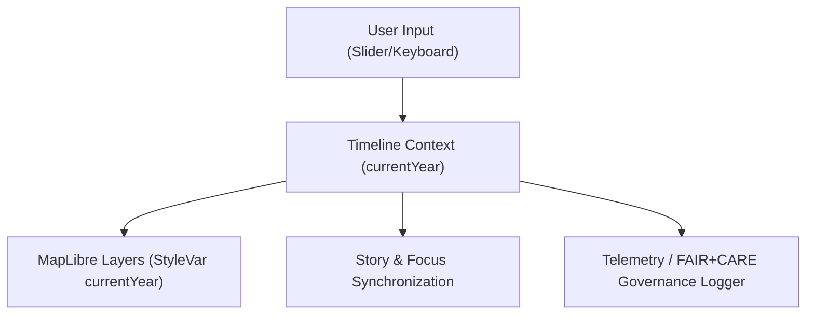

<div align="center">

# 🕰️ **Timeline View — Temporal Visualization & Focus Synchronization**  
`web/src/components/TimelineView/README.md`

**Purpose:**  
Deliver a **reactive temporal visualization panel** for Kansas Frontier Matrix (KFM), enabling users to navigate across centuries of data through an interactive time slider and event density view.  
Synchronizes **MapLibre layers**, **Focus Mode**, and **Story Nodes** in accordance with **FAIR+CARE governance** and **MCP-DL v6.3** principles.

[](../../../../docs/)
[](../../../../LICENSE)
[](../../../../docs/standards/)
[](#)

</div>

---

## 📘 Overview

The **Timeline View** component orchestrates the **temporal navigation** layer of the KFM web interface.  
It enables time scrubbing, event highlighting, and synchronization across **map**, **story**, and **AI Focus** contexts.  
All timeline interactions are logged via **telemetry hooks** and validated for accessibility and performance.

### Core Objectives
- 🎚 Interactive year slider linked to `currentYear` style variable.  
- 📊 Display event densities, story markers, and temporal ranges.  
- 🧠 Synchronize with Focus Mode (auto-align to event date).  
- ⚙️ Log telemetry for performance, FAIR+CARE governance, and energy efficiency.  
- ♿ WCAG 2.1 AA compliant with keyboard and screen reader support.

---

## 🗂️ Directory Layout

```plaintext
web/
└─ src/
   └─ components/
      └─ TimelineView/
         README.md               # This file — component overview
         TimelineView.tsx        # React component rendering the timeline
         useTimeline.ts          # Hook managing timeline state and sync
         timeline-context.ts     # Context for global currentYear state
         density-chart.tsx       # D3-based event density graph
         telemetry.ts            # Logs performance and FAIR+CARE metrics
         timeline.css            # Styling and accessibility tokens
```

---

## ⚙️ Component Architecture



**Data Sources**
- `focus-telemetry.json` → logs interaction latency, energy usage, and a11y scores.  
- `data/work/` → validated temporal datasets linked to event markers.  
- `src/pipelines/telemetry/` → system-level telemetry for sustainability metrics.

---

## 🧩 Example Implementation

### `TimelineView.tsx`
```tsx
import React from "react";
import { useTimeline } from "./useTimeline";
import { DensityChart } from "./density-chart";

export function TimelineView() {
  const { year, setYear, play, stop, playing } = useTimeline();

  return (
    <section aria-labelledby="timeline-heading" className="timeline-view">
      <h2 id="timeline-heading">Interactive Timeline</h2>
      <input
        type="range"
        min={1700}
        max={2025}
        step={1}
        value={year}
        aria-label="Timeline year"
        onChange={(e) => setYear(parseInt(e.target.value, 10))}
      />
      <DensityChart currentYear={year} />
      <div className="controls">
        {!playing ? (
          <button onClick={play} aria-label="Play timeline animation">▶</button>
        ) : (
          <button onClick={stop} aria-label="Stop timeline animation">⏸</button>
        )}
        <span>{year}</span>
      </div>
    </section>
  );
}
```

---

## 🧠 Hook: `useTimeline.ts`

Manages timeline playback, state synchronization, and MapLibre updates.

```ts
import { useEffect, useState } from "react";

export function useTimeline() {
  const [year, setYear] = useState(1850);
  const [playing, setPlaying] = useState(false);
  let timer: number;

  function play() {
    setPlaying(true);
    timer = window.setInterval(() => setYear((y) => (y < 2025 ? y + 1 : 1700)), 200);
  }

  function stop() {
    setPlaying(false);
    clearInterval(timer);
  }

  useEffect(() => {
    window.dispatchEvent(new CustomEvent("kfm:timeline:year", { detail: { year } }));
  }, [year]);

  return { year, setYear, play, stop, playing };
}
```

---

## 📊 D3 Density Chart Example (`density-chart.tsx`)

Visualizes event frequency or story node density over time.

```tsx
import * as d3 from "d3";
import React, { useRef, useEffect } from "react";

export function DensityChart({ currentYear }: { currentYear: number }) {
  const ref = useRef<SVGSVGElement>(null);
  useEffect(() => {
    const svg = d3.select(ref.current);
    svg.selectAll("*").remove();
    const data = d3.range(1700, 2026).map((y) => ({ y, count: Math.random() * 10 }));
    const x = d3.scaleLinear().domain([1700, 2025]).range([0, 400]);
    svg.append("g").selectAll("rect")
      .data(data)
      .enter()
      .append("rect")
      .attr("x", (d) => x(d.y))
      .attr("y", (d) => 50 - d.count)
      .attr("width", 1)
      .attr("height", (d) => d.count)
      .attr("fill", (d) => (d.y === currentYear ? "#FFB703" : "#90CAF9"));
  }, [currentYear]);
  return <svg ref={ref} width={420} height={60} />;
}
```

---

## ⚙️ Telemetry (`telemetry.ts`)

Logs interaction metrics and energy data for FAIR+CARE compliance.

```ts
export function logTimelineEvent(event: string, year: number) {
  fetch("/api/telemetry", {
    method: "POST",
    body: JSON.stringify({
      event,
      year,
      timestamp: new Date().toISOString(),
      user_role: "public",
      faircare: { a11y_compliant: true, ethical_tag: "public" }
    }),
  });
}
```

Telemetry schema: `schemas/telemetry/web-timelineview-v1.json`.

---

## ♿ Accessibility Features

| Feature | Implementation |
|----------|----------------|
| ARIA Labeling | Slider and controls labeled with roles and regions. |
| Keyboard Navigation | `←`/`→` adjusts year, `Space` toggles play/pause. |
| Live Region | Announces year change via `aria-live="polite"`. |
| High Contrast Mode | Color palette uses WCAG-safe tokens. |
| Reduced Motion | Animation disabled via `prefers-reduced-motion`. |

---

## ⚖️ FAIR+CARE Integration

| Principle | Implementation |
|------------|----------------|
| **Findable** | Every year change emits `kfm:timeline:year` for telemetry traceability. |
| **Accessible** | Complies with WCAG 2.1 AA; supports screen readers and keyboard users. |
| **Reusable** | TimelineView exported as independent component module. |
| **Collective Benefit** | Visualizes shared heritage transparently with care tags. |
| **Ethics** | Avoids over-sensationalizing sensitive periods; CARE enforcement applied. |

---

## 🧾 Internal Citation

```text
Kansas Frontier Matrix (2025). Timeline View — Temporal Visualization & Focus Synchronization (v9.9.0).
Implements FAIR+CARE-compliant, accessible timeline visualization synchronized with map and Focus Mode in the Kansas Frontier Matrix web platform.
```

---

## 🕰️ Version History

| Version | Date       | Author | Summary |
|--------:|------------|--------|----------|
| v9.9.0 | 2025-11-08 | `@kfm-web` | Added D3 density visualization, AI synchronization, telemetry hooks, and FAIR+CARE audits. |
| v9.8.0 | 2025-11-05 | `@kfm-ui` | Integrated Focus Mode and map event synchronization. |
| v9.7.0 | 2025-11-02 | `@kfm-core` | Established timeline slider and accessibility baseline. |

---

<div align="center">

**Kansas Frontier Matrix**  
*Temporal Insight × FAIR+CARE Governance × Accessible Visualization*  
© 2025 Kansas Frontier Matrix · Master Coder Protocol v6.3 · FAIR+CARE Certified · Diamond⁹ Ω / Crown∞Ω Ultimate Certified  

[Back to Components Index](../README.md) · [Governance Charter](../../../../docs/standards/governance/DATA-GOVERNANCE.md)

</div>

