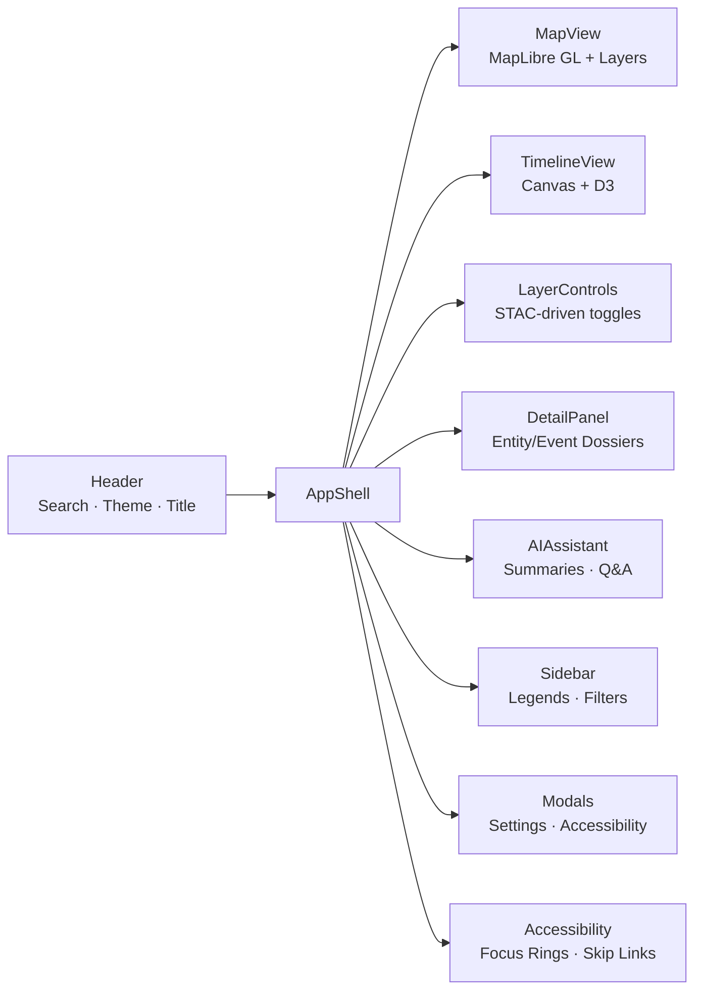
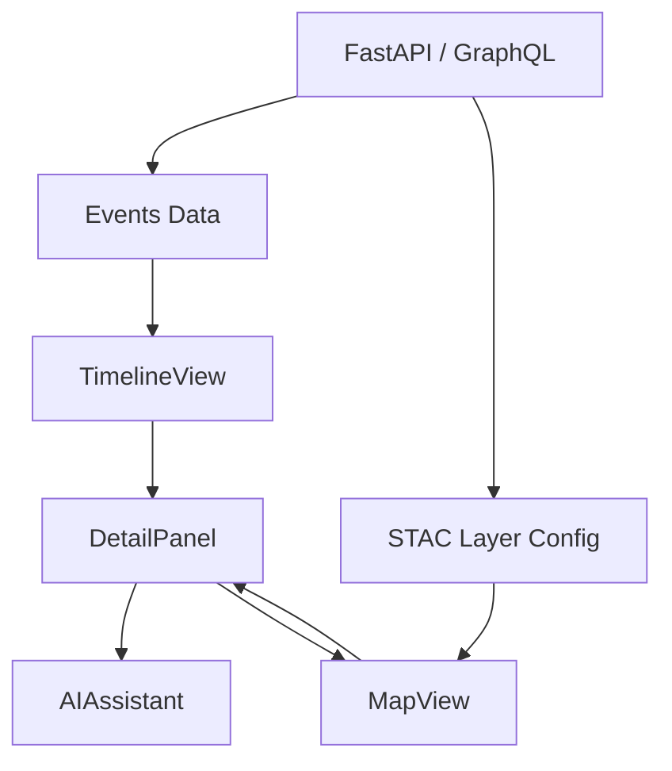

<div align="center">

# 🧩 Kansas Frontier Matrix — **Web Frontend Components**  
`web/src/components/`

**Modular React Components · Map + Timeline UI · Storytelling Panels**

[](../../../../.github/workflows/ci.yml)
[](../../../../.github/workflows/codeql.yml)
[](../../../../docs/)
[](../../../../LICENSE)

</div>

---

## 🧭 Overview

`web/src/components/` defines the **React component layer** of the Kansas Frontier Matrix (KFM) Web Frontend — rendering the user interface for **Map**, **Timeline**, **AI**, and **Narrative Panels**.  
Each module adheres to **MCP-DL v6.2**, focusing on **reproducibility**, **semantic accessibility**, and **deterministic rendering**.

> *“Components are the storytellers — each renders a fragment of Kansas history into view.”*

---

## 🧱 Directory Structure

```text
web/src/components/
├── AppShell/             # Root layout + global providers
├── Header/               # Top bar (search, title, theme toggle)
├── MapView/              # MapLibre map + GeoJSON/COG overlays
├── TimelineView/         # Timeline visualization (Canvas + D3)
├── LayerControls/        # STAC-driven toggles & legends
├── DetailPanel/          # Entity/Event dossier + AI summary
├── AIAssistant/          # Conversational Q&A component
├── Sidebar/              # Legends, filters, pinned info
├── Modals/               # Settings, About, Accessibility overlays
├── Accessibility/        # Focus rings, skip-links, ARIA helpers
└── index.ts              # Barrel export of all components
```

Each directory includes:

- `index.tsx` — main component logic  
- `styles.scss` — scoped visual tokens  
- `test.tsx` — Jest + RTL unit/integration tests  
- `README.md` — (optional) documentation  

---

## 🗺️ Component Architecture



All major modules are composed within **AppShell**, which wires context providers, layout, and theming.

---

## 🧩 Core Components

| Component         | Purpose                                                | Key Technologies        |
|:------------------|:-------------------------------------------------------|:------------------------|
| **AppShell**      | Root wrapper + global state injection                  | React Context, Framer Motion |
| **Header**        | Navigation bar, search, theme toggle                   | React Router, useDebounce |
| **MapView**       | Interactive map w/ STAC-based layers                   | MapLibre GL JS |
| **TimelineView**  | Temporal visualization w/ zoom & brush                 | HTML5 Canvas, D3.js |
| **LayerControls** | Toggle visibility & adjust opacity                     | STAC metadata parser |
| **DetailPanel**   | Entity & event dossiers + AI summaries                 | `react-markdown`, context APIs |
| **AIAssistant**   | Contextual Q&A chat UI                                 | FastAPI `/ask` endpoint |
| **Sidebar**       | Displays filters & legends                             | TailwindCSS, Framer Motion |
| **Modals**        | Settings/About overlays                                | React Portal API |
| **Accessibility** | WCAG 2.1 AA compliance utilities                       | ARIA roles, keyboard hooks |

---

## ⚙️ Example Implementation — MapView

```tsx
import React, { useEffect, useRef } from "react";
import maplibregl from "maplibre-gl";
import "maplibre-gl/dist/maplibre-gl.css";

export function MapView({ layers }) {
  const mapRef = useRef<HTMLDivElement>(null);

  useEffect(() => {
    const map = new maplibregl.Map({
      container: mapRef.current!,
      style: "https://basemaps.cartocdn.com/gl/voyager-gl-style/style.json",
      center: [-98.3, 38.5],
      zoom: 6,
    });

    layers.forEach(layer => {
      map.addSource(layer.id, { type: "geojson", data: layer.url });
    });

    return () => map.remove();
  }, [layers]);

  return <div ref={mapRef} className="map-view" />;
}
```

---

## 🧠 Data Flow



**Flow Logic:**

- Timeline scrub updates map layers and event filters  
- Map clicks trigger DetailPanel with related entities  
- AI Assistant enriches panels with contextual summaries  

---

## ♿ Accessibility & Design Integration

- Components respect `AccessibilityContext` (focus/motion states)  
- Layout grids sourced from `styles/layout.scss`  
- All interactive elements have ARIA roles and keyboard bindings  
- High-contrast and reduced-motion modes honored via tokens  
- WCAG 2.1 AA validated using **axe-core** in CI  

---

## 🧾 Provenance & Integrity

| Artifact | Description |
|:----------|:-------------|
| **Inputs** | Hooks, context, utils, and STAC catalog data |
| **Outputs** | React components rendering data visualizations |
| **Dependencies** | React 18+, D3, MapLibre GL, TailwindCSS, Framer Motion |
| **Integrity** | CI: ESLint · Jest coverage · Accessibility audit |

---

## 🧠 MCP Compliance Checklist

| MCP Principle | Implementation |
|:---------------|:---------------|
| Documentation-first | Each component documented with props + examples |
| Reproducibility | Deterministic render logic validated in CI |
| Open Standards | STAC, GeoJSON, WCAG, OWL-Time |
| Provenance | Component lineage traced to API + data sources |
| Accessibility | Keyboard navigation + ARIA metadata verified |

---

## 🔗 Related Documentation

- **Web Frontend Overview** — `web/README.md`  
- **Context Providers** — `web/src/context/README.md`  
- **Hooks Reference** — `web/src/hooks/README.md`  
- **Types Definition** — `web/src/types/README.md`  
- **Utilities** — `web/src/utils/README.md`  
- **Architecture Guide** — `web/ARCHITECTURE.md`

---

## 🧾 Versioning & Metadata

| Field | Value |
|:------|:------|
| **Version** | `v1.5.0` |
| **Codename** | *Narrative Component Upgrade* |
| **Last Updated** | 2025-10-17 |
| **Maintainers** | @kfm-web · @kfm-ui |
| **License** | MIT (code) · CC-BY 4.0 (docs) |
| **Alignment** | CIDOC CRM · OWL-Time · WCAG 2.1 AA |
| **Maturity** | Stable / Production |

---

<div align="center">

**© Kansas Frontier Matrix — Web Frontend Components**  
Built under the **Master Coder Protocol (MCP)** for modular, reproducible design.

[]()  
[]()

</div>