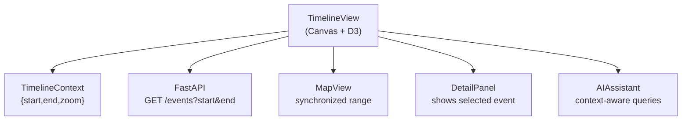
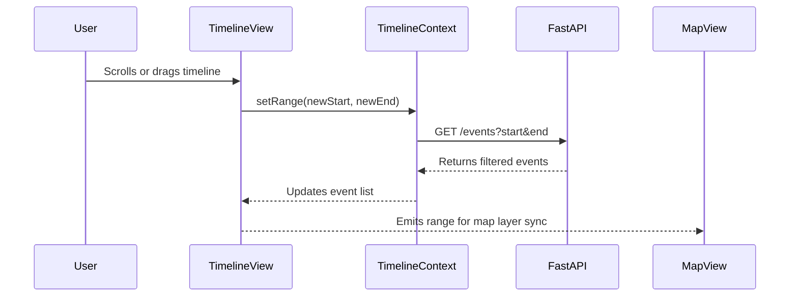

<div align="center">

# 🕰️ Kansas Frontier Matrix — **TimelineView Component**  
`web/src/components/TimelineView/`

**Temporal Navigation · Event Visualization · Time–Map Synchronization**

[](../../../../../.github/workflows/ci.yml)
[](../../../../../.github/workflows/codeql.yml)
[](../../../../../docs/)
[](../../../../../docs/design/reviews/accessibility/)
[](../../../../../LICENSE)

</div>

---

```yaml
---
title: "KFM • TimelineView Component (web/src/components/TimelineView/)"
version: "v1.5.0"
last_updated: "2025-10-14"
owners: ["@kfm-web", "@kfm-visualization"]
tags: ["timeline","canvas","d3","temporal-visualization","map-sync","accessibility","mcp"]
license: "MIT"
semantic_alignment:
  - OWL-Time
  - CIDOC CRM
  - PROV-O
  - WCAG 2.1 AA
---
````

---

## 🧭 Overview

The **TimelineView Component** provides the primary **temporal visualization interface** of the Kansas Frontier Matrix Web Application.
It enables users to explore Kansas’s historical events chronologically, synchronize temporal ranges with the **MapView**, and interact with entities from the **Neo4j Knowledge Graph** (people, places, treaties, disasters, etc.).

The visualization is built with **HTML5 Canvas** and **D3.js** for high-performance rendering of thousands of time-linked events.
It connects to `TimelineContext` for global time state and dynamically filters **Map layers** and **AI Assistant summaries** based on the current visible time window.

---

## 🧱 Directory Structure

```text
web/src/components/TimelineView/
├── TimelineView.tsx       # Main timeline renderer (Canvas + D3)
├── TimelineAxis.tsx       # Scalable axis & ticks based on zoom level
├── EventMarkers.tsx       # Visual rendering of events + hover effects
├── Tooltip.tsx            # Contextual tooltip for event details
├── styles.scss            # Timeline layout & theming
└── __tests__/             # Jest + RTL tests for rendering & interactions
```

Each submodule is documented and unit-tested under the MCP-DL reproducibility framework.

---

## ⚙️ Component Architecture



---

## 🧩 Core Features

| Feature                        | Description                                                    | Data Source            |
| :----------------------------- | :------------------------------------------------------------- | :--------------------- |
| **Time Navigation**            | Scroll, pan, and zoom through historical periods               | `TimelineContext`      |
| **Event Markers**              | Draws color-coded markers by category (treaty, disaster, etc.) | `/api/events`          |
| **Hover Details**              | Displays tooltips with title, date, summary                    | API / Graph Data       |
| **Time–Map Sync**              | Updates map visibility based on timeline range                 | `LayerContext` / STAC  |
| **Temporal Filtering**         | Filters entities and datasets by year or interval              | Knowledge Graph        |
| **Keyboard Navigation**        | Arrow keys (pan), +/− (zoom)                                   | `AccessibilityContext` |
| **High Performance Rendering** | Canvas + D3 scales to 10k+ events                              | Canvas API             |

---

## 💬 Example Implementation

```tsx
import React, { useRef, useEffect } from "react";
import * as d3 from "d3";
import { useTimeline } from "../../context/TimelineContext";
import "./styles.scss";

export const TimelineView: React.FC = () => {
  const canvasRef = useRef<HTMLCanvasElement>(null);
  const { range, setRange, events } = useTimeline();

  useEffect(() => {
    const canvas = canvasRef.current;
    const ctx = canvas?.getContext("2d");
    if (!canvas || !ctx) return;

    ctx.clearRect(0, 0, canvas.width, canvas.height);

    const scale = d3
      .scaleTime()
      .domain([new Date(range.start), new Date(range.end)])
      .range([0, canvas.width]);

    for (const event of events) {
      const x = scale(new Date(event.startDate));
      ctx.fillStyle = event.color ?? "#00b3b3";
      ctx.beginPath();
      ctx.arc(x, 40, 5, 0, 2 * Math.PI);
      ctx.fill();
    }
  }, [range, events]);

  return <canvas ref={canvasRef} className="timeline-canvas" width={800} height={100} />;
};
```

> Ensures efficient rendering of events and propagates visible range changes to the `MapContext` for synchronized updates.

---

## 🧮 Data Flow



---

## 🎨 Visual Design

| Element           | Description                                                                        |
| :---------------- | :--------------------------------------------------------------------------------- |
| **Event Dots**    | Circle markers for events; color-coded (e.g., treaties = blue, disasters = orange) |
| **Axis**          | D3-rendered ticks for years/decades; adaptive scale                                |
| **Range Shading** | Gradient overlay marking active time window                                        |
| **Tooltip**       | On hover: displays title, date, and summary                                        |
| **Transitions**   | Smooth pan/zoom via Framer Motion easing                                           |

> **Dark Mode** automatically inverts background & tick colors via `ThemeContext`.

---

## ♿ Accessibility (WCAG 2.1 AA)

| Feature                 | Implementation                                                 |
| :---------------------- | :------------------------------------------------------------- |
| **Keyboard Navigation** | Arrow keys = pan · `+` / `−` = zoom · Enter = select event     |
| **ARIA Roles**          | `role="region"` with `aria-label="Kansas Historical Timeline"` |
| **Focus Ring**          | High-contrast outline on selected event markers                |
| **Screen Readers**      | Announce event titles and years on focus                       |
| **Reduced Motion**      | Disables smooth transitions if `prefers-reduced-motion` is set |

---

## 🧪 Testing

| Test Case               | Description                                         | Tool                  |
| :---------------------- | :-------------------------------------------------- | :-------------------- |
| **Event Rendering**     | Confirms correct positioning & color for each event | Jest + Canvas Mock    |
| **Range Update**        | Validates new range triggers API call               | React Testing Library |
| **Hover/Tooltip**       | Verifies tooltip matches hovered event              | Jest DOM              |
| **Keyboard Navigation** | Simulates key input for a11y control                | Cypress               |
| **Accessibility Check** | Runs axe-core audit for ARIA & contrast             | axe-core              |

**Coverage target:** ≥ **90%** lines / branches.

---

## 🧾 Provenance & Integrity

| Artifact         | Description                                                                      |
| :--------------- | :------------------------------------------------------------------------------- |
| **Inputs**       | `/api/events`, `TimelineContext`, `LayerContext`                                 |
| **Outputs**      | Canvas-rendered timeline synced with MapView                                     |
| **Dependencies** | React 18+, D3.js, Framer Motion, TailwindCSS                                     |
| **Integrity**    | CI runs full suite: linting, rendering tests, performance & accessibility audits |

---

## 🧠 MCP Compliance Checklist

| MCP Principle       | Implementation                             |
| :------------------ | :----------------------------------------- |
| Documentation-first | README and JSDoc before code merge         |
| Reproducibility     | Deterministic rendering + CI verification  |
| Accessibility       | WCAG 2.1 AA compliance via keyboard & ARIA |
| Provenance          | Type-safe events & API-linked metadata     |
| Open Standards      | D3 scales + OWL-Time + CIDOC CRM semantics |

---

## 🔗 Related Documentation

* **MapView Component** — `web/src/components/MapView/README.md`
* **LayerControls Component** — `web/src/components/LayerControls/README.md`
* **Context: Timeline & Layer** — `web/src/context/README.md`
* **Web UI Architecture** — `web/ARCHITECTURE.md`

---

## 📜 License

Released under the **MIT License**.
© 2025 Kansas Frontier Matrix — developed under **MCP-DL v6.2** for scientific reproducibility, accessibility, and transparent visualization design.

> *“The TimelineView connects memory to motion — Kansas history unfolding through time.”*

```
```
