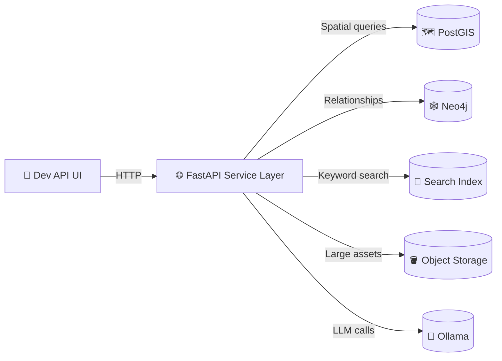

# 🧰 Dev API Playground

<kbd>DEV-ONLY</kbd> <kbd>REST</kbd> <kbd>GraphQL</kbd> <kbd>OpenAPI</kbd> <kbd>Tiles</kbd> <kbd>Focus Mode</kbd>

> Developer-facing UI utilities for exploring, validating, and debugging **Kansas Frontier Matrix (KFM)** backend API contracts *from inside the web app* 🧪

---

## 🎯 What this folder is

This directory contains **developer tooling components** that help you:

- 🔎 Explore REST endpoints quickly (without leaving the browser)
- 🧭 Validate “contract” assumptions during frontend work (params, headers, response shape)
- 🗺️ Smoke-test map layers (vector/raster tiles) the same way MapLibre/Cesium consumes them
- 🕸️ Try GraphQL queries for relationship-heavy reads
- 🤖 Exercise **Focus Mode** calls in a controlled way (including auth + context)

> [!IMPORTANT]
> **Do not ship this UI to production.**  
> Keep it behind a dev-only route/flag and ensure it is excluded/disabled in prod builds. ✅

---

## ⚡ Quick start (local dev)

From the repo root, bring up the stack (or whatever your current local workflow is):

```bash
docker-compose up
```

Useful local URLs (typical defaults):

```text
Web (React):        http://localhost:3000
API (FastAPI):      http://localhost:8000
Swagger (OpenAPI):  http://localhost:8000/docs
OpenAPI JSON:       http://localhost:8000/openapi.json
GraphQL endpoint:   http://localhost:8000/graphql
```

> [!TIP]
> If you can’t find the dev screen in the UI, search the web router for something like:
> `DevApi`, `ApiPlayground`, or `components/dev/api`.

---

## 🧠 Architectural guardrails (why this exists)

KFM is intentionally designed so **the API is the single entry point** for clients (web, mobile, AR, external scripts). That means this dev UI should **never** “cheat” by reaching into databases or raw files directly.

Key principles this folder should honor:

- 🧱 **API-first**: Treat the API as the contract boundary (no direct DB access from frontend).
- 🧾 **Provenance-aware**: Prefer endpoints that preserve “what is this?” + “where did it come from?”.
- 🧩 **Open standards**: GeoJSON/STAC/DCAT-style metadata and linkable assets are first-class.
- 🔐 **Governed by policy**: Expect RBAC + policy middleware to deny/shape responses.

---

## 🗺️ Mental model (data → API → UI)



---

## 🧪 What you can test here (endpoint cookbook)

> This list is **intentionally “contract-shaped”**. Always confirm exact inputs/outputs via **OpenAPI** (`/docs` + `/openapi.json`) and the backend README(s).

### 🩺 Health & meta

Typical “is it alive?” checks (great for CI/dev debugging):

```text
GET /healthz
GET /readyz
GET /version
```

---

### 🗂️ Data catalog & datasets

Common patterns:

- **Dataset metadata** (DCAT summary + links to assets)
- **Catalog search** (keyword + bbox + time range)
- **Data retrieval** (stream/return filtered features)

Example shapes:

```text
GET /api/v1/datasets/{id}
GET /api/v1/catalog/search?keyword=...&bbox=...&time=...
GET /api/v1/datasets/{id}/data?format=geojson&bbox=...
```

✅ Frontend usage notes:
- Use **search** first to discover what exists for an area/time.
- Use **bbox/time filters** aggressively to avoid huge payloads.

---

### 🧮 Ad-hoc spatial queries (advanced)

KFM supports a *safe* query interface for approved tables/views (validated, constrained, logged).

Example:

```text
GET /api/v1/query?table=geo_counties&select=name,pop_1890&where=pop_1890>10000
```

✅ Frontend usage notes:
- Treat this as “power user mode” (expect denials + masking).
- Always display: table, filters, and final request URL for reproducibility.

---

### 🧱 Map tiles (vector + raster)

Tile endpoints are designed so multiple clients can “drink from the same well” 🥤

Examples:

```text
GET /tiles/{layer}/{z}/{x}/{y}.pbf   # vector tiles (MVT)
GET /tiles/{layer}/{z}/{x}/{y}.png   # raster tiles
GET /tiles/{layer}/{z}/{x}/{y}.webp  # raster tiles (alt)
```

✅ Frontend usage notes:
- Provide a **copy/paste** tile URL in the dev UI.
- Consider showing a tiny tile preview for raster endpoints.
- For vector tiles, show: response size, content-type, and cache headers.

---

### 🕸️ GraphQL (relationships + joins)

GraphQL is useful when the UI needs interconnected objects (places ↔ datasets ↔ events ↔ stories) in fewer round trips.

Example request:

```bash
curl -X POST http://localhost:8000/graphql \
  -H "Content-Type: application/json" \
  -d '{"query":"query { storyNodes { id title yearRange } }"}'
```

✅ Frontend usage notes:
- Expect query limits (depth/cost) to prevent abuse.
- Always show GraphQL query text + variables in the dev UI.

---

### 🤖 Focus Mode (AI-assisted, governed)

Focus Mode is called via a dedicated API endpoint:

```text
POST /focus-mode/query
```

A good dev UI runner for Focus Mode should support:

- 🧼 Input sanitization expectations (don’t assume raw prompt goes through untouched)
- 🧭 Passing **map context** (selected area/time/layers) when available
- 📚 Displaying returned **sources** alongside the answer
- 🧾 Verifying “citation discipline” (answers should tie back to sources)

Example curl (shape will vary—confirm via OpenAPI):

```bash
curl -X POST http://localhost:8000/focus-mode/query \
  -H "Content-Type: application/json" \
  -d '{
    "question": "What happened here in the 1930s?",
    "mapContext": {
      "bbox": [-102.05, 37.00, -94.60, 40.00],
      "year": 1935,
      "activeLayers": ["drought_index", "population"]
    }
  }'
```

> [!NOTE]
> The **dev UI should never present AI output as “ground truth.”**  
> Always show sources + allow jumping to the underlying datasets/documents.

---

## 🔐 Auth, RBAC, and policy behavior

This dev UI must assume:

- ✅ Every request may be evaluated by **role-based access controls (RBAC)**
- ✅ Policy middleware may deny access (*fail closed*)
- ✅ Some responses may be **sanitized/masked** (not just denied)

Recommended UI affordances:

- 🔑 A place to paste a bearer token (never persist to git)
- 🧾 A “Request Details” panel: method, URL, headers, body
- 🧯 Clear error rendering for `401`, `403`, `422`, `429`, `5xx`
- 🕵️ A “Copy as curl” button to reproduce behavior outside the browser

> [!WARNING]
> Never store tokens in localStorage in a way that could leak into screenshots/logs.  
> Prefer in-memory state and explicit “clear token” actions 🧽.

---

## 🧩 Suggested component responsibilities (names may differ)

Even if file names evolve, this folder typically benefits from these conceptual pieces:

- 🧰 **API client wrapper**: base URL, headers, JSON parsing, timing, error shaping
- 🧾 **Endpoint registry**: curated templates (method/path/default params/body)
- 🧪 **Runner UI**: editable params + execute + show response + copy-as-curl
- 🗺️ **Geo helpers**: bbox builders, GeoJSON preview, tile URL builder
- 🔐 **Auth helper**: bearer token input + request injection

---

## 🧯 Troubleshooting

<details>
  <summary><strong>Ports / containers / “it won’t start”</strong> 🐳</summary>

- If Postgres (5432), Neo4j (7474), API (8000), or Web (3000) ports conflict, update your compose mappings.
- If a container dies under load, increase Docker memory limits.
- If code changes don’t reflect in the web container, verify your volume mounts.

</details>

<details>
  <summary><strong>CORS / network errors from the browser</strong> 🌐</summary>

- Prefer a dev proxy (web dev server → API) **or** ensure the API allows your dev origin.
- In the dev UI, show the resolved base URL to avoid “wrong host” confusion.

</details>

---

## 🔗 References (in-repo)

> Prefer these docs as the “source of truth” when updating this dev tooling.

- 📘 Backend API README: `../../../../../src/server/api/README.md`
- 🧱 System overview: `../../../../../docs/architecture/system_overview.md`
- 🤖 AI system overview: `../../../../../docs/architecture/AI_SYSTEM_OVERVIEW.md`
- 🦙 Ollama integration: `../../../../../docs/architecture/ai/OLLAMA_INTEGRATION.md`
- 🛠️ CLI tooling: `../../../../../tools/kfm/README.md`

---

## ✅ Contribution checklist (when adding new dev endpoints)

- [ ] Confirm endpoint exists in **Swagger** (`/docs`) and/or GraphQL schema (`/graphql`)
- [ ] Add a template with **safe defaults** (bbox/time filters, paging, etc.)
- [ ] Render “copy as curl” output
- [ ] Add response hints (GeoJSON, tiles, JSON, binary)
- [ ] Ensure dev-only gating stays intact (no accidental exposure)

---

🧭 **Rule of thumb:** if you can reproduce it with a curl command, you can debug it.
