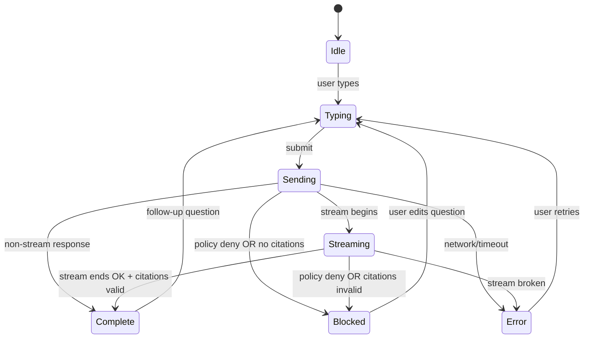

# 🧠 Focus Mode (Dev UI) — `web/src/components/dev/focus-mode/`


-informational)

> 🧭 **Purpose:** Focus Mode is KFM’s map-and-timeline-aware assistant surface. This folder contains the **dev-facing UI component(s)** that render a Focus Mode chat experience, **without ever calling the LLM directly**.  
> ✅ The UI talks only to the **governed API boundary** and renders **clickable citations** (or refuses to display ungrounded output).

---

## ✨ What “Focus Mode” means in KFM

Focus Mode is not “just a chatbot”.

It’s a **governed reading + exploration mode** where:
- a **Story Node** (curated narrative) can be presented alongside **map + timeline context** 🗺️🕰️
- optional AI assistance is **user-triggered (opt‑in)** and **visibly labeled** 🤖
- any dynamic content must be provenance-linked, and **citations are mandatory** 🔗

---

## 📚 Contents

<details>
<summary><strong>Click to expand</strong></summary>

- [Key invariants (must not regress)](#-key-invariants-must-not-regress)
- [UI responsibilities](#-ui-responsibilities)
- [Suggested folder layout](#-suggested-folder-layout)
- [Core UI anatomy](#-core-ui-anatomy)
- [API contract expectations](#-api-contract-expectations)
  - [Non-streaming query](#non-streaming-query)
  - [Streaming query](#streaming-query)
- [Citation rendering rules](#-citation-rendering-rules)
- [State machine](#-state-machine)
- [Sensitive data + sovereignty guardrails](#-sensitive-data--sovereignty-guardrails)
- [Accessibility](#-accessibility)
- [Performance notes](#-performance-notes)
- [Testing checklist](#-testing-checklist)
- [Troubleshooting](#-troubleshooting)
- [Contributing](#-contributing)

</details>

---

## ✅ Key invariants (must not regress)

These are “project law” for Focus Mode UI:

- **API boundary rule:** UI must never query data stores directly (e.g., Neo4j). All access goes through the governed API layer.  
- **Evidence-first narrative:** No unsourced narrative content in Focus Mode.  
- **Provenance-only display:** If content lacks a source/ID/provenance, it does not render.  
- **AI is opt‑in + transparent:** AI content never appears by default; it must be user-triggered and clearly labeled.
- **No sensitive location leaks:** The UI must not become a side-channel for restricted data (e.g., exact points for sensitive places).

> 🧠 Mental model: Focus Mode is where users “experience the story” — but everything they see should be traceable back to evidence.

---

## 🎛️ UI responsibilities

The Focus Mode dev UI should:

### Must do ✅
- Render a **chat-style** interface (messages + composer).
- Show current **context** (location/time/layers/story node scope) in a compact “context bar”.
- Send user prompts to the **backend Focus Mode endpoint** (never to an LLM runtime).
- Render returned citations as **clickable footnotes** / **source chips**.
- Gracefully handle **policy-blocked responses** (e.g., missing citations, restricted data).
- Clearly label AI outputs with an **AI-generated** tag and (if provided) confidence/uncertainty metadata.

### Must not do 🚫
- Never call Ollama (or any LLM) directly from the browser.
- Never “invent” citations client-side.
- Never display “helpful guesses” if the server returns “insufficient evidence”.
- Never leak raw coordinates or restricted identifiers if the server redacts/generalizes them.

---

## 🗂️ Suggested folder layout

> This is a **recommended** shape for maintainable UI code. Your actual filenames may differ.

```text
📁 web/src/components/dev/focus-mode/
├─ 📄 README.md
├─ 🧩 FocusModePanel.tsx          # container (layout + orchestration)
├─ 💬 FocusModeChat.tsx           # message list + composer
├─ 🧱 FocusModeMessageList.tsx    # virtualization-friendly list rendering
├─ ✍️ FocusModeComposer.tsx       # input + send + shortcuts
├─ 🔖 FocusModeCitations.tsx      # citations list + source drawer
├─ 🧠 FocusModeContextBar.tsx     # map/timeline/story context summary
├─ 🌐 focusMode.api.ts            # API client wrapper (query/stream)
├─ 🧾 focusMode.types.ts          # shared types
├─ 🧰 focusMode.utils.ts          # parsing, formatting, safety helpers
└─ 🧪 __tests__/
   ├─ citations.parse.test.ts
   ├─ citations.render.test.tsx
   └─ focusMode.state.test.ts
```

---

## 🧱 Core UI anatomy

A good Focus Mode UI typically has:

### 1) Context bar 🗺️🕰️
Shows what the assistant is “looking at”, e.g.:
- selected place(s) (county, town, feature id)
- active timeline year/range
- active data layers
- story node(s) in scope (if any)

> Tip: send **IDs + bounded context**, not huge blobs. Prefer stable identifiers over raw geometry.

### 2) Message list 💬
- user messages
- assistant messages (with citations)
- system messages (policy-blocked, no-evidence, redaction notices)

### 3) Composer ✍️
- single-line by default; expand to multi-line
- `Enter` to send, `Shift+Enter` newline
- supports “suggested prompts” (optional)

### 4) Citations + evidence drawer 🔎
- sources list: title + snippet + type (dataset/story/doc) + link target
- clicking `[1]` in the answer scrolls/opens the relevant source entry

---

## 🌐 API contract expectations

The backend is the orchestrator: it sanitizes prompts, retrieves evidence, runs the model, then applies governance checks before returning an answer.

This README documents what the **frontend should expect** and how to behave defensively.

### Non-streaming query

**Request (illustrative):**
```json
POST /api/v1/ai/query
{
  "question": "What happened here during the 1930s drought?",
  "context": {
    "place": { "type": "county", "id": "finney_ks" },
    "time": { "start": "1930-01-01", "end": "1939-12-31" },
    "layers": ["drought_index", "historic_newspapers"],
    "viewport": { "bbox": [-101.2, 37.6, -100.6, 38.1] },
    "storyNodeIds": ["story_ks_dust_bowl_intro"]
  },
  "client": {
    "surface": "web.focus-mode.dev",
    "sessionId": "optional-session-id"
  }
}
```

**Response (illustrative):**
```json
{
  "answer": "The 1930s brought prolonged drought conditions and major agricultural stress in this region [1][2].",
  "citations": [
    {
      "n": 1,
      "kind": "dataset",
      "title": "1935 Drought Index (Kansas)",
      "snippet": "…relevant excerpt…",
      "href": "/datasets/ks_drought_1935"
    },
    {
      "n": 2,
      "kind": "document",
      "title": "1936 Newspaper excerpt",
      "snippet": "…relevant excerpt…",
      "href": "/archives/doc/abc123"
    }
  ],
  "meta": {
    "model": "kfm-llama2:latest",
    "policy": { "decision": "allow" },
    "requestId": "req_..."
  }
}
```

### Streaming query

If the backend supports streaming, the UI should prefer it for responsiveness:
- show partial tokens as they arrive
- preserve the final “answer + citations” structure when complete

**Implementation patterns:**
- SSE (`text/event-stream`)
- NDJSON chunking
- WebSocket

**UI rule:** don’t render “final answer” formatting until:
- the stream ends cleanly **and**
- citations are present/validated

---

## 🔖 Citation rendering rules

### What to support
- Citation markers like: `[1]`, `[2]`, … (including multi-digit like `[12]`)
- Repeated markers (`[1]` used multiple times)
- Dense clusters (`…[1][2][3]`)

### What to enforce in UI (defense-in-depth)
Even if the backend already gates outputs, the UI should still be strict:

- If **no citation markers** exist in `answer` → treat as **policy-blocked** and do not render as authoritative output.
- If markers exist but **no matching `citations[]` entries** → render the answer as **untrusted** and show a fallback:
  - “Evidence list missing; please retry.”

### Suggested parsing approach
- Regex: `\[(\d+)\]`
- Build a map: `citationByNumber[n] => citation`
- Render:
  - inline markers as `<button role="link">[n]</button>`
  - citations list as numbered entries with titles/snippets

---

## 🧭 State machine



---

## 🛡️ Sensitive data + sovereignty guardrails

Focus Mode UI must treat redaction/generalization as a **first-class UX pattern**:

- If a location is sensitive, prefer:
  - region highlight instead of point
  - blurred marker
  - “generalized location” badge
- If a citation/source is restricted:
  - show title but hide snippet (or show “restricted”)
  - keep links behind role-based access checks

> 🔒 The UI must never reconstruct or infer redacted coordinates from other fields.

---

## ♿ Accessibility

Minimum expectations:

- Full keyboard navigation:
  - tab through composer, send button, citation markers
  - `Esc` closes drawers/modals
- Screen-reader friendly:
  - aria-label for citation buttons (e.g., “Open source 2”)
  - message roles and clear speaker labels (“User”, “Focus Mode”)
- Motion + streaming:
  - avoid excessive auto-scrolling that steals focus
  - prefer “New content” indicator if user has scrolled up

---

## ⚡ Performance notes

- **Virtualize** message list if it grows large.
- Stream tokens to reduce perceived latency (but buffer just enough to avoid rerender storms).
- Memoize expensive formatting (citation parsing, markdown rendering).
- Keep “context bar” updates cheap; do not recompute full context on every keystroke.

---

## 🧪 Testing checklist

### Unit tests
- citation parsing (multi-digit, duplicates, missing)
- “no source, no answer” gating logic
- context serialization (stable IDs, bounded fields)

### UI tests
- keyboard navigation (composer → send → citations)
- policy-blocked responses
- restricted citation rendering

### Contract tests (recommended)
- validate that `/api/v1/ai/query` response schema matches what the UI expects
- ensure streaming emits a final “complete” chunk with citations

---

## 🧯 Troubleshooting

### “Answer returned but UI shows Blocked”
Likely causes:
- answer missing `[n]` markers
- citations array missing/empty
- policy decision deny

✅ Expected UI behavior: show a helpful message like:
- “No Source, No Answer — try narrowing the place/time or enabling more layers.”

### Citations render but links 404
- source is not published
- role lacks access
- stale IDs

✅ Expected UI behavior:
- keep the citation visible
- show “source unavailable” without breaking the whole response

---

## 🤝 Contributing

Before changing Focus Mode UI, confirm:

- [ ] No direct LLM calls were added (browser → API only).
- [ ] New UI features still honor provenance and sensitivity rules.
- [ ] Any new map overlays include provenance-linked metadata / source visibility.
- [ ] Any new API usage is contract-first and documented.
- [ ] Citation UI remains strict (no ungrounded “helpfulness”).

> 🧩 If you’re adding new capability, also update the relevant docs in `docs/architecture/` and/or `docs/governance/` so the invariants stay explicit.
