# Dev Map Toolkit 🗺️🧪 (`web/src/components/dev/map`)


> [!WARNING]
> **Developer sandbox only.** Everything in this folder is for building & validating map behaviors safely (layers, styles, state, provenance, performance).  
> **Do not ship dev controls to production routes** without feature-flagging + governance review. 🔒

---

## Why this exists 🧭

Kansas Frontier Matrix (KFM) is an **evidence-first geospatial knowledge platform** where every visual (map layers, charts, AI answers) must be **traceable to sources** (“the map behind the map”). The architecture enforces a canonical “truth path”:

- **Raw ➜ Processed ➜ Catalog ➜ Databases ➜ API ➜ UI/AI**
- The **UI does not query databases directly**; it must go through the governed API.
- Datasets are considered publishable only when they have **metadata (STAC/DCAT)** and **lineage (W3C PROV)** and have passed policy gates (“fail closed”).  

This folder gives us a safe place to iterate quickly on map UX while staying aligned with those constraints.

```mermaid
flowchart LR
  A[📥 raw data] --> B[🧹 processed]
  B --> C[🗂️ catalog + metadata<br/>STAC/DCAT]
  C --> D[(🧠 databases<br/>PostGIS / Neo4j / Search)]
  D --> E[🧰 API layer<br/>REST / GraphQL + policy gates]
  E --> F[🖥️ UI + Dev Map Toolkit]
  F --> G[🧾 provenance + citations UI]
```



---

## What lives here 📦

This directory is the **map “lab bench”**:

- 🔌 **Map engines**: 2D MapLibre + optional 3D Cesium adapter(s)
- 🧱 **Layer registry**: canonical list of dev-testable layers + their metadata hooks
- 🧰 **Dev panels**: toggles for layers, styles, tile debug, feature inspect, etc.
- 🧾 **Provenance drawer**: inspect dataset metadata + license + lineage links
- 🧪 **Diagnostics**: perf counters, render timing, network/tile sanity checks

> [!NOTE]
> If the current implementation differs, treat this README as the **intended contract** and update either the code or this doc to match.

---

## Folder layout 🗂️

> **Illustrative** (adjust to match actual files).

```text
📁 web/
  📁 src/
    📁 components/
      📁 dev/
        📁 map/
          📄 README.md                👈 you are here
          📄 DevMapRoute.tsx          (dev-only router entry)
          📄 DevMap.tsx               (orchestrator: state → engines)
          📄 layerRegistry.ts         (LayerDefinition[] + helpers)
          📄 useMapLibre.ts           (MapLibre lifecycle hook)
          📄 useCesium.ts             (Cesium lifecycle hook)
          📄 DevLayerPanel.tsx        (layer toggles + ordering)
          📄 DevInspectPanel.tsx      (feature inspect + hover/click)
          📄 DevProvenanceDrawer.tsx  (metadata + license + provenance)
          📄 DevPerfPanel.tsx         (fps, tile counts, timing)
          📄 styles.ts                (shared dev styles)
```

---

## Quick start ⚡

### 1) Run the stack (typical)
- Start backend services (API + datastores) via your project’s usual workflow (Docker Compose / dev scripts).
- Start the web dev server.

```bash
cd web
npm install
npm run dev   # or: npm start
```

### 2) Open the dev map route
Common patterns:
- `http://localhost:3000/dev/map`
- `http://localhost:5173/dev/map` (Vite default)

> [!TIP]
> Keep this route **behind a dev-only gate** (env flag + route guard). See: **Dev gating** below.

---

## Dev gating 🔒

Dev tooling is powerful and can expose sensitive internals (tile URLs, dataset IDs, query parameters). A safe pattern:

- Build dev map components normally (so they typecheck & stay healthy),
- But mount them only when:
  - `import.meta.env.DEV` **AND**
  - a dedicated flag is on (example: `VITE_ENABLE_DEV_ROUTES=true`).

```ts
// pseudo
export const devRoutesEnabled =
  import.meta.env.DEV && import.meta.env.VITE_ENABLE_DEV_ROUTES === 'true';
```

> [!CAUTION]
> “Fail closed” applies to UI too: if flags are missing, **dev tools should not render**.

---

## Architectural contract 🧱

### Map must “drink from the same well” 🥤
KFM is designed so **web, 3D, mobile, and external clients** can consume the same map layers via tile URLs. The API typically supports:

- **Dataset metadata** (DCAT summary + links to STAC assets)
  - `GET /api/v1/datasets/{id}`
  - `GET /api/v1/catalog/search`
- **Dataset data** (e.g., GeoJSON export with bbox filter)
  - `GET /api/v1/datasets/{id}/data?format=geojson&bbox=...`
- **Safe ad-hoc queries** (governed / validated)
  - `GET /api/v1/query?...`
- **Tiles**
  - Vector tiles: `GET /tiles/{layer}/{z}/{x}/{y}.pbf`
  - Raster tiles: `GET /tiles/{layer}/{z}/{x}/{y}.png` (or `.webp`)

> [!IMPORTANT]
> **Never** bypass this layer by directly connecting UI code to PostGIS/Neo4j.  
> The dev map is a **client** of the governed API.

---

## State model 🧠

KFM map UX is inherently multi-dimensional:

- 🗺️ View: center, zoom, bearing, pitch
- 🕰️ Time: year/date slider (and/or narrative “story nodes”)
- 🧱 Layers: visible set + ordering + opacity
- 🧷 Selection: hovered/clicked features
- 🧾 Provenance: dataset + license + lineage + citations for what’s on screen

**Rule of thumb:**  
Keep “source of truth” state in one place (store/context), and keep map engines (MapLibre/Cesium) as **renderers** that subscribe to state.

Example dev state shape (illustrative):

```ts
type DevMapState = {
  view: { lng: number; lat: number; zoom: number; bearing: number; pitch: number };
  time: { mode: 'year' | 'date'; value: number | string };
  layers: Record<string, { visible: boolean; opacity: number; order: number }>;
  selection?: { layerId: string; featureId?: string; props?: Record<string, unknown> };
  debug: { showTileBoundaries: boolean; showCollisionBoxes: boolean; logEvents: boolean };
};
```

---

## Layer registry contract 🧩

Every layer we show—**even in dev**—must be representable as:
1) a **renderable source** (tiles / geojson / 3d tiles), and  
2) a **governable artifact** (metadata + license + provenance hooks).

### Suggested `LayerDefinition` (TypeScript)
```ts
export type LayerSensitivity = 'public' | 'restricted' | 'community';

export type LayerDefinition = {
  id: string;                 // stable, URL-safe
  title: string;              // human readable
  kind: 'vector-tile' | 'raster-tile' | 'geojson' | '3d-tiles';

  // how the renderer fetches it
  source: {
    tiles?: string[];         // e.g., `${API}/tiles/historic_trails/{z}/{x}/{y}.pbf`
    url?: string;             // e.g., `${API}/api/v1/datasets/{id}/data?...`
    minzoom?: number;
    maxzoom?: number;
  };

  // governance hooks (what the UI shows + what policy can reason about)
  datasetId?: string;         // maps to /api/v1/datasets/{id}
  license?: { id?: string; name?: string; url?: string };
  attribution?: { text: string; url?: string };
  provenance?: { provId?: string; url?: string }; // W3C PROV record or link
  sensitivity?: LayerSensitivity;

  // UX defaults
  defaultVisible?: boolean;
  defaultOpacity?: number;
};
```

### Naming conventions 🏷️
Pick something consistent and grep-friendly:

- `kfm.<domain>.<layer>`  
  Example: `kfm.historic.trails`
- Add time slices only when truly distinct artifacts:
  - `kfm.climate.drought.1935` ✅ (if it’s a discrete dataset)
  - Prefer “single layer + time filter” when backed by queryable data ✅

---

## Provenance-first UI 🧾✨

KFM’s promise is: **click anything, and you can trace it.**  
The dev map must exercise that promise early.

### What the dev map should display (minimum)
When a layer is visible, we should be able to surface:

- Dataset title + description (from DCAT-like summary)
- License + usage constraints
- Source/publisher attribution
- Lineage link (W3C PROV record) and/or pipeline run metadata
- Citation guidance (“how to cite”)

> [!NOTE]
> Good geospatial data needs metadata that covers identification, quality, spatial reference/projection, attributes, distribution policy, citation, temporal info, and contacts. Treat this as “definition of done” for layers—not a nice-to-have.

### “Map behind the map” panel idea 🔎
A compact drawer (per active layer) that shows:

- `Dataset:` `ks_hydrology_1880` (example id)
- `License:` CC-BY / public domain / restricted (as applicable)
- `Provenance:` link to PROV record (lineage)
- `Source:` publisher / archive / agency
- `Last updated:` data timestamp (not UI build time)

---

## Indigenous data safeguards 🌾🪶

Some layers may concern Indigenous lands, communities, knowledge, or culturally sensitive sites. KFM governance explicitly treats ethics as **architectural**, not “afterthought”.

Minimum UI/UX expectations (even in dev):

- 🔐 Support **tiered visibility** (`public` vs `restricted` vs `community`)
- 🧷 Allow datasets to include **community authority markers**
- 🏷️ Be ready to display Traditional Knowledge / Biocultural label metadata when present
- 🛑 Avoid “default open” assumptions when metadata indicates constraints
- 🧭 Avoid deficit framing in legends, labels, and default map narratives (harm can be reinforced by visualization choices)

> [!CAUTION]
> If sensitivity is unknown or metadata is incomplete, the correct behavior is to **hide the layer by default** (“fail closed”).

---

## Cartography & UX standards 🎨🧭

Dev map is where we enforce *good habits*.

### Visual hierarchy (quick checklist)
- ✅ Most important layer has strongest contrast
- ✅ Basemap does **not** fight thematic layers
- ✅ Legends explain symbols/units clearly
- ✅ Time slices are visually consistent (don’t change palettes per year)
- ✅ Color choices consider color-vision deficiencies
- ✅ Labels are decluttered and do not jitter excessively

### Copyright & styling ⚖️
Remember: **facts/data are not copyrighted**, but **a map’s representation** (symbolization, colors, line weights) can be.  
Avoid copying proprietary cartographic styling directly; use licensed basemaps/styles or original styling.

---

## Dev tools included (recommended) 🧰

### Debug toggles
- 🧱 tile boundaries (helps confirm MVT addressing)
- 🧭 coordinate readout (lon/lat + projected if helpful)
- 🧵 collision boxes / label debug (MapLibre)
- 🧰 style inspector (source/layer list + paint/layout values)
- 🧾 provenance drawer (active layer metadata + license)

### Feature inspect
- Hover/click returns:
  - `layerId`
  - `featureId` (if available)
  - properties (sanitized)
  - datasetId / provenance link (from registry)

> [!TIP]
> Prefer a **sanitizer** for displayed properties (strip huge blobs, redact secrets, cap string length).

### Perf panel
Track:
- fps / frame time
- number of rendered features (approx)
- tile request count + error count
- network timing (TTFB-ish) for tiles
- memory hints (if available)

---

## Story + timeline testing 🕰️📜

KFM supports narrative experiences (“story nodes”) that bind scroll/steps to map state changes (fly-to, layer switches, timeline highlights). The dev map should support loading a test script like:

```json
{
  "id": "dust_bowl",
  "steps": [
    { "label": "Black Sunday (1935)", "flyTo": [-99.5, 38.5, 6], "time": 1935, "layersOn": ["kfm.climate.drought"] }
  ]
}
```

Dev utilities should include:
- step forward/back
- show current resolved state
- log state diffs between steps

---

## Troubleshooting 🧯

### Tiles 404 / blank map
- Check template: `{z}/{x}/{y}` and correct extension `.pbf` vs `.png`
- Confirm `minzoom/maxzoom` and that you’re within the layer’s bounds
- Confirm CORS headers on tile server (dev server + API)

### “Map loads but layers don’t”
- Vector tiles need correct `source-layer` names in style
- Raster tiles need correct tile size expectations
- Ensure layer id uniqueness (MapLibre will silently replace sometimes)

### Feature inspect returns nothing
- You may be clicking a layer not marked interactive
- Vector tiles may omit `id` unless promoted / encoded
- At low zoom, features may be generalized/merged

---

## PR checklist ✅

- [ ] Dev route is gated (DEV + flag) 🔒
- [ ] New layer has **datasetId + license + attribution + provenance link** 🧾
- [ ] Sensitivity is set (`public|restricted|community`) and defaults are safe 🪶
- [ ] No direct DB calls from UI (API only) 🚫🗄️
- [ ] Map engine instances are cleaned up on unmount ♻️
- [ ] No excessive re-renders (use refs; batch updates) ⚡
- [ ] Legends/labels are clear and non-harmful (no deficit framing) 🎛️
- [ ] Basic tests updated (registry + state reducers/hooks) 🧪

---

## Related docs 🔗

- 📚 System architecture + “truth path” + governance overview  
  `../../../../../docs/architecture/system_overview.md` (if present)
- 🧰 API layer contract (datasets/catalog/tiles/query)  
  `../../../../../api/README.md` (if present)
- 🧾 Provenance records & expectations  
  `../../../../../data/provenance/` (if present)

---

## Project references used for this README 📚✨

These project library sources inform the governance + UX expectations captured above:

- Kansas Frontier Matrix system documentation (architecture, truth path, tiles, catalog, governance)  [oai_citation:0‡Kansas Frontier Matrix Comprehensive System Documentation.pdf](sediment://file_00000000ef40722faf17987b69730695)  
- Professional web UI patterns & templates (layout/interaction conventions)  [oai_citation:1‡professional-web-design-techniques-and-templates.pdf](sediment://file_000000000acc71f8b2e5128c030179fc)  
- HTML/CSS fundamentals for maintainable UI structure (accessibility + structure)  [oai_citation:2‡learn-to-code-html-and-css-develop-and-style-websites.pdf](sediment://file_00000000ed6471fdb0ecead71e051444)  
- React/Router patterns for component routing & dev-only routes  [oai_citation:3‡Node.js-React-CSS-HTML.pdf](sediment://file_00000000b09c71f8b277cb19b9f597b2)  
- Indigenous Data Sovereignty, CARE/OCAP considerations for ethical data display  [oai_citation:4‡Indigenous Statistics.pdf](sediment://file_0000000033ec72308e1f791a79f61bfe)  
- Additional web design reference material  [oai_citation:5‡Web Design.pdf](sediment://file_00000000d1987230b931eccca5ab6cda)  
- High-stakes domain cautionary patterns (ethics, provenance expectations)  [oai_citation:6‡Artificial Intelligence & Machine Learning in Health Care & Medical Sciences.pdf](sediment://file_0000000036fc71fda445161776f735db)  

---

### Maintainer note 🛠️
If you add a new dev tool here, add:
1) a screenshot/GIF (optional but helpful),  
2) the state fields it reads/writes,  
3) the policy or governance implication (if any),  
4) and the removal plan if it should never reach prod.
