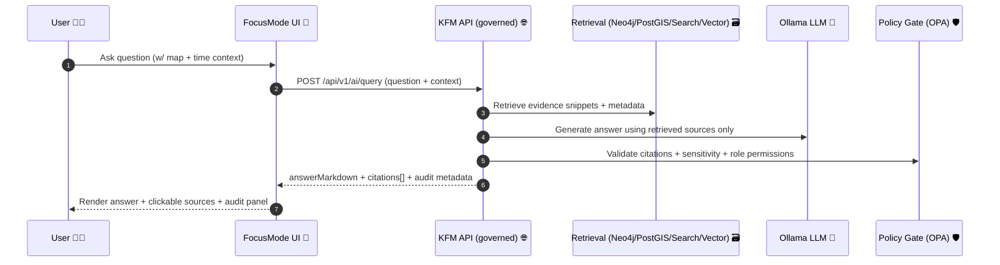

# 🧠 Focus Mode (Evidence‑First Assistant)

<p align="center">
  
  
  
  
  
  
</p>

> **Focus Mode** is the KFM “research librarian + GIS analyst” chat panel 🗺️📚 — designed to **answer only when it can show its work** (citations + provenance), and to **fail closed** when it cannot.

---

## ✨ What lives in this folder?

This directory contains the **Focus Mode UI component(s)** used by the KFM web app (React/TypeScript). The UI:
- 💬 renders a chat-like experience (question → answer)
- 🧾 displays **clickable citations** (sources list + snippets)
- 🧭 stays **context-aware** (map bbox, selected place, active layers, timeline)
- 🛡️ never calls the LLM directly — **only the governed KFM API** (policy + provenance enforced server-side)

---

## 🧭 Non‑negotiable contracts (read this first)

> [!IMPORTANT]
> **Focus Mode must remain “evidence-first.”** If an answer cannot be tied to sources returned by the API, the UI must treat the response as **invalid** and show a safe fallback.

### ✅ Must-haves
- **UI → API only**: The UI **never** talks directly to Ollama (or any model runtime).  
- **Citations required**: Every factual response must include citations like `[1] [2]`.
- **Fail closed**: If citations are missing / policy denies / evidence is empty → show a refusal UX (not a “best guess”).
- **Treat all model output as untrusted**: sanitize before rendering (especially Markdown/HTML).
- **Provenance-aware UX**: the UI should provide a way to inspect sources/snippets (“audit panel” 🧾🔍).

### 🚫 Non-goals
- Building a generic internet chatbot 🌐❌
- Letting UI bypass governance gates (no direct DB calls, no direct model calls) 🔒❌
- Fabricating narrative without sources (no “hallucinated history”) 🧯❌

---

## 🏗️ High-level flow (UI perspective)



---

## 🗺️ Context awareness: what “map-aware” means

Focus Mode should include relevant UI context in each query, such as:
- 📍 map center / bbox (what the user is looking at)
- 🕰️ timeline state (year/range)
- 🧩 active layers (which datasets are currently visible)
- 🧷 selected feature(s) (county, place, event, story node)
- 🧵 conversation/session id (optional; enables multi-turn continuity)

> [!TIP]
> If the user changes time/layers/selection, show a tiny “context chip” row so they can see what the assistant is grounded on (and optionally clear it).

---

## 🔌 API contract (frontend expectations)

> [!NOTE]
> The authoritative endpoint + schema live in the server docs (see **References**). This section describes the **expected UI contract**.

### Endpoint (typical)
- `POST /api/v1/ai/query` (preferred, versioned)
- Some deployments may also expose a legacy `POST /focus-mode/query`

### Suggested request shape (TypeScript)

```ts
export type FocusModeQueryRequest = {
  question: string;

  // Context is what makes answers “map-aware”
  context?: {
    bbox?: [number, number, number, number]; // [minX, minY, maxX, maxY]
    center?: [number, number];              // [lng, lat]
    zoom?: number;

    time?: { start: string; end: string } | { year: number };

    selectedFeatureIds?: string[];
    activeLayerIds?: string[];

    storyId?: string;
    placeId?: string;
  };

  conversationId?: string; // optional multi-turn thread id
  stream?: boolean;        // enable SSE/streaming if supported
};
```

### Suggested response shape (TypeScript)

```ts
export type FocusModeCitation = {
  key: string;        // "1", "2", ...
  title: string;      // human label for UI
  sourceId: string;   // stable identifier in KFM
  url?: string;       // optional deep-link
  snippet?: string;   // short excerpt shown in audit panel
  datasetId?: string; // if applicable
  license?: string;   // if applicable
  publishedAt?: string;
};

export type FocusModeQueryResponse = {
  answerMarkdown: string;        // model answer (untrusted input!)
  citations: FocusModeCitation[]; // structured mapping for [1], [2], ...

  // Optional but strongly recommended for traceability:
  audit?: {
    requestId: string;
    model?: { provider: "ollama"; name: string; version?: string };
    policy?: { decision: "allow" | "deny"; reasons?: string[] };
    retrieved?: Array<{ sourceId: string; score?: number }>;
  };
};
```

---

## 🧾 Citations UX (how to render “No Source, No Answer”)

### Citation rendering rules ✅
1. The answer uses bracket markers like: `... Dust Bowl impacts [1] ...`  
2. The UI must render a **Sources** section that lists citation metadata:
   - `[1] Title → open source`
   - optional: snippet, dataset/license, “open in catalog”, etc.
3. Clicking a citation marker should:
   - jump/scroll to the source row
   - highlight the source row
   - optionally open an “Evidence Drawer” 🧾

### Validation rules 🛡️
Treat the response as invalid if:
- `citations.length === 0`
- the answer contains markers like `[3]` but citation `key: "3"` is missing
- policy says `deny`
- answer is missing required citation markers (if your server enforces that)

> [!WARNING]
> Do **not** silently “hide missing citations.” That turns Focus Mode into a black box. If citations don’t line up, show a refusal + ask the user to refine the scope.

---

## 🧩 Recommended component layout 🗂️

> This is a suggested structure (adapt to what exists). Keep **UI**, **API client**, and **state** cleanly separated.

```text
web/src/components/focus-mode/
├─ 📄 README.md
├─ 🧠 FocusModePanel.tsx            # container panel (layout, docking)
├─ 💬 FocusModeChat.tsx             # message list + input
├─ 🧾 FocusModeCitations.tsx        # sources list + linking
├─ 🔍 FocusModeAuditDrawer.tsx      # evidence/snippets/provenance
├─ 🔌 focusMode.api.ts              # API client (fetch/SSE)
├─ 🧷 focusMode.types.ts            # request/response types
├─ 🧰 focusMode.utils.ts            # citation parsing, helpers
└─ 🧪 __tests__/                    # unit tests (parsing, rendering)
```

---

## 🛡️ Security, governance, and safe rendering

### 🔐 “Least privilege” mindset
Even though the backend does prompt sanitization + policy gating, the UI must still:
- sanitize Markdown output before rendering
- prevent HTML injection
- avoid leaking secrets/tokens into logs
- treat all AI text as **untrusted input**

### ✅ Practical guidance
- Use `react-markdown` + `remark-gfm`
- Add `rehype-sanitize` (or sanitize at the string boundary)
- Disallow raw HTML unless you *really* mean it
- For external links: add `rel="noreferrer noopener"`

> [!IMPORTANT]
> The model output is a **draft narrative** built from retrieved evidence — not an authority. The UI should encourage users to open sources (“the map behind the map” 🗺️).

---

## ⚡ Streaming (optional, but nice)

If the API supports streaming (SSE or chunked fetch):
- show incremental text output ✍️
- allow **Cancel** (AbortController)
- preserve citation behavior:
  - either citations arrive at the end, or
  - citations stream separately (preferred if supported)

> [!TIP]
> Even with streaming, keep a final “validated answer” pass: only mark an answer “ready” once citations are present + consistent.

---

## 🧪 Testing checklist (minimum viable confidence)

### Unit tests ✅
- citation marker parsing: `"[1]" → key "1"`
- mismatch detection: answer references `[4]` but citations missing `"4"`
- safe markdown rendering (no `<script>` execution)
- “deny” policy response displays refusal UX

### Integration tests 🔁
- map context included in request payload
- consistent rendering across theme/layout changes
- keyboard-only navigation + focus order

---

## 🧯 Troubleshooting (common failure modes)

- **No citations returned** → show refusal + suggest narrowing scope (place/time/layers)
- **Policy denied** → display a governance-friendly message; do not retry automatically
- **Backend unreachable** → show offline state + “Try again” button
- **Citation mismatch** → treat as invalid answer (bug or schema mismatch)

---

## ✅ PR checklist (ship-ready)

- [ ] UI calls **only** KFM API endpoints (no direct model calls)
- [ ] Markdown output sanitized
- [ ] Answer is not displayed as “valid” without citations
- [ ] Sources panel renders stable metadata (title/id/link)
- [ ] Context chips reflect current map/time/layers
- [ ] Tests updated/added for citation parsing + mismatch handling

---

## 📚 References 🔗

From this directory, repo-root is `../../../../`.

- 🏛️ System overview: `../../../../docs/architecture/system_overview.md`
- 🤖 AI overview: `../../../../docs/architecture/AI_SYSTEM_OVERVIEW.md`
- 🦙 Ollama integration: `../../../../docs/architecture/ai/OLLAMA_INTEGRATION.md`
- 🌐 API contracts: `../../../../src/server/api/README.md`
- 🧪 Env config (model + endpoints): `../../../../.env.example`

> [!NOTE]
> If any of the above paths differ in your branch, update this README to match the canonical docs locations.