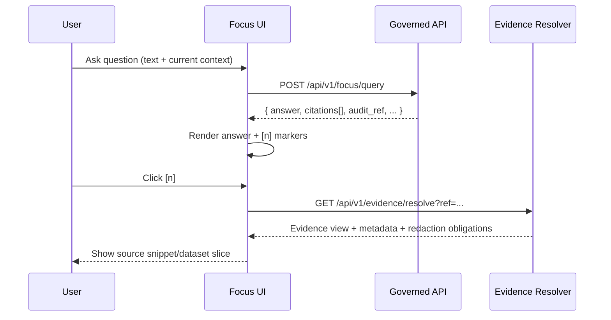
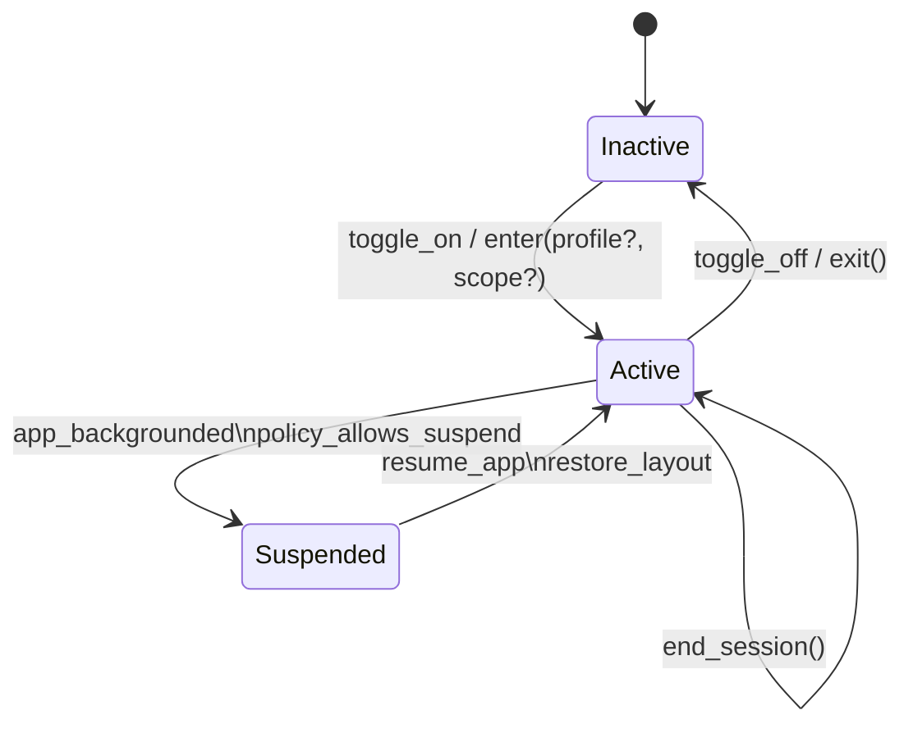

<!--
File: web/src/components/focus/README.md

KFM Governed Artifact
- Audience: web engineers, reviewers, governance/QA
- Scope: Focus Mode UI components only (React)
-->

# Focus Mode Components


Focus Mode in KFM is a **global UI attention state** + a **cited analyst assistant surface**:
- **Visual Focus:** reduces cognitive load by suppressing navigation chrome and distractions.
- **Focus Assistant:** answers questions *only with evidence from KFM* and *always with citations + audit reference* (or it abstains).  

> [!IMPORTANT]
> **Trust membrane rule:** this UI **never** reads from databases directly. It consumes **governed API** responses only (policy boundary + audit). If you think you need “just one DB query,” you actually need an API contract.  
> *If it can’t be traced to an approved source, it must be labeled* **not confirmed** *or withheld.*

---

## What lives in this folder

This folder is the **UI implementation** of Focus Mode: layout suppression, toggles, chat/panel UI, citation rendering, evidence viewing, and audit/explain affordances.

**This folder does not implement:**
- retrieval (RAG / search / ranking),
- policy evaluation / OPA enforcement,
- provenance ledger writes,
- database access,
- dataset transforms.

Those belong behind the **governed API boundary**.

---

## Non-negotiable invariants

### Evidence-first behavior

Focus Mode answers must:
1) **Cite** every factual claim (inline markers like `[1]`, `[2]`)  
2) Make citations **clickable** to open a source view (document snippet, dataset entry, etc.)  
3) Provide an **audit reference** (e.g., `audit_ref`) for every answer  
4) **Abstain** (or label **not confirmed**) if citations cannot be produced

> [!NOTE]
> The UI must treat “no citations returned” as a **contract failure** (not as a normal response). Display a safe refusal state.

### Policy-governed + advisory-only

- The assistant is **read-only**: it does not execute autonomous actions.
- If policy blocks/redacts content, the UI must:
  - show that a refusal/redaction occurred,
  - avoid leaking hidden content via tooltips, logs, analytics, or client-side caching.

### Auditability

The UI must surface:
- `audit_ref` (copyable)
- correlation IDs (if provided by API)
- explain/audit drawer when enabled (feature-flagged)

---

## Folder structure

> [!CAUTION]
> The tree below is a **recommended skeleton**. If actual filenames differ, update this README so reviewers can map behavior → code fast.

```text
web/
└─ src/
   └─ components/
      └─ focus/
         ├─ README.md
         ├─ FocusShell.tsx                 # Top-level UI overlay + chrome suppression
         ├─ FocusProvider.tsx              # React context for focus state + events
         ├─ FocusToggle.tsx                # UI control + keyboard shortcut hook
         ├─ FocusPanel.tsx                 # Container for assistant + focus session UI
         │
         ├─ assistant/
         │  ├─ FocusChat.tsx               # Message list + composer
         │  ├─ MessageList.tsx
         │  ├─ MessageComposer.tsx
         │  ├─ AnswerRenderer.tsx          # Renders markdown + inline citations
         │  └─ RefusalCard.tsx             # “abstain / not confirmed / policy blocked”
         │
         ├─ citations/
         │  ├─ CitationPill.tsx            # Inline [1] marker UI
         │  ├─ CitationList.tsx            # End-of-answer list
         │  └─ CitationResolver.ts         # Lazy evidence resolve orchestration
         │
         ├─ evidence/
         │  ├─ EvidenceDrawer.tsx          # Source viewer drawer/modal
         │  ├─ EvidenceSnippet.tsx         # Doc snippet / dataset slice UI
         │  └─ EvidenceRedactionBadge.tsx  # Redacted/permissioned indicators
         │
         ├─ audit/
         │  ├─ AuditDrawer.tsx             # “Show work” / retrieved contexts (if permitted)
         │  └─ AuditRef.tsx                # Copy audit_ref + correlation id(s)
         │
         ├─ state/
         │  ├─ focusMachine.ts             # Overlay state machine (UI contract)
         │  ├─ types.ts                    # FocusMode types + API DTOs
         │  └─ events.ts                   # UI event taxonomy (local)
         │
         ├─ hooks/
         │  ├─ useFocusHotkeys.ts          # Cmd+. / Ctrl+. toggle (configurable)
         │  ├─ useFocusQuery.ts            # POST /api/v1/focus/query
         │  └─ useEvidenceResolve.ts       # GET /api/v1/evidence/resolve
         │
         └─ __tests__/
            ├─ focusMachine.test.ts
            ├─ FocusShell.a11y.test.ts
            └─ FocusChat.contract.test.ts
```

---

## UX flows

### Enter / exit Focus Mode

Minimum MVP behavior:
- one action toggles a distraction-reduced UI (hide/collapse chrome)
- content remains unchanged
- there is always an accessible “Exit Focus Mode” action

**Keyboard shortcut (default):**
- macOS: `⌘ + .`
- Windows/Linux: `Ctrl + .`

> [!IMPORTANT]
> Keyboard handling must not trap focus when panels are hidden. Ensure tab order remains valid and exit is always reachable.

### Ask a question with evidence

1) user asks a question (often with map/timeline context)
2) UI sends request to governed endpoint
3) UI renders answer with inline citations
4) user opens evidence drawer to verify sources
5) user optionally opens “Audit/Explain” drawer (if enabled)



---

## Core API contracts

> [!NOTE]
> These contracts are defined here so UI work remains reviewable and testable. Update them only alongside backend/OpenAPI changes.

### Focus query

**Request**
```ts
export type FocusQueryRequest = {
  question: string;

  /**
   * Context should be minimal and policy-safe:
   * - avoid precise coordinates unless needed
   * - prefer bbox or named regions
   * - include time range only if relevant
   */
  context?: {
    viewport_bbox?: [number, number, number, number]; // [minLon, minLat, maxLon, maxLat]
    time_range?: { start: string; end: string };      // ISO-8601
    active_layers?: string[];
    selection?: { type: string; id: string };
  };

  user_role?: string;
};
```

**Response**
```ts
export type FocusCitation = {
  /** A stable reference that can be resolved by the evidence resolver */
  ref: string; // e.g., "doc://...", "dcat://...", "stac://...", "prov://..."
  label?: string; // short display label
  claim_span?: { start: number; end: number }; // optional: character offsets in answer
};

export type FocusQueryResponse =
  | {
      kind: "answer";
      answer: string;            // markdown allowed
      citations: FocusCitation[]; // REQUIRED (or UI treats as contract violation)
      audit_ref: string;          // REQUIRED
      redactions?: Array<{ reason: string; fields?: string[] }>;
    }
  | {
      kind: "refusal";
      reason:
        | "insufficient_evidence"
        | "policy_denied"
        | "permission_denied"
        | "malformed_request"
        | "system_error";
      message: string; // user-safe text
      audit_ref?: string;
    };
```

### Evidence resolver

**Goal:** every `citations[].ref` must resolve in bounded calls.

**Endpoint**
```text
GET /api/v1/evidence/resolve?ref=<scheme://...>
```

**Expected behavior**
- returns a human-readable evidence view (snippet / dataset slice / provenance pointers)
- returns machine-readable metadata (license/sensitivity flags, version, etc.)
- returns access decision + redaction obligations

---

## Focus overlay state machine

Focus Mode should be implemented as a **policy-driven overlay state machine**, orthogonal to content objects. The key reason: it allows incremental rollout (visual focus now; sessions/presence later) without entangling core content state.



### Durable vs ephemeral state

Focus Mode introduces two classes of state:

**Durable (sync-worthy)**
- focus profiles (preferences/policies)
- session history (for review + analytics)

**Ephemeral (usually not sync-worthy)**
- current “active focus” chrome state per window
- presence signals (broadcast; not long-term storage)

> [!IMPORTANT]
> If we store any state client-side, treat it as sensitive by default:
> - minimize what you store
> - avoid storing raw scope names if policy might restrict it
> - prefer hashed/redacted identifiers for telemetry

---

## Accessibility requirements

> [!IMPORTANT]
> Focus Mode must be usable keyboard-first and screen-reader friendly.

Checklist:
- [ ] Always-visible (or always-reachable) **Exit Focus Mode** control with clear accessible name
- [ ] No “focus trap” when panels are hidden/collapsed
- [ ] Keyboard shortcut discoverability (menu item + tooltip + docs)
- [ ] Timer/session updates use polite ARIA live regions (avoid spammy announcements)
- [ ] Citation markers are focusable and have accessible labels (“Open citation 3”)
- [ ] Evidence drawer has correct dialog semantics (`role="dialog"`, labelledby, focus return)
- [ ] High-contrast focus outline in Focus Mode theme

---

## Testing and CI expectations

Testing must cover:
- UX correctness
- policy/refusal correctness
- offline correctness (if enabled)
- accessibility
- security/privacy regressions

### Minimum test matrix

| Layer | What we test | Pass/fail signal |
|------:|--------------|------------------|
| Unit | state machine transitions; event schemas | deterministic graph coverage |
| Component/UI | panel hide/show; shortcuts; citation click | no layout regressions; stable a11y tree |
| Integration | API contract; refusal modes; citation resolvability | citations resolve or correct 403/404 |
| Offline (if enabled) | cache/restore focus profile; queued events | no data loss across offline/online |
| A11y | keyboard nav; ARIA correctness | WCAG 2.2 AA target checks |
| Security/privacy | token handling, logging redaction, telemetry | no sensitive leakage in logs/events |

### Definition of Done for changes in this folder

- [ ] Does not violate trust membrane (no DB / no private endpoints)
- [ ] Adds/updates TypeScript DTOs for any contract change
- [ ] Includes tests appropriate to change scope (unit + component at minimum)
- [ ] Maintains citation UX (click → evidence view)
- [ ] Handles refusal modes explicitly (no silent failure states)
- [ ] Does not introduce sensitive leakage via console logs or analytics
- [ ] A11y checks run and pass for affected surfaces

---

## Feature-flag guidance

Focus Mode is a cross-cutting feature. Ship behind flags:
- `focus.visual` (chrome suppression)
- `focus.assistant` (chat + citations)
- `focus.audit_drawer` (explain/audit UI)
- `focus.sessions` (timer + history)
- `focus.presence` (team visibility)

> [!NOTE]
> Flagging keeps policy and privacy review manageable. Promote flags only after governance sign-off.

---

## References and source documents

These documents define the load-bearing requirements for this folder (update paths/links to match repo layout):
- `KFM_Masterpiece_Vision.pdf` — “not a black box”, “not confirmed” promise, trust membrane framing
- `KFM-Bluprint-&-Ideas.pdf` — Focus Mode as “cited analyst”, clickable citations, audit/explain UI
- `Deep Research Report on Craft KFM Focus Mode.pdf` — overlay state machine, event model, a11y/testing guidance

---

## Contact and governance review

If you are adding UI that:
- reveals precise locations,
- changes citation/evidence behavior,
- changes logging/telemetry,
- introduces new persistence,

open a governance review issue and tag:
- security
- data governance
- accessibility
- provenance/audit
