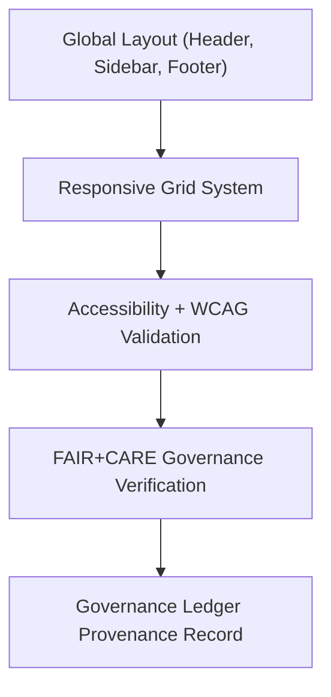

<div align="center">

# 🧭 **Kansas Frontier Matrix — Layout Components Module (v2.1.1 · Tier-Ω+∞ Certified)**  
`web/src/components/layout/README.md`

**Mission:** Define and document the **core layout structure** for the **Kansas Frontier Matrix (KFM)** web application —  
ensuring responsive, accessible, and FAIR+CARE-governed design architecture across all UI screens.

[](../../../../../docs/)
[](../../../../../docs/standards/faircare-validation.md)
[](../../../../../docs/standards/accessibility.md)
[](../../../../../LICENSE)

</div>

---

## 📚 Overview

The **Layout Module** provides the foundational structure and responsive grid system for the  
Kansas Frontier Matrix (KFM) web interface. It defines the base layout for pages, dashboards,  
and data visualization panels, aligning all UI components under FAIR+CARE and WCAG 2.1 AA principles.

Core objectives:
- 🧱 Define universal grid and layout patterns for consistent UI structure.  
- ♿ Maintain accessibility through semantic HTML and ARIA roles.  
- 🧩 Integrate FAIR+CARE governance across responsive designs.  
- 🧭 Support multi-device usability with mobile-first responsiveness.  

---

## 🗂️ Directory Layout

```bash
web/src/components/layout/
├── README.md                       # This file — Layout module documentation
│
├── header.tsx                       # Top navigation and branding component
├── footer.tsx                       # Page footer with FAIR+CARE and governance info
└── sidebar.tsx                      # Collapsible sidebar navigation and filters
```

---

## ⚙️ Layout Governance Model


<!-- END OF MERMAID -->

---

## 🧱 Core Components

| Component | Description | FAIR+CARE Function | Validation Workflow |
|:--|:--|:--|:--|
| **Header** | Contains project branding, navigation, and search. | Transparency + Accessibility | `design-validate.yml` |
| **Sidebar** | Displays hierarchical links and layer toggles. | Findable + Reusable | `ui-validate.yml` |
| **Footer** | Contains FAIR+CARE, license, and provenance links. | Responsibility + Ethics | `faircare-validate.yml` |

---

## 🧠 FAIR + CARE Integration

| Principle | Implementation | Validation |
|:--|:--|:--|
| **Findable** | Structured ARIA navigation and breadcrumbs. | `policy-check.yml` |
| **Accessible** | Semantic landmarks (`<header>`, `<nav>`, `<footer>`) for all users. | `design-validate.yml` |
| **Interoperable** | Consistent layout schema shared across UI components. | `ui-validate.yml` |
| **Reusable** | Global layout exported as shared wrapper components. | `docs-validate.yml` |
| **Collective Benefit (CARE)** | Accessible UI reinforces equitable participation. | `faircare-validate.yml` |

---

## ♿ Accessibility Standards (WCAG 2.1 AA)

| Feature | Implementation | Validation Workflow |
|:--|:--|:--|
| **Semantic Regions** | Uses `<header>`, `<main>`, `<aside>`, `<footer>` landmarks. | `design-validate.yml` |
| **Keyboard Navigation** | Tab/arrow key focus cycles across layout elements. | `ui-validate.yml` |
| **ARIA Roles** | Labeled navigation and search areas with `aria-label`. | `docs-validate.yml` |
| **Contrast Compliance** | 4.5:1 minimum contrast across layout elements. | `design-validate.yml` |

---

## 🔍 Provenance & Governance Integration

| Artifact | Description | Path |
|:--|:--|:--|
| **Layout Schema** | JSON registry for layout component structure. | `web/src/components/layout/schema.json` |
| **Governance Ledger** | Logs layout compliance and checksum. | `data/reports/audit/data_provenance_ledger.json` |
| **FAIR+CARE Validation Report** | Accessibility and design ethics validation. | `data/reports/fair/data_care_assessment.json` |

---

## 🧾 Example Component Metadata

```yaml
---
component_id: "layout_header_v2.1.1"
authors: ["@kfm-web","@kfm-accessibility"]
faircare_status: "Tier-Ω+∞ Verified"
checksum: "sha256:af9b21d3f03d54a7..."
governance_ledger_entry: "data/reports/audit/data_provenance_ledger.json"
accessibility_compliance: "WCAG 2.1 AA"
license: "MIT"
---
```

---

## 🧮 Observability Metrics

| Metric | Description | Target | Workflow |
|:--|:--|:--|:--|
| **Layout Load Time** | Time to render responsive grid layout. | ≤ 1.0s | `ui-validate.yml` |
| **Accessibility Compliance (WCAG)** | Percentage of layout regions passing audit. | ≥ 95 | `design-validate.yml` |
| **FAIR+CARE Compliance Rate** | Design inclusivity and transparency alignment. | ≥ 95 | `faircare-validate.yml` |
| **Governance Sync Rate** | Provenance log recorded successfully. | 100% | `governance-ledger.yml` |

---

## 🧾 Validation Workflows

| Workflow | Function | Output |
|:--|:--|:--|
| `ui-validate.yml` | Tests layout rendering, responsiveness, and keyboard flow. | `reports/validation/ui_validation.json` |
| `design-validate.yml` | Runs WCAG and ARIA validation. | `reports/validation/a11y_validation.json` |
| `faircare-validate.yml` | Checks ethical alignment and design inclusivity. | `reports/fair/data_care_assessment.json` |
| `governance-ledger.yml` | Logs checksum and layout provenance. | `data/reports/audit/data_provenance_ledger.json` |

---

## 🕰 Version History

| Version | Date | Author | Summary |
|:--|:--|:--|:--|
| **v2.1.1** | 2025-11-16 | @kfm-web | Added FAIR+CARE linkage and accessibility validation across layout components. |
| v2.0.0 | 2025-10-25 | @kfm-accessibility | Integrated governance metadata and WCAG compliance reports. |
| v1.0.0 | 2025-10-04 | @kfm-docs | Initial layout documentation and responsive design governance. |

---

<div align="center">

**Kansas Frontier Matrix © 2025**  
*“Structure with Ethics — Design with Purpose.”*  
📍 `web/src/components/layout/README.md` — FAIR+CARE-aligned layout component documentation for the Kansas Frontier Matrix.

</div>

