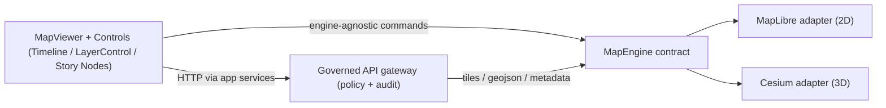

<!--
File: web/src/components/map/engines/README.md
Scope: Frontend rendering engines only (2D/3D). Governed-data access stays behind the API boundary.
-->

# Map Engines (2D + 3D)


This folder contains **map rendering engine adapters** used by the KFM web UI.  
The goal is to let higher-level UI components (ex: `MapViewer`) drive a map in a **engine-agnostic** way, while still supporting **2D** (MapLibre GL JS) and **3D** (CesiumJS) experiences.

> [!IMPORTANT]
> **Trust membrane invariant:** engines are **renderers**.  
> They must **never** connect directly to databases/object stores or perform governance decisions.  
> Engines should render **only** what upstream UI/services provide (API responses, vetted URLs, and already-policy-processed data).

---

## What belongs in this folder

✅ Engine implementation details:
- Initializing / destroying the underlying engine runtime (MapLibre `Map`, Cesium `Viewer`)
- Translating common KFM “map actions” into engine calls (camera/view updates, layer attach/detach, picking)
- Normalizing engine events (click/hover, viewport changes) into a stable internal shape
- Hosting engine-specific glue for overlays (e.g., badge/label anchoring to features)

✅ Engine-specific performance work:
- Debouncing camera events
- WebGL context-loss recovery hooks
- Feature-picking optimizations / hit-test throttling

🚫 Not here:
- Fetching raw data from the internet or storage backends
- Data licensing checks, sensitivity masking, attestation verification, citation enforcement  
  (those are API / policy responsibilities)
- Story Node / Focus Mode business logic (those are UI/use-case responsibilities)

---

## Why “engines”?

KFM’s map UX spans **flat 2D vector maps** and **3D globe/terrain**. MapLibre and Cesium solve different problems well; KFM needs both, with a toggleable experience.

This folder implements that as a **Bridge/Adapter** design:
- UI talks to **`MapEngine`** (our internal contract)
- `MapEngine` is implemented by engine adapters (MapLibre, Cesium)
- Engine adapters talk to the real libraries



---

## Suggested directory layout

> [!NOTE]
> This is a **recommended** layout for clarity and testability.  
> If your repo already has a different layout, treat this as the target shape to converge toward.

```text
web/
  src/
    components/
      map/
        engines/
          README.md
          index.ts                  # public exports + registry
          types.ts                  # engine-agnostic contracts (NO MapLibre/Cesium types)
          maplibre/
            MapLibreEngine.ts       # adapter
            maplibre.utils.ts       # style/layer helpers
          cesium/
            CesiumEngine.ts         # adapter
            cesium.utils.ts         # tileset/imagery helpers
          overlays/
            OverlayHost.ts          # shared overlay anchoring (optional)
          __tests__/
            engines.contract.test.ts
            maplibre.adapter.test.ts
            cesium.adapter.test.ts
```

---

## Engine contract

The **engine contract** is the “API boundary” *inside the frontend*.

### Contract principles

- **Stable and small**: UI code should not depend on engine-specific types.
- **Deterministic**: the same command should yield the same visible result given the same inputs.
- **Auditable in tests**: adapters should be unit-testable with mocks/fakes.

<details>
<summary><strong>Proposed TypeScript contract (starter)</strong></summary>

```ts
// web/src/components/map/engines/types.ts

export type EngineId = "maplibre" | "cesium";

export type ViewState = {
  // Use lng/lat + zoom for 2D, and allow pitch/bearing for 3D-ish camera parity.
  lng: number;
  lat: number;
  zoom: number;
  bearing?: number; // degrees
  pitch?: number;   // degrees
};

export type EngineInitOptions = {
  engine: EngineId;
  initialView: ViewState;

  /**
   * Engine adapters should NOT decide access.
   * Use this only to pass already-authorized base URLs / headers.
   */
  request?: {
    baseUrl?: string;
    headers?: Record<string, string>;
    credentials?: "omit" | "same-origin" | "include";
  };

  /**
   * Style IDs, basemap selectors, etc. are higher-level concerns,
   * but engines need the resolved style/config to initialize.
   */
  style?: unknown;
};

export type LayerId = string;

export type LayerSpec =
  | {
      kind: "vector-tile";
      id: LayerId;
      // e.g. {z}/{x}/{y}.pbf (already governed URL)
      tiles: string[];
      sourceLayer?: string;
      style?: unknown; // paint/layout-like config (engine-agnostic)
      minzoom?: number;
      maxzoom?: number;
    }
  | {
      kind: "geojson";
      id: LayerId;
      data: GeoJSON.FeatureCollection;
      style?: unknown;
    }
  | {
      kind: "raster-tile";
      id: LayerId;
      tiles: string[];
      tileSize?: number;
      minzoom?: number;
      maxzoom?: number;
      opacity?: number;
    }
  | {
      kind: "tiles3d";
      id: LayerId;
      // 3D Tiles tileset.json URL (already governed URL)
      tilesetUrl: string;
      style?: unknown; // styling rules (engine-specific translation)
    };

export type PickedFeature = {
  layerId: LayerId;
  featureId?: string; // stable ID if present (preferred)
  properties?: Record<string, unknown>;
  lngLat: { lng: number; lat: number };
};

export type EngineEventMap = {
  viewChanged: { view: ViewState; isUserGesture: boolean };
  click: { picked?: PickedFeature; lngLat: { lng: number; lat: number } };
  hover: { picked?: PickedFeature; lngLat: { lng: number; lat: number } };
  error: { message: string; cause?: unknown };
};

export interface MapEngine {
  readonly id: EngineId;

  mount(container: HTMLElement, options: EngineInitOptions): Promise<void>;
  destroy(): void;

  getView(): ViewState;
  setView(next: ViewState, opts?: { animate?: boolean }): void;

  setLayers(layers: LayerSpec[]): void;
  setLayerVisibility(layerId: LayerId, visible: boolean): void;
  setLayerOpacity(layerId: LayerId, opacity: number): void;

  pick(point: { x: number; y: number }): PickedFeature | undefined;

  on<K extends keyof EngineEventMap>(
    event: K,
    handler: (payload: EngineEventMap[K]) => void
  ): () => void;
}
```

</details>

---

## Capability matrix

This is the **target** parity. Not all rows will be “done” at first.

| Capability | MapLibre (2D) | Cesium (3D) | Notes |
|---|---:|---:|---|
| Vector tiles (PBF) | ✅ | ⚠️ | Cesium supports vectors but the UX/format strategy may differ |
| GeoJSON overlays | ✅ | ✅ | Keep GeoJSON small; large datasets should be tiled |
| Raster tiles | ✅ | ✅ | Basemap + draped imagery |
| 3D Tiles | ❌ | ✅ | Cesium-native strength |
| Terrain / DEM | ⚠️ | ✅ | Cesium terrain pipeline; MapLibre terrain depends on chosen approach |
| Feature picking | ✅ | ✅ | Must normalize output to `PickedFeature` |
| Story-driven camera keyframes | ✅ | ✅ | Deterministic camera transitions are key for Story Nodes |
| Provenance badge overlays | ✅ | ✅ | Adapters attach overlays without coupling to provenance source |

Legend: ✅ supported, ⚠️ possible/partial/strategy needed, ❌ not applicable.

---

## Data inputs

Engines should be fed via **engine-agnostic specs** (like `LayerSpec`) created upstream by:
- layer registry / layer catalog UI
- story playback system (Story Nodes)
- Focus Mode “map actions” (if enabled in the UI)

### Recommended patterns

- **Big layers ⇒ tiles** (vector tiles / raster tiles / 3D tiles)  
- **Small layers ⇒ GeoJSON** (feature collections sized for client performance)
- **Always attach provenance metadata upstream**, so:
  - feature inspectors can show dataset IDs, citations, audit refs
  - map click → “evidence drawer” is always available

---

## Overlays and provenance UI

Many KFM UI patterns require overlays that are **not** part of the base map render:
- “Automation/health” badges
- sensitivity indicators
- feature callouts
- Story Node “guided step” markers

This folder may include overlay anchoring helpers, but **must not**:
- verify attestations (do that server-side)
- fetch untrusted links directly from the browser

> [!TIP]
> Prefer a single overlay host abstraction (DOM overlay anchored to map/globe) that both engines can implement.

---

## Adding a new engine

Use this checklist when introducing a new renderer (or doing a major refactor).

### Thin-slice steps

1. Implement `MapEngine` adapter with **mount / destroy / setView / setLayers / pick / events**
2. Add it to the engine registry in `index.ts`
3. Add a minimal story “camera keyframe” demo path (proves determinism)
4. Add contract tests (adapter must pass a shared suite)

### Definition of Done

- [ ] Adapter implements `MapEngine` without leaking engine-specific types past `engines/`
- [ ] Works in a basic MapViewer flow: toggle engine, keep camera and active layers
- [ ] Picking returns a normalized `PickedFeature` (no raw MapLibre/Cesium objects)
- [ ] No direct DB/object-store access from the engine adapter
- [ ] Unit tests cover: layer attach/detach, click picking, camera update, teardown
- [ ] E2E test (recommended): scripted camera path screenshots across 2D/3D

---

## Testing strategy

### Unit tests (fast, deterministic)
- Mock the engine APIs (MapLibre map object / Cesium viewer)
- Validate the adapter contract:
  - view updates are applied
  - layers are added/removed idempotently
  - events are normalized

### E2E (recommended)
- Script a set of “camera paths”:
  - baseline zoom/pan
  - Story Node keyframes
  - 2D ↔ 3D switch
- Screenshot/assert that overlays align and no blank frames occur

---

## Security & governance notes

- Never render untrusted HTML in popups/tooltips. Sanitize any rich text.
- Never embed secrets in client code. Use short-lived tokens and server mediation.
- Treat “sensitive” layers as **already generalized** before they hit the engine.
- Prefer fail-closed UX: if data or provenance is missing, render a safe fallback state.

---

## Related docs (project-level)

- Web UI architecture (React/TypeScript), map engines choice, and MapViewer responsibilities
- Trust membrane / policy-as-code expectations
- Story Nodes + Focus Mode “map-first” UX patterns

> Keep this README aligned with the governed architecture: **data → pipeline → catalogs/provenance → APIs → UI/Focus Mode**.