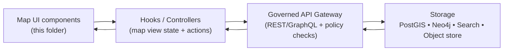

# Map UI components


This directory contains **presentational UI components** that surround the interactive map canvas (MapLibre) and make the “map-first” experience usable: controls, panels, drawers, legends, and map-adjacent overlays.

> [!IMPORTANT]
> **Governed UX rule:** every visible layer, story step, or AI answer must expose “where it came from” (provenance + citations), and any sensitive information must be generalized/redacted before it is shown to users.

---

## Responsibilities

### What belongs here

- UI widgets for map interaction (zoom, basemap picker, search box, measurement tools, etc.).
- Panels/drawers used while viewing the map (Layers, Legend, Provenance, Story Node, Focus Mode).
- Read-only presentation of state produced elsewhere (e.g., active layers, time window, cursor inspection results).
- Accessibility-first interaction surfaces (keyboard operable, ARIA labels, focus management).

### What does not belong here

- **Direct data-store access** (no PostGIS/Neo4j/Search access, no raw SQL/Cypher).
- Business rules (put them in domain/use-case code or hooks/services).
- Policy decisions (those are enforced by governed APIs and policy gates; UI only renders what it is permitted to see).
- Heavy geoprocessing (belongs in pipeline / backend services).

> [!NOTE]
> Keep MapLibre imperative map mutations (addLayer/setStyle, etc.) behind a small adapter layer or hook. UI components should not own the map engine.

---

## Trust membrane and data flow

KFM’s frontend must remain **strictly decoupled** from backend storage and talk only to governed APIs. This preserves the project’s trust membrane and ensures auditing, policy enforcement, and provenance logging happen in the right place.



**UI contract expectations:**
- Render provenance/citations links for every layer and every story step.
- When a claim cannot be traced to evidence, the UI must show a “not confirmed” style and avoid overclaiming.
- Respect sensitivity flags and privacy levels (show generalized geometry where required).

---

## Provenance-first UI rules

### Layer and legend UX

Any UI that enables a user to **turn on or inspect a layer** must provide:
- **Source badge** (dataset key, provider)
- **Dataset DOI** when available
- **License/attribution**
- **Links to evidence** (DCAT landing page + STAC collection/item where applicable)
- **Processing lineage link** (PROV / run receipt / audit reference if available)

Recommended pattern: an `Info` affordance on each layer row that opens a drawer with the evidence bundle.

### Focus Mode and Story Nodes

For Focus Mode answers and Story Node steps:
- Show citation markers that open a **source viewer** (snippet/dataset entry).
- Include an **audit reference** for the response (so it can be reviewed later).
- Clearly differentiate:
  - **Fact** (cited)
  - **Interpretation / hypothesis** (labeled as such, with uncertainty)

> [!TIP]
> When coordinates are generalized/redacted, surface a **CARE badge** (e.g., `care.privacy_level`) and a permission label so users understand *why* precision is reduced.

---

## Sensitivity and CARE handling

Some layers (especially archaeological/cultural locations) require **dual representation**:
- **Public:** generalized geometry (coarsened coordinates, grid cell, or masked area)
- **Restricted:** precise geometry (permissioned)

UI behavior requirements:
- Never “reconstruct” precise locations from generalized data.
- Always display a **privacy badge** when coordinates were generalized/redacted.
- Ensure exports (screenshots, GeoJSON downloads, “share links”) obey the same sensitivity constraints.

> [!WARNING]
> If you are adding a new interactive affordance that reveals location (hover identify, click popup, measure tool),
> explicitly check sensitivity rules for that layer and confirm the UI cannot leak restricted precision.

---

## Performance patterns for map-first UX

### Progressive story navigation

To keep Story navigation responsive:
- Prefer **transition styles** (lightweight map styles) during story-step changes.
- Swap to full-fidelity styles once the map is idle and sources are loaded.

### Progressive layer reveal

Avoid mounting/unmounting heavy layers during navigation:
- Keep layers registered, but start them at opacity `0`.
- Fade to opacity `1` once the source reports ready.
- Cancel fades cleanly on rapid navigation.

### Rendering guidance

- Keep the MapLibre map instance stable (avoid re-creating it on re-render).
- Prefer memoization for derived UI state (layer lists, legend entries).
- Debounce high-frequency UI events (mousemove, hover inspect).

---

## Suggested directory layout

<details>
<summary><strong>Expand</strong></summary>

```text
web/
└─ src/
   └─ components/
      └─ map/
         └─ ui/
            ├─ README.md
            ├─ controls/
            │  ├─ ZoomControls/
            │  ├─ Compass/
            │  └─ BasemapPicker/
            ├─ panels/
            │  ├─ LayerPanel/
            │  ├─ LegendPanel/
            │  ├─ TimelinePanel/
            │  └─ StoryPanel/
            ├─ drawers/
            │  ├─ ProvenanceDrawer/
            │  ├─ FocusModeDrawer/
            │  └─ LayerInfoDrawer/
            ├─ overlays/
            │  ├─ MapHUD/
            │  └─ IdentifyPopup/
            └─ shared/
               ├─ badges/
               ├─ buttons/
               └─ typography/
```

</details>

> [!NOTE]
> This is a **suggested** organization. If the repo already has a different convention, follow the repo convention and keep this README updated.

---

## Component standards

| Category | What it is | Must support |
|---|---|---|
| Controls | Small, persistent map actions | Keyboard access, clear labels, no map re-init |
| Panels | Side panels with lists and filters | Virtualized lists if large; provenance affordance |
| Drawers | Slide-over detail surfaces | Evidence links, license display, sensitivity badges |
| Overlays | On-map UI elements | Non-blocking pointer events; screen-reader fallback |

General conventions:
- Prefer **pure components**: props in, render out.
- Fetch data via hooks/services; keep UI focused on rendering and interaction.
- Do not accept raw HTML from untrusted sources (sanitize or render as plain text).

---

## Testing checklist

### Minimum tests for UI components

- **Unit tests**: rendering states, keyboard navigation, aria-label presence.
- **Interaction tests**: layer toggles update view state; provenance drawer opens.
- **Policy/sensitivity tests**: sensitive layers never show restricted precision.
- **Story navigation**: no blank map state; camera/time window preserved across transitions.

### Example test matrix

| Feature | Unit | Integration | E2E |
|---|---:|---:|---:|
| Layer list + legend | ✅ | ✅ | ✅ |
| Provenance drawer | ✅ | ✅ | ✅ |
| Focus Mode citations | ✅ | ✅ | ✅ |
| Sensitivity redaction | ✅ | ✅ | ✅ |
| Progressive style swap |  | ✅ | ✅ |

---

## Definition of done for a new map UI feature

- [ ] UI follows trust membrane: uses governed API client only
- [ ] Provenance is visible and clickable for all new layers/features
- [ ] CARE/sensitivity is enforced and visibly indicated
- [ ] Keyboard operability + focus order tested
- [ ] No map blanking during navigation (story/time changes)
- [ ] Performance: no unnecessary re-creates of MapLibre map
- [ ] Tests added (unit + at least one integration/E2E path)
- [ ] README updated if new components or patterns were introduced

---

## How to add a new layer-related UI affordance

1. **Register the layer** in the layer registry/config (outside this folder).
2. Add UI controls here (layer toggle, opacity slider, etc.).
3. Ensure the layer row includes an **Info** affordance that opens provenance details:
   - dataset identifiers (provider keys, DOI if available)
   - DCAT + STAC links
   - license/attribution
   - processing lineage (PROV/run receipt)
4. Validate sensitivity handling:
   - public generalized vs restricted precise behavior
5. Add tests (see checklist above).

---

## Glossary

- **DCAT**: dataset catalog metadata for discovery.
- **STAC**: spatiotemporal asset catalog metadata for map-ready assets.
- **PROV**: provenance/lineage model describing how an artifact was produced.
- **Story Node**: governed narrative artifact that synchronizes map state and citations.
- **Focus Mode**: context-aware Q&A interface that must “cite or abstain.”