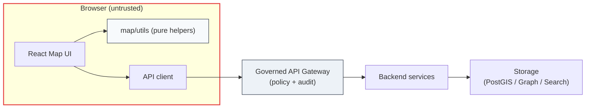

# Map Utils (`web/src/components/map/utils`)


Utilities for the **KFM Map UI** that are:

- **Pure / deterministic by default** (easy to test, cache, and reason about)
- **UI-safe** (no direct network, no secrets, no policy decisions)
- **Geospatially correct** (coordinate order, projections, units)
- **Governance-aligned** (trust membrane, sensitivity, provenance preservation)

> [!IMPORTANT]
> **Trust membrane rule:** the browser is an untrusted environment.  
> Anything present in client code or client-visible data should be considered **public**.  
> Do **not** implement access control or sensitivity protection here—enforce it in governed APIs and data pipelines.

---

## Data flow and boundaries



> [!NOTE]
> **Map utils are inside the browser trust boundary** — they can improve UX, but they cannot enforce security.

---

## Scope

### ✅ What belongs in `utils/`

| Category | Examples | Notes |
|---|---|---|
| Coordinate helpers | normalize/validate `[lng, lat]`, bbox helpers, conversions | Keep consistent coordinate order. |
| Temporal helpers | ISO parsing, time window normalization, slider conversions | Avoid locale-dependent formatting. |
| Layer/style helpers | Map style expressions, paint/layout builders | Keep them data-driven and testable. |
| Geometry helpers | feature filtering, lightweight calculations | Prefer fast primitives; be careful with expensive ops. |
| Serialization | view-state encoding/decoding, URL params helpers | Must be stable + backwards compatible. |
| Guardrails | runtime assertions, “safe defaults” | Throw early in dev; fail gracefully in prod. |

### ❌ What does *not* belong here

- React components, hooks, or anything that depends on the DOM
- Anything that directly calls the network (fetch/GraphQL/etc.)
- “Policy” logic (permissions, license enforcement, sensitivity decisions)
- Stateful singletons (global caches, mutable module-level state) unless reviewed

---

## Directory layout

> [!NOTE]
> The file names below are **illustrative** (not confirmed in repo).  
> Keep the folder organized by **capability**, not by “misc”.

```text
web/
└─ src/
   └─ components/
      └─ map/
         ├─ (components, hooks, layers, controls, …)
         └─ utils/
            ├─ README.md        ← you are here
            ├─ index.ts         ← barrel exports (recommended)
            ├─ coords.ts        ← lng/lat, bbox helpers (example)
            ├─ time.ts          ← temporal normalization (example)
            ├─ style.ts         ← layer/style helpers (example)
            ├─ serialize.ts     ← view-state/url helpers (example)
            └─ __tests__/       ← unit tests colocated (example)
```

---

## Conventions and contracts

### Coordinate order and units

- Prefer **GeoJSON coordinate order**: `[longitude, latitude]`.
- Be explicit about units in function names:
  - `meters`, `kilometers`, `degrees`, `pixels`, `ms` (milliseconds), etc.
- If a function assumes a projection (e.g., Web Mercator), state it in:
  - JSDoc
  - parameter names
  - tests

> [!TIP]
> When in doubt, return values in **WGS84 / `[lng, lat]`** for data interchange, and leave render-projection handling to the map engine.

### Determinism

Utilities should be deterministic:

- No hidden randomness
- No reading from `Date.now()` directly (inject `now` or accept a `Date`)
- No dependence on browser locale/timezone unless explicitly required

### Public exports

Prefer a single “public surface” via a barrel export:

```ts
// web/src/components/map/utils/index.ts
export * from "./coords";
export * from "./time";
export * from "./style";
// …
```

This keeps imports stable:

```ts
import { normalizeBbox, toIsoRange } from "@/components/map/utils";
```

---

## Examples

### Example: normalize a bbox

```ts
/**
 * Normalizes bbox input to [west, south, east, north].
 * Returns null when invalid.
 */
export function normalizeBbox(
  bbox: number[] | undefined | null,
): [number, number, number, number] | null {
  if (!bbox || bbox.length !== 4) return null;
  const [w, s, e, n] = bbox;
  if (![w, s, e, n].every(Number.isFinite)) return null;
  if (w > e || s > n) return null;
  return [w, s, e, n];
}
```

### Example: stable view-state serialization

```ts
export type MapViewState = {
  center: [number, number]; // [lng, lat]
  zoom: number;
  bearing?: number;
  pitch?: number;
  time?: { start: string; end: string }; // ISO 8601
};

export function encodeViewState(v: MapViewState): string {
  // Keep encoding stable (order, rounding, defaults).
  // Consider a version prefix (e.g., "v1:...") for future migrations.
  return JSON.stringify(v);
}
```

---

## Governance and safety notes

### “Do not strip provenance”

If feature properties include provenance/citation metadata (dataset IDs, lineage references, etc.), utilities should **preserve it by default** when:

- filtering
- reprojecting
- slicing by time
- merging feature collections

> [!WARNING]
> Treat provenance as user-visible UX, not optional “extra metadata”.

### Sensitivity handling

- If you are working with data that *might* be sensitive:
  - archaeological sites
  - private land details
  - culturally restricted knowledge
- assume the **server has already redacted/generalized**.  
  Frontend-only redaction is not a security boundary.

If you need client-side generalization for UX (e.g., “blur” markers at low zoom), do it as a **visual effect**, not as “protection”.

---

## Testing and quality gates

### Minimum tests expected

- ✅ happy path
- ✅ boundary cases (empty, null, NaN, inverted bbox)
- ✅ property/shape preservation (do not drop unknown properties)
- ✅ backward compatibility for serialization

### Definition of Done

- [ ] Function is pure/deterministic (or explicitly justified)
- [ ] JSDoc includes assumptions (projection, units, coordinate order)
- [ ] Unit tests added/updated
- [ ] No policy logic introduced (access/sensitivity/licensing)
- [ ] Exports added to `index.ts` (if intended as public)
- [ ] Lint + typecheck pass (see project scripts)

---

## Performance guidelines

- Prefer **O(1)** / **O(n)** loops; avoid nested loops over features unless necessary.
- Avoid heavy geometry operations on the main thread for large datasets.
- If you must do expensive work, consider:
  - memoization keyed by stable IDs
  - Web Workers (if adopted in the web app)
  - server-side precomputation via governed pipelines

---

## Change management

When changing behavior of a widely used util:

1. Add tests demonstrating current behavior
2. Introduce change behind a versioned function or option flag (when needed)
3. Update downstream call sites in the same PR
4. Add a short note to this README (or the map module changelog, if it exists)

---

## References

- KFM architecture and governance principles (trust membrane, evidence-first outputs) are defined at the system level; keep map UI utilities aligned with those principles.