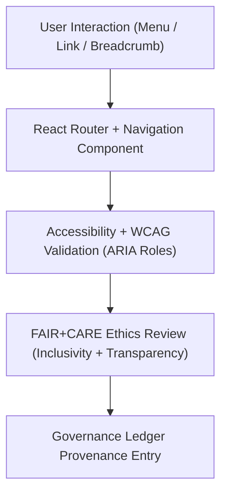

<div align="center">

# 🧭 **Kansas Frontier Matrix — Navigation Components Module (v2.1.1 · Tier-Ω+∞ Certified)**  
`web/src/components/navigation/README.md`

**Mission:** Provide accessible, FAIR+CARE-governed navigation components for the  
**Kansas Frontier Matrix (KFM)** web platform — enabling users to move ethically, intuitively,  
and transparently through historical, spatial, and AI-enhanced content layers.

[](../../../../../docs/)
[](../../../../../docs/standards/faircare-validation.md)
[](../../../../../docs/standards/accessibility.md)
[](../../../../../LICENSE)

</div>

---

## 📚 Overview

The **Navigation Module** defines the routing and wayfinding components of the  
Kansas Frontier Matrix web interface. It ensures all navigation pathways — menus, breadcrumbs, and pagination —  
adhere to FAIR+CARE, WCAG, and governance validation frameworks to maintain consistency, inclusivity,  
and provenance across the user journey.

Core objectives:
- 🧭 Build intuitive navigation for complex, multi-layered data views.  
- ♿ Support screen readers, keyboard access, and focus management.  
- 🧩 Embed FAIR+CARE ethics in routing and hierarchy.  
- 🔗 Track provenance and user flow events for governance review.

---

## 🗂️ Directory Layout

```bash
web/src/components/navigation/
├── README.md                    # This file — Navigation module documentation
│
├── navbar.tsx                    # Primary site navigation bar (responsive + accessible)
├── breadcrumb.tsx                # Path-based breadcrumb navigation component
└── pagination.tsx                # Pagination controls for datasets and search results
```

---

## ⚙️ Navigation Governance Model


<!-- END OF MERMAID -->

---

## 🧱 Core Components

| Component | Description | FAIR+CARE Function | Validation Workflow |
|:--|:--|:--|:--|
| **Navbar** | Main navigation bar with ARIA roles and tab focus. | Accessibility + Ethics | `design-validate.yml` |
| **Breadcrumb** | Displays hierarchical navigation paths for context. | Transparency + Findability | `ui-validate.yml` |
| **Pagination** | Dataset/page navigation controls with keyboard shortcuts. | Reusability + Accessibility | `ui-validate.yml` |

---

## 🧠 FAIR + CARE Integration

| Principle | Implementation | Validation |
|:--|:--|:--|
| **Findable** | Breadcrumbs and routes reflect dataset hierarchy. | `policy-check.yml` |
| **Accessible** | Full ARIA support and keyboard navigation for links. | `design-validate.yml` |
| **Interoperable** | Standard React Router pattern ensures consistent navigation. | `ui-validate.yml` |
| **Reusable** | Navigation components shared across modules. | `docs-validate.yml` |
| **Collective Benefit (CARE)** | Clear pathways promote user agency and comprehension. | `faircare-validate.yml` |

---

## ♿ Accessibility Standards (WCAG 2.1 AA)

| Feature | Implementation | Validation Workflow |
|:--|:--|:--|
| **Keyboard Navigation** | Arrow + tab key traversal across links and menus. | `ui-validate.yml` |
| **ARIA Roles** | `role="navigation"` and `aria-current` attributes implemented. | `design-validate.yml` |
| **Contrast Ratio** | ≥ 4.5:1 across navigation items and active states. | `design-validate.yml` |
| **Screen Reader Support** | Breadcrumbs and menus labeled via `aria-label`. | `docs-validate.yml` |

---

## 🔍 Provenance & Governance Integration

| Artifact | Description | Path |
|:--|:--|:--|
| **Navigation Registry** | JSON structure listing all route components. | `web/src/components/navigation/routes.json` |
| **Accessibility Reports** | Logs WCAG validation outcomes. | `reports/validation/a11y_validation.json` |
| **Governance Ledger** | Records navigation structure provenance and checksum. | `data/reports/audit/data_provenance_ledger.json` |

---

## 🧾 Example Component Metadata

```yaml
---
component_id: "navigation_navbar_v2.1.1"
authors: ["@kfm-web","@kfm-accessibility"]
faircare_status: "Tier-Ω+∞ Verified"
checksum: "sha256:ef23ac9e1d4f572b..."
governance_ledger_entry: "data/reports/audit/data_provenance_ledger.json"
accessibility_compliance: "WCAG 2.1 AA"
license: "MIT"
---
```

---

## 🧮 Observability Metrics

| Metric | Description | Target | Workflow |
|:--|:--|:--|:--|
| **Navigation Load Time** | Average render time for routes. | ≤ 0.5s | `ui-validate.yml` |
| **Accessibility Compliance (WCAG)** | Overall compliance across nav components. | ≥ 95 | `design-validate.yml` |
| **FAIR+CARE Ethics Score** | Inclusivity and transparency audit score. | ≥ 95 | `faircare-validate.yml` |
| **Governance Sync Rate** | Provenance record accuracy in ledger. | 100% | `governance-ledger.yml` |

---

## 🧾 Validation Workflows

| Workflow | Function | Output |
|:--|:--|:--|
| `ui-validate.yml` | Tests navigation routes and keyboard interactions. | `reports/validation/ui_validation.json` |
| `design-validate.yml` | Audits accessibility and color contrast. | `reports/validation/a11y_validation.json` |
| `faircare-validate.yml` | Ensures ethical navigation and user transparency. | `reports/fair/data_care_assessment.json` |
| `governance-ledger.yml` | Logs provenance and component checksums. | `data/reports/audit/data_provenance_ledger.json` |

---

## 🕰 Version History

| Version | Date | Author | Summary |
|:--|:--|:--|:--|
| **v2.1.1** | 2025-11-16 | @kfm-web | Added provenance registry and FAIR+CARE audit synchronization. |
| v2.0.0 | 2025-10-25 | @kfm-accessibility | Integrated WCAG navigation validation and breadcrumb semantics. |
| v1.0.0 | 2025-10-04 | @kfm-docs | Initial navigation documentation and governance model. |

---

<div align="center">

**Kansas Frontier Matrix © 2025**  
*“Navigation with Purpose — Accessibility with Integrity.”*  
📍 `web/src/components/navigation/README.md` — FAIR+CARE-aligned navigation component documentation for the Kansas Frontier Matrix.

</div>

