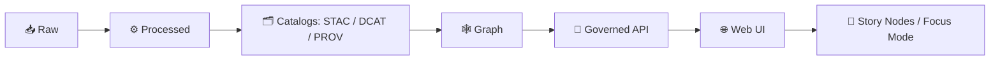

# 🧾 Provenance UI Components (`web/src/components/provenance/`)


> **Why this exists:** Kansas Frontier Matrix (KFM) is “show your work” by default.  
> The **Provenance UI** is the *human-facing* layer for lineage, citations, and auditability across **datasets**, **map layers**, and **Focus Mode** answers.

---

## ✨ What users get (product behavior)

### ✅ In the UI, provenance should feel like:
- **An “info” icon** next to any dataset/layer/claim that opens a **Provenance Drawer** 🧠
- A **summary first** (“where did this come from?”), with **deep drill-down** (“how was it produced?”)
- **Clickable evidence** (citations → original artifact metadata → provenance chain)
- Clear governance signals (license, sensitivity/classification, and redaction notes) 🛡️

---

## 🧭 KFM “Truth Path” (where provenance fits)

KFM treats provenance as a **first-class artifact** in the lifecycle.



**This folder** is responsible for the **UI-facing** representation of the **PROV** portion of the catalog layer *and* how it connects to STAC/DCAT metadata.

---

## 📦 What lives here

This directory is a **component bundle** for rendering provenance + evidence across the app.

### Suggested structure (feel free to adjust to actual files in this folder)
```text
📁 web/src/components/provenance/
├─ 📄 README.md                        ← you are here
├─ 🧱 ProvenanceDrawer.tsx             ← primary UI container (drawer/modal)
├─ 🪪 ProvenanceBadge.tsx              ← tiny “info” affordance (map legend / headers)
├─ 🧾 ProvenanceSummary.tsx            ← human-readable summary card
├─ 🕸️ ProvenanceGraph.tsx              ← optional lineage graph (entity/activity/agent)
├─ 📚 EvidencePanel.tsx                ← citations/snippets viewer (Focus Mode + layers)
├─ 🧰 provTypes.ts                     ← shared TS types for PROV-ish data
├─ 🧪 provParse.ts                     ← parsers + normalizers for PROV JSON
└─ 🧲 index.ts                         ← exports
```

> **Rule of thumb:** *No provenance UI should require users to “understand PROV” to get value.*  
> We show plain English first, PROV structure second.

---

## 🧬 Provenance model (mental model, not strict schema)

Provenance typically answers:

- **Entity**: *What* input/output artifacts exist? (raw files, derived files, exports)
- **Activity**: *What process* produced the output? (pipeline run, transform)
- **Agent**: *Who/what* performed it? (script version, developer, automation)

### UI-friendly shape (recommended normalization)

If you can normalize any backend PROV-ish structure into something like this, the UI becomes consistent:

```ts
// ⚠️ Illustrative type, not enforced
export type ProvenanceNormalized = {
  id: string;                 // stable id for UI keys
  title?: string;             // display name
  summary?: string;           // short “what happened”
  classification?: "public" | "internal" | "sensitive" | string;
  license?: string;

  entities: Array<{
    id: string;
    label: string;
    kind: "input" | "output" | "intermediate";
    uri?: string;
    checksum?: string;
    mimeType?: string;
  }>;

  activities: Array<{
    id: string;
    label: string;
    startedAt?: string;
    endedAt?: string;
    parameters?: Record<string, unknown>;
    notes?: string[];
  }>;

  agents: Array<{
    id: string;
    label: string;
    kind: "person" | "software" | "service";
    version?: string;
  }>;

  links: Array<{
    from: string;
    to: string;
    rel: "used" | "wasGeneratedBy" | "wasAssociatedWith" | "wasDerivedFrom";
  }>;
};
```

---

## 🔌 Integration entry points

### 1) Dataset pages 🗂️
- Dataset detail views should include a **ProvenanceBadge** near the title.
- Clicking opens a **ProvenanceDrawer** with:
  - Summary (title/description/license/sensitivity)
  - Inputs/outputs
  - Pipeline activity details
  - Links to STAC/DCAT references (when available)
  - PROV download/export

### 2) Map layers 🗺️
- **Every layer** must expose provenance:
  - an info icon in the **legend**, or
  - a popup section that links to the dataset evidence/provenance.
- The provenance drawer should show:
  - “Source dataset” and “How this layer was derived”
  - Any redaction/generalization disclaimers (if present)

### 3) Focus Mode answers 🎯
- Focus Mode should attach **citations** to claims.
- Clicking a citation should open an **EvidencePanel** that:
  - Shows the retrieved snippet / reference
  - Links back to the dataset (DCAT/STAC)
  - Links to or embeds provenance (PROV) for auditability

---

## 🧩 Data loading rules (API boundary)

### ✅ What we do
- Fetch provenance and metadata **via the governed API** (never directly from DB/graph).
- Prefer “one hop → summary → expand” loading:
  1. Load dataset summary + asset links
  2. Lazy-load PROV / evidence details on drawer open
  3. Cache by stable ids (dataset id, layer id, run id)

### 🚫 What we don’t do
- No direct Neo4j or PostGIS queries from the UI.
- No “guessing” missing provenance—missing provenance is a **visible state**, not something we silently hide.

---

## 🧯 Empty & error states (must be intentional)

### Missing provenance
When provenance is absent:
- Show a **red flag** style UI:
  - “Provenance not found for this artifact.”
  - Provide the dataset/layer id for debugging
  - Offer a link to “How to fix: register STAC/DCAT/PROV”

### Partial provenance
Common in early ingestion:
- Render what exists (entities only, or activity only)
- Include an “Incomplete” badge + a checklist of missing fields

### Sensitive provenance
If classification/sensitivity indicates redaction:
- Avoid showing raw coordinates, exact site locations, or sensitive identifiers
- Prefer generalized display (county/region) + “Redacted” annotations

---

## 🎨 UX guidelines (provenance that doesn’t overwhelm)

### Progressive disclosure
**Default view:** summary + “Inputs / Outputs”  
**Expandable sections:** “Pipeline parameters”, “Agents”, “Raw PROV JSON”, “Run timeline”

Use collapsibles for detail:

<details>
  <summary>🧾 View raw provenance JSON</summary>

```json
{
  "entity": { "...": "..." },
  "activity": { "...": "..." },
  "agent": { "...": "..." }
}
```

</details>

### “Copy / Export” affordances
- Copy stable ids (dataset id, run id)
- Download normalized provenance JSON
- Copy share-link to open drawer directly (if routing supports it)

---

## ♿ Accessibility checklist

- Drawer must be fully keyboard navigable (Tab/Shift+Tab)
- Provide `aria-label` on icon-only buttons (“Open provenance”)
- Evidence snippets should be selectable/copyable
- Graph view must have a non-graph fallback (table/list)

---

## ✅ Definition of Done for provenance UI changes

When adding/changing provenance UI:
- [ ] A dataset/layer/claim **always** has a visible provenance entry point 🧾
- [ ] Evidence is linkable (citations → metadata → provenance)
- [ ] Missing provenance is handled explicitly (error state)
- [ ] Sensitive data handling is respected (redaction/generalization)
- [ ] UI uses API boundary (no direct graph/DB)
- [ ] Snapshot/UI test updated if component structure changes

---

## 🧠 Glossary (quick)

- **STAC**: asset-level metadata (items/collections)
- **DCAT**: dataset discovery metadata (title/license/description)
- **PROV**: lineage (“how produced”)
- **Evidence panel**: what the user can inspect to verify a claim
- **Focus Mode**: governed narrative/analysis that must be evidence-linked

---

## 🔗 Related (recommended reading inside the repo)
- `docs/standards/` (KFM metadata profiles)
- `docs/architecture/` (pipeline + API boundary rules)
- `data/provenance/` (lineage documents generated by pipelines)

---