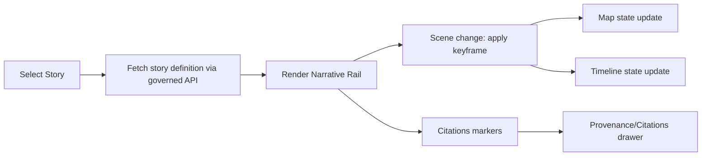

# Story Components (Story Mode + Story Nodes)


This folder contains the **frontend building blocks** for KFM’s Story experience: a **map-first** layout with a narrative “rail,” **timeline** sync, and **citations/provenance** surfaced as first-class UI.

> [!IMPORTANT]
> **Story ≠ content.** This directory contains *UI components only*.  
> **Governed narrative content (Story Nodes) lives under** `docs/reports/story_nodes/` (draft vs published).  
> Do **not** stash narrative markdown, datasets, or “hidden fixtures” in `web/`.

---

## What lives here

Typical responsibilities of `web/src/components/story/` include:

- **Story playback** (chapters/scenes/steps, next/prev, play/pause)
- **Narrative rail** rendering (markdown → safe HTML, callouts, scene TOC)
- **Scene → Map/Timeline synchronization** (reproducible view states)
- **Citations/provenance affordances** (drawer, badges, “why can I trust this?”)
- **Tasks/missions UI** (checklists tied to a story step and map state)
- **Sensitivity UX** (badges, redaction indicators, “generalized geometry” notices)

---

## KFM invariants for Story UI

These constraints are **non-negotiable** for anything in this folder.

### Trust membrane (frontend boundary)
- The frontend **never** talks to storage directly (no PostGIS/Neo4j direct calls).
- All data access flows through the **governed API boundary** (contracts-first).

> [!WARNING]
> If you find yourself adding “quick” direct queries to a database, **stop**. That violates the trust membrane.

### Evidence-first UX
- Every story-visible **layer / chart / statistic / quote / claim** must be traceable.
- The UI must make it easy to answer: **“What is this, where did it come from, and what can I trust?”**

### Focus Mode / Story Node hard gates (applies to Story surfaces too)
When Story UI embeds or interacts with Focus Mode:
- **Only provenance-linked content** is allowed to render.
- **AI contributions are opt-in + clearly labeled** (with uncertainty/confidence when applicable).
- **No sensitive-location leaks** (generalize/omit per sovereignty rules).

---

## Expected repository alignment

This directory is one part of the larger governed structure. Story content and contracts have canonical homes:

```text
docs/
  reports/
    story_nodes/
      templates/
      draft/
      published/
        <story_slug>/
          story.md
          assets/
web/
  src/
    components/
      story/
        README.md   <-- you are here
```

---

## Recommended component boundaries

The codebase may organize these differently, but the **responsibilities should remain stable**.

| UI capability | Suggested component(s) | Notes |
|---|---|---|
| Playback controller | `StoryPlayer`, `StoryControls` | Owns play/pause, step index, keyframe jumps |
| Narrative rail | `StoryRail`, `SceneTOC`, `SceneBlock` | Renders markdown + callouts; supports “jump to keyframe” |
| Scene renderer | `SceneRenderer` | Applies scene state to Map + Timeline (idempotent) |
| Timeline binding | `StoryTimelineSync` | Scrubber + keyframe markers; scene playback alignment |
| Citations drawer | `CitationsDrawer`, `CitationMarker` | Click-to-open evidence; never hide provenance |
| Provenance links | `ProvenanceBadge`, `DatasetBadge` | Deep-links to DCAT/STAC/PROV via API-resolved IDs |
| Tasks/missions | `StoryTasksChecklist` | Tasks should be auditable (what did user do?) |
| Sensitivity handling | `SensitivityBadge`, `RedactionNotice` | Display *why* something is generalized/hidden |

> [!NOTE]
> If your component influences **what the user believes**, it likely needs a citation/provenance affordance.

---

## UI interaction model (map-first)

The Story experience is designed around a **map-first** layout with a narrative rail and a provenance/citation drawer.

**Core layout expectations:**
- Main canvas: **Map View** (active layers; optional split-view comparisons)
- **Timeline controls**: scrubber, granularity selector, keyframe markers, play/pause
- **Layer manager**: ordered stack, opacity, legend, dataset badge (provenance link)
- **Narrative rail**: chapter/scene blocks, callouts, task checklist, “jump to keyframe”
- **HUD**: active time window, hypothesis, uncertainty indicator, offline/sync status
- **Annotation tools**: point/line/polygon notes with attached citations and sensitivity label
- **Scenario panel**: parameter inputs, run status, compare-to-baseline toggles
- **Citations/Provenance drawer**: dataset list, processing lineage, license/attribution

---

## Data flow and state sync

Story UI must keep three states aligned:

1. **Narrative state** (current scene/step)
2. **Map state** (bbox/camera, layer visibility/opacity, style, split-view)
3. **Timeline state** (time window, granularity, keyframe index)

### Key rule: idempotent scene application
Applying a scene should be safe to repeat:
- No “incremental drift” across replays
- Deterministic mapping from `scene.keyframe` → map/timeline state



---

## Contracts-first integration points

> [!IMPORTANT]
> **Define contracts before UI features.**  
> New story behaviors should be backed by explicit schemas/contracts (OpenAPI or GraphQL) and validated in CI.

Common (illustrative) API needs for Story UI:
- Fetch story definition by `storyId` (+ optional `version`)
- Resolve **evidence** for citation markers
- Fetch **provenance** timelines / receipts for datasets or derived artifacts
- Create/read **annotations** (with citation + sensitivity metadata)
- Scenario runs (what-if/counterfactual) where policy allows

If you add a new Story capability:
- update contracts under the server contracts area (e.g., `src/server/contracts/`)
- implement server behavior with redaction/policy hooks
- add **contract tests** and any required redaction rules

---

## Citations and provenance UX rules

Citations and provenance must be **discoverable at the moment of interpretation**:

- Every citation marker should open an evidence panel/drawer that:
  - names the dataset/document source
  - shows identifiers (dataset keys / graph IDs / catalog IDs)
  - links to DCAT/STAC/PROV-resolved resources (via API)
  - surfaces license / attribution
- When content is derived (charts/aggregations), show:
  - the derivation lineage (“generated by” pipeline activity/run)
  - the run receipt / version metadata (where available)

> [!TIP]
> Treat provenance UI as a *primary feature*, not a “settings page.”

---

## Sensitivity & CARE handling

Story UI is a common place where sensitive data can leak inadvertently.

### What to do in components
- Display sensitivity badges (public / internal / restricted)
- If geometry is generalized, show a visible notice (“generalized to protect sensitive location”)
- Never provide “side-channel” access to restricted locations (e.g., hover/identify reveals precise coords)

### What **not** to do
- Don’t attempt to “reconstruct” hidden precision client-side
- Don’t cache restricted content in localStorage/sessionStorage unless explicitly approved and encrypted (policy-dependent)

> [!CAUTION]
> If you touch content involving culturally restricted knowledge or precise locations, flag it for governance review.

---

## Accessibility & localization

Baseline expectations:
- Keyboard operability (playback controls, drawer focus, rail navigation)
- Screen reader semantics (scene titles, TOC, citation markers)
- Respect reduced motion preferences for story playback transitions
- Localize UI strings with BCP 47 locale conventions (implementation-specific)

---

## Testing expectations

Minimum coverage for Story components:

- **Unit tests**
  - scene parsing / keyframe application logic
  - citation marker rendering + click behavior
- **Integration tests**
  - story step changes correctly update map/timeline state
  - provenance drawer opens with correct identifiers
- **E2E smoke**
  - “load story → step forward → open citation → open provenance”
- **A11y checks**
  - focus order in rail + drawer, no keyboard traps

---

## PR checklist (Story UI)

- [ ] New UI elements do **not** bypass governed APIs (trust membrane preserved)
- [ ] Every displayed claim/layer/stat has an evidence path (citation/provenance)
- [ ] Sensitive location protections are respected (no precision leaks)
- [ ] Story scene application is deterministic + idempotent
- [ ] A11y: keyboard + focus + SR labels verified for new controls
- [ ] Tests added/updated (unit + at least one integration path)
- [ ] Any new contracts/schemas updated first; contract tests passing
- [ ] Governance review flagged if content affects licensing/sensitivity/community authority

---

## Glossary

- **Story Node**: governed markdown narrative with citations + semantic entity refs.
- **Scene/Step**: a segment of a story with narrative content and a map/timeline “keyframe.”
- **Keyframe**: a reproducible view state (time window + map camera + active layers).
- **Provenance**: lineage describing how an artifact was produced (inputs → transforms → outputs).
- **Trust membrane**: rule that clients never directly access data stores; everything passes through governed APIs.

---

## Maintainer notes

This README is intentionally **policy-forward**: Story UI is a high-risk surface for trust failures (unsourced claims, hidden provenance, sensitive leaks). Keep the UX opinionated in favor of **transparency** and **governance-by-default**.