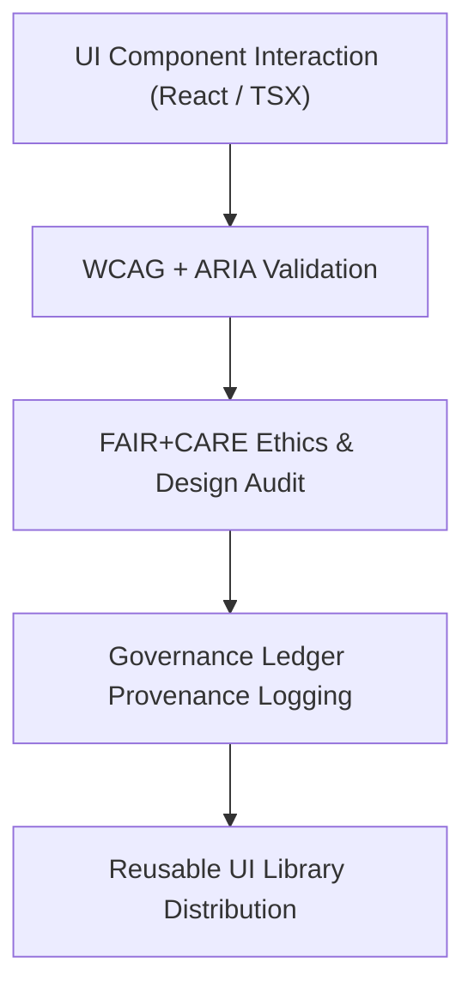

<div align="center">

# 🧩 **Kansas Frontier Matrix — UI Components Module (v2.1.1 · Tier-Ω+∞ Certified)**  
`web/src/components/ui/README.md`

**Mission:** Provide modular, accessible, and FAIR+CARE-aligned **UI components** for the  
**Kansas Frontier Matrix (KFM)** web application — promoting design consistency, ethical accessibility,  
and verifiable governance across the interface ecosystem.

[](../../../../../docs/)
[](../../../../../docs/standards/faircare-validation.md)
[](../../../../../docs/standards/accessibility.md)
[](../../../../../LICENSE)

</div>

---

## 📚 Overview

The **UI Components Module** defines the reusable interface elements that power  
the KFM web platform. Each component follows strict accessibility and ethical  
design protocols while being fully integrated with governance and provenance tracking.

Core objectives:
- ♿ Ensure **WCAG 2.1 AA** accessibility across all interactive elements.  
- 🧱 Build **FAIR+CARE-aligned** and ethically transparent UI design.  
- 🔗 Integrate governance ledger tracking for provenance verification.  
- 🧠 Promote reusability and consistency across all KFM modules.  

---

## 🗂️ Directory Layout

```bash
web/src/components/ui/
├── README.md                     # This file — UI components documentation
│
├── button.tsx                    # Primary and secondary buttons with a11y roles
├── modal.tsx                     # Dialog and modal component with focus trap
├── dropdown.tsx                  # Select and menu UI elements
└── tooltip.tsx                   # Contextual tooltip for labels and guidance
```

---

## ⚙️ UI Component Governance Model


<!-- END OF MERMAID -->

---

## 🧱 Core Components

| Component | Description | FAIR+CARE Function | Validation Workflow |
|:--|:--|:--|:--|
| **Button** | Interactive button with role-based semantics. | Responsibility + Accessibility | `ui-validate.yml` |
| **Modal** | Focus-trapped dialog component for ethical UX. | Transparency + Usability | `design-validate.yml` |
| **Dropdown** | Selectable menu component for categorized actions. | Findable + Ethics | `ui-validate.yml` |
| **Tooltip** | Contextual guidance component for accessibility hints. | Collective Benefit (CARE) | `faircare-validate.yml` |

---

## 🧠 FAIR + CARE Integration

| Principle | Implementation | Validation |
|:--|:--|:--|
| **Findable** | Components registered and documented in design registry. | `policy-check.yml` |
| **Accessible** | Implements ARIA roles and keyboard navigation. | `design-validate.yml` |
| **Interoperable** | Components adhere to React + TypeScript patterns. | `ui-validate.yml` |
| **Reusable** | Modular architecture promotes portability and testing. | `docs-validate.yml` |
| **Collective Benefit (CARE)** | UI promotes inclusive, human-centered interaction. | `faircare-validate.yml` |

---

## ♿ Accessibility Standards (WCAG 2.1 AA)

| Feature | Implementation | Validation Workflow |
|:--|:--|:--|
| **Keyboard Navigation** | Full navigation via Tab, Shift+Tab, and Enter. | `ui-validate.yml` |
| **ARIA Roles** | Role-based states (`button`, `dialog`, `tooltip`) defined. | `design-validate.yml` |
| **Focus Management** | Modal and dropdown focus traps with visible outlines. | `ui-validate.yml` |
| **Color Contrast** | Text meets ≥ 4.5:1 ratio; large text ≥ 3:1. | `design-validate.yml` |

---

## 🔍 Provenance & Governance Integration

| Artifact | Purpose | Path |
|:--|:--|:--|
| **Component Registry** | Index of all reusable UI components. | `web/src/components/ui/registry.json` |
| **Accessibility Reports** | Logs WCAG and ARIA validation results. | `reports/validation/a11y_validation.json` |
| **Governance Ledger** | Records checksum and ownership verification. | `data/reports/audit/data_provenance_ledger.json` |

---

## 🧾 Example Component Metadata

```yaml
---
component_id: "ui_modal_v2.1.1"
authors: ["@kfm-web","@kfm-accessibility"]
faircare_status: "Tier-Ω+∞ Verified"
checksum: "sha256:b3a91e77a1f34d8c..."
governance_ledger_entry: "data/reports/audit/data_provenance_ledger.json"
accessibility_compliance: "WCAG 2.1 AA"
license: "MIT"
---
```

---

## 🧮 Observability Metrics

| Metric | Description | Target | Workflow |
|:--|:--|:--|:--|
| **Accessibility Compliance (WCAG)** | % of components passing audits. | ≥ 95 | `design-validate.yml` |
| **FAIR+CARE Compliance** | Inclusivity and ethics compliance score. | ≥ 95 | `faircare-validate.yml` |
| **Test Coverage** | Unit and integration test coverage across UI components. | ≥ 90% | Jest / CI Reports |
| **Governance Sync Rate** | % of registered components logged to ledger. | 100% | `governance-ledger.yml` |

---

## 🧾 Validation Workflows

| Workflow | Function | Output |
|:--|:--|:--|
| `ui-validate.yml` | Tests component rendering and keyboard navigation. | `reports/validation/ui_validation.json` |
| `design-validate.yml` | Runs accessibility and ARIA validation tests. | `reports/validation/a11y_validation.json` |
| `faircare-validate.yml` | Verifies inclusive design and FAIR+CARE compliance. | `reports/fair/data_care_assessment.json` |
| `governance-ledger.yml` | Records checksum and component ownership. | `data/reports/audit/data_provenance_ledger.json` |

---

## 🕰 Version History

| Version | Date | Author | Summary |
|:--|:--|:--|:--|
| **v2.1.1** | 2025-11-16 | @kfm-web | Added provenance integration, FAIR+CARE audit linkage, and accessibility metrics. |
| v2.0.0 | 2025-10-25 | @kfm-accessibility | Updated button, modal, and dropdown for full WCAG 2.1 AA compliance. |
| v1.0.0 | 2025-10-04 | @kfm-docs | Initial UI component documentation and governance registry setup. |

---

<div align="center">

**Kansas Frontier Matrix © 2025**  
*“Every Interface Should Be Ethical — Every Click Should Be Accountable.”*  
📍 `web/src/components/ui/README.md` — FAIR+CARE-aligned UI component documentation for the Kansas Frontier Matrix.

</div>

