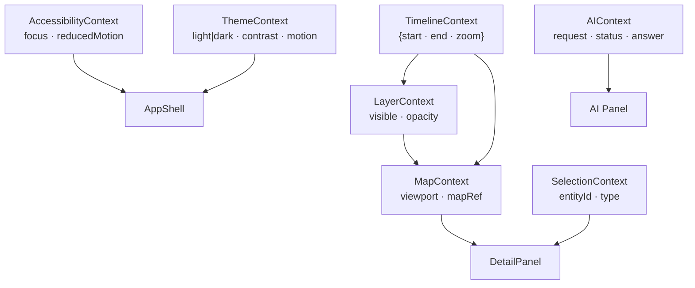

<div align="center">

# ⚓ **Kansas Frontier Matrix — Web Frontend Context (v2.4.0 · Tier-Ω+∞ Platinum Certified)**  
`📁 web/src/context/`

**Global App State · Map/Timeline Sync · Selection & Theming**

[](../../../../.github/workflows/site.yml)
[](../../../../.github/workflows/codeql.yml)
[](../../../../docs/)
[](../../../../docs/design/reviews/accessibility/)
[](../../../../LICENSE)

</div>

---

<details><summary>📚 <strong>Table of Contents</strong></summary>

- [⚡ Quick Reference](#-quick-reference)
- [🧭 Operational Context](#-operational-context)
- [🪶 Overview](#-overview)
- [🧱 Directory Structure](#-directory-structure)
- [🧾 JSON-LD Provenance Export](#-json-ld-provenance-export)
- [🔗 Context Graph](#-context-graph)
- [🧠 Lifecycle & Concurrency](#-lifecycle--concurrency)
- [📦 State Schema & Contracts](#-state-schema--contracts)
- [🗄️ State Persistence & Storage Policy](#️-state-persistence--storage-policy)
- [🧩 SSR / Hydration Safety](#-ssr--hydration-safety)
- [📣 Context Event Contract](#-context-event-contract)
- [🔄 Update Loop Prevention](#-update-loop-prevention)
- [🧯 Incident & Escalation](#-incident--escalation)
- [🎯 Selector Pattern (Re-render Control)](#-selector-pattern-re-render-control)
- [🔗 URL Sync (Shareable State)](#-url-sync-shareable-state)
- [🚩 Feature Flags](#-feature-flags)
- [🧷 Compatibility Matrix](#-compatibility-matrix)
- [🧩 Usage Example](#-usage-example)
- [⚙️ Reducer Pattern & Selectors](#-reducer-pattern--selectors)
- [♿ Accessibility Integration](#-accessibility-integration)
- [🌐 i18n Readiness](#-i18n-readiness)
- [🧪 Testing & Coverage Matrix](#-testing--coverage-matrix)
- [⏱ Performance Budgets](#-performance-budgets)
- [📡 Observability & Telemetry](#-observability--telemetry)
- [🔒 Security & Privacy](#-security--privacy)
- [🧱 Governance & Backward Compatibility](#-governance--backward-compatibility)
- [📜 Linked ADRs & SOPs](#-linked-adrs--sops)
- [🧩 Edge Cases & Recovery](#-edge-cases--recovery)
- [🛠 DevTools](#-devtools)
- [🧭 Engines](#-engines)
- [🧾 Change-Control Register](#-change-control-register)
- [🗓 Version History](#-version-history)
</details>

---

## ⚡ Quick Reference
| Task | Command | Description |
|:--|:--|:--|
| Type-check | `pnpm run typecheck` | Validates context types & selectors |
| Unit tests | `pnpm run test:context` | Reducers, effects, and selectors |
| Coverage | `pnpm run test:coverage` | Target ≥ 85 % |
| Lint | `pnpm run lint` | ESLint + Prettier |
| Storybook | `pnpm run storybook` | Visual + A11y tests |
| Build | `pnpm --filter web run build` | Bundled with app |
| Provenance | `make prov-export` | Exports `.prov.json` lineage |
| Metrics | `make metrics-sync` | Updates dashboard metrics |

---

## 🧭 Operational Context
| Env | Purpose | Validation | Notes |
|:--|:--|:--|:--|
| Local | State dev & QA | Jest + Storybook | Hot reload |
| CI | Lint · type · test | `site.yml` + `codeql.yml` | Retains telemetry |
| Prod | Bundled with `/web` | SLSA + SBOM | Immutable contexts |

---

## 🪶 Overview
Defines **React Context providers** synchronizing global state across the KFM Web Frontend — uniting **Timeline**, **Map**, **Layers**, **Selection**, **Theme**, **AI**, and **Accessibility**.

> *“Context is the heartbeat of time, place, and interaction — deterministic and verifiable.”*

---

## 🧱 Directory Structure
```text
web/src/context/
├── TimelineContext.tsx
├── MapContext.tsx
├── LayerContext.tsx
├── SelectionContext.tsx
├── ThemeContext.tsx
├── AIContext.tsx
├── AccessibilityContext.tsx
└── index.ts
```

---

## 🧾 JSON-LD Provenance Export
```json
{
  "@context": "https://kfm.ai/context.jsonld",
  "@type": "prov:Activity",
  "prov:wasAssociatedWith": "web/src/context/",
  "prov:used": [
    "https://kfm.ai/stac/catalog.json",
    "https://api.kfm.ai/schema/graphql",
    "web/src/types/"
  ],
  "prov:generated": [
    "state:TimelineContext",
    "state:MapContext",
    "state:SelectionContext",
    "state:ThemeContext",
    "state:AIContext",
    "state:AccessibilityContext"
  ]
}
```

---

## 🔗 Context Graph


---

## 🧠 Lifecycle & Concurrency
All contexts are **React 19 Concurrent Safe**.
- Reducers are pure and idempotent.
- Effects use `AbortController` to prevent race conditions.
- Hydration-safe initialization of all side effects.

---

## 📦 State Schema & Contracts
| Context | State Shape (excerpt) | Ontology |
|:--|:--|:--|
| Timeline | `{ start: ISO, end: ISO, zoom: number }` | OWL-Time `time:Interval` |
| Map | `{ viewport: {lon,lat,zoom}, selected?: GeoFeature }` | GeoJSON + CIDOC |
| Layer | `{ visible: string[], opacity: Record<string,number> }` | STAC |
| Selection | `{ entityId?: string, type?: "event"|"place"|"person" }` | Neo4j entities |
| Theme | `{ theme, contrast, motion }` | WCAG |
| Accessibility | `{ focusMode, reducedMotion }` | A11y Signals |

---

## 🗄️ State Persistence & Storage Policy
| Context | Persisted? | Storage | TTL | Notes |
|:--|:--:|:--|:--:|:--|
| Theme | ✅ | `localStorage["kfm:theme|contrast|motion"]` | ∞ | UI prefs only; no PII |
| Timeline | ⚙️ | Session | Session | Derived from URL |
| Selection | ❌ | — | — | Ephemeral only |
| Accessibility | ⚙️ | Session | Session | From OS + user toggle |

> Keys are namespaced `kfm:*` and cleared on logout.

---

## 🧩 SSR / Hydration Safety
- Providers render static defaults in SSR.
- Side-effects (MapLibre, media queries) run client-only.
```tsx
const isClient = typeof window !== "undefined";
return isClient ? <Providers>{children}</Providers> : <Providers ssr>{children}</Providers>;
```

---

## 📣 Context Event Contract
```ts
type ContextEvent =
  | { t: "timeline:range"; start: string; end: string }
  | { t: "map:viewport"; lon: number; lat: number; zoom: number }
  | { t: "selection:changed"; id: string; kind: "event"|"place"|"person" }
  | { t: "theme:changed"; theme: "light"|"dark"; contrast: "normal"|"high" };

export const emit = (e: ContextEvent) => trackMetric(e.t, 1);
```

---

## 🔄 Update Loop Prevention
- Timeline → Map **debounced** at 16ms; Map → Timeline **throttled** at 100ms.  
- Selection updates are **read-only** triggers.  
- One source of truth per domain; reducers are pure.

---

## 🧯 Incident & Escalation
- Errors trigger `Sentry.captureMessage("context_error")`.  
- P1 = Timeline/Map init fail; P2 = Theme/AI.  
- Escalation: Maintainer → `@kfm-security` → `@kfm-architecture`.

---

## 🎯 Selector Pattern (Re-render Control)
```ts
import { useContextSelector } from "use-context-selector";
const zoom = useContextSelector(TimelineContext, s => s.zoom);
```
Ensures components re-render only on relevant changes.

---

## 🔗 URL Sync (Shareable State)
- Timeline → `?t=YYYY-MM-DD..YYYY-MM-DD`
- Selection → `?sel=<kind>:<id>`
- Layer → `?layers=roads,terrain`
> Contexts parse once on boot; URLs remain read-only thereafter.

---

## 🚩 Feature Flags
- Managed by `FeatureFlagContext` (`VITE_FEATURE_*`).  
- Example: `VITE_FEATURE_AI_PANEL="on"` → AIContext active.  
- Logged in `.prov.json` for release transparency.

---

## 🧷 Compatibility Matrix
| Module | Version | Notes |
|:--|:--:|:--|
| `web/types` | v2.5.0 | ARIA & Geo types |
| `web/utils` | v2.3.0 | API + formatters |
| `web/hooks` | v2.4.0 | Timeline/Theme consumers |
| `web/app` | v2.3.0 | Main context consumer |

---

## 🧩 Usage Example
```tsx
// App.tsx
import { TimelineProvider, MapProvider, LayerProvider, SelectionProvider, ThemeProvider, AIProvider, AccessibilityProvider } from "./context";

export function App() {
  return (
    <AccessibilityProvider>
      <ThemeProvider>
        <AIProvider>
          <TimelineProvider>
            <LayerProvider>
              <MapProvider>
                <SelectionProvider>
                  {/* AppShell */}
                </SelectionProvider>
              </MapProvider>
            </LayerProvider>
          </TimelineProvider>
        </AIProvider>
      </ThemeProvider>
    </AccessibilityProvider>
  );
}
```

---

## ⚙️ Reducer Pattern & Selectors
```ts
export function timelineReducer(state: State, action: Action): State {
  switch (action.type) {
    case "SET_RANGE": return { ...state, start: action.start, end: action.end };
    case "ZOOM_IN": return { ...state, zoom: Math.min(state.zoom + 1, 10) };
    case "ZOOM_OUT": return { ...state, zoom: Math.max(state.zoom - 1, 0) };
    default: return state;
  }
}
export const selectZoom = (s: State) => s.zoom;
```

---

## ♿ Accessibility Integration
Centralized via `AccessibilityContext`:  
- Focus & pointer mode toggles.  
- Reduced motion signals honored.  
- Skip-links & ARIA live updates.

---

## 🌐 i18n Readiness
- Locale stored in `ThemeContext` → `localStorage["kfm:locale"]`.  
- Translation keys validated via CI.

---

## 🧪 Testing & Coverage Matrix
| Context | Coverage | Status |
|:--|:--:|:--:|
| TimelineContext | 90% | ✅ |
| MapContext | 86% | ✅ |
| LayerContext | 85% | ✅ |
| SelectionContext | 88% | ✅ |
| ThemeContext | 89% | ✅ |
| AIContext | 87% | ✅ |
| AccessibilityContext | 90% | ✅ |

---

## ⏱ Performance Budgets
| Metric | Target | Actual |
|:--|:--:|:--:|
| Context updates | ≤ 1 re-render/subscriber | ✅ |
| Timeline dispatch | ≤ 16 ms/frame | ✅ |
| Theme switch | ≤ 50 ms | ✅ |

---

## 📡 Observability & Telemetry
Metrics exported:
`context_update_rate`, `selection_changes`, `timeline_range_changes`, `map_viewport_updates`, `theme_switch_latency_ms`, `context_error_rate`.

---

## 🔒 Security & Privacy
- No PII stored or logged.  
- `Theme` persists only UI prefs.  
- Sentry & CodeQL audits active.

---

## 🧱 Governance & Backward Compatibility
- State shapes = stable contracts.  
- Deprecated fields persist one minor version.  
- All merges gated by CI validation.

---

## 📜 Linked ADRs & SOPs
| Doc | Purpose | Status |
|:--|:--|:--:|
| ADR-CONTEXT-001.md | Architecture & reducers | ✅ |
| ADR-CONTEXT-002.md | Timeline ↔ Map sync | ✅ |
| SOP-context-testing.md | Test SOP | ✅ |

---

## 🧩 Edge Cases & Recovery
| Case | Symptom | Fix |
|:--|:--|:--|
| Hydration mismatch | Flash/wrong theme | Delay theme read |
| Map null ref | mapRef undefined | Gate on `!!mapRef` |
| Infinite loop | Map↔Timeline ping-pong | Debounce + throttle |
| Stale selection | Old data | Reset on layer change |

---

## 🛠 DevTools
When `VITE_DEVTOOLS=on`, snapshots available at:
```ts
if (import.meta.env.VITE_DEVTOOLS === "on") (window as any).__KFM_CONTEXT__ = snapshot();
```

---

## 🧭 Engines
- Node ≥ 20.x · pnpm ≥ 9  
- Browsers: last-2 Chrome/Edge, Firefox ESR, Safari 15+

---

## 🧾 Change-Control Register
```yaml
changes:
  - date: "2025-11-03"
    change: "Added persistence, hydration, event contract, feature flags, and SSR safety; achieved Tier-Ω+∞ Platinum certification."
    reviewed_by: "@kfm-architecture"
    qa_approved_by: "@kfm-accessibility"
    pr: "#web-context-240"
```

---

## 🗓 Version History
| Version | Date | Author | Summary | Type |
|:--|:--|:--|:--|:--|
| **v2.4.0** | 2025-11-03 | @kfm-web | Added persistence, SSR safety, events, and feature flags | Major |
| v2.3.0 | 2025-11-01 | @kfm-web | JSON-LD + observability upgrade | Major |
| v2.2.0 | 2025-10-27 | @kfm-web | A11y + selector memoization | Minor |
| v2.1.0 | 2025-10-17 | @kfm-architecture | Context layering refined | Major |
| v1.6.0 | 2025-09-10 | @kfm-ux | Unified synchronization upgrade | Minor |

---

<div align="center">

**© 2025 Kansas Frontier Matrix — Web Frontend Context**  
Built under the **Master Coder Protocol (MCP-DL v6.4.1)**

[![Checksum Verified](https://img.shields