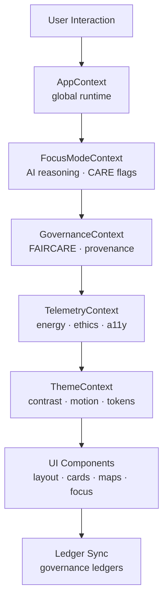
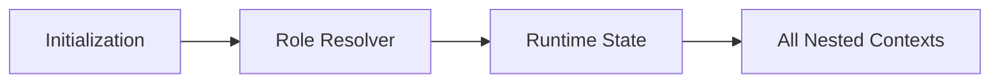
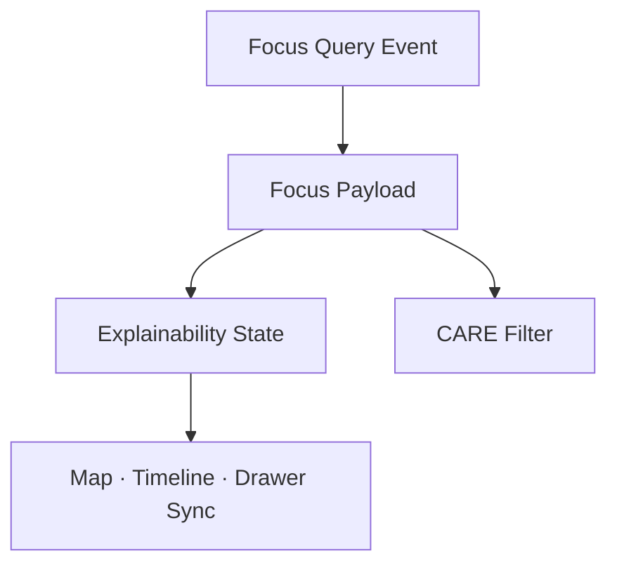
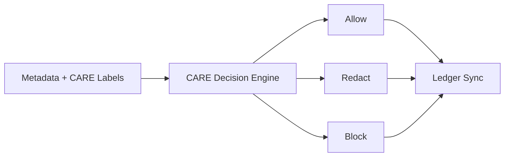
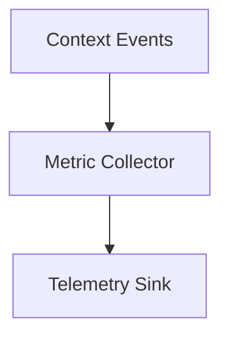
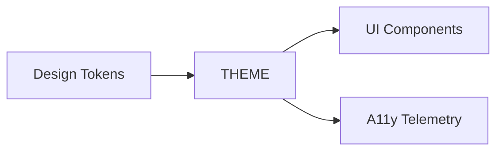
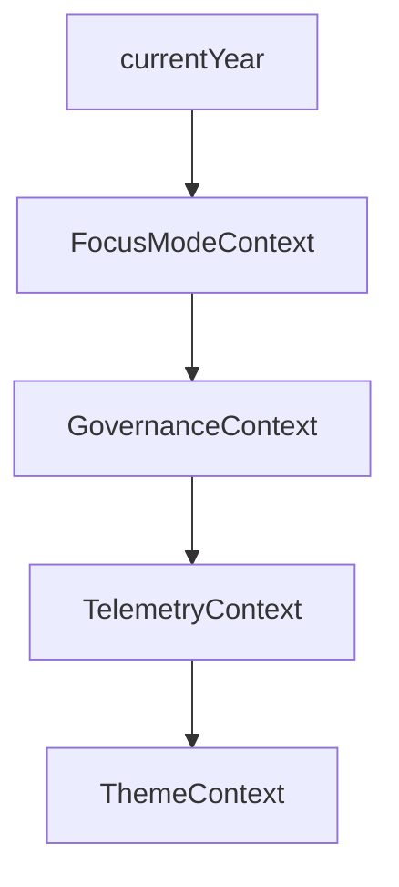
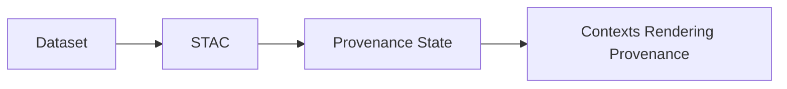
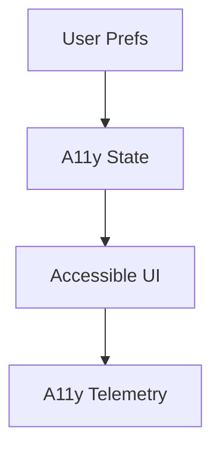

<div align="center">

# 🧩 **Kansas Frontier Matrix — Web Context & State Management Architecture**  
`web/src/context/README.md`

**Purpose:**  
Define the complete **deep-architecture specification** of the global context and state management system powering the Kansas Frontier Matrix (KFM) v10.3.2 web platform.  
This subsystem synchronizes AI explainability, FAIR+CARE governance, telemetry, provenance, accessibility tokens, sustainability metrics, and cross-component state across the entire front-end environment.

[]()
[]()
[]()
[]()

</div>

---

# 📘 Executive Summary

The **Context Layer** forms the **ethical, semantic, and operational brainstem** of the entire KFM front-end.  
It centralizes:

- Global Focus Mode v2.5 AI reasoning state  
- FAIR+CARE governance rules & decision engines  
- Provenance & lineage chains (PROV-O, STAC, DCAT)  
- Sustainability + performance telemetry (ISO 50001)  
- A11y preferences, high-contrast themes, reduced motion  
- Temporal & spatial sync between Map, Timeline, Focus Mode, and Story Nodes  
- Application-wide reactive event bus  

The architecture ensures **deterministic, ethical, inclusive, and reproducible** front-end behavior.

---

# 🗂️ Directory Layout (Authoritative v10.3.2)

```text
web/src/context/
├── README.md
├── AppContext.tsx
├── FocusModeContext.tsx
├── GovernanceContext.tsx
├── TelemetryContext.tsx
├── ThemeContext.tsx
└── metadata.json
```

Each context operates within the **Context Orchestration Plane**.

---

# 🧩 Global Context Orchestration Architecture



---

# 🧬 Context Deep Specifications

## 1️⃣ AppContext — Root Runtime & Ethical Backbone

### Responsibilities
- Bootstraps all other contexts  
- Normalizes user roles + permissions  
- Provides the app-wide FAIR+CARE runtime environment  
- Exposes global event bus for:
  - navigation  
  - dataset activation  
  - focus/temporal updates  
  - governance signals  



---

## 2️⃣ FocusModeContext — Explainable AI State Engine

### Responsibilities
- Stores Focus Mode v2.5 results  
- Tracks:
  - narrative  
  - explainability tokens  
  - provenance bundles  
  - ethics_flags  
  - care_labels  
  - subgraph metadata  

- Responsible for:
  - temporal alignment  
  - spatial highlight triggers  
  - CARE-based content filtering  



---

## 3️⃣ GovernanceContext — CARE, Provenance & Ledger Sync

Manages:

- CARE enforcement state  
- License + rights metadata  
- Sovereignty rules  
- Provenance references  
- Ledger submission  

### Governance Flow



Governance ledger:

```
../../../docs/reports/audit/web-context-governance-ledger.json
```

---

## 4️⃣ TelemetryContext — Sustainability + Performance Observability

Tracks:

- render time  
- CPU/GPU load approximation  
- energy estimate (Wh)  
- carbon gCO₂e  
- CARE masking events  
- A11y compliance  
- Focus Mode usage metrics  



Exports to:

```
../../../releases/v10.3.2/focus-telemetry.json
```

---

## 5️⃣ ThemeContext — Accessibility & Design Token Authority

Controls:

- high contrast  
- reduced motion  
- colorblind-safe tokens  
- typography scaling  
- map-legend colors  
- CARE symbol mappings  



---

# 🌐 Cross-Context Synchronization Architecture

Contexts collectively coordinate:

- story-node highlighting  
- timeline centering  
- map layer filtering  
- Focus highlight paths  
- drawer display updates  



---

# 🔍 Provenance Integration (PROV-O + STAC + DCAT)

Each context surfaces and maintains provenance:

- dataset lineage  
- STAC item/collection metadata  
- checksum registry links  
- source & temporal coverage  
- Story Node relationships  



---

# ♿ Accessibility Architecture (WCAG 2.1 AA)

The context layer:

- tracks user preferences  
- enforces color contrast  
- preserves motion-safety  
- injects ARIA token guidance  
- logs A11y telemetry  



---

# 📡 Sustainability & Energy Modeling (ISO 50001)

Context-layer energy tracking computes:

- `session_energy_wh`  
- `interaction_energy_wh`  
- carbon estimate  
- GPU/CPU render deltas  

Telemetry exported via:

```
../../../releases/v10.3.2/focus-telemetry.json
```

---

# ⚙️ CI / Validation Requirements

| Category | Validator |
|----------|-----------|
| Governance | faircare-validate.yml |
| Accessibility | accessibility_scan.yml |
| Telemetry | telemetry-export.yml |
| Documentation | docs-lint.yml |
| Schema | metadata.json validation |
| Security | CodeQL + Trivy |

Any failure → merge blocked.

---

# 🧾 Example Context Metadata Record

```json
{
  "id": "web_context_state_v10.3.2",
  "contexts": [
    "AppContext",
    "FocusModeContext",
    "GovernanceContext",
    "TelemetryContext",
    "ThemeContext"
  ],
  "a11y_score": 99.7,
  "sustainability_score": 98.8,
  "care_events": 17,
  "checksum_verified": true,
  "telemetry_synced": true,
  "timestamp": "2025-11-14T21:31:00Z"
}
```

---

# 🕰️ Version History

| Version | Date | Summary |
|--------|--------|---------|
| v10.3.2 | 2025-11-14 | Full deep-architecture rebuild: CARE engine, governance pipeline, telemetry system, and cross-context synchronization. |
| v9.7.0 | 2025-11-05 | Previous version. |

---

<div align="center">

**Kansas Frontier Matrix — Context Architecture**  
🧩 Ethical State Management · 🧠 AI Reasoning Sync · 🌐 FAIR+CARE · 🔗 Provenance Integrity  
© 2025 Kansas Frontier Matrix — MIT License  

[Back to Web Source](../README.md)

</div>
