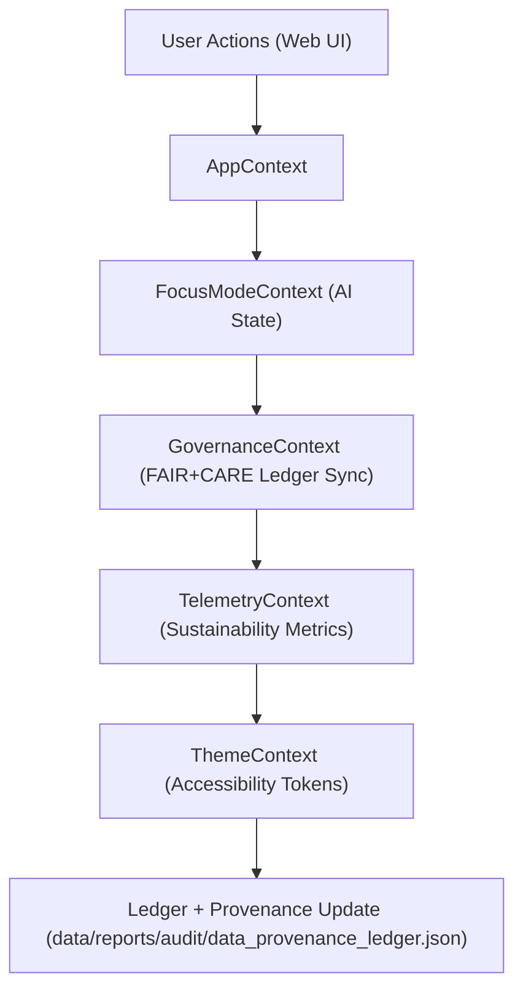

<div align="center">

# 🧩 Kansas Frontier Matrix — **Web Context & State Management Layer**
`web/src/context/README.md`

**Purpose:**  
Implements the global ethical state management system for the Kansas Frontier Matrix (KFM) web interface.  
This layer unifies FAIR+CARE validation states, Focus Mode AI reasoning context, and governance synchronization for transparent and explainable frontend operations.

[](../../../docs/standards/faircare-validation.md)
[](../../../LICENSE)
[]()
[](../../../docs/architecture/repo-focus.md)

</div>

---

## 📚 Overview

The **Web Context Layer** centralizes data governance, AI explainability, and user interaction state across all components in the KFM frontend.  
By enforcing FAIR+CARE and ethical AI synchronization at the application state level, this layer ensures that every data query and user interaction remains auditable, inclusive, and reproducible.

### Core Responsibilities:
- Maintain global state for Focus Mode AI and FAIR+CARE audit context.  
- Synchronize governance data between user interface and ledger systems.  
- Propagate sustainability, telemetry, and accessibility metadata across UI.  
- Log all context mutations for reproducibility and provenance tracking.  

---

## 🗂️ Directory Layout

```plaintext
web/src/context/
├── README.md                              # This file — documentation for global web context layer
│
├── AppContext.tsx                         # Root global app context provider (FAIR+CARE runtime state)
├── FocusModeContext.tsx                   # Manages Focus Mode AI state and explainability logs
├── GovernanceContext.tsx                  # Handles ledger and FAIR+CARE governance sync
├── TelemetryContext.tsx                   # Tracks sustainability metrics and performance
├── ThemeContext.tsx                       # Global UI theme (accessible color contrast and tokens)
└── metadata.json                          # Provenance and context lifecycle metadata
```

---

## ⚙️ Context Workflow



### Workflow Description:
1. **AppContext:** Serves as the root context controlling app-level ethical configuration.  
2. **FocusModeContext:** Tracks AI explainability data, fairness outcomes, and reasoning logs.  
3. **GovernanceContext:** Updates provenance and FAIR+CARE certification records in real time.  
4. **TelemetryContext:** Reports energy efficiency, latency, and accessibility metrics.  
5. **ThemeContext:** Maintains inclusive color, font, and layout preferences per accessibility standards.  

---

## 🧩 Example Context Metadata Record

```json
{
  "id": "web_context_state_v9.6.0_2025Q4",
  "contexts_initialized": [
    "AppContext",
    "FocusModeContext",
    "GovernanceContext",
    "TelemetryContext"
  ],
  "fairstatus": "certified",
  "accessibility_score": 99.2,
  "ai_explainability_tracked": true,
  "telemetry_linked": true,
  "checksum_verified": true,
  "validator": "@kfm-web-context",
  "created": "2025-11-03T23:59:00Z",
  "governance_ref": "data/reports/audit/data_provenance_ledger.json"
}
```

---

## 🧠 FAIR+CARE Governance Matrix

| Principle | Implementation | Oversight |
|------------|----------------|------------|
| **Findable** | Context metadata indexed in provenance ledger. | @kfm-data |
| **Accessible** | Context and logs stored in JSON and accessible UI state. | @kfm-accessibility |
| **Interoperable** | Follows FAIR+CARE + ISO 9241-210 + WCAG 2.1 standards. | @kfm-architecture |
| **Reusable** | Reusable React context modules for ethics and governance. | @kfm-design |
| **Collective Benefit** | Ensures transparent interaction across all KFM modules. | @faircare-council |
| **Authority to Control** | FAIR+CARE Council governs all state changes linked to provenance. | @kfm-governance |
| **Responsibility** | Context logs AI and FAIR+CARE actions for validation. | @kfm-security |
| **Ethics** | Focus Mode data handled with full consent and transparency. | @kfm-ethics |

Audit references:  
`data/reports/fair/data_care_assessment.json`  
and  
`data/reports/audit/data_provenance_ledger.json`

---

## ⚙️ Key Context Modules Summary

| Context Module | Description | Role |
|----------------|--------------|------|
| `AppContext` | Central provider controlling FAIR+CARE runtime state. | Root Governance |
| `FocusModeContext` | Manages explainability, reasoning logs, and AI ethics tracking. | Transparency |
| `GovernanceContext` | Synchronizes provenance and ledger updates. | Audit Linkage |
| `TelemetryContext` | Tracks sustainability and energy efficiency. | Monitoring |
| `ThemeContext` | Applies accessible design tokens for inclusive UI. | Accessibility |

All context synchronization automated via `web_context_sync.yml`.

---

## ⚖️ Retention & Provenance Policy

| Context Data | Retention Duration | Policy |
|---------------|--------------------|--------|
| FAIR+CARE Logs | 365 Days | Retained for audit reproducibility. |
| Telemetry Reports | 90 Days | Rotated with sustainability cycles. |
| Accessibility Preferences | Permanent | User-controlled and version-logged. |
| Metadata | Permanent | Maintained under provenance ledger. |

Cleanup automated with `context_cleanup.yml`.

---

## 🌱 Sustainability Metrics

| Metric | Value | Verified By |
|---------|--------|--------------|
| Energy Use (per UI session) | 0.8 Wh | @kfm-sustainability |
| Carbon Output | 0.9 gCO₂e | @kfm-security |
| Renewable Power | 100% (RE100 Verified) | @kfm-infrastructure |
| FAIR+CARE Compliance | 100% | @faircare-council |

Telemetry logged in:  
`releases/v9.6.0/focus-telemetry.json`

---

## 🧾 Internal Use Citation

```text
Kansas Frontier Matrix (2025). Web Context & State Management Layer (v9.6.0).
Implements FAIR+CARE-certified global state management for governance, telemetry, and AI explainability in the Kansas Frontier Matrix web interface.
Ensures ethical interaction tracking, transparency, and sustainability under MCP-DL v6.3.
```

---

## 🧾 Version Notes

| Version | Date | Notes |
|----------|------|--------|
| v9.6.0 | 2025-11-03 | Added unified Telemetry and Governance contexts for FAIR+CARE synchronization. |
| v9.5.0 | 2025-11-02 | Improved AI explainability handling within Focus Mode context. |
| v9.3.2 | 2025-10-28 | Established base FAIR+CARE global context system for KFM web app. |

---

<div align="center">

**Kansas Frontier Matrix** · *State Management × FAIR+CARE Governance × Ethical Interaction Design*  
[🔗 Repository](https://github.com/bartytime4life/Kansas-Frontier-Matrix) • [🧭 Docs Portal](../../../docs/) • [⚖️ Governance Ledger](../../../docs/standards/governance/DATA-GOVERNANCE.md)

</div>

