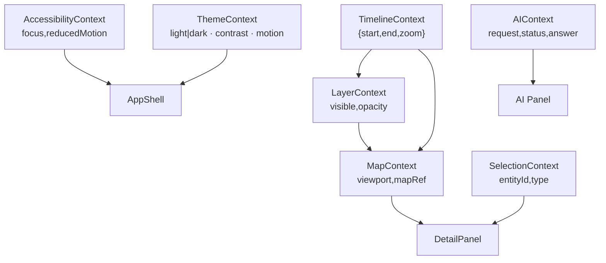

<div align="center">

# 🧠 Kansas Frontier Matrix — **Web Frontend Context**  
`web/src/context/`

**Global App State · Map/Timeline Sync · Selection & Theming**

[](../../../../.github/workflows/ci.yml)
[](../../../../.github/workflows/codeql.yml)
[](../../../../docs/)
[](../../../../LICENSE)

</div>

---

## 🧭 Overview

`web/src/context/` defines the **React Context providers** that maintain synchronized global state across the KFM Web Frontend — linking **Map**, **Timeline**, **Layer Controls**, **AI Assistant**, and **Detail Panels**.

**Design Principles**
- 🧩 **Unified state:** one context layer per domain  
- ⚙️ **Deterministic updates:** pure reducers & memoized selectors  
- 🧠 **Type-safe contracts:** shared `types/` module for entities/events  
- 🧾 **MCP Compliance:** traceable, documented, and testable  

---

## 🧱 Directory Structure

```text
web/src/context/
├── TimelineContext.tsx       # Time window state & reducer (start/end/zoom)
├── MapContext.tsx            # MapLibre instance, viewport & selection
├── LayerContext.tsx          # Visible overlays, opacity, STAC linkage
├── SelectionContext.tsx      # Entity/event selection & multi-select
├── ThemeContext.tsx          # Theme, contrast, motion preference
├── AIContext.tsx             # AI interaction states (loading, answer)
├── AccessibilityContext.tsx  # Focus ring, keyboard hints, motion toggles
└── index.ts                  # Export all contexts + typed hooks
```

---

## 🔗 Context Graph



---

## 🧩 Usage Example

```tsx
// App.tsx
import {
  TimelineProvider,
  MapProvider,
  LayerProvider,
  SelectionProvider,
  ThemeProvider,
  AIProvider,
  AccessibilityProvider,
} from "./context";

export function App() {
  return (
    <AccessibilityProvider>
      <ThemeProvider>
        <AIProvider>
          <TimelineProvider>
            <LayerProvider>
              <MapProvider>
                <SelectionProvider>
                  {/* AppShell: Header, MapView, TimelineView, Panels */}
                </SelectionProvider>
              </MapProvider>
            </LayerProvider>
          </TimelineProvider>
        </AIProvider>
      </ThemeProvider>
    </AccessibilityProvider>
  );
}
```

---

## ⚙️ Reducer Pattern Example

```ts
type Action =
  | { type: "SET_RANGE"; start: string; end: string }
  | { type: "ZOOM_IN" }
  | { type: "ZOOM_OUT" };

function timelineReducer(state: State, action: Action): State {
  switch (action.type) {
    case "SET_RANGE": return { ...state, start: action.start, end: action.end };
    case "ZOOM_IN":   return { ...state, zoom: Math.min(state.zoom + 1, 10) };
    case "ZOOM_OUT":  return { ...state, zoom: Math.max(state.zoom - 1, 0) };
    default:          return state;
  }
}
```

---

## 🧪 Testing

- ✅ Unit tests for each context (reducers, hooks, and providers)  
- 🧩 Jest + RTL (`@testing-library/react`) to simulate interactions  
- 🎯 Validate:
  - Initial contracts  
  - State transitions  
  - Selector stability  
  - Accessibility toggle propagation  

**Coverage target:** ≥ **85%**

---

## 🚀 Performance & Optimization

- Memoized context values to prevent unnecessary re-renders  
- Localize heavy state where possible; lift only when shared  
- Immutable reducers for referential consistency  
- Debounced updates for viewport & timeline events  

---

## ♿ Accessibility Integration

Centralized under `AccessibilityContext`:
- `prefers-reduced-motion` listener  
- Focus ring vs pointer mode detection  
- Skip-to-content behavior  
- Global keyboard hint overlays  

All contexts observe these flags to ensure **accessibility-first UI behavior**.

---

## 🧾 Provenance & Integrity

| Field | Description |
|:------|:-------------|
| **Inputs** | Hooks, utils, and types modules |
| **Outputs** | Context providers and typed hooks |
| **Dependencies** | React 18+, TypeScript |
| **Integrity** | CI runs ESLint, TypeScript checks, and Jest coverage |
| **Audit Tools** | CodeQL + Trivy for dependency & security validation |

---

## 🔗 Related Documentation

- **Web Frontend Overview** — `web/README.md`  
- **Hooks Reference** — `web/src/hooks/README.md`  
- **Types Reference** — `web/src/types/README.md`  
- **Web UI Architecture** — `web/ARCHITECTURE.md`  

---

## 🧾 Versioning & Metadata

| Field | Value |
|:------|:------|
| **Version** | `v1.6.0` |
| **Codename** | *Unified Context Synchronization Upgrade* |
| **Last Updated** | 2025-10-17 |
| **Maintainers** | @kfm-web · @kfm-ux |
| **License** | MIT (code) · CC-BY 4.0 (docs) |
| **Alignment** | OWL-Time · CIDOC CRM · WCAG 2.1 AA |
| **Maturity** | Stable / Production |

---

<div align="center">

**© Kansas Frontier Matrix — Web Frontend Context**  
Built under the **Master Coder Protocol (MCP)** for reliability, transparency, and accessibility.

[]()  
[]()

</div>