<div align="center">

# 🧠 Kansas Frontier Matrix — **Web Frontend Context**  
`web/src/context/`

**Global App State · Map/Timeline Sync · Selection & Theming**

[](../../../../.github/workflows/ci.yml)
[](../../../../.github/workflows/codeql.yml)
[](../../../../docs/)
[](../../../../LICENSE)

</div>

---

## 🧭 Overview

`web/src/context/` provides **React Context providers** and **typed hooks** that coordinate global UI state—keeping **Map**, **Timeline**, **LayerControls**, **DetailPanel**, and **AI Assistant** synchronized.

**Design goals**

- **Single source of truth** for cross-cutting state (timeline range, selected entity, active layers)  
- **Deterministic updates** with minimal re-renders (memoized values & selectors)  
- **Type-safe contracts** via `web/src/types/`  
- **MCP-aligned**: documented behaviors, predictable effects, testable reducers  

---

## 🧱 Directory Structure

```text
web/src/context/
├── TimelineContext.tsx       # Global time window (start/end/zoom) + reducer/actions
├── MapContext.tsx            # Map instance refs, viewport, interaction state
├── LayerContext.tsx          # Visible overlays, opacity, legends (STAC-driven)
├── SelectionContext.tsx      # Selected entity/event, multi-select, clipboard
├── ThemeContext.tsx          # Light/Dark theme + persistence (+ reduced motion/contrast)
├── AIContext.tsx             # AI request state, responses, citations
├── AccessibilityContext.tsx  # Focus ring, reduced motion, keyboard hints
└── index.ts                  # Re-exports all providers & typed hooks
```

Each context exports a **Provider**, a **typed hook** (e.g., `useTimeline()`), and **actions/reducers** where appropriate.

---

## 🔗 Context Graph

```mermaid
flowchart TD
  TL["TimelineContext<br/>{start,end,zoom}"] --> MAP["MapContext<br/>viewport,mapRef"]
  TL --> LYR["LayerContext<br/>visible,opacity"]
  SEL["SelectionContext<br/>entityId,type"] --> DP["DetailPanel"]
  MAP --> DP
  LYR --> MAP
  THEME["ThemeContext<br/>light|dark · contrast · motion"] --> APP["AppShell"]
  AI["AIContext<br/>request,status,answer"] --> AIP["AI Panel"]
  ACC["AccessibilityContext<br/>focus,reducedMotion"] --> APP
%% END OF MERMAID
```



---

## 🧩 Usage Example

```tsx
// App.tsx
import {
  TimelineProvider,
  MapProvider,
  LayerProvider,
  SelectionProvider,
  ThemeProvider,
  AIProvider,
  AccessibilityProvider,
} from "./context";

export function App() {
  return (
    <AccessibilityProvider>
      <ThemeProvider>
        <AIProvider>
          <TimelineProvider>
            <LayerProvider>
              <MapProvider>
                <SelectionProvider>
                  {/* AppShell: Header, MapView, TimelineView, Panels */}
                </SelectionProvider>
              </MapProvider>
            </LayerProvider>
          </TimelineProvider>
        </AIProvider>
      </ThemeProvider>
    </AccessibilityProvider>
  );
}
```

```tsx
// TimelineToolbar.tsx
import { useTimeline, useSelection } from "../context";

export function TimelineToolbar() {
  const { start, end, setRange, zoomIn, zoomOut } = useTimeline();
  const { selected, clearSelection } = useSelection();

  return (
    <div className="toolbar">
      <button aria-label="Zoom out" onClick={zoomOut}>−</button>
      <button aria-label="Zoom in" onClick={zoomIn}>+</button>
      <button onClick={() => setRange("1850-01-01", "1900-12-31")}>1850–1900</button>
      {selected && <button onClick={clearSelection}>Clear selection</button>}
      <span>{start} — {end}</span>
    </div>
  );
}
```

---

## ⚙️ Patterns & Contracts

- **Composition over collision** — keep state domains independent; cross-communicate via props/events  
- **Selectors & memoization** — export derived values with `useMemo` to avoid re-renders  
- **Reducer-first** for critical flows (e.g., Timeline/Layer reducers) with explicit, testable transitions  
- **Persistence** — theme & user prefs via `localStorage` (namespaced keys)  
- **Interop** — types (`Event`, `Layer`, `AIResponse`, `TimelineRange`) from `web/src/types/`  

**Reducer shape (example)**

```ts
type Action =
  | { type: "SET_RANGE"; start: string; end: string }
  | { type: "ZOOM_IN" }
  | { type: "ZOOM_OUT" };

function timelineReducer(state: State, action: Action): State {
  switch (action.type) {
    case "SET_RANGE": return { ...state, start: action.start, end: action.end };
    case "ZOOM_IN":   return { ...state, zoom: Math.min(state.zoom + 1, 10) };
    case "ZOOM_OUT":  return { ...state, zoom: Math.max(state.zoom - 1, 0) };
    default:          return state;
  }
}
```

---

## 🧪 Testing

- Unit tests for each context **reducer** and **hook**: `web/src/context/__tests__/`  
- Use RTL + Jest: `render(<Provider>children</Provider>)`  
- Validate:
  - Initial state contracts  
  - Action transitions (happy & edge cases)  
  - Memoized selectors (stable identity)  
  - A11y toggles (`reducedMotion`, focus ring)  

**Coverage target:** ≥ **85%**

---

## 🚀 Performance Notes

- Co-locate heavy state with nearest component; lift to context **only when shared**  
- Memoize context values; provide **granular hooks** (e.g., `useLayerOpacity(id)`)  
- Immutable updates to avoid referential churn  
- Throttle dispatches for large map viewport sync (e.g., **60–120ms**)  

---

## ♿ Accessibility

`AccessibilityContext` centralizes:

- `prefers-reduced-motion` handling  
- Focus outline mode (keyboard vs mouse)  
- Skip-to-content announcements  
- Hotkey hints (surfaced to help overlays)  

**Contract:** all contexts **must** respect these flags (e.g., disable animations with reduced motion).

---

## 🧾 Provenance & Integrity

| Artifact   | Description                                                                 |
| :--------- | :-------------------------------------------------------------------------- |
| **Inputs** | Typed models from `../types/`, utilities from `../utils/`, hooks from `../hooks/` |
| **Outputs**| Context providers & typed hooks consumed by UI components                   |
| **Deps**   | React 18+, TypeScript                                                       |
| **Integrity** | ESLint, `tsc --noEmit`, unit tests with coverage gates in CI             |

---

## 🔗 Related Documentation

- **Web Frontend Overview** — `web/README.md`  
- **Hooks** — `web/src/hooks/README.md`  
- **Types** — `web/src/types/README.md`  
- **Web UI Architecture** — `web/ARCHITECTURE.md`

---

## 🧾 Versioning & Metadata

| Field | Value |
| :---- | :---- |
| **Version** | `v1.5.0` |
| **Codename** | *Global State & Sync Upgrade* |
| **Last Updated** | 2025-10-17 |
| **Maintainers** | @kfm-web · @kfm-ux |
| **License** | MIT (code) · CC-BY 4.0 (docs) |
| **Alignment** | OWL-Time (timeline range semantics) · CIDOC CRM (UI↔entity linkage) · WCAG 2.1 AA (focus/motion) |
| **Maturity** | Stable / Production |

---

## 📜 License

Released under the **MIT License**.  
© 2025 Kansas Frontier Matrix — built with **MCP-DL v6.2** for reliability, clarity, and accessibility.

> *“Context is the campfire: every component gathers round to share the same light.”*