<div align="center">

# 🧩 **Kansas Frontier Matrix — Web Context & State Management Layer**
`web/src/context/README.md`

**Purpose:** Define the global, FAIR+CARE-certified state management system that governs AI explainability, telemetry, and accessibility across the KFM frontend.  
Each context synchronizes ethical data interactions with governance ledgers and telemetry systems under **MCP v6.3** and **WCAG 2.1 AA**.

[](../../../docs/README.md)
[](../../../LICENSE)
[](../../../docs/standards/faircare.md)
[]()

</div>

---

## 📘 Overview

The **Context Layer** acts as the **ethical backbone** of the KFM web application.  
It centralizes FAIR+CARE compliance, AI Focus Mode context, and telemetry while maintaining accessibility preferences and provenance traceability.

**Core Functions**
- Maintain global Focus Mode AI and FAIR+CARE runtime state.  
- Sync provenance and ledger data between UI and governance systems.  
- Track telemetry for sustainability, performance, and ethics validation.  
- Preserve user preferences (accessibility, consent, themes) transparently.

---

## 🗂️ Directory Layout

```
web/src/context/
├── README.md               # This file
├── AppContext.tsx          # Root provider for governance & runtime state
├── FocusModeContext.tsx    # AI state + explainability reasoning
├── GovernanceContext.tsx   # FAIR+CARE + ledger sync
├── TelemetryContext.tsx    # Sustainability & performance reporting
├── ThemeContext.tsx        # Global theme, color contrast, and layout prefs
└── metadata.json           # Context provenance + audit metadata
```

---

## 🧩 Context Flow

```mermaid
flowchart TD
A["User Interaction (Frontend)"] --> B["AppContext"]
B --> C["FocusModeContext (AI Explainability)"]
C --> D["GovernanceContext (FAIR+CARE Ledger)"]
D --> E["TelemetryContext (Perf + Sustainability)"]
E --> F["ThemeContext (A11y + Visual Tokens)"]
F --> G["Ledger Update → Provenance Registry"]
```



1. **AppContext:** Root state for global FAIR+CARE runtime.  
2. **FocusModeContext:** Tracks reasoning data and CARE safeguards.  
3. **GovernanceContext:** Updates provenance and certification logs.  
4. **TelemetryContext:** Monitors energy, accessibility, and latency.  
5. **ThemeContext:** Manages inclusive color and typography tokens.

---

## ⚙️ Contracts & Validation

| Contract | Purpose | Validator |
|----------|----------|-----------|
| State Contract | Context interface + data shape | TypeScript checks |
| A11y Contract | Theme + user preference consistency | `accessibility_scan.yml` |
| Governance Contract | Provenance schema validation | `faircare-validate.yml` |
| Telemetry Contract | Context log structure | `telemetry-export.yml` |

Artifacts stored in:
- `reports/self-validation/docs/`
- `releases/v9.7.0/focus-telemetry.json`

---

## 🧠 FAIR+CARE Governance Matrix

| Principle | Implementation | Oversight |
|------------|----------------|------------|
| **Findable** | Context metadata versioned in governance ledgers. | @kfm-data |
| **Accessible** | Contexts reflect user preferences and accessibility modes. | @kfm-accessibility |
| **Interoperable** | JSON/TypeScript schemas aligned with FAIR+CARE & ISO 9241-210. | @kfm-architecture |
| **Reusable** | Modular and composable contexts exported across app. | @kfm-design |
| **Collective Benefit** | Enables transparent cross-component ethics tracking. | @faircare-council |
| **Authority to Control** | FAIR+CARE Council governs provenance data access. | @kfm-governance |
| **Responsibility** | Context telemetry logs energy and ethics indicators. | @kfm-sustainability |
| **Ethics** | Focus Mode safeguarded against bias or opaque inference. | @kfm-ethics |

Audit references:  
`docs/reports/audit/data_provenance_ledger.json`  
and  
`docs/reports/fair/data_care_assessment.json`

---

## 🧾 Example Context Metadata Record

```json
{
  "id": "web_context_state_v9.7.0",
  "contexts": [
    "AppContext",
    "FocusModeContext",
    "GovernanceContext",
    "TelemetryContext",
    "ThemeContext"
  ],
  "a11y_score": 99.4,
  "energy_score": 98.3,
  "ai_explainability_tracked": true,
  "telemetry_synced": true,
  "checksum_verified": true,
  "timestamp": "2025-11-05T18:20:00Z"
}
```

---

## ⚙️ Key Context Modules Summary

| Module | Description | Role |
|--------|-------------|------|
| `AppContext` | Root FAIR+CARE state manager. | Core Governance |
| `FocusModeContext` | Manages AI reasoning, bias tests, CARE controls. | Transparency |
| `GovernanceContext` | Emits provenance and FAIR+CARE updates. | Ledger Sync |
| `TelemetryContext` | Logs sustainability + performance data. | Monitoring |
| `ThemeContext` | Manages color tokens + contrast accessibility. | A11y & Design |

---

## ♿ Accessibility Integration

- Synchronizes **ThemeContext** with user system preferences.  
- Stores per-user accessibility settings (contrast, font scaling, motion).  
- Applies **reduced-motion**, **high-contrast**, and **keyboard**-first styles.  
- Runs **axe/Lighthouse** validation during CI (`accessibility_scan.yml`).

---

## 🌱 Sustainability Metrics

| Metric | Target | Verified By |
|---------|---------|-------------|
| Energy Use per Session | ≤ 0.8 Wh | @kfm-sustainability |
| Carbon Output | ≤ 1.0 gCO₂e | @kfm-security |
| Renewable Power | 100% RE100 | @kfm-infrastructure |
| FAIR+CARE Compliance | 100% | @faircare-council |

Telemetry recorded in:  
`../../../releases/v9.7.0/focus-telemetry.json`

---

## 🕰️ Version History

| Version | Date | Author | Summary |
|----------|------|---------|----------|
| v9.7.0 | 2025-11-05 | KFM Core Team | Aligned to MCP v6.3; added contracts + telemetry schema; improved a11y/CARE tracking. |
| v9.6.0 | 2025-11-03 | KFM Core Team | Added TelemetryContext and unified global governance sync. |
| v9.5.0 | 2025-11-02 | KFM Core Team | Enhanced AI explainability and Focus Mode oversight. |
| v9.3.2 | 2025-10-28 | KFM Core Team | Established global FAIR+CARE context layer. |

---

<div align="center">

**© 2025 Kansas Frontier Matrix — MIT / CC-BY 4.0**  
Maintained under **Master Coder Protocol v6.3** · FAIR+CARE Certified · Diamond⁹ Ω / Crown∞Ω Ultimate Certified  
[Back to Web Source](../README.md) · [Docs Index](../../../docs/README.md)

</div>