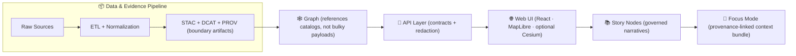

# 🧠 `core/` — The KFM Web “Brain” (web/src/core)

> **Core is where the Web app’s *truth* lives**: typed contracts, provenance + citations, map/layer logic, Focus Mode rules, and UI-agnostic state.  
> **UI is where the app’s *presentation* lives**: React components, pages, CSS, and view composition.

---

## ✅ Module Status “Badges” (no external links)

| Area | Status | Notes |
|---|---:|---|
| 📜 Contracts-first types | ✅ | Prefer generating/deriving types from schemas whenever possible. |
| 🧬 Provenance + citations | ✅ | “No black box” rule: everything must be traceable. |
| 🗺️ Map/Layers engine | 🟡 | 2D MapLibre + optional 3D Cesium supported by adapters. |
| 🧠 Focus Mode gating | ✅ | Hard guardrails: no unsourced narrative, AI is advisory only. |
| ⚡ Performance | 🟡 | Stream/tiles-first; caching + incremental loading required. |
| 🔒 Security & redaction | ✅ | UI must never bypass redaction rules. |

---

## 🎯 What belongs in `web/src/core/`

**If it would still make sense without React… it likely belongs here.**  
Core focuses on:

- 📦 **Contracts & Types**: STAC/DCAT/PROV-shaped models, graph entity references, stable IDs.
- 🧬 **Provenance & Citation Plumbing**: “show the source for anything visible.”
- 🗺️ **Layer Registry & Map Logic**: layer definitions, rendering parameters, time binding, legends.
- 🧭 **State & Deterministic Behavior**: repeatable state transitions, serializable map state.
- 🧠 **Focus Mode Engine**: context bundle assembly, evidence constraints, “no hallucinations” gates.
- 🔌 **API Client Boundary**: one well-defined funnel to server data; no direct DB access.
- ⚡ **Performance Tooling**: caching policy, workers, memoization boundaries, tile/COG strategies.
- 🔒 **Security Guardrails**: safe URL building, input validation, redaction-aware rendering rules.

### 🚫 What does *not* belong here

- ⚛️ React components (`web/src/components`, `web/src/views`, etc.)
- 🎨 CSS/Sass and design tokens
- 🧾 Story markdown content (governed story content belongs in documentation/content structures, not “random folders”)
- 🗃️ Hidden data blobs (no “just drop a dataset in the frontend”)

---

## 🧱 Non‑negotiable Core Rules

> [!IMPORTANT]
> These are platform invariants. If a change threatens them, **stop** and escalate for governance/review.

1. **Contract-first** 🧾  
   Data structures in core should mirror **schemas/contracts**, not ad-hoc shapes.

2. **Evidence-first UI** 🧬  
   If it renders, it must be able to answer: **“Where did this come from?”**  
   (source, license, lineage, confidence/uncertainty when relevant)

3. **No UI data side-channels** 🚫🗃️  
   The frontend must not “sneak in” datasets. Everything user-facing must flow through the governed pipeline → API.

4. **Focus Mode is gated** 🧠🔒  
   Focus Mode must never introduce unsourced material. AI is **advisory**, evidence-backed, and clearly labeled.

5. **Respect redaction & classification** 🛡️  
   Core must treat “redacted/limited precision” as a first-class behavior (including map zoom/aggregation behavior).

6. **Deterministic state transitions** 🎛️  
   A given input + config should produce the same state outcomes (helps debugging + reproducibility).

---

## 🗺️ How `core/` fits the KFM pipeline



**Core sits inside the Web UI box** but acts like a *mini-platform* that enforces the same invariants: contracts, provenance, determinism, and guardrails.

---

## 📁 Suggested `core/` Directory Layout

> [!NOTE]
> The exact tree may evolve, but the *seams* should stay stable: **contracts → data access → domain → rendering adapters → UI consumption**.

```text
web/
└─ 📁 src/
   └─ 🧠 core/
      ├─ 🔌 api/               # 🔌 Typed API client + request builders
      ├─ 🧾 contracts/         # 🧾 Generated/derived TS types + validators
      ├─ 🧠 domain/            # 🧠 Domain models (dataset, layer, event, place…)
      ├─ 🧬 provenance/        # 🧬 Citation + lineage helpers (PROV-aware)
      ├─ 🕸️ graph/             # 🕸️ Graph entity refs + query shape adapters
      ├─ 🗺️ layers/            # 🗺️ Layer registry, styling, legends, time-binding
      ├─ 🧭 map/               # 🧭 Map state + viewport math + interaction model
      ├─ 🎮 renderers/         # 🎮 MapLibre/Cesium adapters (UI-agnostic)
      ├─ 🧠 focus/             # 🧠 Focus Mode context bundle + gating logic
      ├─ 📈 analytics/         # 📈 UI-safe metrics events (no sensitive leakage)
      ├─ 🔒 security/          # 🔒 redaction helpers, safe URL builders, guards
      ├─ 🧰 utils/             # 🧰 pure helpers (date/time, ids, memoization)
      ├─ 🧩📄 index.ts          # 🧩 public exports (keep tight!)
      └─ 📘 README.md           # 📘 you are here 📌
```

---

## 🧾 Core Data Contracts (front-end view)

Core treats the platform’s boundary artifacts as **first-class**:

### ✅ “Reference, don’t duplicate”
When possible, core should pass around *references*:

- `stacItemId` / `stacHref`
- `dcatDatasetId` / `dcatHref`
- `provBundleId` / `provHref`
- `graphNodeId` / `graphHref`

This keeps the Web app aligned with the “one source of truth” intent, and makes it trivial to open a “why am I seeing this?” panel.

### TypeScript sketch (illustrative)

```ts
export type StableId = string;

export interface ProvenanceRef {
  provBundleId: StableId;
  provHref?: string;          // optional link to PROV bundle (API-served)
  generatedAt?: string;       // ISO timestamp
  method?: string;            // model/pipeline name or version
  confidence?: number;        // 0..1 when applicable
}

export interface Citation {
  label: string;              // human label: "Kansas Historical Society"
  sourceId?: StableId;        // dataset/source stable ID
  license?: string;
  accessedAt?: string;        // ISO timestamp
  notes?: string;             // short, non-narrative
}

export interface EvidencePacket {
  citations: Citation[];
  provenance?: ProvenanceRef;
  warnings?: string[];        // e.g., "redacted", "low precision"
}
```

> [!TIP]
> Keep these shapes **serializable**. Anything that can be snapshot-tested is easier to trust.

---

## 🗺️ Layers: the core of the map experience

Core owns the **Layer Registry**: a structured, audited list of what can appear on the map.

A layer definition should include:

- 🆔 Stable identifier
- 🧭 Spatial extent (when known)
- 🕰️ Temporal extent + time binding mode
- 🎨 Style + legend metadata (and accessibility-friendly labels)
- 🧬 Evidence packet (citations + provenance)
- 🔒 Redaction behavior (precision limits, aggregation, or disabled states)
- 🎮 Renderer compatibility: 2D (MapLibre) and/or 3D (Cesium)

### Example layer definition (illustrative)

```ts
export interface LayerDefinition {
  id: StableId;
  title: string;
  description?: string;

  kind: "vector" | "raster" | "3dTiles" | "chart" | "storyStep";
  time?: {
    mode: "none" | "range" | "steps";
    start?: string; // ISO or year
    end?: string;
    step?: "year" | "month" | "day";
  };

  sources: {
    stacItemId?: StableId;
    tilesetUrl?: string; // produced by API; do not hardcode “hidden” datasets
  };

  style?: Record<string, unknown>;
  legend?: {
    title: string;
    items: Array<{ label: string; value?: string }>;
  };

  evidence: EvidencePacket;

  security?: {
    redaction: "none" | "aggregate" | "blur" | "disable";
    minZoom?: number;
    maxZoom?: number;
  };
}
```

---

## 🎮 Renderers: MapLibre + optional Cesium

Core should **not** directly import UI components; instead it exposes renderer adapters.

- 🗺️ **MapLibre (2D)** is the default high-performance WebGL renderer for vector tiles + overlays.
- 🌍 **Cesium (3D)** is optional for terrain/globe/3D tiles.

Core responsibilities:

- Keep a **renderer-agnostic map state model** (`Viewport`, `ActiveLayers`, `TimeCursor`)
- Provide adapters to translate that state into MapLibre/Cesium instructions

> [!NOTE]
> In practice, MapLibre/Cesium components live elsewhere (ex: `web/src/viewers/`), but **their logic should depend on core**, not the other way around.

---

## 🕰️ Time & Timeline: first-class, not a widget

The timeline is a platform feature, not “just a slider.”

Core owns:

- 📅 Time cursor state
- 🧩 Layer-to-time binding rules
- 🎞️ Play/step behavior (deterministic)
- ✅ Validation: time range must match layer metadata

This makes it possible to drive:

- map layers
- charts
- story steps
- Focus Mode “evidence windows”

---

## 🧠 Story Nodes & Focus Mode: how core enforces trust

### Story Nodes (content) 📚
Story content is **governed narrative** and must remain machine-ingestible and evidence-linked.

Core’s job is not to “write stories,” but to:

- Validate story payloads are **reference-based** (IDs/hrefs)
- Assemble a **Focus Context Bundle** that contains:
  - map state
  - time state
  - referenced evidence assets
  - citations & provenance
  - graph anchors (nodes/edges) needed for context

### Focus Mode (experience) 🔒🧠
Focus Mode rules are strict:

- Every claim shown must be traceable to an evidence source
- AI assistance must be explicitly labeled and evidence-constrained
- No “freeform” invented narrative

> [!IMPORTANT]
> If a UI surface can’t provide citations/provenance for what it shows, it does **not** belong in Focus Mode.

---

## ⚡ Performance & Data Handling Guidelines

Core is where we keep the **performance discipline**:

- 🧊 Prefer tiled/streaming sources over giant payloads  
- 🧠 Cache *derived* computations, not raw truth  
- 🧵 Offload heavy transforms to Web Workers when possible  
- 🎮 Avoid per-frame allocations in WebGL paths  
- 🧰 Use memoization boundaries that are explicit and testable  
- 🧾 Always keep a paper trail: “fast” must not mean “opaque”

---

## 🔒 Security & Governance in the Frontend

Core should provide:

- ✅ safe URL builders (no injection-by-concatenation)
- ✅ parameter encoding helpers
- ✅ redaction-aware rendering decisions
- ✅ audit/analytics event envelopes that avoid leaking sensitive details

> [!TIP]
> Treat “security” as a UX feature: a user should *see* when precision is reduced or content is restricted.

---

## 🧪 Testing Expectations (core-level)

Core should be the easiest place to test because it’s UI-agnostic.

Recommended test layers:

- ✅ **Unit tests** for pure functions (time binding, layer selection, provenance assembly)
- ✅ **Contract tests** for API client shapes
- ✅ **Snapshot tests** for Focus Mode context bundle assembly
- ✅ **Fixtures** for representative datasets/layers (including redacted cases)

---

## 🧭 Contribution Quickstart

### Add a new dataset layer 🗺️
1. Define/extend the layer’s contract shape (`contracts/`)
2. Add a `LayerDefinition` to the registry (`layers/`)
3. Ensure evidence packet is present (citations + provenance)
4. Validate timeline behavior if temporal
5. Add renderer adapter support (2D/3D if applicable)
6. Add tests (including redaction + “no provenance” rejection)

### Add a new Focus Mode capability 🧠
1. Extend context bundle schema (keep it serializable)
2. Add strict validators: fail closed if missing evidence
3. Add UI hooks elsewhere, but keep logic in core
4. Add snapshot tests for bundle outputs

---

## 📚 Project Research Library (used to shape this core)

<details>
<summary><strong>📖 Click to expand the full library map</strong></summary>

### 🗺️ Geospatial, Cartography, Mapping & 3D
- **Kansas-Frontier-Matrix_ Open-Source Geospatial Historical Mapping Hub Design.pdf** — MapLibre/Leaflet timeline concepts, optional Cesium & 3D Tiles strategy, static hosting patterns.
- **making-maps-a-visual-guide-to-map-design-for-gis.pdf** — cartographic design choices, legend clarity, map readability.
- **Mobile Mapping_ Space, Cartography and the Digital - 9789048535217.pdf** — mobile context, place-based interaction patterns.
- **Archaeological 3D GIS_26_01_12_17_53_09.pdf** — 3D GIS thinking and interpretability in spatial storytelling.
- **webgl-programming-guide-interactive-3d-graphics-programming-with-webgl.pdf** — WebGL mental models for performant rendering and interaction.
- **python-geospatial-analysis-cookbook.pdf** — PostGIS/GeoJSON workflows, routing analysis patterns that inform “analysis outputs → layers.”
- **Cloud-Based Remote Sensing with Google Earth Engine-Fundamentals and Applications.pdf** — remote sensing visualization + band/time-series thinking.

### 🧱 Data Engineering, Interop & Performance
- **Scalable Data Management for Future Hardware.pdf** — “one fact, one place” discipline + performance/caching mindsets.
- **Database Performance at Scale.pdf** — query/latency intuition and performance hygiene.
- **PostgreSQL Notes for Professionals - PostgreSQLNotesForProfessionals.pdf** — backend storage realities that shape client assumptions.
- **Data Spaces.pdf** — interoperability/federation framing and “data sharing with semantics” mindset.

### 📈 Modeling, Analytics, Uncertainty & Evidence
- **Scientific Modeling and Simulation_ A Comprehensive NASA-Grade Guide.pdf** — reproducibility, simulation outputs as evidence artifacts.
- **Understanding Statistics & Experimental Design.pdf** — experimental rigor; avoid overclaiming without uncertainty.
- **think-bayes-bayesian-statistics-in-python.pdf** — representing priors/posteriors and uncertainty communication.
- **regression-analysis-with-python.pdf** + **Regression analysis using Python - slides-linear-regression.pdf** — modeling outputs as explainable/inspectable layers.
- **graphical-data-analysis-with-r.pdf** — visual diagnostics; “make anomalies visible.”
- **Spectral Geometry of Graphs.pdf** — future graph analytics lenses (structure, similarity, diffusion) for map-linked insights.
- **Generalized Topology Optimization for Structural Design.pdf** — optimization outputs as auditable artifacts (constraints, objectives, provenance).

### 🌐 Web UX & Frontend Discipline
- **responsive-web-design-with-html5-and-css3.pdf** — responsive layout patterns; accessibility/interaction scaling.

### 🔒 Security & Safety
- **ethical-hacking-and-countermeasures-secure-network-infrastructures.pdf** — threat modeling mindset.
- **Gray Hat Python - Python Programming for Hackers and Reverse Engineers (2009).pdf** — adversarial thinking and defensive engineering habits.
- **compressed-image-file-formats-jpeg-png-gif-xbm-bmp.pdf** — image asset choices, compression tradeoffs, predictable decoding.

### 🤖 Humanism, Governance & AI Constraints
- **Introduction to Digital Humanism.pdf** — human-centered accountability, transparency.
- **On the path to AI Law’s prophecies and the conceptual foundations of the machine learning age.pdf** — conceptual framing for AI guardrails.
- **Principles of Biological Autonomy - book_9780262381833.pdf** — autonomy/control concepts that inform “advisory, not autonomous” design.

### 🧰 Programming Reference Compendiums (multi-book PDFs)
These inform implementation patterns, language specifics, and safe idioms:
- **A programming Books.pdf**
- **B-C programming Books.pdf**
- **D-E programming Books.pdf**
- **F-H programming Books.pdf**
- **I-L programming Books.pdf**
- **M-N programming Books.pdf**
- **O-R programming Books.pdf**
- **S-T programming Books.pdf**
- **U-X programming Books.pdf**

### 🧠 Deep Learning (research support)
- **Deep Learning for Coders with fastai and PyTorch - Deep.Learning.for.Coders.with.fastai.and.PyTorchpdf** — informs offline model building; core consumes outputs as evidence layers.

</details>

---

## 🧾 Glossary (core-level)

- **Contract artifact** 🧾 — a machine-validated schema/spec that defines an interface.
- **Evidence artifact** 🧬 — a dataset/analysis output that ships with citations + provenance, treated like first-class data.
- **Layer registry** 🗺️ — a canonical list of visualizable layers with metadata, styling, and evidence.
- **Focus Mode** 🧠 — an evidence-gated narrative + map experience; must be provenance-linked.
- **Redaction** 🔒 — rules that constrain precision, access, or visibility based on sensitivity/governance.

---

## 🧩 Export Discipline

> [!WARNING]
> Keep `core/index.ts` small. Export only stable surfaces.  
> If everything is exported, nothing is stable.

---

### 🛠️ TODO hooks for the next iteration
- [ ] Add a formal `FocusContextBundle` schema + validator in `core/focus/`
- [ ] Add a `LayerRegistry` loader that can be generated from contracts
- [ ] Add `redaction-aware` map zoom/aggregation policies as reusable guards
- [ ] Add core test fixtures for: temporal layers, 3D tiles, and redacted data

---
